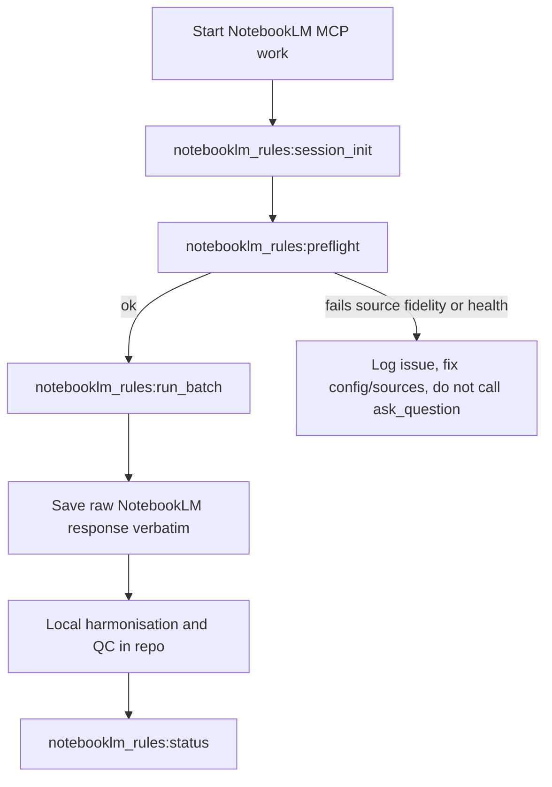

# NotebookLM MCP Rules Guardrail

This skill defines the **guardrails and preflight checks** that must be applied before any NotebookLM MCP usage, especially calls to `mcp--notebooklm--ask_question`.

It does **not** implement the low-level MCP client itself; instead, it tells the agent how to:
- make parameters explicit (notebook, session, browser options),
- keep NotebookLM extraction-only,
- enforce strict source-fidelity gates, and
- log each batch in a traceable way.

For detailed rules, see [`notebooklm-mcp-ruleset.md`](references/notebooklm-mcp-ruleset.md).

---

## When to use this skill

Use this skill **before** any NotebookLM MCP work when:

1. A plan or session wants to call `mcp--notebooklm--ask_question` directly, or via another NotebookLM skill.
2. You are running structured extraction from a NotebookLM notebook (for example, CRI capacity dictionary, WMO/NFCS quote bank, foresight evidence passes).
3. You need reliable, evidence-grade outputs where **source fidelity** and **parameter discipline** are critical.

In these cases, you must:
- apply the rules in this skill first,
- confirm parameters and source packets explicitly,
- then delegate the actual NotebookLM call.

---

## When NOT to use this skill

Do **not** use this skill when:

1. You are editing or analysing local markdown notes only, with no NotebookLM involvement.
2. You are using the NotebookLM web UI in a purely exploratory, non-repo-bound way.
3. Another, more specific NotebookLM skill already guarantees parameter discipline and source fidelity for the exact workflow (and explicitly states that it supersedes this guardrail).

In those cases, keep the rules in mind, but do not add unnecessary ceremony.

---

## Inputs required

Before applying this skill, gather:

1. **Project context**
   - Client / project name (e.g., CRI, CRDB, WMO-NFCS, foresight report).
   - The local repo path where outputs and logs should live.

2. **NotebookLM context**
   - The intended NotebookLM `notebook_id` for this project.
   - A short description of what the notebook contains (domains, document types).

3. **Batch objective**
   - The specific extraction goal for this batch (e.g., “methodological capacity indicator concepts”, “framework evidence rows”, “governance quotes”).
   - Whether the batch is **source-bound** (tied to named titles) or general corpus extraction.

4. **Operational environment**
   - Basic awareness of the current MCP environment and any known issues, as logged in [`NotebookLM-MCP-troubleshooting.md`](ψ/inbox/NotebookLM-MCP-troubleshooting.md).

---

## Workflow

Follow these steps whenever using NotebookLM MCP in a structured workflow.

### 1) Load and internalise the ruleset

1. Read the condensed rules in [`notebooklm-mcp-ruleset.md`](references/notebooklm-mcp-ruleset.md).
2. Optionally skim the originating learnings and retros referenced there under `"Origins"` for deeper context.

Do not proceed until you can restate, in your own words, the three core pillars:
- **extraction vs local harmonisation**, 
- **parameter discipline**, and
- **source fidelity as a hard gate**.

### 2) Attach or confirm the project notebook

1. Determine the project-level config location (conceptual):
   - Prefer a project file such as `ψ/incubate/<Client>/<Project>/output/notebooklm-rules.config.json`.
2. If the config exists:
   - Read the attached `notebook_id` and notebook description.
   - Confirm it matches the current task.
3. If it does not exist:
   - Ask the human which NotebookLM notebook to use.
   - Record the chosen `notebook_id` and a short description in the project config when implemented.

### 3) Cross-check with the troubleshooting log

1. Open [`NotebookLM-MCP-troubleshooting.md`](ψ/inbox/NotebookLM-MCP-troubleshooting.md).
2. Look for any **recent failures, environment issues, or workarounds** (auth drift, timeouts, shell limitations, skill-loading conflicts).
3. If you find relevant patterns not already covered in the ruleset:
   - Treat them as **additional constraints** (for example, required timeouts, shell quirks, or MCP server settings).
   - Update the mental model of how to run NotebookLM in this environment.

The troubleshooting note is the first place new failure patterns should be captured. The ruleset is updated only after these patterns stabilise.

### 4) Run MCP health and auth preflight

1. Use MCP health tools (for example, a `get_health`-style check) to confirm:
   - `authenticated = true` for NotebookLM MCP.
   - No obvious error state or repeated recent failures.
2. If health is poor or auth has drifted:
   - Apply the re-auth workflow described in the ruleset (cleanup while preserving library, then re-auth), not ad hoc retries.
3. Only proceed when NotebookLM MCP is healthy.

### 5) Define the batch and source packet

1. Clarify the **single extraction objective** for this batch.
2. Decide whether the batch is:
   - **Corpus-wide extraction** (not tied to named titles), or
   - **Source-bound extraction** (requires exact NotebookLM titles).
3. For source-bound batches:
   - Define a **small packet** of 1–3 exact titles.
   - Ensure these titles are copied directly from the NotebookLM source list, not inferred from repo filenames.

### 6) Apply the source-fidelity gate

For **source-bound** batches:

1. If necessary, run a **title-resolution step** in NotebookLM to list actual source titles.
2. Confirm that each named packet title is present and unambiguous.
3. Encode explicit instructions for **fail-fast behaviour**:
   - If any named title is missing or ambiguous, NotebookLM must report this and stop.
   - Substituting “nearby” literature is not allowed.
4. If the gate fails, mark the batch as **invalid** and do not proceed until sources or prompts are corrected.

### 7) Build a compliant extraction prompt

Using the patterns in the ruleset and relevant project plans (for example, CRI v2 query packs):

1. Write a **short, extraction-only prompt** that:
   - States a single objective.
   - Forbids harmonisation, de-duplication, QC, or register rewriting.
   - Describes the expected output shape (flat row schema or atomic-note template).
2. For source-bound batches:
   - Include a section listing the **exact NotebookLM source titles** in the packet.
   - Explicitly instruct NotebookLM to **fail fast** if any are missing.
3. Keep the expected response length within the environment’s latency budget (to reduce timeouts).

### 8) Construct the ask_question parameters

Before calling `mcp--notebooklm--ask_question` (or any wrapper skill):

1. Ensure the payload has:
   - `notebook_id`: explicit, taken from the project config or human input.
   - `session_id`: explicit, either reused from an open session or newly created and recorded.
   - `browser_options`: explicit timeout and stealth options that align with the MCP environment config.
2. Do **not** rely on implicit “active notebook” or default sessions.
3. Record `notebook_id`, `session_id`, and the batch label in a local session log when implemented.

### 9) Execute the batch and save raw outputs

1. Delegate the constructed prompt and parameters to the appropriate NotebookLM skill or MCP tool.
2. On success:
   - Save the raw NotebookLM response **verbatim** to a dedicated file (one file per run).
   - Do not clean or reshape the raw output before saving.
3. On failure (timeout, auth error, source-fidelity violation):
   - Capture a short note in the troubleshooting log and/or a learning note under `ψ/memory/learnings/`.
   - Apply the relevant failure-handling pattern from the ruleset.

### 10) Harmonise locally (outside NotebookLM)

1. Flatten and harmonise raw outputs **only in local repo notes or scripts**, not inside NotebookLM.
2. Update canonical registers (for example, indicator concept registers) only after local QC.
3. Treat NotebookLM as an extraction engine; treat the repo as the place where synthesis and governance live.

---

## Files in this skill

- [`SKILL.md`](.roo/skills/notebooklm-rules/SKILL.md) — entrypoint and workflow for the guardrail.
- [`notebooklm-mcp-ruleset.md`](references/notebooklm-mcp-ruleset.md) — condensed ruleset derived from existing learnings and retros.

External but important:
- [`2026-04-08_notebooklm-source-fidelity-and-parameter-discipline.md`](ψ/memory/learnings/2026-04-08_notebooklm-source-fidelity-and-parameter-discipline.md)
- [`2026-04-08_notebooklm-extraction-vs-local-harmonisation.md`](ψ/memory/learnings/2026-04-08_notebooklm-extraction-vs-local-harmonisation.md)
- [`NotebookLM-MCP-troubleshooting.md`](ψ/inbox/NotebookLM-MCP-troubleshooting.md)

---

## Configuration model (conceptual)

This skill assumes a two-layer configuration model:

1. **Global defaults** (infrastructure-level)
   - Path (conceptual example): `/.roo/skills/notebooklm-rules.config.json`
   - Contents (minimum):
     - Default `browser_options` for NotebookLM MCP (timeout, stealth flags).
     - Optional global fallbacks for `notebook_id` when a project has not yet attached one.

2. **Project-level config** (per-incubate project)
   - Recommended path pattern: `ψ/incubate/<Client>/<Project>/output/notebooklm-rules.config.json`
   - Contents (minimum):
     - `notebook_id`: primary NotebookLM notebook for this project.
     - `notebook_description`: short human description of notebook scope.
     - `default_output_root`: where to save NotebookLM raw outputs and logs (for example, `notebooklm_runs/`).
     - Optional `default_row_schema` or `note_template` hints for this project.

When implementing this skill in Code mode:
- Read global defaults first, then overlay project-level config.
- Never rely on implicit runtime state; always resolve notebook and session ids from config + explicit parameters.

---

## Interaction flow and commands (conceptual)

This skill defines the **behavioural contract** for a future command surface such as:

- `notebooklm_rules:session_init` — attach notebook, create/record `session_id`, and prepare a session log.
- `notebooklm_rules:preflight` — run MCP health checks and source-fidelity gates for a batch.
- `notebooklm_rules:run_batch` — build a compliant `ask_question` payload and delegate to the NotebookLM MCP tool/skill.
- `notebooklm_rules:status` — summarise current notebook, session, and recent batches.

These commands are not implemented here; they are **targets for Code mode**. This SKILL.md tells any agent that implements them **what behaviour they must enforce**.

### Workflow diagram (for implementers)

Implementations in Code mode must preserve this structure:
- **Guardrails and checks** (session_init + preflight) always run **before** any `ask_question` call.
- **Raw outputs** are always saved verbatim **before** any local transformation.
- **Harmonisation** always happens in repo files, never inside NotebookLM.

---

## Troubleshooting and evolution

When NotebookLM MCP work fails or behaves unexpectedly:

1. **Log first, then fix**
   - Append a short, concrete description of the failure to [`NotebookLM-MCP-troubleshooting.md`](ψ/inbox/NotebookLM-MCP-troubleshooting.md):
     - What you tried (prompt + batch type).
     - What failed (auth, timeout, wrong sources, environment mismatch).
     - Any immediate workaround.

2. **Map failure → rule**
   - Re-open [`notebooklm-mcp-ruleset.md`](references/notebooklm-mcp-ruleset.md).
   - Decide whether the failure reveals a missing or unclear rule.
   - If so, update the ruleset (in a future Skill Writer edit) so the behaviour becomes part of the standard discipline.

3. **Keep skills narrow**
   - This guardrail skill defines **how** NotebookLM may be used.
   - Individual project skills or workflows define **what** to ask (domain-specific prompts and schemas).

Over time, this skill should remain the **single source of truth** for NotebookLM MCP guardrails in this repo.

