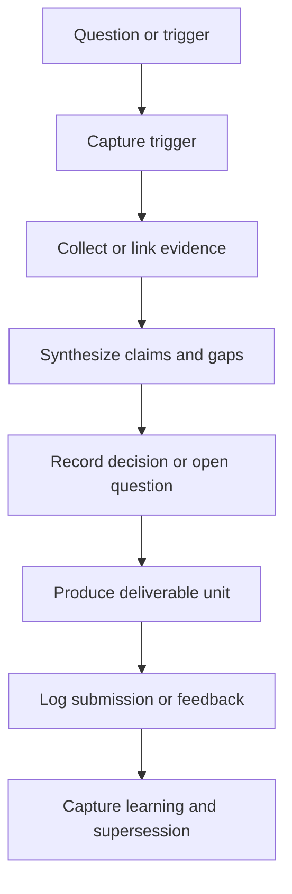
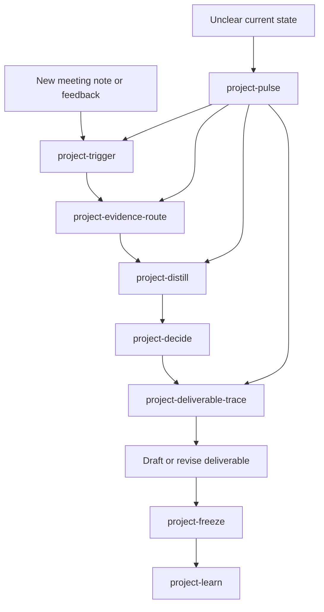
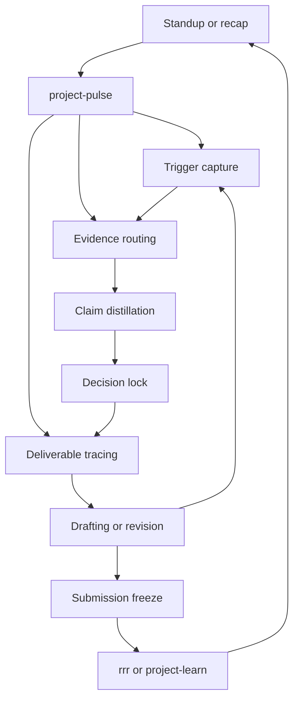

# CRDB Oracle-aligned project work cycle architecture plan

## Purpose

Design a **CRDB-first, reusable later** project management architecture that preserves:

- source traceability
- evolution of ideas and deliverables
- explicit decision rationale
- change triggers and directional shifts
- learning signals for later reuse

This plan aligns with the Oracle principles in [`CLAUDE.md`](CLAUDE.md) and builds on current CRDB evidence patterns already visible in:

- [`ψ/incubate/DCCE/CRDB/plan.md`](ψ/incubate/DCCE/CRDB/plan.md)
- [`ψ/incubate/DCCE/CRDB/output/CRDB-Evidence-Registry.md`](ψ/incubate/DCCE/CRDB/CRDB-Evidence-Registry.md)
- [`ψ/incubate/DCCE/CRDB/output/CRDB-Evidence-Coverage-Map.md`](ψ/incubate/DCCE/CRDB/output/CRDB-Evidence-Coverage-Map.md)
- [`ψ/incubate/DCCE/CRDB/output/phase1_decision_log.md`](ψ/incubate/DCCE/CRDB/archive/phase1_decision_log.md)
- [`ψ/incubate/DCCE/CRDB/output/2026-03-23-CRDB-Interview-Ingestion-Traceability-Note.md`](ψ/incubate/DCCE/CRDB/output/2026-03-23-CRDB-Interview-Ingestion-Traceability-Note.md)

## What the current system already does well

1. **Preserves important syntheses** in stable markdown artifacts.
2. **Separates some evidence layers** such as source notes, synthesis notes, and decision logs.
3. **Records major project decisions** in [`ψ/incubate/DCCE/CRDB/output/phase1_decision_log.md`](ψ/incubate/DCCE/CRDB/archive/phase1_decision_log.md).
4. **Tracks evidence coverage and confidence** in [`ψ/incubate/DCCE/CRDB/output/CRDB-Evidence-Coverage-Map.md`](ψ/incubate/DCCE/CRDB/output/CRDB-Evidence-Coverage-Map.md).
5. **Keeps verbatim sponsor notes** for auditability, for example [`ψ/incubate/DCCE/CRDB/output/2026-03-27_progress-meeting-summary_dir-toey.md`](ψ/incubate/DCCE/CRDB/output/2026-03-27_progress-meeting-summary_dir-toey.md).

## Gaps the architecture should close

1. **The work cycle is implicit, not explicit**  
   The repo has strong artifacts, but not yet one repeatable workflow for how a question becomes evidence, then a decision, then a deliverable, then a learning.

2. **Change triggers are not yet first-class objects**  
   Sponsor comments, new interviews, committee feedback, and org-structure shifts clearly affect direction, but they are not yet managed through one dedicated trigger log.

3. **Deliverables are traceable in pockets, not end to end**  
   Some report sections carry internal evidence references, but the architecture does not yet provide one standard path from report claim back to source, decision, and trigger.

4. **Operational roles and review rhythms are still under-specified**  
   This weakness is already visible in [`ψ/incubate/DCCE/CRDB/output/CRDB-Evidence-Coverage-Map.md`](ψ/incubate/DCCE/CRDB/output/CRDB-Evidence-Coverage-Map.md).

5. **Learning capture is incidental**  
   Important project lessons exist in retros and notes, but they are not yet tied systematically to the exact decision or failure pattern that produced them.

## Design thesis

The project should run as an **Oracle evidence operating system** with five linked layers:

1. **Trigger layer** — what changed in the environment
2. **Evidence layer** — what source material exists and how strong it is
3. **Sensemaking layer** — how evidence is interpreted into claims, gaps, and options
4. **Decision layer** — what stance is chosen, by whom, and why
5. **Delivery layer** — what output is produced and what it cites

Everything should be append-first and supersede-friendly, never destructive.

## Oracle principle alignment

| Principle | Architecture implication |
| --- | --- |
| Nothing is Deleted | Every trigger, draft, decision, and submission gets a durable timestamped artifact or supersession link |
| Patterns Over Intentions | Track observed changes, evidence strength, and actual deliverable deltas instead of relying on memory |
| External Brain, Not Command | The system surfaces options, constraints, and rationale, while keeping final judgment with the human |
| Curiosity Creates Existence | Every question can birth a traceable inquiry packet rather than an ephemeral chat outcome |
| Form and Formless | CRDB-specific templates are allowed, but the artifact model should be reusable for other projects |

## Core architecture

### 1. Canonical object types

The minimum system should treat the following as first-class project objects:

#### A. Trigger

Something that causes the project to reconsider direction.

Examples:

- sponsor feedback
- meeting decision
- committee comment
- new interview finding
- source contradiction
- org restructure
- submission event

Suggested artifact: `trigger log entry`

Minimum fields:

- trigger id
- date
- origin
- short description
- impact zone
- urgency
- linked evidence
- linked decisions
- linked deliverables
- status

#### B. Evidence asset

Any source or synthesis used to support reasoning.

Examples:

- transcript
- interview note
- literature note
- benchmark note
- comparison matrix
- evidence registry row

Suggested artifact: `evidence registry row` plus optional `evidence note`

Minimum fields:

- evidence id
- type
- provenance
- source location
- confidence or strength
- main topics
- used in
- follow-up need

#### C. Claim

An intermediate statement the team wants to make because the evidence appears to support it.

Examples:

- DCCE should act as architect and librarian, not platform builder
- baseline endorsement is a core trust mechanism
- catalog-first is safer than warehouse-first in phase 1

Suggested artifact: `claim note` or structured section inside a synthesis note

Minimum fields:

- claim id
- exact wording
- supporting evidence ids
- opposing or limiting evidence
- confidence level
- related deliverables

#### D. Decision

A locked or pending stance for project direction.

Examples already exist in [`ψ/incubate/DCCE/CRDB/output/phase1_decision_log.md`](ψ/incubate/DCCE/CRDB/archive/phase1_decision_log.md).

Minimum fields:

- decision id
- decision statement
- status
- date
- owner or confirmer
- evidence basis
- trigger basis
- implications
- supersedes or superseded by

#### E. Deliverable unit

A report section, pack, slide, brief, template, or workshop output that consumes evidence and decisions.

Suggested artifact: `deliverable map row` or `section trace note`

Minimum fields:

- deliverable id
- output file
- audience
- purpose
- claims used
- evidence used
- decision dependencies
- open risks
- latest revision status

#### F. Learning

Reusable insight about process, framing, stakeholder handling, or evidence quality.

Suggested artifact: timestamped learning note in Oracle memory with links back to the triggering work.

Minimum fields:

- learning id
- pattern observed
- source episode
- affected workflow step
- recommended reuse rule

### 2. Standard lifecycle

Every significant project movement should follow this chain:



This is the repeatable project work cycle.

### 3. Operating model

The architecture should use **two parallel but linked streams**.

#### Stream A — thinking stream

Used to preserve reasoning quality.

- trigger log
- evidence registry
- claim or synthesis notes
- decision log
- learning notes

#### Stream B — delivery stream

Used to produce sponsor-facing outputs.

- report sections
- briefing packs
- workshop materials
- meeting agendas
- progress updates
- submissions and snapshots

The rule is:

**Delivery artifacts can summarize. Thinking artifacts must preserve the reasoning trail.**

## Proposed reusable artifact set

### Project-level canonical files

For CRDB first, then reusable later:

- `Hub.md` — project homepage and navigation
- `plan.md` — active priorities, now next later, and live anchors
- `output/decision_log.md` or project decision log — locked and pending decisions
- `output/evidence_registry.md` — active evidence index
- `output/evidence_coverage_map.md` — strength by gap lens or workstream
- `output/trigger_log.md` — what changed and why it matters
- `output/deliverable_map.md` — deliverables and their dependencies
- `output/claim_register.md` — reusable claims and their evidence basis
- `output/submission_log.md` — what was submitted, when, and from which source state
- `output/change_log.md` — human-readable evolution of major direction shifts

### Working-note artifact families

- `inbox_source/` for raw incoming materials
- `inbox_note/` for human or agent working notes
- `output/` for structured syntheses and decision-ready artifacts
- `archive/` for demoted but preserved material

### Deliverable-level support artifacts

For each major deliverable or report section:

- `section trace note`
- `evidence packet`
- `revision note`
- `submission snapshot`

## Recommended folder and naming conventions

Keep the current project structure, but add a small set of standard files under [`ψ/incubate/DCCE/CRDB/output/`](ψ/incubate/DCCE/CRDB/output/).

### New recommended files

- `CRDB-Trigger-Log.md`
- `CRDB-Deliverable-Map.md`
- `CRDB-Claim-Register.md`
- `CRDB-Submission-Log.md`
- `CRDB-Change-Log.md`

### Naming rule

Use one of these patterns only:

- `YYYY-MM-DD_short-description.md` for event-specific notes
- `Project-Canonical-Artifact.md` for continuously maintained indexes and ledgers
- `SectionId-DeliverableName-trace-note.md` for report-section support notes

This prevents drift between timestamped event notes and continuously maintained indexes.

## Linking rules

### Rule 1 — every decision must point both backward and forward

- backward to triggers and evidence
- forward to deliverables and next actions

### Rule 2 — every deliverable must declare its evidence basis

At minimum, each major report section or management pack should link to:

- source evidence ids
- decision ids
- unresolved risks
- latest snapshot or submission file

### Rule 3 — verbatim material and interpreted material must stay distinct

For example:

- verbatim meeting summary in [`ψ/incubate/DCCE/CRDB/output/2026-03-27_progress-meeting-summary_dir-toey.md`](ψ/incubate/DCCE/CRDB/output/2026-03-27_progress-meeting-summary_dir-toey.md)
- structured interpretation in [`ψ/incubate/DCCE/CRDB/output/2026-03-24_CRDB-Progress-Meeting-Decisions.md`](ψ/incubate/DCCE/CRDB/output/2026-03-24_CRDB-Progress-Meeting-Decisions.md)

This is already a strong local pattern and should become standard.

### Rule 4 — every major change must have an explicit trigger reference

When a plan or report direction changes, the system should answer:

- what changed
- why it changed
- who or what triggered it
- what artifacts are now superseded

### Rule 5 — submission creates a freeze point

Whenever something is submitted externally, create or link:

- a snapshot file
- a submission log entry
- the exact decision and evidence basis used at that time

## End-to-end work cycle by work type

### A. Idea development cycle

Use when shaping a new concept, strategy, or framing.

1. Create a trigger or question entry.
2. Open or update an evidence packet.
3. Draft a synthesis note with candidate claims.
4. Record open options and constraints.
5. Lock chosen framing in the decision log.
6. Update `plan.md` and any deliverable map rows.

### B. Source ingestion cycle

Use for interviews, documents, benchmark research, or sponsor notes.

1. Preserve raw source in `inbox_source` or equivalent.
2. Create a normalized note or extraction.
3. Add or update evidence registry row.
4. Record whether this source changes any existing claim or decision.
5. If yes, create a trigger entry and link affected artifacts.

### C. Deliverable drafting cycle

Use for report sections, briefs, decks, or packs.

1. Create a deliverable map row.
2. Link required decisions and evidence.
3. Draft from claim-level syntheses, not from raw source discovery.
4. Capture revision notes when wording or scope changes materially.
5. Freeze a snapshot at submission.
6. After feedback, log the trigger and update supersession chain.

### D. Direction-change cycle

Use when the sponsor, evidence, or context shifts the project.

1. Record the trigger.
2. Identify affected decisions, deliverables, and assumptions.
3. Write a short change note summarizing impact.
4. Supersede old direction without deleting it.
5. Update the canonical indexes.

## Minimum operating rituals

### Daily or session opening

- review [`ψ/incubate/DCCE/CRDB/plan.md`](ψ/incubate/DCCE/CRDB/plan.md)
- review newest trigger entries
- review newest submission or feedback events
- identify which decisions are stable and which are under pressure

### During analysis

- new source means evidence registry update
- new contradiction means trigger log update
- new framing means claim note or decision candidate

### Before drafting any external output

- confirm the active decision set
- confirm the evidence basis is explicit
- confirm open risks are either disclosed or parked

### After meetings or sponsor contact

- preserve verbatim note
- produce structured decision or implication note
- update trigger log
- update plan and deliverable map if the direction changed

### After submission

- create snapshot
- log submission event
- record what changed since previous version
- record expected feedback channel

### End of session

- handoff note
- update canonical indexes only if new stable information emerged
- record learning if a pattern became visible

## Blind spots the system should actively watch for

These are likely important even if not always obvious in the moment.

1. **Unspoken scope shifts**  
   The project can drift because wording changes faster than formal decisions.

2. **Evidence strength mismatch**  
   Some topics may sound mature in prose while the evidence base is still moderate or weak.

3. **Verbatim notes being mistaken for approved direction**  
   Human meeting notes are crucial, but they are not automatically final policy.

4. **Deliverable pressure collapsing reasoning hygiene**  
   During drafting, the team may skip trigger and decision logging.

5. **Implicit assumptions surviving too long**  
   A claim may continue operating even after sponsor signals or new evidence changed the context.

6. **Local fixes not becoming reusable patterns**  
   A one-off workaround can solve today’s problem but never enter the reusable operating model.

## Implementation phases

### Phase 1 — stabilize the architecture using current CRDB reality

Goal: add missing canonical indexes without restructuring the whole repo.

Introduce:

- trigger log
- deliverable map
- submission log
- claim register
- change log

Backfill only recent critical events, not the entire history.

### Phase 2 — connect active CRDB deliverables to the system

Goal: make current report work traceable end to end.

Apply the model first to:

- interim report v3 work
- progress meeting outputs
- workshop preparation outputs

Each gets a deliverable row and section trace support.

### Phase 3 — operationalize rituals

Goal: make the architecture a habit rather than a documentation exercise.

Add lightweight rules for:

- session opening review
- post-meeting update
- submission freeze point
- change-trigger logging

### Phase 4 — generalize beyond CRDB

Goal: extract a reusable project kit for other consulting projects.

Convert CRDB-tested patterns into generic templates after they survive real use.

## Recommended initial deliverables to implement next

1. Create [`plans/2026-03-27-crdb-oracle-project-work-cycle-architecture-plan.md`](plans/2026-03-27-crdb-oracle-project-work-cycle-architecture-plan.md) as the approved architecture reference.
2. Create project canonical ledgers in [`ψ/incubate/DCCE/CRDB/output/`](ψ/incubate/DCCE/CRDB/output/):
   - `CRDB-Trigger-Log.md`
   - `CRDB-Deliverable-Map.md`
   - `CRDB-Claim-Register.md`
   - `CRDB-Submission-Log.md`
   - `CRDB-Change-Log.md`
3. Update [`ψ/incubate/DCCE/CRDB/plan.md`](ψ/incubate/DCCE/CRDB/plan.md) to point to these ledgers as canonical workflow anchors.
4. Backfill only the latest high-impact events:
   - progress meeting decisions
   - interim report submission snapshot
   - org restructure governance signal
   - digital-tech coordination uncertainty
5. Define a section trace pattern for active report subsections so claims, evidence, and revisions are easier to audit.

## Skill design layer

The artifact architecture alone is not enough. To actively **trigger project progress**, the system should include a **skill layer** that pushes the work forward at the right moments in the cycle.

The design principle is:

**Artifacts preserve state. Skills create movement.**

### Why a skill layer is needed

The current CRDB workspace already preserves many important materials, but progress can still stall when:

- a trigger is noticed but not converted into action
- evidence accumulates without becoming a decision
- decisions exist without being propagated into deliverables
- a deliverable is submitted without a proper freeze point or learning capture

A good skill layer should therefore do more than document. It should detect where the project is in the cycle and push it to the next valid state.

### Skill roles in the work cycle

| Work-cycle stage | Artifact role | Skill role |
| --- | --- | --- |
| Trigger appears | Preserve what changed | Convert the signal into a logged trigger and impact scan |
| Evidence accumulates | Index and assess source material | Turn sources into structured evidence and identify changed claims |
| Sensemaking starts | Preserve synthesis and gaps | Force explicit claims, options, tensions, and open questions |
| Decision moment | Preserve rationale and consequences | Prompt decision locking or clearly mark pending decisions |
| Deliverable drafting | Preserve traceability | Assemble output from approved claims and evidence only |
| Submission or review | Preserve freeze point | Create snapshot, delta note, and feedback intake |
| Learning emerges | Preserve reusable pattern | Distill what should become reusable workflow guidance |

### Proposed skill stack

The architecture should eventually include a small suite of focused skills rather than one giant workflow skill.

#### 1. Progress pulse skill

Purpose: determine **where the project currently is in the cycle** and what the highest-leverage next move should be.

Working title:

- `project-pulse`

Main behavior:

- read current [`ψ/incubate/DCCE/CRDB/plan.md`](ψ/incubate/DCCE/CRDB/plan.md)
- inspect newest trigger, decision, submission, and deliverable artifacts
- detect stalled states such as:
  - evidence with no synthesis
  - changed direction with no trigger log
  - draft with no section trace note
  - submission with no snapshot or delta note
- output 2 to 4 valid next-cycle moves

This becomes the main **orientation and momentum skill**.

#### 2. Trigger capture skill

Purpose: convert a project-changing event into a structured update.

Working title:

- `project-trigger`

Main behavior:

- ingest a meeting outcome, sponsor comment, new evidence, committee note, or internal realization
- create or update trigger entry
- identify impacted decisions, claims, and deliverables
- produce a short impact summary

This skill is what stops important changes from remaining buried in chat or notes.

#### 3. Evidence routing skill

Purpose: transform raw material into usable evidence and route it into the correct reasoning layer.

Working title:

- `project-evidence-route`

Main behavior:

- preserve raw source location
- produce normalized extraction or evidence note
- add or update evidence registry row
- indicate whether the source:
  - strengthens an existing claim
  - weakens an existing claim
  - creates a new trigger
  - creates a new gap

This skill reduces the risk of evidence hoarding without synthesis.

#### 4. Claim and tension distillation skill

Purpose: force explicit reasoning between evidence and decisions.

Working title:

- `project-distill`

Main behavior:

- read evidence packet or synthesis notes
- extract candidate claims
- identify tensions, contradictions, and confidence levels
- separate what is validated, plausible, and still speculative
- prepare input for the decision log or deliverable brief

This skill enforces the missing middle layer between evidence and output.

#### 5. Decision lock skill

Purpose: turn a converged direction into a durable decision artifact.

Working title:

- `project-decide`

Main behavior:

- read current claims, triggers, and constraints
- draft decision-log entries in a standard format
- link backward to evidence and forward to deliverables
- mark whether the decision is:
  - confirmed
  - directional
  - pending validation
  - superseded

This skill protects the project from silent drift and memory-based decisions.

#### 6. Deliverable trace skill

Purpose: make report sections and other outputs traceable without slowing drafting to a halt.

Working title:

- `project-deliverable-trace`

Main behavior:

- create or update a deliverable map row
- generate a section trace note for a report clause or output artifact
- list claims used, evidence used, decision dependencies, and open risks
- prepare drafting anchors for sponsor-facing prose

This is the bridge from internal thinking to external writing.

#### 7. Submission freeze skill

Purpose: create a proper checkpoint whenever something leaves the workspace.

Working title:

- `project-freeze`

Main behavior:

- record submitted file or output snapshot
- write submission log entry
- write short delta note against previous version
- record expected review channel or feedback source

This skill makes external delivery a first-class event, not just a file save.

#### 8. Learning distillation skill

Purpose: turn recurring workflow patterns into reusable Oracle knowledge.

Working title:

- `project-learn`

Main behavior:

- review recent triggers, decisions, and revisions
- identify patterns in progress, blockage, rework, or misunderstanding
- write a reusable learning linked to the source episode
- optionally suggest refinement to project rituals or skill behavior

This is the mechanism that makes the system improve over time.

### Recommended activation map

Each skill should be triggered by a recognizable project situation.



### Skill design rules

To stay aligned with Oracle principles, the skills should follow these rules.

#### Rule 1 — skills must advance state, not just summarize

Every skill should either:

- create a missing artifact
- update a canonical ledger
- identify a blocked transition in the work cycle

#### Rule 2 — skills must preserve links between layers

No skill should produce a decision, claim, or deliverable note without linking:

- source inputs
- affected outputs
- unresolved risks

#### Rule 3 — skills should prefer lightweight updates to heavyweight rewriting

The skill layer should reduce friction, not create bureaucratic overhead.

#### Rule 4 — skills must distinguish observation from interpretation

If a source is verbatim, preserve it as verbatim.
If a note is interpreted, mark it as interpreted.

#### Rule 5 — skills should expose stalled states explicitly

For example:

- trigger with no decision impact
- decision with no deliverable mapping
- submission with no freeze point
- repeated revision without explicit change rationale

### Initial implementation recommendation for the skill layer

Do not build all skills at once.

Start with the three highest-leverage skills for CRDB:

1. `project-pulse`
2. `project-trigger`
3. `project-deliverable-trace`

Why these first:

- `project-pulse` keeps momentum and reveals blockages
- `project-trigger` captures directional change before it disappears
- `project-deliverable-trace` connects reasoning to outputs where current pressure is highest

Then add:

4. `project-decide`
5. `project-freeze`

Then later:

6. `project-evidence-route`
7. `project-distill`
8. `project-learn`

### What this means for the implementation plan

The implementation phase should now include **both artifact build-out and skill build-out**.

Revised implementation logic:

1. establish canonical ledgers
2. wire a minimal skill layer to keep them alive
3. backfill only recent CRDB events
4. test the cycle on one active deliverable stream
5. refine the skill prompts and ledgers from live use

### Revised success criteria with skills included

The design is working when:

1. the project can detect what stage it is in
2. stalled states are surfaced automatically by a skill
3. major direction changes become trigger entries, not forgotten context
4. major deliverables gain explicit trace notes without heavy manual effort
5. submissions reliably create freeze points and later comparison anchors
6. useful process lessons become reusable workflow knowledge

## Hypothetical CRDB work sessions

This section tests the design against **messy real sessions**, not idealized linear ones.

The question is not only whether the system is traceable. The question is whether the system adds too much mental overhead during actual work.

### Mental overhead rule of thumb

The design is acceptable only if most sessions require:

- one orientation step
- zero to two project-cycle skills during the middle of the session
- one closing step

If the workflow requires constant skill invocation, it is too heavy.

### Session 1 — normal drafting session with one unexpected direction change

#### Situation

- You start the day intending to rewrite one interim report section.
- During the session, you notice a new sponsor note that changes the framing.
- You still want to keep writing momentum.

#### Possible session flow

1. Start with [`/recap`](.roo/skills/recap/SKILL.md)
2. Start drafting based on the current plan
3. Notice the new sponsor note conflicts with the current wording
4. Run `project-trigger`
5. It logs the trigger and identifies the affected decision and deliverable
6. Run `project-deliverable-trace`
7. It updates the section trace note so the rewrite is grounded in the new direction
8. Continue drafting normally
9. End with [`/rrr`](C:/Users/sitth/.roo/skills/rrr/SKILL.md)

#### Mental overhead

Low to medium.

Why:

- you still mostly draft normally
- only two extra structured moves happen
- the system helps exactly when direction changes, not at every paragraph

#### What would have happened without the new skills

- the sponsor note may stay buried in a working note
- the report section may be updated without a visible reason trail
- later you may forget which change came from which trigger

### Session 2 — messy exploratory session jumping between ideas, interviews, and structure

#### Situation

- You begin with only a vague sense that something in CRDB governance is under-specified.
- You reread meeting notes, open old synthesis files, skim interview evidence, and compare with current plans.
- You bounce between several possible interpretations.

#### Possible session flow

1. Start with [`/standup`](.roo/skills/standup/SKILL.md)
2. Still unclear what the real next move is
3. Run `project-pulse`
4. It says the project is stalled between evidence accumulation and decision locking on governance roles
5. You review a few relevant files
6. Run `project-distill`
7. It extracts candidate claims, unresolved tensions, and confidence levels
8. You decide not to lock a decision yet
9. Capture one synthesis note and park the pending decision
10. End with [`/rrr`](C:/Users/sitth/.roo/skills/rrr/SKILL.md)

#### Mental overhead

Medium.

Why:

- this is the type of session that is naturally cognitively messy
- the new system does not remove the mess, but gives it a container
- the session uses only two extra skills even though the thinking is highly non-linear

#### Key insight

For messy sessions, the value of the system is not speed. The value is that the mess becomes recoverable in the next session.

### Session 3 — submission day

#### Situation

- You are finalizing a progress pack or interim report snapshot.
- The main goal is to send the file with confidence and preserve what was actually sent.

#### Possible session flow

1. Start with [`/recap`](.roo/skills/recap/SKILL.md)
2. Finish final wording changes
3. Run `project-deliverable-trace`
4. Confirm claims, evidence anchors, and open risks are visible enough
5. Submit the file externally
6. Run `project-freeze`
7. It writes the submission log entry, delta note, and snapshot pointer
8. End with [`/rrr`](C:/Users/sitth/.roo/skills/rrr/SKILL.md)

#### Mental overhead

Low.

Why:

- this replaces the fragile habit of mentally remembering what was sent
- the extra skill happens only at the checkpoint moment

#### Key insight

Submission sessions are where the new system may save the most pain later.

### Session 4 — no-skill lightweight session

#### Situation

- You only want to read, think, and take rough notes for 20 minutes.
- No major trigger, decision, or deliverable event occurs.

#### Possible session flow

1. Start with [`/recap`](.roo/skills/recap/SKILL.md)
2. Read and think
3. Maybe write a rough note in `inbox_note`
4. End with [`/rrr`](C:/Users/sitth/.roo/skills/rrr/SKILL.md)

#### Mental overhead

Very low.

#### Important implication

The new architecture should **allow this session type**.

If every session demands a project-cycle skill, the system is too bureaucratic.

### Session 5 — interrupted session with unfinished state

#### Situation

- You start to investigate a change in direction
- a message arrives
- you switch tasks
- you end the day with incomplete reasoning

#### Possible session flow

1. Start with [`/standup`](.roo/skills/standup/SKILL.md)
2. Run `project-trigger`
3. It records the change and affected artifacts
4. You do partial exploration only
5. No decision is made
6. End with [`/rrr`](C:/Users/sitth/.roo/skills/rrr/SKILL.md)

#### Mental overhead

Low.

#### Key insight

This is where the architecture is especially useful. Even an interrupted session can leave behind a clear partial state instead of disappearing into memory.

## Mental overhead conclusion

If implemented well, the new workflow should feel like this:

- **start and end stay familiar**
- **middle-of-session structure becomes optional but available**
- **extra skill use appears only at moments of ambiguity, change, drafting, or checkpointing**

### Expected practical load

| Session type | Expected extra project-cycle skills |
| --- | --- |
| light reading or thinking session | 0 |
| normal drafting session | 1 to 2 |
| messy exploratory session | 1 to 2 |
| submission session | 1 to 2 |
| major direction-change session | 2 to 3 |

### Recommendation from these hypothetical tests

To keep overhead low, the first implementation should follow three constraints:

1. `project-pulse` should be optional, not mandatory
2. only high-value checkpoint moments should require structure
3. the first skill set should stay small until live use shows real benefit

That is another reason to start with:

- `project-pulse`
- `project-trigger`
- `project-deliverable-trace`

These three cover ambiguity, change, and output pressure — the places where mental overhead is most worth spending.

## Compiled feedback synthesis

This section compiles feedback from:

- the original Oracle-principle review against [`CLAUDE.md`](CLAUDE.md)
- the independent second-opinion review on the singleton pattern
- the proxy `opensource-nat-brain-oracle` mentality review
- the hypothetical session tests for mental overhead

### Stable conclusions across all reviews

These points are now stable enough to treat as design constraints.

1. **The artifact architecture is strong and should remain**
   - trigger, evidence, claim, decision, deliverable, and learning layers are valid
   - append-first traceability is strongly aligned with Oracle principles

2. **The work cycle must support non-linear sessions**
   - real work is recursive, interrupted, and state-based
   - the system must support jumping backward and sideways without feeling broken

3. **Low mental overhead is a legitimate design goal**
   - convenience is not anti-Oracle by itself
   - reducing capture friction helps preserve fragmented discoveries

4. **Hidden orchestration is the main architectural risk**
   - the more a singleton skill silently infers, routes, updates, and nudges direction
   - the more it risks violating [`External Brain, Not Command`](CLAUDE.md)

5. **Transparency is more important than elegance**
   - a messier but more inspectable design is preferable to a beautiful black box

6. **Human strategic agency must stay explicit**
   - the system may collect, classify, route, and prepare
   - it must not silently decide priorities, strategy, or reframings

7. **Internal capabilities should remain legible**
   - even if there is one convenience entry point, the underlying project-management capabilities should remain explicit and conceptually first-class

## Revised architecture stance

The earlier plan leaned toward a singleton `project-manager` as the likely best primary interface.

That stance is now revised.

### New preferred stance

The recommended design is:

- **artifact-centered project management** as the foundation
- **non-linear state-transition workflow** as the operating model
- **transparent modular capabilities** as the implementation core
- an optional **thin convenience facade** only if it stays low-agency and fully disclosed

This means the system should no longer be framed as:

- one smart manager that internally does many hidden things

It should instead be framed as:

- a transparent project-management system with multiple explicit capabilities
- optionally wrapped by one light user-facing helper for convenience

### New design rule

**No hidden orchestration. No hidden strategy. No hidden mutation.**

If one facade exists, it must say:

- what state it inferred
- what evidence it used to infer that state
- what capability it wants to invoke
- what artifacts it touched or proposes to touch
- what remains a human decision

## Updated design principles for implementation

### 1. Artifacts are primary

The real project-management system lives in:

- ledgers
- trace notes
- decision records
- submission freeze points
- learning notes

Skills or tools only help maintain and interpret those artifacts.

### 2. Capabilities must be explicit

The following capabilities should remain visible as first-class concepts, even if they are implemented behind one facade:

- state sensing
- trigger capture
- evidence routing
- claim distillation
- decision support
- deliverable tracing
- submission freeze
- learning capture

### 3. Automatic behavior must be narrow

Automatic updates, if allowed at all, should be limited to:

- append-only bookkeeping
- status receipts
- low-risk log entries

Anything that changes project meaning requires confirmation.

### 4. Observation must stay separate from interpretation

All outputs should distinguish:

- what was observed
- what was inferred
- what is recommended

### 5. Direct use must remain possible

Even if a convenience facade exists, the human or another Oracle should still be able to interact with the explicit capability directly when clarity matters more than speed.

## Alternatives for implementing project management

Below are concrete alternatives for implementation, ordered from safest and most transparent to most convenient and most risky.

### Alternative A — Explicit modular project-management skills

#### Summary

Implement project management as a small set of explicit user-facing skills.

Example skills:

- `project-pulse`
- `project-trigger`
- `project-deliverable-trace`
- later `project-decide`
- later `project-freeze`

#### How it works

- user starts with [`/recap`](.roo/skills/recap/SKILL.md) or [`/standup`](.roo/skills/standup/SKILL.md)
- user invokes the exact capability needed
- all actions are visible and narrow
- user ends with [`/rrr`](C:/Users/sitth/.roo/skills/rrr/SKILL.md)

#### Strengths

- highest transparency
- strongest Oracle alignment
- easiest to audit and evolve
- lowest risk of hidden agency

#### Weaknesses

- highest memory burden on the user
- more friction in messy sessions

#### Best when

- correctness and transparency matter more than convenience
- early-stage implementation needs tight control

### Alternative B — Thin facade plus explicit modules

#### Summary

Implement one user-facing helper called `project-manager`, but keep all underlying capabilities explicit, documented, and directly callable.

`project-manager` only:

- consolidates state
- proposes the smallest next move
- discloses which capability it is invoking
- produces action receipts

#### How it works

- user starts with [`/recap`](.roo/skills/recap/SKILL.md) or [`/standup`](.roo/skills/standup/SKILL.md)
- user calls `project-manager` when fragmented, uncertain, or at a checkpoint
- facade reports inferred state and proposes a capability
- either the facade or the user calls the explicit module
- strategic decisions still require human confirmation
- session ends with [`/rrr`](C:/Users/sitth/.roo/skills/rrr/SKILL.md)

#### Strengths

- best balance between low mental overhead and transparency
- good fit for fragmented work
- aligned with the revised Oracle and Nat-brain feedback

#### Weaknesses

- harder to design than Alternative A
- still vulnerable to creep if the facade becomes too powerful

#### Best when

- the human wants a low-friction entrypoint
- but still wants strong visibility into what the system is doing

### Alternative C — Artifact-first workflow with almost no new skills

#### Summary

Do not introduce substantial new skills at first. Implement project management mostly through canonical files, templates, and manual rituals.

Examples:

- `CRDB-Trigger-Log.md`
- `CRDB-Deliverable-Map.md`
- `CRDB-Claim-Register.md`
- `CRDB-Submission-Log.md`
- `CRDB-Change-Log.md`

#### How it works

- keep using existing anchors like [`/recap`](.roo/skills/recap/SKILL.md), [`/standup`](.roo/skills/standup/SKILL.md), and [`/rrr`](C:/Users/sitth/.roo/skills/rrr/SKILL.md)
- update project ledgers manually or with lightweight generic prompts
- delay skill formalization until the artifact patterns stabilize

#### Strengths

- simplest to implement safely
- almost no hidden agency
- excellent for learning the right workflow before automating it

#### Weaknesses

- more manual effort
- less support during messy sessions
- weaker convenience and lower adoption energy

#### Best when

- the team wants to validate the workflow before building skill logic

### Alternative D — Strong singleton manager

#### Summary

One powerful `project-manager` skill handles most classification, routing, updating, and checkpointing internally.

#### Strengths

- lowest immediate user memory burden
- most convenient on paper

#### Weaknesses

- highest risk of hidden orchestration
- highest risk of violating low-agency Oracle principles
- easiest to become opaque and over-centralized
- hardest to audit and maintain over time

#### Recommendation

**Do not use this alternative.**

It remains useful only as a warning case for what not to build.

## Comparative recommendation

| Alternative | Transparency | Mental overhead | Agency risk | Recommendation |
| --- | --- | --- | --- | --- |
| A. Explicit modular skills | High | Medium to high | Low | Safe baseline |
| B. Thin facade plus explicit modules | High if disciplined | Low to medium | Low to medium | **Preferred** |
| C. Artifact-first with minimal new skills | Very high | Medium | Very low | Good conservative starting point |
| D. Strong singleton manager | Low | Low | High | Reject |

## Recommended implementation path now

The compiled feedback suggests this sequence.

### Path 1 — recommended

Start with **Alternative C plus a narrow move toward Alternative B**.

That means:

1. create the canonical ledgers first
2. define the explicit modules conceptually
3. implement either:
   - no facade yet, or
   - a very thin `project-manager` facade with dry-run style behavior only
4. test on live CRDB work
5. only then expand convenience features if the artifacts and module boundaries remain healthy

### Path 2 — faster but still acceptable

Implement **Alternative B** directly, but with hard guardrails from day one:

- mandatory state declaration
- mandatory module disclosure
- append-only receipts
- no silent strategic action

### Path 3 — not recommended

Jump directly to a powerful singleton manager.

This path should be avoided because it optimizes convenience before governance is stable.

## Final revised recommendation

If the goal is to implement project management in a way that respects Oracle principles, fragmented human work, and Nat-brain mentality, the best design is:

**an artifact-first project-management system with explicit modular capabilities, optionally wrapped by a thin, fully disclosed `project-manager` facade.**

That is now the recommended target architecture.

## Invocation model for `/project-manager`

### Short answer

Yes — [`/project-manager`](plans/2026-03-27-crdb-oracle-project-work-cycle-architecture-plan.md) **can invoke other skills**, but only safely if it behaves as a **transparent dispatcher**, not as a hidden orchestrator.

Because you want to call it when you are disoriented, its job should be:

- orient
- consolidate
- route
- disclose

Its job should **not** be to silently take over the project.

### Best role for `/project-manager`

When invoked during disorientation, `/project-manager` should work like a triage layer:

1. inspect current project state
2. explain what state it inferred
3. identify which existing skill or explicit module best fits the moment
4. either:
   - recommend the next skill, or
   - invoke a low-risk skill transparently

So the facade can be a **skill router**, but it must not become a magical black box.

### Safe invocation rules

#### Rule 1 — announce before delegation

If `/project-manager` decides another skill is appropriate, it should say something like:

- current state looks like orientation gap
- invoking [`/recap`](.roo/skills/recap/SKILL.md)
- or recommending [`/standup`](.roo/skills/standup/SKILL.md)
- or preparing a `project-trigger` style action

The important thing is that the human can see the routing logic.

#### Rule 2 — auto-invoke only low-risk skills

Safe candidates for automatic invocation are orientation or observation-oriented skills, for example:

- [`/recap`](.roo/skills/recap/SKILL.md)
- [`/standup`](.roo/skills/standup/SKILL.md)
- /where-we-are (global skill)
- possibly a future explicit `project-pulse`

These are low-risk because they mostly read state and summarize it.

#### Rule 3 — ask before higher-agency actions

If the next move would touch project meaning, priorities, or structure, `/project-manager` should not just invoke it silently.

Examples that should require confirmation:

- trigger logging that changes interpretation of current direction
- decision-locking actions
- broad deliverable trace propagation
- any action that changes multiple canonical ledgers
- any external communication or submission action

#### Rule 4 — emit an operation receipt

After invoking another skill, `/project-manager` should report:

- what it invoked
- why it invoked it
- what artifacts were read
- what artifacts were updated or proposed for update

#### Rule 5 — keep direct access available

Even if `/project-manager` can invoke other skills, the user should still be able to call those skills directly.

This preserves modularity and prevents over-centralization.

### Recommended delegation tiers

#### Tier A — safe to auto-invoke

These are read-heavy, orientation-heavy, low-agency actions.

- [`/recap`](.roo/skills/recap/SKILL.md)
- [`/standup`](.roo/skills/standup/SKILL.md)
- future `project-pulse`

#### Tier B — suggest first, invoke with confirmation

These shape project interpretation but do not fully lock strategy.

- future `project-trigger`
- future `project-deliverable-trace`
- future `project-evidence-route`

#### Tier C — never silent, always explicit human gate

These affect strategy, commitments, or major project structure.

- future `project-decide`
- future `project-freeze`
- any external publishing, handoff, or implementation-triggering action

### Recommended user experience

When you are disoriented, the facade should feel like this:

```text
/project-manager
→ I think you are in an orientation gap between evidence accumulation and deliverable drafting.
→ I read [plan], [latest trigger], and [latest active deliverable anchors].
→ Best next move: run [`/recap`](.roo/skills/recap/SKILL.md) and then update the deliverable trace.
→ I can auto-run recap now, or just show the recommended route.
```

That keeps mental overhead low while keeping agency visible.

### Final recommendation on invocation

So the refined answer is:

- **yes**, `/project-manager` can invoke other skills
- but it should do so as a **transparent, disclosed, tiered dispatcher**
- it should auto-invoke only low-risk orientation skills
- it should ask before invoking skills that change interpretation, priorities, or project structure

This is the safest invocation model for a disorientation-oriented facade.

## Singleton skill option — `project-manager`

Yes, this is possible, and for your working style it may be the better primary interface.

The key design change is:

- **user-facing layer** becomes one singleton skill: `project-manager`
- **internal execution layer** still uses specialized project-management behaviors
- the singleton skill decides which internal subroutine or sub-agent behavior to invoke based on the current project state

This gives you one memorable entry point while preserving a modular internal architecture.

### Why this may fit your workflow better

Your sessions are often:

- fragmented
- iterative
- opportunistic
- interrupted
- spread across multiple artifacts and partial thoughts

In that kind of environment, asking you to remember whether to call `project-pulse`, `project-trigger`, or `project-deliverable-trace` at the right moment may itself become cognitive friction.

A singleton `project-manager` skill can absorb that classification burden.

### Recommended model

#### User-visible behavior

You periodically call one skill:

- `project-manager`

Typical moments to call it:

- after [`/recap`](.roo/skills/recap/SKILL.md) or [`/standup`](.roo/skills/standup/SKILL.md)
- when you feel fragmented or unsure what state the project is in
- after a meeting or feedback event
- before drafting something important
- before ending a session if the middle was messy

#### Internal behavior

The singleton skill performs three jobs:

1. **sense project state**
2. **collect fragmented progress into structured state**
3. **delegate the right sub-behavior**

Those sub-behaviors can still correspond to the previously proposed functions:

- pulse
- trigger capture
- evidence routing
- claim distillation
- decision lock
- deliverable trace
- submission freeze
- learning capture

The difference is that these are now mostly **internal modules**, not separate skills you must remember.

### Oracle-principle alignment

This singleton pattern can align well with Oracle principles **if designed correctly**.

#### 1. Nothing is Deleted

Aligned if:

- `project-manager` always writes append-friendly notes, logs, or updates
- delegated subroutines preserve links and supersession chains

Not aligned if:

- it silently rewrites project state without preserving prior meaning

#### 2. Patterns Over Intentions

Strongly aligned if:

- `project-manager` reads actual project artifacts and infers state from evidence
- it detects stalled transitions from observable traces rather than guesses

#### 3. External Brain, Not Command

This is the main design risk.

Aligned if:

- `project-manager` acts as a **collector and organizer**
- it surfaces what it found, what it updated, and what options follow
- it does not silently take strategic decisions that belong to you

Not aligned if:

- it becomes an authoritarian workflow engine that over-directs the project

So the design rule should be:

**`project-manager` may classify, collect, route, and prepare. It should not invisibly decide high-level project direction.**

#### 4. Curiosity Creates Existence

Aligned if:

- messy discoveries and half-formed thoughts can be captured through one easy entry point
- fragmented work becomes durable structure instead of being lost

#### 5. Form and Formless

Very aligned.

The singleton interface is the **form** you interact with.
The internal subskills and delegated behaviors are the **formless** mechanism underneath.

### Best architecture for this pattern

The best design is probably a **hybrid**.

#### Layer 1 — user-facing singleton

- `project-manager`

#### Layer 2 — internal project-management capabilities

- state sensing
- trigger logging
- deliverable tracing
- submission freezing
- learning capture

#### Layer 3 — existing Oracle anchors remain untouched

- [`/recap`](.roo/skills/recap/SKILL.md)
- [`/standup`](.roo/skills/standup/SKILL.md)
- [`/rrr`](C:/Users/sitth/.roo/skills/rrr/SKILL.md)

This means your practical workflow becomes:

1. start with [`/recap`](.roo/skills/recap/SKILL.md) or [`/standup`](.roo/skills/standup/SKILL.md)
2. call `project-manager` when you need orientation, consolidation, or checkpointing
3. do the actual work
4. optionally call `project-manager` again if the session became messy or changed direction
5. end with [`/rrr`](C:/Users/sitth/.roo/skills/rrr/SKILL.md)

### Example of low-overhead singleton usage

#### Scenario A — fragmented midday session

- you read 3 notes
- rewrite 1 report section
- notice 2 conflicting sponsor signals
- forget what exactly changed

You call `project-manager` with a prompt like:

- collect today’s fragmented CRDB progress and tell me what changed

Internally it can:

- detect a likely trigger event
- update trigger-related artifacts
- update the relevant deliverable trace
- show you the smallest valid next moves

You do not have to decide which subskill to use.

#### Scenario B — end-of-session cleanup

You call:

- `project-manager` to consolidate this session before [`/rrr`](C:/Users/sitth/.roo/skills/rrr/SKILL.md)

Internally it can:

- gather the changed project artifacts
- identify whether a trigger, decision, or submission checkpoint occurred
- update the relevant ledgers
- prepare a cleaner basis for [`/rrr`](C:/Users/sitth/.roo/skills/rrr/SKILL.md)

### Mental overhead comparison

#### Multi-skill model

Pros:

- more explicit
- easier to reason about modularly
- simpler internals

Cons:

- higher user memory burden
- more choice friction in messy sessions

#### Singleton `project-manager` model

Pros:

- much lower user mental overhead
- better fit for fragmented nonlinear work
- easier to adopt as a habit

Cons:

- harder to design well
- risks becoming vague or overly magical
- may drift toward too much hidden agency if not constrained carefully

### Recommended constraint set for `project-manager`

To keep it aligned with Oracle principles, the singleton skill should obey these rules:

1. it must always report what state it inferred
2. it must always report what artifacts it touched or wants to touch
3. it may update logs and trace artifacts automatically
4. it must ask before locking strategic decisions or large restructures
5. it should prefer the smallest valid intervention
6. it should expose which internal sub-behaviors it invoked

### Recommendation for implementation direction

For your workflow, I recommend this adjustment:

- implement **one user-facing singleton skill**: `project-manager`
- internally design it around the first three capabilities:
  - pulse
  - trigger capture
  - deliverable trace
- keep the remaining capabilities as hidden internal modules for later expansion

That gives you the low-overhead interface you want without losing architectural discipline.

### Revised implementation stance

The first implementation should no longer be framed as:

- three user-facing skills first

It should instead be framed as:

- one user-facing `project-manager` skill
- with three first-priority internal behaviors

Those internal behaviors are:

1. **state sensing and progress consolidation**
2. **trigger and impact capture**
3. **deliverable trace updating**

This is likely the best balance between usability and Oracle alignment.

## Success criteria

The design is working when the team can answer these questions quickly:

1. What changed this week and why
2. Which evidence supports the current direction
3. Which decisions are locked vs pending
4. Which deliverables depend on which claims and evidence
5. What was submitted and from which source state
6. What lessons should be reused in the next project cycle

## Recommended next implementation order


## Non-linear session model

This architecture is **not a waterfall** and should not be used as one.

The real unit of work is not a fixed sequence. The real unit of work is a **state transition** inside a living project system.

That means a session can start anywhere:

- with a new trigger
- with raw source ingestion
- in the middle of drafting
- after feedback on a submitted deliverable
- with an intuition that an old decision no longer fits

The cycle therefore supports **loops, jumps, and backtracking**.

### Practical interpretation

- You may move from drafting back to trigger capture if a sponsor comment changes direction.
- You may move from a decision back to evidence routing if a contradiction appears.
- You may jump directly from standup into deliverable tracing if the task is already clear.
- You may end a session with open claims and pending decisions rather than a clean linear finish.

The cycle is best understood as a **graph**, not a line.



This graph model is closer to how CRDB work already behaves.

## How the proposed skills work with existing Oracle skills

The proposed project-cycle skills are meant to **extend**, not replace, the existing Oracle workflow.

### Existing workflow anchors that should remain

- [`/recap`](.roo/skills/recap/SKILL.md)
- [`/standup`](.roo/skills/standup/SKILL.md)
- [`/rrr`](C:/Users/sitth/.roo/skills/rrr/SKILL.md)

These are already good session anchors:

- start with orientation
- work through the session
- end with reflection and preservation

That pattern should stay.

### New role of the proposed skills

The new skills sit **between** those anchors and make the middle of the session more structured and more traceable.

| Existing skill | Existing role | Proposed companion role |
| --- | --- | --- |
| [`/recap`](.roo/skills/recap/SKILL.md) | fast orientation from repo reality | hands off naturally to `project-pulse` if next move is unclear |
| [`/standup`](.roo/skills/standup/SKILL.md) | daily orientation around pending work, schedule, recent progress | can be followed by `project-pulse` to detect stalled transitions or missing artifacts |
| `/trace` | discover and search | can feed `project-evidence-route` or `project-trigger` when findings alter direction |
| `/learn` | study a codebase or repo deeply | can feed `project-distill` when new understanding should influence design |
| `/philosophy` | alignment check with Oracle principles | can be used as a guardrail when skills propose a workflow change |
| `/forward` | prepare handoff or wrap-up | works alongside `project-freeze` if a submission or major checkpoint occurred |
| [`/rrr`](C:/Users/sitth/.roo/skills/rrr/SKILL.md) | retrospective and session reflection | becomes the natural place to trigger `project-learn` outputs or note process patterns |

### Session pattern with current workflow preserved

Your current workflow does **not** need to become more complicated at the edges.

The simplest upgraded pattern is:

1. Start with [`/recap`](.roo/skills/recap/SKILL.md) or [`/standup`](.roo/skills/standup/SKILL.md)
2. If the next step is unclear, run `project-pulse`
3. During the session, invoke only the skill that matches the current state:
   - `project-trigger`
   - `project-evidence-route`
   - `project-distill`
   - `project-decide`
   - `project-deliverable-trace`
   - `project-freeze`
4. End with [`/rrr`](C:/Users/sitth/.roo/skills/rrr/SKILL.md)

### What changes in your workflow

The core rhythm stays the same, but the middle becomes more explicit.

#### Before

`/recap or /standup` → work in a fluid way → [`/rrr`](C:/Users/sitth/.roo/skills/rrr/SKILL.md)

#### After

`/recap or /standup` → `project-pulse if needed` → state-specific project skill during the session → [`/rrr`](C:/Users/sitth/.roo/skills/rrr/SKILL.md)

### Important design consequence

The new system should not require you to remember a strict workflow.

Instead, it should answer one question repeatedly:

**What state is the project in right now, and what is the smallest valid move forward**

That is why `project-pulse` is the most important first skill. It makes the architecture compatible with iterative, non-linear work instead of fighting it.

