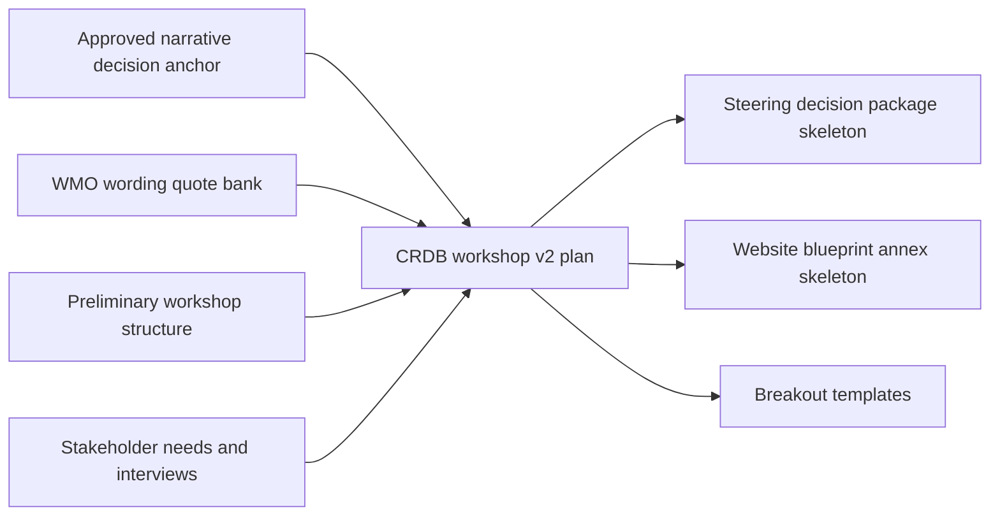

# Plan: CRDB workshop v2 (using WMO-NFCS evidence + approved narrative)

## Background
Last session produced:

- A stable narrative decision anchor: [plans/2026-03-30-crdb-workshop-narrative-approved-plan-note.md](plans/2026-03-30-crdb-workshop-narrative-approved-plan-note.md)
- The full narrative strategies + session mapping: [plans/2026-03-30-crdb-workshop-narrative-strategies.md](plans/2026-03-30-crdb-workshop-narrative-strategies.md)
- A WMO-aligned quote bank for steering-safe governance wording, UIP framing including website, and MEL/accountability: [ψ/incubate/WMO-NFCS/output/WMO-NFCS_quote-bank_governance-uip-mel.md](ψ/incubate/WMO-NFCS/output/WMO-NFCS_quote-bank_governance-uip-mel.md)
- Existing CRDB workshop structure anchor: [ψ/incubate/DCCE/CRDB/output/2026-03-24_CRDB-Workshop-Preliminary-Plan.md](ψ/incubate/DCCE/CRDB/output/consultation_workshop/2026-03-24_CRDB-Workshop-Preliminary-Plan.md)
- Session handoff anchor: [ψ/inbox/handoff/2026-03-30_18-06_crdb-workshop-v2-plan-from-wmo-nfcs-evidence.md](ψ/inbox/handoff/2026-03-30_18-06_crdb-workshop-v2-plan-from-wmo-nfcs-evidence.md)

Next session goal: turn the narrative and evidence into **CRDB workshop v2** artifacts that are executable, sponsor-safe, steering-consumable, and stakeholder-fit.

## Target outcome (definition of done)
By end of next session, we have:

1. A **CRDB workshop v2 plan** document that is clearly aligned to:
   - Strategy 2 narrative, packaged as Strategy 1 outputs, plus website blueprint annex
   - Session-by-session outputs and facilitation instructions
   - Stakeholder-fit and TOR 15-organization logic
1. A **workshop outputs pack skeleton** (headings + templates only) to ==make post-workshop writing mechanical.==

## Constraints to respect
- TOR-literal: NCAIF must output a **website blueprint annex**.
- NFCS ownership: avoid implying NFCS is hosted by a line agency; use oversight vs coordinating institution framing per quote bank.
- Stakeholder evidence: workshop design must remain consistent with the cross-agency needs clusters and interviews captured in [ψ/incubate/DCCE/CRDB/output/2026-03-23-Chapter2-stakeholder-needs-synthesis-v2.md](ψ/incubate/DCCE/CRDB/output/2026-03-23-Chapter2-stakeholder-needs-synthesis-v2.md) and [ψ/incubate/DCCE/CRDB/output/2026-03-23-CRDB-Interview-Ingestion-Traceability-Note.md](ψ/incubate/DCCE/CRDB/output/2026-03-23-CRDB-Interview-Ingestion-Traceability-Note.md).

## Architecture of the v2 package

## Stakeholder fit and invite logic

Use the dedicated stakeholder note for detail: [plans/2026-03-31_crdb-workshop-v2-stakeholder-fit-and-invite-plan.md](plans/2026-03-31_crdb-workshop-v2-stakeholder-fit-and-invite-plan.md).

For next session planning treat the following as constraints:

- The workshop design already aligns well with interview-based needs from FTI, UDDC, BMA, and DPT (service bundles, baselines, governance, access rails) but only if those actors or equivalent functions are present in the room.
- At least five functional groups must be represented by named organizations: economic and planning, climate service providers, data infrastructure and catalog owners, local implementers and disaster risk managers, and private sector demand.
- NFCS steering and NMHS leadership must have at least observer or co-owner presence to make the steering decision package credible and WMO-consistent.

Stakeholder clusters to prioritise in invite review:

- Economic and planning: NESDC, OTP, TBA, NXPO or equivalents.
- Data infrastructure and catalog: DGA, NSO, DCCE/CRDB.
- Climate and hazard service providers: TMD and allied technical units consistent with NFCS guidance.
- Local implementers: BMA, DLA, at least one non-Bangkok municipality, UDDC or similar design partners.
- Disaster risk and emergency operations: DDPM and/or provincial DRR actors.
- Private sector: FTI and/or other sector associations relevant to Human Settlement and Security.

These clusters should be explicitly checked against the invite list during the next session; gaps should be recorded as risks in the v2 plan.

## TOR 15-organization expectation

The TOR floor of **at least 15 organizations** is both sensible and achievable given:

- the number of agencies already engaged through CRDB interviews and NFCS consultations; and
- the WMO-NFCS expectation of inter-ministerial oversight, NMHS leadership, and sector UIPs.

Planning rule for the next session:

- Do **not** treat 15 as a maximum; aim for a balanced span of **15–20 organizations** across the functional clusters above.
- If any functional group has zero confirmed organizations, treat that as a risk to be documented in the workshop v2 plan and adjust expectations on which decisions can be claimed as NFCS-ready.

## Next session execution checklist

### 1) Freeze inputs and extract requirements
- Read and highlight the minimum deliverable pack requirements from: [plans/2026-03-30-crdb-workshop-narrative-approved-plan-note.md](plans/2026-03-30-crdb-workshop-narrative-approved-plan-note.md)
- Pull the session-by-session mapping blocks from: [plans/2026-03-30-crdb-workshop-narrative-strategies.md](plans/2026-03-30-crdb-workshop-narrative-strategies.md)
- Pull governance wording guardrails and UIP and MEL snippets from: [ψ/incubate/WMO-NFCS/output/WMO-NFCS_quote-bank_governance-uip-mel.md](ψ/incubate/WMO-NFCS/output/WMO-NFCS_quote-bank_governance-uip-mel.md)
- Confirm stakeholder evidence anchors from: [ψ/incubate/DCCE/CRDB/output/2026-03-23-Chapter2-stakeholder-needs-synthesis-v2.md](ψ/incubate/DCCE/CRDB/output/2026-03-23-Chapter2-stakeholder-needs-synthesis-v2.md) and [ψ/incubate/DCCE/CRDB/output/2026-03-23-CRDB-Interview-Ingestion-Traceability-Note.md](ψ/incubate/DCCE/CRDB/output/2026-03-23-CRDB-Interview-Ingestion-Traceability-Note.md)

### 2) Produce CRDB workshop v2 plan
Create a new v2 plan file rather than overwriting the preliminary plan.

Proposed output path:
- [ψ/incubate/DCCE/CRDB/output/2026-03-31_CRDB-Workshop-Plan-v2.md](ψ/incubate/DCCE/CRDB/archive/2026-03-31_CRDB-Workshop-Plan-v2.md)

Minimum sections:

- Purpose and audience
- Constraints (TOR-literal website blueprint, NFCS governance wording)
- Stakeholder and TOR assumptions (15+ organizations, functional coverage)
- Narrative script (plenary framing)
- Session-by-session facilitation notes
- Explicit outputs per session (and who produces them)
- Post-workshop assembly instructions: how outputs become the 2-page memo + annex

### 3) Produce workshop outputs pack skeleton
Create a pack folder or a single skeleton file. Keep it headings and templates only.

Proposed outputs:

- [ψ/incubate/DCCE/CRDB/output/2026-03-31_CRDB-Workshop-Outputs-Pack-Skeleton.md](ψ/incubate/DCCE/CRDB/archive/2026-03-31_CRDB-Workshop-Outputs-Pack-Skeleton.md)

Include templates for:

- Steering decision package (2 pages max)
- Website blueprint annex
- Service blueprint one-pager per journey
- Baseline and caveat rules table
- Governance roles and operating rhythm table
- MEL and accountability minimal block

### 3b) Encode stakeholder fit into session design

- For each session define which stakeholder clusters must be present to meet the objective, for example:
  - Session 2 must include at least one local implementer (BMA or other municipality), one planning/engineering actor (DPT or similar), and one private-sector or budget-facing actor (FTI, NESDC etc.).
  - Session 3 must include at least one data infrastructure owner (DGA, NSO, DCCE) and one climate service provider (TMD or equivalent).
  - Session 4 must include at least one NFCS steering representative or governance actor able to speak to oversight and coordination roles.
- Add these required clusters into the facilitation notes and room plan so that breakout composition is not left to chance.

### 4) Wire steering-safe language into the templates

- Add a short guardrails section inside each template that links back to the quote bank.
- Ensure language differentiates oversight body vs coordinating institution vs implementing agencies.
- Embed a light MEL block using WMO language so that review cadence and reporting lines are explicit.

### 5) Repo hygiene decisions

- Decide whether to add a `.gitattributes` rule to reduce LF to CRLF noise, or accept the warnings.
- Keep future commits split by intent: CRDB narrative, WMO-NFCS, tooling/config.

## Devil s advocate stress test checklist

Before freezing the CRDB workshop v2 plan use the following questions as a pressure test.

### Workshop logic

- Are we trying to lock too many decision types at once for the available time (bundles, baselines, governance, MEL, website blueprint).
- Does the narrative clearly state that outputs are recommendations for NFCS steering endorsement rather than a line agency taking ownership of NFCS.
- Is the website blueprint annex explicitly positioned as one UIP element derived from service and governance design rather than the main deliverable.

### Stakeholder mix

- Does each functional cluster (economic planning, climate service provision, data infrastructure, local implementation, disaster risk management, private sector) have at least one organization confirmed.
- Are private sector and non-Bangkok local authorities present given their prominence in the evidence base.
- Are sensitive data holders (MSDHS, NSO, DDPM) engaged in a way that feels safe and staged rather than sudden and absolute.

### Deliverability

- Do the planned session outputs land directly into the decision package and website blueprint skeletons with minimal rewriting.
- Does every endorsed baseline rule or governance role have a named institutional owner and a realistic review cadence consistent with WMO MEL guidance.

If any of these checks fail, the next session should adjust scope, invites, or framing before calling the artifact **CRDB workshop v2**.

## Reference

- Handoff: [ψ/inbox/handoff/2026-03-30_18-06_crdb-workshop-v2-plan-from-wmo-nfcs-evidence.md](ψ/inbox/handoff/2026-03-30_18-06_crdb-workshop-v2-plan-from-wmo-nfcs-evidence.md)

