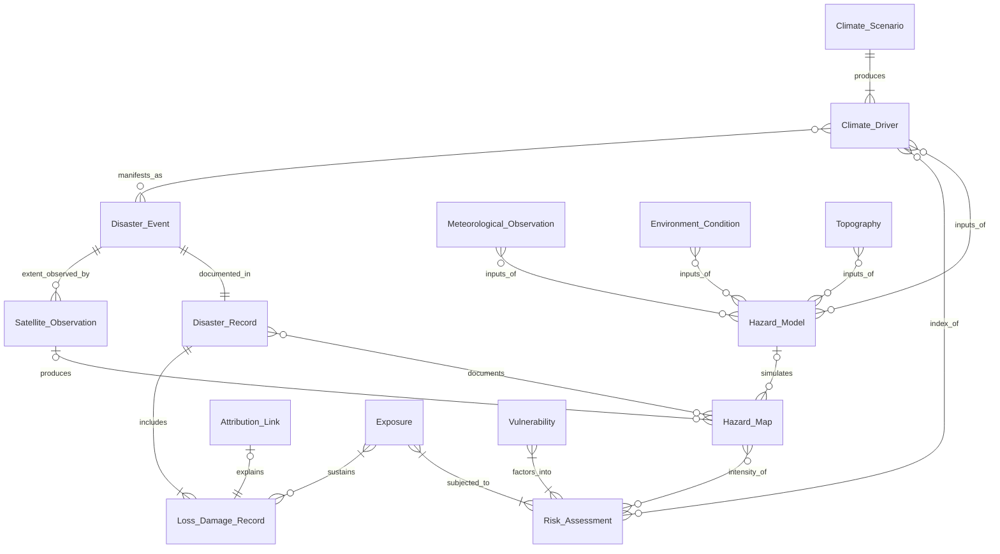

## Relationship Analysis (Domain 1 & 2)

### Normalized relationship list (updated after decisions)
1. `CLIMATE_SCENARIO` (1) **produces** `CLIMATE_DRIVER` (1..*)
2. `CLIMATE_DRIVER` (0..*) **inputs_of** `HAZARD_MODEL` (0..*)
3. `CLIMATE_DRIVER` (0..*) **index_of** `RISK_ASSESSMENT` (0..*)
4. `CLIMATE_DRIVER` (0..*) **manifests_as** `DISASTER_EVENT` (0..*)
5. `METEOROLOGICAL_OBSERVATION` (0..*) **inputs_of** `HAZARD_MODEL` (0..*)
6. `ENVIRONMENT_CONDITION` (0..*) **inputs_of** `HAZARD_MODEL` (0..*)
7. `TOPOGRAPHY` (0..*) **inputs_of** `HAZARD_MODEL` (0..*)
8. `HAZARD_MODEL` (0..*) **simulates** `HAZARD_MAP` (0..1)
9. `HAZARD_MAP` (0..*) **intensity_of** `RISK_ASSESSMENT` (0..*)
10. `SATELLITE_OBSERVATION` (0..*) **produces** `HAZARD_MAP` (0..1)
11. `DISASTER_RECORD` (0..*) **documents** `HAZARD_MAP` (0..*)
12. `DISASTER_RECORD` (1) **includes** `LOSS_DAMAGE_RECORD` (1..*)
13. `DISASTER_EVENT` (1) **documented_in** `DISASTER_RECORD` (1)
14. `DISASTER_EVENT` (1) **extent_observed_by** `SATELLITE_OBSERVATION` (0..*)
15. `ATTRIBUTION_LINK` (0..1) **explains** `LOSS_DAMAGE_RECORD` (1)
16. `EXPOSURE` (1..*) **subjected_to** `RISK_ASSESSMENT` (1..*)
17. `EXPOSURE` (1..*) **sustains** `LOSS_DAMAGE_RECORD` (0..*)
18. `VULNERABILITY` (1..*) **factors_into** `RISK_ASSESSMENT` (1..*)

> **Note:** Cardinalities above reflect the updated Mermaid markers after applying your decisions.

### Relationship summary table (updated after decisions)

| # | Relationship | Cardinality (A:B) | Notes | Status |
|---|---|---|---|---|
| 1 | `CLIMATE_SCENARIO` produces `CLIMATE_DRIVER` | 1 : 1..* | Scenario generates multiple drivers. | OK |
| 2 | `CLIMATE_DRIVER` inputs_of `HAZARD_MODEL` | 0..* : 0..* | Drivers can feed many models and vice versa. | OK |
| 3 | `CLIMATE_DRIVER` index_of `RISK_ASSESSMENT` | 0..* : 0..* | Index-based pathway; optional for physical assessments. | Resolved |
| 4 | `CLIMATE_DRIVER` manifests_as `DISASTER_EVENT` | 0..* : 0..* | Supports multi-driver attribution for compound events. | OK |
| 5 | `METEOROLOGICAL_OBSERVATION` inputs_of `HAZARD_MODEL` | 0..* : 0..* | Models can require multiple observations/variables. | Resolved |
| 6 | `ENVIRONMENT_CONDITION` inputs_of `HAZARD_MODEL` | 0..* : 0..* | Static layers can be reused across models. | Resolved |
| 7 | `TOPOGRAPHY` inputs_of `HAZARD_MODEL` | 0..* : 0..* | Topography datasets reused across models. | OK |
| 8 | `HAZARD_MODEL` simulates `HAZARD_MAP` | 0..* : 0..1 | Maps may be modeled or observed; model link optional. | Resolved |
| 9 | `HAZARD_MAP` intensity_of `RISK_ASSESSMENT` | 0..* : 0..* | Physical pathway; optional for index-based assessments. | Resolved |
| 10 | `SATELLITE_OBSERVATION` produces `HAZARD_MAP` | 0..* : 0..1 | Observed hazard maps may derive from satellite data. | Resolved |
| 11 | `DISASTER_RECORD` documents `HAZARD_MAP` | 0..* : 0..* | Records can reference multiple maps (pre/post, multi-hazard). | Resolved |
| 12 | `DISASTER_RECORD` includes `LOSS_DAMAGE_RECORD` | 1 : 1..* | Record aggregates loss/damage entries. | OK |
| 13 | `DISASTER_EVENT` documented_in `DISASTER_RECORD` | 1 : 1 | Single observed occurrence with summary stats. | Resolved |
| 14 | `DISASTER_EVENT` extent_observed_by `SATELLITE_OBSERVATION` | 1 : 0..* | Event can have many observations. | OK |
| 15 | `ATTRIBUTION_LINK` explains `LOSS_DAMAGE_RECORD` | 0..1 : 1 | Aggregated attribution summary per loss record. | Resolved |
| 16 | `EXPOSURE` subjected_to `RISK_ASSESSMENT` | 1..* : 1..* | Many exposures assessed in many assessments. | OK |
| 17 | `EXPOSURE` sustains `LOSS_DAMAGE_RECORD` | 1..* : 0..* | Exposures may or may not have losses. | OK |
| 18 | `VULNERABILITY` factors_into `RISK_ASSESSMENT` | 1..* : 1..* | Vulnerability definitions reused across assessments. | OK |

### Decisions applied (from inline comments)
- Dual-path risk assessment: index-based via `CLIMATE_DRIVER`, physical via `HAZARD_MAP` (shared structure).
- Attribution is loss-driven: `ATTRIBUTION_LINK` connects  to `LOSS_DAMAGE_RECORD`and `CLIMATE_DRIVER`
- `HAZARD_MAP` can be modeled or observed; satellite-derived maps allowed (subtypes hidden for now).
- `DISASTER_RECORD` represents a single observed occurrence with summary statistics (1:1 with event).
- Attribution is aggregated per loss record (single summary link).

## Revised entity definitions (Domain 1 & 2)

### Domain 1: Physical Climate (Cause & Observation)
- **`CLIMATE_SCENARIO`**: A standardized projection pathway (e.g., SSP/RCP) that provides assumptions for future climate trajectories used to generate drivers.
- **`CLIMATE_DRIVER`**: A forcing variable or trend (e.g., temperature, precipitation, sea-level rise) produced under a scenario and used as input to hazard modeling or index-based risk assessment.
- **`METEOROLOGICAL_OBSERVATION`**: Time-stamped measured weather data (stations, reanalysis) used as dynamic inputs to hazard models.
- **`ENVIRONMENT_CONDITION`**: Semi-static environmental datasets (land cover, soil, drainage) that condition hazard simulations.
- **`TOPOGRAPHY`**: Static elevation and terrain representations used to parameterize hazard models.
- **`DISASTER_EVENT`**: A discrete hazardous occurrence with time and spatial extent (e.g., cyclone, flood episode) potentially linked to one or more climate drivers.
- **`SATELLITE_OBSERVATION`**: Remote sensing observation capturing spatial extent/characteristics of a disaster event or hazard footprint.

### Domain 2: Risk & Impact Assessment (Hazard, Exposure, Vulnerability, Impact)
- **`HAZARD_MODEL`**: A computational model or workflow (with parameters and inputs) that simulates hazard intensity surfaces.
- **`HAZARD_MAP`**: A spatial output grid representing hazard intensity, either **modeled** (from `HAZARD_MODEL`) or **observed** (from `SATELLITE_OBSERVATION`).
- **`RISK_ASSESSMENT`**: The calculation event combining hazard intensity (`HAZARD_MAP`) and/or driver-based indices (`CLIMATE_DRIVER`) with exposure and vulnerability to quantify risk metrics.
- **`EXPOSURE`**: The inventory of assets, population, or systems that can be affected by hazards, typically geolocated.
- **`VULNERABILITY`**: The susceptibility function or index that translates hazard intensity into expected impact for a given exposure.
- **`DISASTER_RECORD`**: A single observed occurrence of a disaster event with summary statistics (affected population/assets, duration, total losses).
- **`LOSS_DAMAGE_RECORD`**: Observed impacts and losses (economic, social, environmental) linked to exposures and disaster records.
- **`ATTRIBUTION_LINK`**: An aggregated attribution summary linked to a `LOSS_DAMAGE_RECORD` and optional `CLIMATE_DRIVER` since attribution science is still too young in Thailand
## Draft business glossary (derived from the CDM)
- **Attribution**: The process of linking observed loss and damage to causal drivers via a loss-driven attribution summary.
- **Climate Scenario**: A standardized future pathway (SSP/RCP) used to generate projected climate drivers.
- **Climate Driver**: A forcing variable or trend (e.g., rainfall, temperature) that influences hazards and impacts.
- **Disaster Event**: A discrete hazard occurrence with defined time and spatial extent.
- **Disaster Record**: A single observed occurrence of a disaster event with summary statistics.
- **Exposure**: The people, assets, or systems located in hazard-prone areas.
- **Hazard Model**: The computational method used to simulate hazards from inputs.
- **Hazard Map**: A spatial representation of hazard intensity, either modeled or observed.
- **Loss & Damage Record**: A dataset of observed impacts and losses associated with a disaster event.
- **Meteorological Observation**: Measured weather data used as hazard model inputs.
- **Risk Assessment**: The analytical process combining hazard maps and/or climate-driver indices with exposure and vulnerability.
- **Satellite Observation**: Remote sensing data capturing hazard or disaster extent.
- **Topography**: Terrain data defining elevation/slope conditions used in hazard models.
- **Vulnerability**: The susceptibility of exposed assets to damage given a hazard intensity.
