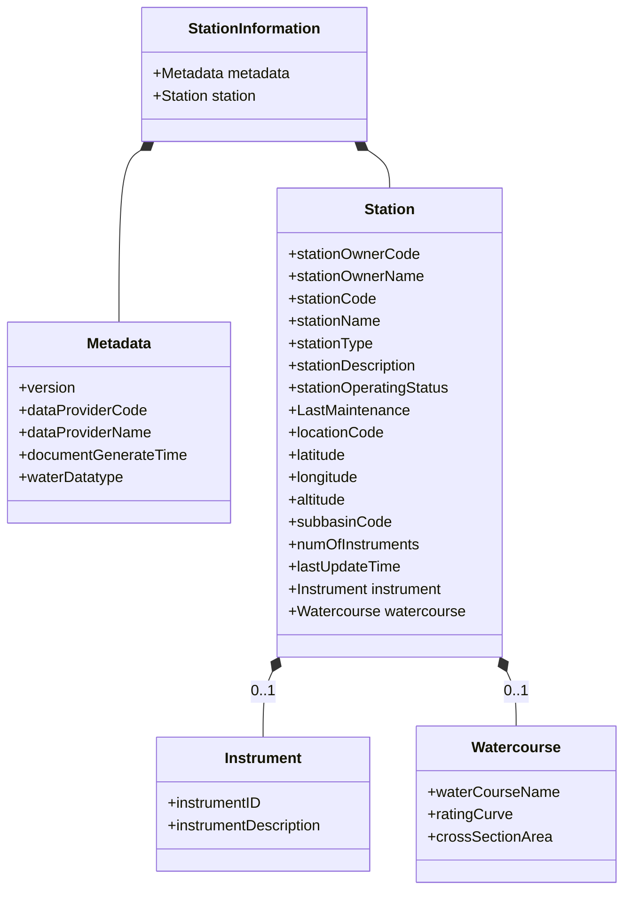
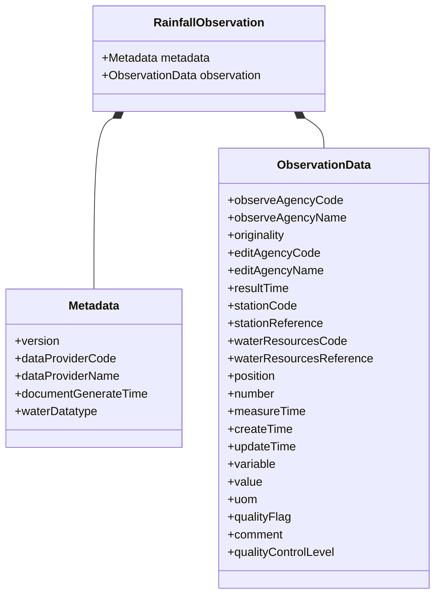

# **Thaiwater Data System Architecture and Data Governance Framework: Systematic Extraction and Artifact Catalog**

The Thaiwater Data System, accessible via standard.thaiwater.net, represents a foundational national infrastructure for the management and exchange of hydro-informatics within the Kingdom of Thailand. This report functions as a systematic architectural extraction of the system's data governance framework artifacts, metadata schemas, and technical protocols. As a data architect’s systematic crawl, the content is organized according to the original sitemap and hierarchical structure of the documentation, preserving technical jargon and original Thai-English terminology to ensure high fidelity for machine ingestion and future synthesis. The system was initiated in 2022 and is structured across two primary implementation phases, encompassing a total of eight core sub-divisions.1

## **Standard Thaiwater Root and Documentation Index (หน้าหลักและสารบัญเอกสาร)**

The root of the Thaiwater standard system establishes the primary navigation and the conceptual boundaries of the data ecosystem. The system is designed to provide a unified standard for water data exchange and warning across diverse governmental and local administrative organizations.3

### **Primary Sitemap Hierarchy**

The hierarchical structure of the site is defined by the following top-level nodes and subsequent branches, which provide the framework for the extraction process:

* **Home (หน้าหลัก)**: The entry point providing high-level summaries of the project’s significance and the National Water Data Warehouse (คลังข้อมูลน้ำแห่งชาติ).3  
* **Water Data Standards for Exchange (มาตรฐานข้อมูลน้ำเพื่อการแลกเปลี่ยน)**: A detailed phase focusing on data interoperability, encompassing reference information, data structures, exchange protocols, quality control, and governance artifacts.1  
* **Water Data Standards for Warning (มาตรฐานข้อมูลน้ำเพื่อการเตือนภัย)**: A second-phase implementation focusing on disaster risk reduction, providing terminology, criteria, and station-based warning levels.1  
* **Appendices (ภาคผนวก)**: A repository of standardized codes for agencies, administrative zones, and hydrological basins.1  
* **Glossary (อภิธานศัพท์)**: Technical definitions used throughout the standard.3  
* **Contact HII (ติดต่อ สสน.)**: Administrative contact information for the Hydro-Informatics Institute.3

[[ψ/incubate/DCCE/CRDB/inbox_note/Thaiwater data governance sitemap|Thaiwater data governance sitemap]]

## **Phase 1: Water Data Standards for Exchange (มาตรฐานข้อมูลน้ำเพื่อการแลกเปลี่ยน)**

This section of the documentation details the technical requirements for agencies to participate in the water data ecosystem. It focuses on ensuring that data moved between systems maintains semantic and structural integrity.1

### **1.1 Reference Information (ข้อมูลอ้างอิง)**

The reference information tier provides the "common language" required for data normalization. It covers units, temporal formats, spatial referencing, and organizational identifiers.3

#### **1.1.1 Units and Symbols (หน่วยและสัญลักษณ์)**

The architecture mandates specific units for various water quality and quantity parameters to prevent calculation errors during inter-agency exchange. The extraction of the primary unit table reveals the following technical specifications:

| Thai Name (ชื่อเรียกภาษาไทย) | English Name | English Unit of Measurement |
| :---- | :---- | :---- |
| การนำไฟฟ้า | Electrical Conductivity | Microsiemens/centimeter (![][image1]) |
| ความขุ่น | Turbidity | Nephelometric Turbidity Units (NTU) |
| ความเค็ม | Salinity | Gram/Liter (![][image2]) |
| บีโอดี | Biochemical Oxygen Demand | Milligram/Liter (![][image3]) |
| ไนเตรทในหน่วยไนโตรเจน | Nitrate Nitrogen | Milligram/Liter (![][image3]) |
| ฟอสฟอรัสทั้งหมด | Total Phosphorus | Milligram/Liter (![][image3]) |
| แบคทีเรียกลุ่มโคลิฟอร์มทั้งหมด | Total Coliform Bacteria | ![][image4] |
| แบคทีเรียกลุ่มฟีคัลโคลิฟอร์ม | Fecal Coliform Bacteria | ![][image4] |

5

#### **1.1.2 Date and Time Formats (รูปแบบวันและเวลา)**

The system adopts a standardized format for identifying the timing of observations and document creation. The architect identifies the use of ISO 8601-like timestamps (e.g., YYYY-MM-DDTHH:MM:SS) to ensure precision in time-series data alignment.3

#### **1.1.3 Coordinate Identification (การระบุพิกัดตำแหน่ง)**

Provisions are made for standardized coordinate positioning, ensuring that spatial data for stations and water resources can be accurately rendered across Geographic Information Systems (GIS) platforms used by different agencies.1

#### **1.1.4 Agency and Location Referencing (การอ้างอิงหน่วยงานและตำแหน่งที่ตั้ง)**

Identifiers for data providers and owners are central to the provenance of the data. Agencies are identified by unique codes (e.g., G50504 for Electricity Generating Authority of Thailand).6 Locations are hierarchically referenced by province, district, and sub-district codes found in the appendices.1

#### **1.1.5 Basin and Water Source Categorization (การอ้างอิงลุ่มน้ำและประเภทแหล่งน้ำ)**

The system categorizes hydrological basins into major and sub-basins. Furthermore, small-scale water resources are classified using specific natural and man-made identifiers.3

| Code (รหัส) | Thai Type Name | English Type Name | Description (ความหมาย) |
| :---- | :---- | :---- | :---- |
| 0101 | ทะเลสาบ/บ่อน้ำ (ตามธรรมชาติ) | Lake/Pond | Natural surface water area with constant surface shape. |
| 0102 | หนอง/บึง/กุด | Swamp/Marsh | Muddy or flooded areas, often covered with aquatic plants. |
| 0103 | ตาน้ำ | Spring/Seep | Areas where groundwater naturally emerges. |
| 0201 | อ่างเก็บน้ำ | Reservoir | Large natural or man-made basin for storage/control. |
| 0202 | สระน้ำ/บ่อน้ำ (มนุษย์สร้าง) | Pool | Man-made structures built specifically for water storage. |
| 0301 | ลำน้ำ/แม่น้ำ | Stream/River | Natural flow paths of surface water. |
| 0401 | คลอง | Canal | Man-made waterways for transport or drainage. |
| 0402 | คลองชลประทาน | Irrigation canal | Channels for delivering water from sources to farmland. |

8

### **1.2 Data Formats and Structures (รูปแบบและโครงสร้างข้อมูล)**

The architectural core of Thaiwater.Standard separates data into two functional groups: Observation data (real-time or periodic sensor measurements) and Information data (static metadata describing the data source).3

##### **1.2.1 โครงสร้างข้อมูลสารสนเทศสถานีตรวจวัด (Station Information)**

โครงสร้างข้อมูลสารสนเทศสถานีตรวจวัดประกอบด้วย 2 ส่วนหลัก คือ **Metadata** และ **Station** โดยมีรายละเอียดและโครงสร้างความสัมพันธ์ของข้อมูลดังนี้:

###### แผนภาพโครงสร้างข้อมูล (Data Structure Diagram)

1. **พจนานุกรมข้อมูล Metadata (Metadata Data Dictionary)**

|**Field Name**|**Mandatory**|**Multiplicity**|**Description**|**Data Type**|**Example**|
|---|---|---|---|---|---|
|version|Y|1|เวอร์ชั่นของมาตรฐาน|string|1.0|
|dataProviderCode|Y|1|รหัสหน่วยงานจัดเตรียมข้อมูล|string|G50601|
|dataProviderName|Y|1|ชื่อหน่วยงานจัดเตรียมข้อมูล|string|Metropolitan Waterworks Authority|
|documentGenerateTime|Y|1|วัน-เวลาที่มีการสร้างเอกสาร|datetime|2023-09-15T10:00:00|
|waterDatatype|Y|1|ชนิดของข้อมูลด้านน้ำ|string|B001|

2. **พจนานุกรมข้อมูล Station (Station Data Dictionary)**

|**Field Name**|**Mandatory**|**Multiplicity**|**Description**|**Data Type**|**Example**|
|---|---|---|---|---|---|
|stationOwnerCode|Y|1|รหัสหน่วยงานที่เป็นเจ้าของสถานี|string|G50601|
|stationOwnerName|Y|1|ชื่อหน่วยงานเจ้าของสถานี|string|Metropolitan Waterworks Authority|
|stationCode|Y|1|รหัสสถานีตรวจวัด|string|G50601-S1|
|stationName|Y|1|ชื่อสถานีตรวจวัด|string|สำแล|
|stationType|Y|1|ชนิดสถานีตรวจวัด|string|คุณภาพน้ำ|
|stationDescription|Y|1|คำอธิบายรายละเอียดสถานีตรวจวัด|string|สถานีวัดคุณภาพน้ำแม่น้ำเจ้าพระยา|
|stationOperatingStatus|Y|1|สถานะการทำงานของสถานีตรวจวัด|integer|1|
|LastMaintenance|Y|1|วันที่มีการบำรุงรักษาล่าสุด|date|2020-06-02|
|locationCode|Y|1|รหัสตำแหน่งที่ตั้ง|string|130105|
|latitude|Y|1|ค่าละติจูด|decimal|14.040830|
|longitude|Y|1|ค่าลองจิจูด|decimal|100.555875|
|altitude|N|0..1|ค่าความสูงเหนือระดับน้ำทะเล|decimal|Null|
|subbasinCode|N|0..1|รหัสลุ่มน้ำหลัก/ลุ่มน้ำสาขา|string|Null|
|numOfInstruments|Y|1|จำนวนของเครื่องมือวัด|integer|1|
|lastUpdateTime|Y|1|วันเวลาการปรับปรุงชุดข้อมูลล่าสุด|datetime|2022-05-02T9:00:00|
|instrumentID|N|0..1|รหัสเครื่องมือวัด|string|Null|
|instrumentDescription|N|0..1|คำอธิบายเครื่องมือวัด|string|Multi-Sensor|
|waterCourseName|N|0..1|ชื่อเส้นทางน้ำ|string|แม่น้ำเจ้าพระยา|
|ratingCurve|N|0..1|ชุดข้อมูลความสัมพันธ์ระดับน้ำและการไหล|ratingcurve|Null|
|crossSectionArea|N|0..1|พื้นที่รูปตัดขวาง|decimal|Null|

**หมายเหตุ:**

- **Mandatory (Y)**: จำเป็นต้องมีข้อมูลในการส่ง
    
- **Mandatory (N)**: ไม่จำเป็นต้องมีข้อมูล หากไม่มีให้ระบุเป็น Null หรือไม่ต้องส่งฟิลด์นั้น

#### **1.2.2 โครงสร้างข้อมูลสารสนเทศแหล่งน้ำขนาดใหญ่ Large-sized Water Resources Information**

Information structures provide the descriptive metadata necessary to interpret the context of measurements. These structures are defined for water resources of three sizes: large, medium, and small.1

##### **Metadata Schema for Water Resources Information**

The following table extracts the metadata components required for Large and Medium-sized water resource information sets:

| Field Name | Mandatory | Multiplicity | Description | Data Type | Example |
| :---- | :---- | :---- | :---- | :---- | :---- |
| version | Y | 1 | Version of the Thaiwater Standard | string | 1.0 |
| dataProviderCode | Y | 1 | Agency code of the data preparer | string | G50504 / G07003 |
| dataProviderName | Y | 1 | Agency name in English | string | Royal Irrigation Department |
| documentGenerateTime | Y | 1 | Timestamp of document creation | datetime | 2022-05-02T22:01:00 |
| waterDatatype | Y | 1 | Code for the water data type | string | B002 (Large) / B003 (Medium) |

The waterDatatype identifier is critical for the system's routing logic:

* B002: Large-sized Water Resources Information.6  
* B003: Medium-sized Water Resources Information.7

#### **1.2.2 Observation Data Structures (โครงสร้างข้อมูลตรวจวัด)**
 นี่คือเนื้อหาจากหน้าเว็บ **ข้อมูลน้ำฝน (Rainfall)** ในรูปแบบ Markdown พร้อมแผนภาพโครงสร้างข้อมูล (Diagram) ครับ

##### 1.2.2.1 ข้อมูลน้ำฝน (Rainfall)

โครงสร้างข้อมูลตรวจวัดน้ำฝน (Time Series Observation) ประกอบด้วยส่วนประกอบสำคัญที่ใช้ในการระบุแหล่งที่มา เวลา และคุณภาพของข้อมูล โดยมีรายละเอียดดังนี้

###### แผนภาพโครงสร้างข้อมูล (Data Structure Diagram)

---

 1. **ตารางพจนานุกรมข้อมูล Metadata**

|**Field Name**|**Mandatory**|**Multiplicity**|**Description**|**Data Type**|**Example**|
|---|---|---|---|---|---|
|version|Y|1|เวอร์ชั่นของมาตรฐาน|string|1.0|
|dataProviderCode|Y|1|รหัสหน่วยงานจัดเตรียมข้อมูล|string|G11004|
|dataProviderName|Y|1|ชื่อหน่วยงานจัดเตรียมข้อมูล|string|Meteorological Department|
|documentGenerateTime|Y|1|วัน-เวลาที่มีการสร้างเอกสาร|datetime|2022-05-02T22:01:00|
|waterDatatype|Y|1|ชนิดของข้อมูลด้านน้ำ|string|B001|

2. **ตารางพจนานุกรมข้อมูล Time Series Observation (Rainfall)**

|**Field Name**|**Mandatory**|**Multiplicity**|**Description**|**Data Type**|**Example**|
|---|---|---|---|---|---|
|observeAgencyCode|Y|1|รหัสหน่วยงานที่ตรวจวัด|string|G11004|
|observeAgencyName|Y|1|ชื่อหน่วยงานที่ตรวจวัด|string|Meteorological Department|
|originality|Y|1|ความเป็นข้อมูลดั้งเดิม|integer|1|
|editAgencyCode|N|0..1|รหัสหน่วยงานที่แก้ไข|string|Null|
|editAgencyName|N|0..1|ชื่อหน่วยงานที่แก้ไข|string|Null|
|resultTime|Y|1|เวลาที่ทำการสร้างชุดข้อมูลตรวจวัดนี้|datetime|2022-05-02T22:01:00|
|stationCode|Y|1|รหัสสถานีตรวจวัด|string|G11004-103662|
|stationReference|Y|1|การอ้างอิงไปยังข้อมูลสารสนเทศสถานีตรวจวัด|url|[https://api.my.org/twsapi/v1.0/StationInfo/G11004-103662](https://www.google.com/search?q=https://api.my.org/twsapi/v1.0/StationInfo/G11004-103662)|
|waterResourcesCode|N|0..1|รหัสแหล่งน้ำ|string|Null|
|waterResourcesReference|N|0..1|การอ้างอิงไปยังข้อมูลแหล่งน้ำ|url|Null|
|position|N|0..1|ตำแหน่งเครื่องมือตรวจวัด|string|Null|
|number|N|0..1|หมายเลขเครื่องมือตรวจวัด|integer|Null|
|measureTime|Y|1|เวลาการตรวจวัด|datetime|2022-05-02T22:00:00|
|createTime|Y|1|เวลาที่ทำการบันทึกข้อมูลตรวจวัดเข้าระบบครั้งแรก|datetime|2022-05-02T22:00:00|
|updateTime|Y|1|เวลาล่าสุดที่ทำการปรับปรุงข้อมูลตรวจวัดในระบบ|datetime|2022-05-02T22:00:00|
|variable|Y|1|ชื่อข้อมูลตรวจวัด|string|Rainfall|
|value|Y|1|ค่าการตรวจวัด|decimal|2.1|
|uom|Y|1|หน่วยการตรวจวัด|string|mm|
|qualityFlag|Y|1|แฟลกคุณภาพข้อมูล|string|U|
|comment|N|0..1|คำอธิบายเพิ่มเติมแฟลกคุณภาพข้อมูล|string|No quality control|
|qualityControlLevel|Y|1|ระดับการควบคุมคุณภาพ|string|1|

**หมายเหตุ:**

- **Mandatory (Y)**: ฟิลด์นี้จำเป็นต้องมีในการส่งข้อมูล
- **Mandatory (N)**: ฟิลด์นี้ไม่จำเป็นต้องมีในการส่งข้อมูล ในกรณีที่ไม่มีข้อมูลให้ระบุเป็น Null หรือไม่ต้องส่งฟิลด์นี้
- **Originality**: ระบุสถานะข้อมูล (เช่น 1 = ข้อมูลจริงจากเครื่องมือวัด)
- **Quality Flag**: ตัวบ่งชี้คุณภาพข้อมูล (เช่น U = Unverified)
- **Quality Control Level**: ระดับความเข้มข้นในการตรวจสอบคุณภาพข้อมูล (เช่น 1 = ขั้นต้น)

1.2.2.2 ข้อมูลน้ำท่า-ระดับน้ำ (Water Level)
1.2.2.3 ข้อมูลแหล่งน้ำขนาดใหญ่-ปริมาณน้ำกักเก็บ (Storage)
1.2.2.4 ข้อมูลแหล่งน้ำขนาดกลาง – ปริมาณน้ำกักเก็บ (Storage)
1.2.2.5 ข้อมูลแหล่งน้ำขนาดเล็ก– ปริมาตรน้ำกักเก็บ (Storage)
### **1.3 Data Connection and Exchange (การเชื่อมโยงข้อมูลและแลกเปลี่ยนข้อมูล)**

The technical architecture for data exchange is partitioned into three layers: Application, Presentation, and Secure Exchange.1

#### **1.3.1 Architectural Layers**

1. **Application Layer**: Governs developer requirements for creating applications that interact with the National Water Data Warehouse.3  
2. **Presentation Layer**: Standardizes data formatting, primarily utilizing JSON for API communication.1  
3. **Secure Exchange Layer**: Focuses on the confidentiality and integrity of data in transit. It mandates protocols for encryption and authentication.1

#### **1.3.2 RESTful API Development Standards**

The API is the primary mechanism for real-time digital exchange. The system defines standard data types and HTTP status codes to be used across all participating agency interfaces.3

| API Data Type | Format and Requirements |
| :---- | :---- |
| string | Textual data; multi-line content must use \\n.14 |
| integer | 32-bit signed integer.14 |
| datetime | Formatted timestamp string.14 |
| float | Precision decimal values.14 |

The system identifies specific endpoints for different hydrological resources:

| Water Data Type | Resource URL |
| :---- | :---- |
| A001 | /Rainfall |
| A002 | /Runoff |
| A003 | /LargesizedWaterResources |
| A004 | /MediumsizedWaterResources |

15

Security guidelines for API development emphasize the **OWASP API Security** framework. Key components include the deployment of Web Application Firewalls (WAF) to inspect requests and prevent attacks, and the definition of access rights (Authentication/Authorization) to control which users can retrieve specific datasets.3

#### **1.3.3 Data Exchange
- สามารถแลกเปลี่ยนข้อมูลระหว่างหน่วยงานได้ทั้งในรูปแบบที่เป็น online และ offline
- รองรับการดึงข้อมูลย้อนหลังได้ เพื่อป้องกันปัญหาไฟฟ้า หรือระบบเครือข่ายขัดข้องชั่วคราว
- สามารถเพิ่มขยายชุดข้อมูลด้านน้ำเพิ่มเติมได้ในอนาคต
- ใช้เทคโนโลยีที่เป็นปัจจุบันและใช้งานกันในวงกว้าง และยังมีแนวโน้มที่สามารถใช้งานอย่างต่อเนื่องได้ต่อไปในอนาคต เพื่อลดความยุ่งยากในการพัฒนาระบบ ตลอดจนค่าใช้จ่ายที่จะเกิดขึ้นในอนาคต
- มีความปลอดภัย และสามารถปรับปรุงให้สอดรับกับการเปลี่ยนแปลงทาง security **ได้ในอนาคต**

**รูปแบบในการแลกเปลี่ยนข้อมูล**
1. **การแลกเปลี่ยนข้อมูลแบบ Online ผ่านระบบเครือข่าย**
	- หน่วยงานที่ให้บริการข้อมูลด้านน้ำจัดทำ API service สำหรับการให้บริการข้อมูลตามรูปแบบมาตรฐานที่กำหนดขึ้น
	- หน่วยงาน/ผู้ใช้บริการข้อมูลสามารถ access ข้อมูลด้านน้ำที่ให้บริการจาก API service ตามรูปมาตรฐาน และภายใต้เงื่อนไขทางด้าน security ของผู้ให้บริการ
	- รูปแบบการแลกเปลี่ยนข้อมูลหลักในการทำงานให้ใช้ในรูปแบบของ Online หากเกิดข้อขัดข้องที่ทำให้ไม่สามารถแลกเปลี่ยนข้อมูลได้ เช่น ระบบสื่อสารขัดข้องเป็นระยะเวลานาน หน่วยงานอาจใช้การแลกเปลี่ยนข้อมูลแบบ Offline ในการแลกเปลี่ยนระหว่างที่ระบบยังไม่สามารถใช้งานได้

2. **การแลกเปลี่ยนข้อมูลแบบ Offline โดยการการส่งข้อมูลในรูปแบบของไฟล์**
	- แลกเปลี่ยนโดยใช้รูปแบบไฟล์ที่มีรูปแบบตามมาตรฐานที่กำหนดขึ้น
	- หน่วยงานสามารถแลกเปลี่ยนข้อมูลระหว่างกัน โดยใช้ช่องทางต่าง ๆ ตามความเหมาะสม เช่น การจัดทำ FTP service เป็นต้น
	- รูปแบบนี้ใช้เพื่อรองรับเหตุเกิดการขัดข้องทางเทคนิคที่ทำให้ระบบ On-line ไม่สามารถใช้งานได้เป็นระยะเวลานาน หรือใช้เพื่อการแลกเปลี่ยนข้อมูลย้อนหลังที่อาจมีปริมาณข้อมูลเป็นจำนวนมาก

For legacy systems or non-real-time data sets, the architecture supports CSV file formats. These files are stored within a hierarchical folder structure on an FTP server, following the same metadata conventions as the API services.1

##### **1.3.3.1 การแลกเปลี่ยนข้อมูลด้วยไฟล์** 
**รูปแบบของไฟล์ที่ใช้ในการแลกเปลี่ยน**

การเลือกชนิดของไฟล์ และการกำหนดรูปแบบข้อมูลภายในไฟล์เพื่อใช้ในการแลกเปลี่ยนข้อมูลด้านน้ำ มีการนำเป้าหมายที่ต้องการมาประกอบแนวทางการกำหนด ดังนี้

- เป็นรูปแบบที่ง่ายต่อการทำความเข้าใจจากผู้ใช้งานทั่วไป ทั้งจากผู้ปฏิบัติงานและผู้ใช้งานข้อมูล เช่น นักวิจัยทั่วไป
- สามารถพัฒนา software ให้ทำงานกับข้อมูลภายในไฟล์ได้โดยง่าย มี public software library ที่ใช้งานได้อย่างหลากหลาย ทั้งที่เป็น opensource และ commercial license
- สามารถแก้ไขข้อมูลภายในไฟล์ด้วยมือ (manual edit) ได้ง่าย เพื่อรองรับการทำงานในกรณีที่มีข้อมูล error เล็กน้อยภายในไฟล์

โดยในมาตรฐานนี้ได้มีการกำหนดรูปแบบของไฟล์เป็น รูปแบบ CSV แบบ Comma-Delimited เป็นรูปแบบในการแลกเปลี่ยนข้อมูล ซึ่งเป็นรูปแบบที่ใช้งานในหน่วยงานด้านน้ำส่วนใหญ่ในปัจจุบัน นอกจากนี้ยังมี software library ที่สามารถนำมาใช้พัฒนาโปรแกรมในการอ่านข้อมูลจากไฟล์ได้อย่างหลากหลาย

###### **ไฟล์ CSV**
1. ไฟล์ข้อมูลน้ำฝน
	ตัวอย่างข้อมูลน้ำฝนในไฟล์ CSV อ้างอิงตัวอย่าง HTTP Response Body ของข้อมูลน้ำฝน 15 นาที
`version,dataProviderCode,dataProviderName,documentGenerateTime,`
`waterDatatype,interval,observeAgencyCode,observeAgencyName,originality,`  `resultTime,stationCode,stationReference,measureTime,createTime,updateTime,`  `variable,value,uom,qualityFlag,comment,qualityControlLevel`  `1.0,G11004,Meteorological Department,2022-05-02T22:30:00,A001,C-15,`  `G11004,Meteorological Department,1,2022-05-02T22:15:00,G11004-103662,`  `[https://api.my.org/twsapi/v1.0/StationInfo/G11004-103662](https://api.my.org/twsapi/v1.0/StationInfo/G11004-103662),`  `2022-05-02T22:00:00,2022-05-02T22:00:00,2022-05-02T22:00:00,Rainfall,2.1,`  `mm,U,No quality control,1`  `1.0,G11004,Meteorological Department,2022-05-02T22:30:00,A001,C-15,`  `G11004,Meteorological Department,1,2022-05-02T22:15:00,G11004-103662,`  `[https://api.my.org/twsapi/v1.0/StationInfo/G11004-103662](https://api.my.org/twsapi/v1.0/StationInfo/G11004-103662),`  `2022-05-02T22:15:00,2022-05-02T22:15:00,2022-05-02T22:15:00, Rainfall,1.0,`  `mm,U,No Quality Control,1`|

2. ไฟล์ข้อมูลน้ำท่า
3. ไฟล์ข้อมูลแหล่งน้ำขนาดใหญ่
4. ไฟล์ข้อมูลแหล่งน้ำขนาดกลาง
5. ไฟล์ข้อมูลแหล่งน้ำขนาดเล็ก
6. ไฟล์ข้อมูลคุณภาพน้ำ
7. ไฟล์ข้อมูลสารสนเทศสถานีตรวจวัด
8. ไฟล์ข้อมูลสารสนเทศแหล่งน้ำขนาดใหญ่
9. ไฟล์ข้อมูลสารสนเทศแหล่งน้ำขนาดกลาง
10. ไฟล์ข้อมูลสารสนเทศแหล่งน้ำขนาดเล็ก

##### **1.3.3.2 FTP Server แนวทางการจัดเก็บไฟล์ภายใน FTP Server 
โครงสร้างหลักภายใน FTP Server
ข้อมูลด้านน้ำทั้งหมดจะมีการจัดเก็บอยู่ภายใต้ root folder เดียวกัน โดยอาจอยู่ที่ path หนึ่งที่กำหนดโดยหน่วยงาน โดยภายใต้ folder นี้จะมีรายการของ folder ที่เป็นข้อมูลด้านน้ำแต่ละประเภท สามารถแสดงรายการ folder ตามชนิดของข้อมูลด้านน้ำที่ครอบคลุมในมาตรฐาน ประกอบด้วย
- ข้อมูลน้ำฝน (Rainfall)
- ข้อมูลน้ำท่า (Runoff)
- ข้อมูลแหล่งน้ำขนาดใหญ่ (Large-sized Water Resources)
- ข้อมูลแหล่งน้ำขนาดกลาง (Medium-sized Water Resources)
- ข้อมูลแหล่งน้ำขนาดเล็ก (Small-sized Water Resources)
- ข้อมูลคุณภาพน้ำ (Water Quality)
- ข้อมูลสารสนเทศสถานีตรวจวัด (Station Information)
- ข้อมูลสารสนเทศแหล่งน้ำขนาดใหญ่ (Large-sized Water Resources information)
- ข้อมูลสารสนเทศแหล่งน้ำขนาดกลาง (Medium-sized Water Resources information)
- ข้อมูลสารสนเทศแหล่งน้ำขนาดเล็ก (Small-sized Water Resources information)

### **1.4 Data Quality Control (การควบคุมคุณภาพข้อมูล)**

To ensure the reliability of national water analytics, the system implements a tiered Quality Control (QC) model. This framework is designed to detect anomalies like instrument failure, data gaps, or extreme outliers.3

#### **1.4.1 Quality Control Levels**

The standard defines three distinct levels of verification:

* **Level 1**: Automated checks during data ingestion.  
* **Level 2**: Agency-side validation against local domain expertise.  
* **Level 3**: Annual audit processes involving graphical analysis and trend comparisons (plotting monthly/annual data) to detect long-term sensor drift or systemic errors.

1

#### **1.4.2 Data Quality Flags**

The architect notes the requirement for "Quality Flags" attached to every data point. These flags communicate the reliability of the data to downstream systems and analytical models.1

#### **1.4.3 ลักษณะการของข้อผิดพลาดที่พบและแนวทางการจัดการ**
- **ข้อผิดพลาดแบบ Punching** เป็นลักษณะที่ข้อมูลมีค่ามากกว่าหรือน้อยกว่าค่าที่เป็นไปได้ที่จะเกิดขึ้นในช่วงเวลาหนึ่งๆ และเมื่อนำมาพล็อตจะพบว่ามีความเบี่ยงเบนที่เด่นชัด กล่าวคือ มีค่าที่สูงหรือต่ำกว่าค่าใกล้เคียงของบริเวณนั้นอย่างชัดเจน ดังรูปแสดงลักษณะข้อผิดพลาดแบบ Punching ด้านล่างนี้ โดยเสนอแนวทางการจัดการไว้ดังนี้
    - ค่าที่เป็นค่าลบจะถูกลบทิ้ง จะมีการใส่แฟลก R (Removed)
    - ค่าที่เป็นค่าสูงมากหรือต่ำมากกว่าปกติ โดยแน่ใจว่าผิดพลาดอย่างแน่นอน และมีการลบทิ้ง จะมีการใส่แฟลก R (Removed)
    - ค่าที่เป็นค่าสูงมากหรือต่ำมากกว่าปกติ โดยแน่ใจว่าผิดพลาดอย่างแน่นอน และไม่ถูกลบทิ้ง จะมีการใส่แฟลก I (Incorrecct)
    - ค่าที่เป็นค่าสูงมากหรือต่ำมากกว่าปกติ โดยสงสัยว่าน่าจะผิดพลาด และไม่ถูกลบทิ้งจะมีการใส่แฟลก S (Suspect)
- - **ข้อมูลสูญหาย (Missing Data)** เป็นลักษณะการสูญหายของข้อมูลในบางช่วงเวลา ด้วยเหตุผลบางประการ ในกรณีนี้จะใส่แฟลก M (Missing) หรือ ในกรณีที่มีการเติมเต็มข้อมูลที่สูญหายด้วยวิธีการทางคณิตศาสตร์ จะใส่แฟลก E (Estimated)
- **การเปลี่ยนแนวโน้ม (Change in Trend)** เป็นลักษณะการเปลี่ยนของแนวโน้มที่เกิดขึ้น ซึ่งอาจจะมาจากหลายสาเหตุ เช่น อุปกรณ์ตรวจวัดมีการเสื่อมสภาพ หรือ ระดับอ้างอิงมีการทรุดตัว เป็นต้น ทำให้ข้อมูลที่ได้มีแนวโน้มเปลี่ยนไป ข้อผิดพลาดลักษณะนี้ จะเป็นการตรวจพบในภายหลัง จากวิธีการสังเกตข้อมูลที่เป็นเชิงสถิติ โดยการเปรียบเทียบข้อมูลรายเดือน หรือรายปี  เมื่อตรวจพบหน่วยงาน จะสามารถใส่แฟลกข้อมูลที่ตรวจวัดเป็น S (Suspect) และดำเนินการแก้ไขปัญหาต่อไป
#### **1.4.4 แนวทางการตรวจสอบคุณภาพข้อมูลที่ได้จากการแลกเปลี่ยน**

### **1.5 Data Governance (ธรรมาภิบาลข้อมูล)**

Data Governance is established as the management framework ensuring high data quality, security, transparency, and compliance with national regulations.3

#### **1.5.1 Governance Body (ผู้รับผิดชอบการกำกับดูแลข้อมูล)**

  
1. คณะกรรมการกำกับกับดูแลข้อมูล (Data Governance Committee)
	มีหน้าที่ดังต่อไปนี้
	
	- กำหนดแนวทางของการกำกับดูแลข้อมูล
	- อนุมัติและประกาศใช้นโยบายข้อมูล
	- ตรวจสอบการดำเนินการกำกับดูแลข้อมูล ให้เป็นไปตามนโยบายข้อมูล
	
	ในปัจจุบันยังไม่มีการแต่งตั้งคณะกรรมการฯ นี้อย่างเป็นทางการ อย่างไรก็ตาม เมื่อศึกษาอำนาจหน้าที่จากเอกสาร คำสั่งคณะกรรมการทรัพยากรน้ำแห่งชาติที่ 4/2562 พบว่าคณะกรรมการกำกับดูแลข้อมูลสามารถมาจากหนึ่งในคณะอนุกรรมการด้านเทคนิคและวิชาการ ได้แก่คณะอนุกรรมการจัดทำหลักเกณฑ์และมาตรฐานการบริหารจัดการทรัพยากรน้ำ หรือ คณะอนุกรรมการพัฒนาเทคโนโลยี นวัตกรรมการบริหารจัดการทรัพยากรน้ำ และผังน้ำ

1. ทีมบริกรข้อมูล (Data Steward Team)
	ทำหน้าที่
	
	- นำเสนอแนวปฏิบัติการกำกับดูแลข้อมูลต่อคณะกรรมการกำกับข้อมูล
	- ตรวจสอบและติดตามการปฏิบัติตามนโยบายข้อมูล รายงานผลการตรวจสอบ และติดตามการปฏิบัติตามนโยบายข้อมูลต่อคณะกรรมการกำกับดูแลข้อมูล
	- ประเมินคุณภาพข้อมูลและรายงานผลการประเมินต่อคณะกรรมการกำกับดูแลข้อมูล
	- การทำงานอื่นๆ ที่เกี่ยวข้องกับข้อมูลที่ได้รับมอบหมายจากคณะกรรมการกำกับดูแล
	
	ในปัจจุบันยังไม่มีการแต่งตั้งคณะบริกรข้อมูล ในการกำกับดูแลข้อมูลตามนโยบายข้อมูลที่กำหนด อย่างไรก็ตาม สามารถเป็นคณะทำงานที่ปฏิบัติงานอยู่ภายใต้สังกัดสำนักงานทรัพยากรน้ำแห่งชาติ สถาบันสารสนเทศทรัพยากรน้ำ หรือเป็นหน่วยงานที่คณะกรรมการทรัพยากรน้ำแห่งชาติมอบหมาย

#### **1.5.2 Governance Control Flow (การควบคุมกำกับดูแลข้อมูล)**

การกำกับดูแลข้อมูลในส่วนที่เกี่ยวข้องกับมาตรฐานแบ่งเป็น 2 ส่วนคือ
1.  การกำกับดูแลการแลกเปลี่ยนข้อมูล มุ่งเน้นไปที่การแลกเปลี่ยนที่มีคุณภาพ มีความมั่นคงปลอดภัยและเป็นไปตามมาตรฐานข้อมูลน้ำ ควรมีแนวปฏิบัติอย่างน้อยดังต่อไปนี้
	-  กำหนดให้หน่วยงานที่จะทำการแลกเปลี่ยนจะต้องดำเนินการตรวจสอบคุณภาพข้อมูลและมีการกำหนดแฟลกคุณภาพของข้อมูลก่อนที่จะมีการแลกเปลี่ยนข้อมูลกับหน่วยงานต่างๆ โดยอ้างอิงจากเกณฑ์มาตรฐาน
	-  กำหนดให้หน่วยงานที่จะทำการแลกเปลี่ยนจะต้องดำเนินการด้านความมั่นคงปลอดภัย ให้สอดคล้องกับการรักษาความมั่นคงปลอดภัยอย่างน้อยเป็นไปตามที่ได้ระบุไว้ในเกณฑ์มาตรฐาน
	-  กำหนดให้หน่วยงานที่จะทำการแลกเปลี่ยนควรจะต้องพัฒนาหรือปรับปรุงระบบเพื่อให้สามารถรองรับการแลกเปลี่ยนข้อมูลให้เป็นไปตามเกณฑ์มาตรฐานภายในระยะเวลาตามที่ตกลง
	
2.  การกำกับดูแลมาตรฐานข้อมูล มุ่งเน้นไปที่การปรับปรุงและแก้ไขมาตรฐานให้มีความทันสมัยและใช้งานได้จริง และส่งเสริมให้เกิดการใช้งานมาตรฐานข้อมูลอย่างแพร่หลาย ควรมีแนวปฏิบัติอย่างน้อยดังต่อไปนี้
	-  กำหนดให้มีการประชุมเพื่อพิจารณาทบทวน ปรับปรุง เกณฑ์มาตรฐานอย่างน้อยปีละ 1 ครั้ง
	-  กำหนดให้มีมาตรการส่งเสริมให้หน่วยงานที่เกี่ยวข้องใช้งานเกณฑ์มาตรฐาน โดยสามารถจัดเป็นกิจกรรมการให้ความรู้เรื่องมาตรฐานข้อมูล การสนับสนุนงบประมาณในการช่วยพัฒนาหรือปรับปรุงระบบเพื่อให้เป็นไปตามเกณฑ์มาตรฐาน เป็นต้น

#### **1.5.3 Governance Repository (การจัดเก็บข้อมูลที่เกี่ยวข้องกับการกำกับดูแล)**

The system includes a dedicated online repository for all governance artifacts. This ensures that data policies, standard documentation, technical manuals, and evidence of agency compliance are centrally accessible to all stakeholders.4

#### 1.5.4 แนวทางการขัดการช้อมูล
##### 1.5.4.1 การปรับปรุงและแก้ไขชุดข้อมูล
หน่วยงานเจ้าของข้อมูลสามารถร้องขอให้มีการปรับปรุงชุดข้อมูลตามเกณฑ์มาตรฐาน โดยมีขั้นตอนดังต่อไปนี้

- หน่วยงานที่ต้องการปรับปรุงชุดข้อมูลแจ้งต่อบริกรข้อมูล เพื่อขอปรับปรุงและแก้ไขชุดข้อมูล พร้อมส่งรายละเอียดโครงสร้างชุดข้อมูลที่ทำการปรับปรุงต่อบริกรข้อมูล 
- บริกรข้อมูลนำเสนอโครงสร้างชุดข้อมูลที่ทำการปรับปรุงต่อคณะกรรมการกำกับดูแล เพื่อขออนุมัติการใช้งานชุดข้อมูลที่มีการปรับปรุง
- บริกรข้อมูลนำชุดข้อมูลที่ได้รับการอนุมัติ ประกาศใช้ในเกณฑ์มาตรฐานต่อไป

##### 1.5.4.2  การบูรณาการของข้อมูล
การนำข้อมูลจากแหล่งข้อมูลอื่นๆ ที่ไม่ใช่หน่วยงานที่เกี่ยวข้องด้านน้ำโดยตรงที่อาจจะเกิดขึ้นได้ในอนาคต เช่น หน่วยงานภาครัฐ องค์กรปกครองส่วนท้องถิ่น หน่วยงานเอกชน เป็นต้น มีแนวทางดังต่อไปนี้

- รูปแบบและโครงสร้างชุดข้อมูลและวิธีการแลกเปลี่ยนข้อมูล ให้เป็นไปตามเกณฑ์มาตรฐานข้อมูล
-  ในกรณีที่เป็นหน่วยงานที่ระบุในเกณฑ์มาตรฐาน เช่น หน่วยงานของรัฐ องค์กรมหาชน องค์กรปกครองส่วนถิ่น หน่วยงานเอกชนที่จดทะเบียน สามารถอ้างอิง รหัส ชื่อหน่วยงานตามเกณฑ์มาตรฐาน
- ในกรณีที่เจ้าของข้อมูลไม่ได้เป็นหน่วยงานที่ระบุในเกณฑ์มาตรฐาน เช่น ประชาชนทั่วไป หน่วยงานจากต่างประเทศ เป็นต้น หน่วยงานที่นำเข้าข้อมูล จะต้องมีการกำหนดรหัสที่แทนความหมายของประชาชน หรือ หน่วยงานนั้นๆขึ้นมาใหม่ เพื่อแทนรหัสของเจ้าของข้อมูล

##### 1.5.4.3 การสร้างความตระหนักในการรักษาคุณภาพของข้อมูล
การสร้างความตระหนักในการรักษาคุณภาพข้อมูลมีจุดประสงค์เพื่อให้หน่วยงานเจ้าของข้อมูลเห็นความสำคัญของปรับปรุงคุณภาพของข้อมูลอย่างต่อเนื่อง เพื่อที่จะสามารถนำข้อมูลที่ได้จากการตรวจวัดไปงานตามภารกิจของหน่วยงานได้อย่างมีประสิทธิภาพ รวมถึงหน่วยงานอื่นๆ สามารถนำข้อมูลไปใช้ได้อย่างมีประสิทธิภาพเช่นกัน โดยมีแนวทางดังต่อไปนี้

- หน่วยงานเจ้าของข้อมูลควรมีขั้นตอนปฏิบัติในการควบคุมคุณภาพข้อมูลตรวจวัดที่เกี่ยวข้องกับวิธีการตรวจวัด เครื่องมือตรวจวัด การตรวจสอบความถูกต้อง และการบันทึกผลการตรวจวัด  
- หน่วยงานเจ้าของข้อมูลควรมีการอบรมเรื่องการจัดการคุณภาพข้อมูลสำหรับเจ้าหน้าที่ที่เกี่ยวข้องอย่างน้อยปีละหนึ่งครั้ง
- หน่วยงานเจ้าของข้อมูลควรจัดให้มีการตรวจสอบการดำเนินการตามขั้นตอนปฏิบัติในการควบคุมคุณภาพข้อมูลตรวจวัดอย่างน้อยปีละหนึ่งครั้ง
- หน่วยงานเจ้าของข้อมูลควรจัดให้มีการทบทวนและปรับปรุงขั้นตอนปฏิบัติการควบคุมคุณภาพข้อมูลตรวจวัด อย่างน้อยปีละหนึ่งครั้ง
## **Phase 2: Water Data Standards for Warning (มาตรฐานข้อมูลน้ำเพื่อการเตือนภัย)**

The warning standard phase transitions from data exchange to data application, defining the thresholds and communication protocols for hazard mitigation.1

### **2.1 Terminology and Definitions (คำศัพท์และนิยาม)**

Clear definitions are provided for critical events to ensure unified cross-agency communication:

* **Flood (น้ำท่วม)**: Categorized into flash floods, forest runoff, and river overflows.12  
* **Drought (น้ำแล้ง)**: Distinguished between meteorological drought (lack of rain) and hydrological drought (low storage/river levels).12

#### **2.1.2 Warning Levels and Color Symbols**

The standard utilizes a hierarchical warning system communicated through standardized color codes.3

| Warning Tier | Thai Name | Description | Color |
| :---- | :---- | :---- | :---- |
| News | การแจ้งข่าวสาร | Monitoring situation; heavy rain or rising water noted. | Blue/Green |
| Incident | การแจ้งเตือนภัยเหตุการณ์ | Preparation level; risks identified, preparations needed. | Orange |
| Disaster | การแจ้งเตือนภัยพิบัติ | Action level; emergency operations and evacuation. | Red |

3

### **2.2 Warning Criteria Thresholds**

Specific numerical thresholds trigger different levels of warnings for rainfall, water levels, and reservoir storage.3

#### **2.2.1 เกณฑ์การแจ้งข่าวสารจากข้อมูลปริมาณฝน**

The following criteria are used for daily rainfall accumulation levels:

| Rainfall Level (Thai) | Threshold (x=mm/day) | Color Code |
| :---- | :---- | :---- |
| ฝนเล็กน้อย (Light) | ![][image5] | Blue (ฟ้า) |
| ฝนปานกลาง (Moderate) | ![][image6] | Green (เขียว) |
| ฝนหนัก (Heavy) | ![][image7] | Orange (ส้ม) |
| ฝนหนักมาก (Very Heavy) | ![][image8] | Red (แดง) |
| ฝนรุนแรง (Extreme) | ![][image9] | Red (แดง) |

11

#### **2.2.2 ระดับการแจ้งข่าวสารจากข้อมูลปริมาณน้ำ (อ่างเก็บน้ำ)**

Warnings for water levels focus on the proximity of the water surface to the bank or maximum capacity.12

* **Normal (ปกติ)**: Water levels within standard ranges; no risk.12  
* **Watch (เฝ้าระวัง)**: Water near bank level; localized overflow possible.12  
* **Warning (แจ้งเตือน)**: Water exceeds bank level or community inundation occurs.12

Drought warnings are triggered by soil moisture depletion or rainfall averages falling significantly below historical norms over several weeks.12

#### **2.2.3 การแจ้งเตือนภัยเหตุการณ์**

### **2.3 สถานีและเกณฑ์ของสถานีเพื่อการเตือนภัย**

#### **2.3.1 สถานีตรวจวัดเพื่อการเตือนภัย**

การเตือนภัยสถานีตรวจวัดปริมาณน้ำฝนและระดับน้ำ (น้ำท่า) ตั้งอยู่ในบริเวณต้นน้ำ กลางน้ำ และปลายน้ำ ในลำน้ำ รวมถึงพื้นที่ลุ่มต่ำหรือพื้นที่เสี่ยงน้ำท่วม เช่น ชุมชนริมน้ำหรือพื้นที่เกษตรกรรม และสถานีวัดระดับน้ำในอ่างเก็บน้ำขึ้นกับความเหมาะสม เพื่อช่วยในการเฝ้าระวังน้ำท่วมและน้ำแล้ง.

#### **2.3.2 เกณฑ์ของสถานีเพื่อการเตือนภัย**
| **คุณสมบัติ**               | **รายละเอียด**                                                                                                                                                                                                                                                                                                                                                           |
| --------------------------- | ------------------------------------------------------------------------------------------------------------------------------------------------------------------------------------------------------------------------------------------------------------------------------------------------------------------------------------------------------------------------ |
| **การแสดงผลข้อมูล**         | แสดงผลข้อมูลแบบ dynamic เช่น พารามิเตอร์หลักในการตรวจวัด ชื่อสถานี ที่ตั้ง/พิกัด (latitude, longitude) ชื่อหน่วยงาน                                                                                                                                                                                                                                                      |
| **การส่งข้อมูล**            | มีเสถียรภาพและมีประสิทธิภาพ และแสดงผลในรูป web service และอื่น ๆ ตามมาตรฐานการเชื่อมโยงข้อมูลที่กำหนด                                                                                                                                                                                                                                                                    |
| **มาตรฐานข้อมูล**           | การแสดงผลข้อมูลเป็นไปตามตัวชี้วัดมาตรฐานข้อมูลจากสถานีโทรมาตร ไม่น้อยกว่าระดับ 3 กล่าวคือ      – เป็นข้อมูลที่มีการตรวจวัดด้วยสถานีถาวร หรือสถานีชั่วคราว แต่ไม่ได้ตรวจวัดด้วยระบบอัตโนมัติ      – มีความพร้อมในการเชื่อมโยงและนำไปแสดงผลได้ทันที และ      – มีข้อมูลประวัติย้อนหลังตั้งแต่ 1 ปี ขึ้นไป และมีการตรวจวัดอย่างสม่ำเสมอ |
| **แผนการซ่อมแซมบำรุงรักษา** | กำหนดแผนการซ่อมแซมบำรุงรักษา และในกรณีเกิดการชำรุดไม่สามารถทำงานได้ภายใน 14 วัน                                                                                                                                                                                                                                                                                          |

## **Appendices and Reference Data (ภาคผนวก)**

The appendices contain the master data tables required for all categorical fields in the metadata schemas.1

1. **Appendix A (ก)**: Codes and names of central government agencies.1  
2. **Appendix B (ข)**: Codes and names of Local Administrative Organizations (LAOs).1  
3. **Appendix C (ค)**: English names for Local Administrative Organizations.1  
4. **Appendix D (ง)**: Standardized codes for Provinces, Districts, and Sub-districts.1  
5. **Appendix E (จ)**: Codes for Major Basins and Sub-basins.1

## **Integration with the Water Monitoring System (WMS)**

The Thaiwater standard serves as the ingestion gateway for advanced monitoring platforms. Research suggests the architecture supports a Water Monitoring System (WMS) that integrates satellite multi-spectral imagery with in-situ sensor data.20

* **Module 1a**: Uses Google Earth Engine (GEE) for near real-time simulation of drought and water stress.20  
* **Module 1b**: Automated web data scraping and extraction (Python-based) to archive surface and groundwater data from various government sources, ensuring compliance with the exchange standard.20

Validation of these models shows strong positive correlations (![][image10] to ![][image11]) with reservoir volume data, while displaying negative correlations (![][image12] to ![][image13]) with groundwater level data, highlighting the complexity of the hydrological data life cycle governed by the Thaiwater standard.21

## **Conclusion of Architectural Extraction**

The Thaiwater Data System is built upon a rigorously structured governance and technical framework. By separating observational measurements from informational metadata, and by enforcing strict reference data standards through its appendices, the system ensures high-quality data integration. The governance artifacts, including roles, control flows, and the digital repository, provide the organizational backbone necessary to maintain this data ecosystem. This structured architecture ultimately enables the transition from simple data storage to a sophisticated, color-coded national early warning system for floods and droughts.2

#### **Works cited**

1. Documentation \- standard.thaiwater.net, accessed April 8, 2026, [https://standard.thaiwater.net/docs/](https://standard.thaiwater.net/docs/)  
2. มาตรฐานข้อมูลน้ำเพื่อการเตือนภัย \- standard.thaiwater.net, accessed April 8, 2026, [https://standard.thaiwater.net/docs/%E0%B8%81%E0%B8%B2%E0%B8%A3%E0%B8%88%E0%B8%B1%E0%B8%94%E0%B8%97%E0%B8%B3%E0%B8%A1%E0%B8%B2%E0%B8%95%E0%B8%A3%E0%B8%90%E0%B8%B2%E0%B8%99%E0%B8%99%E0%B9%89%E0%B8%B3-%E0%B8%A3%E0%B8%B0%E0%B8%A2-2/](https://standard.thaiwater.net/docs/%E0%B8%81%E0%B8%B2%E0%B8%A3%E0%B8%88%E0%B8%B1%E0%B8%94%E0%B8%97%E0%B8%B3%E0%B8%A1%E0%B8%B2%E0%B8%95%E0%B8%A3%E0%B8%90%E0%B8%B2%E0%B8%99%E0%B8%99%E0%B9%89%E0%B8%B3-%E0%B8%A3%E0%B8%B0%E0%B8%A2-2/)  
3. มาตรฐานข้อมูลน้ำที่ใช้ในการแลกเปลี่ยนและการเตือนภัย \- standard.thaiwater.net, accessed April 8, 2026, [https://standard.thaiwater.net/](https://standard.thaiwater.net/)  
4. การจัดเก็บข้อมูลที่เกี่ยวข้องกับการกำกับดูแล (Governance Repository) \- standard.thaiwater.net, accessed April 8, 2026, [https://standard.thaiwater.net/docs/%E0%B8%81%E0%B8%B2%E0%B8%A3%E0%B8%88%E0%B8%B1%E0%B8%94%E0%B8%97%E0%B8%B3%E0%B8%A1%E0%B8%B2%E0%B8%95%E0%B8%A3%E0%B8%90%E0%B8%B2%E0%B8%99%E0%B8%99%E0%B9%89%E0%B8%B3-%E0%B8%A3%E0%B8%B0%E0%B8%A2%E0%B8%B0/%E0%B8%98%E0%B8%A3%E0%B8%A3%E0%B8%A1%E0%B8%B2%E0%B8%A0%E0%B8%B4%E0%B8%9A%E0%B8%B2%E0%B8%A5%E0%B8%82%E0%B9%89%E0%B8%AD%E0%B8%A1%E0%B8%B9%E0%B8%A5-%E0%B8%81%E0%B8%B2%E0%B8%A3%E0%B8%88%E0%B8%B1%E0%B8%94/%E0%B8%81%E0%B8%B2%E0%B8%A3%E0%B8%88%E0%B8%B1%E0%B8%94%E0%B9%80%E0%B8%81%E0%B9%87%E0%B8%9A%E0%B8%82%E0%B9%89%E0%B8%AD%E0%B8%A1%E0%B8%B9%E0%B8%A5%E0%B8%97%E0%B8%B5%E0%B9%88%E0%B9%80%E0%B8%81%E0%B8%B5/](https://standard.thaiwater.net/docs/%E0%B8%81%E0%B8%B2%E0%B8%A3%E0%B8%88%E0%B8%B1%E0%B8%94%E0%B8%97%E0%B8%B3%E0%B8%A1%E0%B8%B2%E0%B8%95%E0%B8%A3%E0%B8%90%E0%B8%B2%E0%B8%99%E0%B8%99%E0%B9%89%E0%B8%B3-%E0%B8%A3%E0%B8%B0%E0%B8%A2%E0%B8%B0/%E0%B8%98%E0%B8%A3%E0%B8%A3%E0%B8%A1%E0%B8%B2%E0%B8%A0%E0%B8%B4%E0%B8%9A%E0%B8%B2%E0%B8%A5%E0%B8%82%E0%B9%89%E0%B8%AD%E0%B8%A1%E0%B8%B9%E0%B8%A5-%E0%B8%81%E0%B8%B2%E0%B8%A3%E0%B8%88%E0%B8%B1%E0%B8%94/%E0%B8%81%E0%B8%B2%E0%B8%A3%E0%B8%88%E0%B8%B1%E0%B8%94%E0%B9%80%E0%B8%81%E0%B9%87%E0%B8%9A%E0%B8%82%E0%B9%89%E0%B8%AD%E0%B8%A1%E0%B8%B9%E0%B8%A5%E0%B8%97%E0%B8%B5%E0%B9%88%E0%B9%80%E0%B8%81%E0%B8%B5/)  
5. หน่วยและสัญลักษณ์ \- standard.thaiwater.net, accessed April 8, 2026, [https://standard.thaiwater.net/docs/%E0%B8%81%E0%B8%B2%E0%B8%A3%E0%B8%88%E0%B8%B1%E0%B8%94%E0%B8%97%E0%B8%B3%E0%B8%A1%E0%B8%B2%E0%B8%95%E0%B8%A3%E0%B8%90%E0%B8%B2%E0%B8%99%E0%B8%99%E0%B9%89%E0%B8%B3-%E0%B8%A3%E0%B8%B0%E0%B8%A2%E0%B8%B0/%E0%B8%82%E0%B9%89%E0%B8%AD%E0%B8%A1%E0%B8%B9%E0%B8%A5%E0%B8%AD%E0%B9%89%E0%B8%B2%E0%B8%87%E0%B8%AD%E0%B8%B4%E0%B8%87-%E0%B8%82%E0%B9%89%E0%B8%AD%E0%B8%A1%E0%B8%B9%E0%B8%A5%E0%B8%AD%E0%B9%89%E0%B8%B2/%E0%B8%AB%E0%B8%99%E0%B9%88%E0%B8%A7%E0%B8%A2%E0%B9%81%E0%B8%A5%E0%B8%B0%E0%B8%AA%E0%B8%B1%E0%B8%8D%E0%B8%A5%E0%B8%B1%E0%B8%81%E0%B8%A9%E0%B8%93%E0%B9%8C-%E0%B8%81%E0%B8%B2%E0%B8%A3%E0%B8%A7%E0%B8%B1/](https://standard.thaiwater.net/docs/%E0%B8%81%E0%B8%B2%E0%B8%A3%E0%B8%88%E0%B8%B1%E0%B8%94%E0%B8%97%E0%B8%B3%E0%B8%A1%E0%B8%B2%E0%B8%95%E0%B8%A3%E0%B8%90%E0%B8%B2%E0%B8%99%E0%B8%99%E0%B9%89%E0%B8%B3-%E0%B8%A3%E0%B8%B0%E0%B8%A2%E0%B8%B0/%E0%B8%82%E0%B9%89%E0%B8%AD%E0%B8%A1%E0%B8%B9%E0%B8%A5%E0%B8%AD%E0%B9%89%E0%B8%B2%E0%B8%87%E0%B8%AD%E0%B8%B4%E0%B8%87-%E0%B8%82%E0%B9%89%E0%B8%AD%E0%B8%A1%E0%B8%B9%E0%B8%A5%E0%B8%AD%E0%B9%89%E0%B8%B2/%E0%B8%AB%E0%B8%99%E0%B9%88%E0%B8%A7%E0%B8%A2%E0%B9%81%E0%B8%A5%E0%B8%B0%E0%B8%AA%E0%B8%B1%E0%B8%8D%E0%B8%A5%E0%B8%B1%E0%B8%81%E0%B8%A9%E0%B8%93%E0%B9%8C-%E0%B8%81%E0%B8%B2%E0%B8%A3%E0%B8%A7%E0%B8%B1/)  
6. โครงสร้างข้อมูลสารสนเทศแหล่งน้ำขนาดใหญ่Large-sized Water Resources Information, accessed April 8, 2026, [https://standard.thaiwater.net/docs/%E0%B8%81%E0%B8%B2%E0%B8%A3%E0%B8%88%E0%B8%B1%E0%B8%94%E0%B8%97%E0%B8%B3%E0%B8%A1%E0%B8%B2%E0%B8%95%E0%B8%A3%E0%B8%90%E0%B8%B2%E0%B8%99%E0%B8%99%E0%B9%89%E0%B8%B3-%E0%B8%A3%E0%B8%B0%E0%B8%A2%E0%B8%B0/%E0%B8%A3%E0%B8%B9%E0%B8%9B%E0%B9%81%E0%B8%9A%E0%B8%9A%E0%B9%81%E0%B8%A5%E0%B8%B0%E0%B9%82%E0%B8%84%E0%B8%A3%E0%B8%87%E0%B8%AA%E0%B8%A3%E0%B9%89%E0%B8%B2%E0%B8%87%E0%B8%82%E0%B9%89%E0%B8%AD%E0%B8%A1/%E0%B9%82%E0%B8%84%E0%B8%A3%E0%B8%87%E0%B8%AA%E0%B8%A3%E0%B9%89%E0%B8%B2%E0%B8%87%E0%B8%82%E0%B9%89%E0%B8%AD%E0%B8%A1%E0%B8%B9%E0%B8%A5%E0%B8%AA%E0%B8%B2%E0%B8%A3%E0%B8%AA%E0%B8%99%E0%B9%80%E0%B8%97/%E0%B9%82%E0%B8%84%E0%B8%A3%E0%B8%87%E0%B8%AA%E0%B8%A3%E0%B9%89%E0%B8%B2%E0%B8%87%E0%B8%82%E0%B9%89%E0%B8%AD%E0%B8%A1%E0%B8%B9%E0%B8%A5%E0%B8%AA%E0%B8%B2%E0%B8%A3%E0%B8%AA%E0%B8%99%E0%B9%80%E0%B8%97-3/](https://standard.thaiwater.net/docs/%E0%B8%81%E0%B8%B2%E0%B8%A3%E0%B8%88%E0%B8%B1%E0%B8%94%E0%B8%97%E0%B8%B3%E0%B8%A1%E0%B8%B2%E0%B8%95%E0%B8%A3%E0%B8%90%E0%B8%B2%E0%B8%99%E0%B8%99%E0%B9%89%E0%B8%B3-%E0%B8%A3%E0%B8%B0%E0%B8%A2%E0%B8%B0/%E0%B8%A3%E0%B8%B9%E0%B8%9B%E0%B9%81%E0%B8%9A%E0%B8%9A%E0%B9%81%E0%B8%A5%E0%B8%B0%E0%B9%82%E0%B8%84%E0%B8%A3%E0%B8%87%E0%B8%AA%E0%B8%A3%E0%B9%89%E0%B8%B2%E0%B8%87%E0%B8%82%E0%B9%89%E0%B8%AD%E0%B8%A1/%E0%B9%82%E0%B8%84%E0%B8%A3%E0%B8%87%E0%B8%AA%E0%B8%A3%E0%B9%89%E0%B8%B2%E0%B8%87%E0%B8%82%E0%B9%89%E0%B8%AD%E0%B8%A1%E0%B8%B9%E0%B8%A5%E0%B8%AA%E0%B8%B2%E0%B8%A3%E0%B8%AA%E0%B8%99%E0%B9%80%E0%B8%97/%E0%B9%82%E0%B8%84%E0%B8%A3%E0%B8%87%E0%B8%AA%E0%B8%A3%E0%B9%89%E0%B8%B2%E0%B8%87%E0%B8%82%E0%B9%89%E0%B8%AD%E0%B8%A1%E0%B8%B9%E0%B8%A5%E0%B8%AA%E0%B8%B2%E0%B8%A3%E0%B8%AA%E0%B8%99%E0%B9%80%E0%B8%97-3/)  
7. โครงสร้างข้อมูลสารสนเทศแหล่งน้ำขนาดกลาง (Medium-sized Water Resources Information), accessed April 8, 2026, [https://standard.thaiwater.net/docs/%E0%B8%81%E0%B8%B2%E0%B8%A3%E0%B8%88%E0%B8%B1%E0%B8%94%E0%B8%97%E0%B8%B3%E0%B8%A1%E0%B8%B2%E0%B8%95%E0%B8%A3%E0%B8%90%E0%B8%B2%E0%B8%99%E0%B8%99%E0%B9%89%E0%B8%B3-%E0%B8%A3%E0%B8%B0%E0%B8%A2%E0%B8%B0/%E0%B8%A3%E0%B8%B9%E0%B8%9B%E0%B9%81%E0%B8%9A%E0%B8%9A%E0%B9%81%E0%B8%A5%E0%B8%B0%E0%B9%82%E0%B8%84%E0%B8%A3%E0%B8%87%E0%B8%AA%E0%B8%A3%E0%B9%89%E0%B8%B2%E0%B8%87%E0%B8%82%E0%B9%89%E0%B8%AD%E0%B8%A1/%E0%B9%82%E0%B8%84%E0%B8%A3%E0%B8%87%E0%B8%AA%E0%B8%A3%E0%B9%89%E0%B8%B2%E0%B8%87%E0%B8%82%E0%B9%89%E0%B8%AD%E0%B8%A1%E0%B8%B9%E0%B8%A5%E0%B8%AA%E0%B8%B2%E0%B8%A3%E0%B8%AA%E0%B8%99%E0%B9%80%E0%B8%97/%E0%B9%82%E0%B8%84%E0%B8%A3%E0%B8%87%E0%B8%AA%E0%B8%A3%E0%B9%89%E0%B8%B2%E0%B8%87%E0%B8%82%E0%B9%89%E0%B8%AD%E0%B8%A1%E0%B8%B9%E0%B8%A5%E0%B8%AA%E0%B8%B2%E0%B8%A3%E0%B8%AA%E0%B8%99%E0%B9%80%E0%B8%97-4/](https://standard.thaiwater.net/docs/%E0%B8%81%E0%B8%B2%E0%B8%A3%E0%B8%88%E0%B8%B1%E0%B8%94%E0%B8%97%E0%B8%B3%E0%B8%A1%E0%B8%B2%E0%B8%95%E0%B8%A3%E0%B8%90%E0%B8%B2%E0%B8%99%E0%B8%99%E0%B9%89%E0%B8%B3-%E0%B8%A3%E0%B8%B0%E0%B8%A2%E0%B8%B0/%E0%B8%A3%E0%B8%B9%E0%B8%9B%E0%B9%81%E0%B8%9A%E0%B8%9A%E0%B9%81%E0%B8%A5%E0%B8%B0%E0%B9%82%E0%B8%84%E0%B8%A3%E0%B8%87%E0%B8%AA%E0%B8%A3%E0%B9%89%E0%B8%B2%E0%B8%87%E0%B8%82%E0%B9%89%E0%B8%AD%E0%B8%A1/%E0%B9%82%E0%B8%84%E0%B8%A3%E0%B8%87%E0%B8%AA%E0%B8%A3%E0%B9%89%E0%B8%B2%E0%B8%87%E0%B8%82%E0%B9%89%E0%B8%AD%E0%B8%A1%E0%B8%B9%E0%B8%A5%E0%B8%AA%E0%B8%B2%E0%B8%A3%E0%B8%AA%E0%B8%99%E0%B9%80%E0%B8%97/%E0%B9%82%E0%B8%84%E0%B8%A3%E0%B8%87%E0%B8%AA%E0%B8%A3%E0%B9%89%E0%B8%B2%E0%B8%87%E0%B8%82%E0%B9%89%E0%B8%AD%E0%B8%A1%E0%B8%B9%E0%B8%A5%E0%B8%AA%E0%B8%B2%E0%B8%A3%E0%B8%AA%E0%B8%99%E0%B9%80%E0%B8%97-4/)  
8. ประเภทของแหล่งน้ำขนาดเล็ก \- standard.thaiwater.net, accessed April 8, 2026, [https://standard.thaiwater.net/docs/%E0%B8%81%E0%B8%B2%E0%B8%A3%E0%B8%88%E0%B8%B1%E0%B8%94%E0%B8%97%E0%B8%B3%E0%B8%A1%E0%B8%B2%E0%B8%95%E0%B8%A3%E0%B8%90%E0%B8%B2%E0%B8%99%E0%B8%99%E0%B9%89%E0%B8%B3-%E0%B8%A3%E0%B8%B0%E0%B8%A2%E0%B8%B0/%E0%B8%82%E0%B9%89%E0%B8%AD%E0%B8%A1%E0%B8%B9%E0%B8%A5%E0%B8%AD%E0%B9%89%E0%B8%B2%E0%B8%87%E0%B8%AD%E0%B8%B4%E0%B8%87-%E0%B8%82%E0%B9%89%E0%B8%AD%E0%B8%A1%E0%B8%B9%E0%B8%A5%E0%B8%AD%E0%B9%89%E0%B8%B2/%E0%B8%9B%E0%B8%A3%E0%B8%B0%E0%B9%80%E0%B8%A0%E0%B8%97%E0%B8%82%E0%B8%AD%E0%B8%87%E0%B9%81%E0%B8%AB%E0%B8%A5%E0%B9%88%E0%B8%87%E0%B8%99%E0%B9%89%E0%B8%B3%E0%B8%82%E0%B8%99%E0%B8%B2%E0%B8%94%E0%B9%80/](https://standard.thaiwater.net/docs/%E0%B8%81%E0%B8%B2%E0%B8%A3%E0%B8%88%E0%B8%B1%E0%B8%94%E0%B8%97%E0%B8%B3%E0%B8%A1%E0%B8%B2%E0%B8%95%E0%B8%A3%E0%B8%90%E0%B8%B2%E0%B8%99%E0%B8%99%E0%B9%89%E0%B8%B3-%E0%B8%A3%E0%B8%B0%E0%B8%A2%E0%B8%B0/%E0%B8%82%E0%B9%89%E0%B8%AD%E0%B8%A1%E0%B8%B9%E0%B8%A5%E0%B8%AD%E0%B9%89%E0%B8%B2%E0%B8%87%E0%B8%AD%E0%B8%B4%E0%B8%87-%E0%B8%82%E0%B9%89%E0%B8%AD%E0%B8%A1%E0%B8%B9%E0%B8%A5%E0%B8%AD%E0%B9%89%E0%B8%B2/%E0%B8%9B%E0%B8%A3%E0%B8%B0%E0%B9%80%E0%B8%A0%E0%B8%97%E0%B8%82%E0%B8%AD%E0%B8%87%E0%B9%81%E0%B8%AB%E0%B8%A5%E0%B9%88%E0%B8%87%E0%B8%99%E0%B9%89%E0%B8%B3%E0%B8%82%E0%B8%99%E0%B8%B2%E0%B8%94%E0%B9%80/)  
9. โครงสร้างข้อมูลสารสนเทศ (Information) \- standard.thaiwater.net, accessed April 8, 2026, [https://standard.thaiwater.net/docs/%E0%B8%81%E0%B8%B2%E0%B8%A3%E0%B8%88%E0%B8%B1%E0%B8%94%E0%B8%97%E0%B8%B3%E0%B8%A1%E0%B8%B2%E0%B8%95%E0%B8%A3%E0%B8%90%E0%B8%B2%E0%B8%99%E0%B8%99%E0%B9%89%E0%B8%B3-%E0%B8%A3%E0%B8%B0%E0%B8%A2%E0%B8%B0/%E0%B8%A3%E0%B8%B9%E0%B8%9B%E0%B9%81%E0%B8%9A%E0%B8%9A%E0%B9%81%E0%B8%A5%E0%B8%B0%E0%B9%82%E0%B8%84%E0%B8%A3%E0%B8%87%E0%B8%AA%E0%B8%A3%E0%B9%89%E0%B8%B2%E0%B8%87%E0%B8%82%E0%B9%89%E0%B8%AD%E0%B8%A1/%E0%B9%82%E0%B8%84%E0%B8%A3%E0%B8%87%E0%B8%AA%E0%B8%A3%E0%B9%89%E0%B8%B2%E0%B8%87%E0%B8%82%E0%B9%89%E0%B8%AD%E0%B8%A1%E0%B8%B9%E0%B8%A5%E0%B8%AA%E0%B8%B2%E0%B8%A3%E0%B8%AA%E0%B8%99%E0%B9%80%E0%B8%97/](https://standard.thaiwater.net/docs/%E0%B8%81%E0%B8%B2%E0%B8%A3%E0%B8%88%E0%B8%B1%E0%B8%94%E0%B8%97%E0%B8%B3%E0%B8%A1%E0%B8%B2%E0%B8%95%E0%B8%A3%E0%B8%90%E0%B8%B2%E0%B8%99%E0%B8%99%E0%B9%89%E0%B8%B3-%E0%B8%A3%E0%B8%B0%E0%B8%A2%E0%B8%B0/%E0%B8%A3%E0%B8%B9%E0%B8%9B%E0%B9%81%E0%B8%9A%E0%B8%9A%E0%B9%81%E0%B8%A5%E0%B8%B0%E0%B9%82%E0%B8%84%E0%B8%A3%E0%B8%87%E0%B8%AA%E0%B8%A3%E0%B9%89%E0%B8%B2%E0%B8%87%E0%B8%82%E0%B9%89%E0%B8%AD%E0%B8%A1/%E0%B9%82%E0%B8%84%E0%B8%A3%E0%B8%87%E0%B8%AA%E0%B8%A3%E0%B9%89%E0%B8%B2%E0%B8%87%E0%B8%82%E0%B9%89%E0%B8%AD%E0%B8%A1%E0%B8%B9%E0%B8%A5%E0%B8%AA%E0%B8%B2%E0%B8%A3%E0%B8%AA%E0%B8%99%E0%B9%80%E0%B8%97/)  
10. โครงสร้างข้อมูลสารสนเทศสถานีตรวจวัด Station Information \- standard.thaiwater.net, accessed April 8, 2026, [https://standard.thaiwater.net/docs/%E0%B8%81%E0%B8%B2%E0%B8%A3%E0%B8%88%E0%B8%B1%E0%B8%94%E0%B8%97%E0%B8%B3%E0%B8%A1%E0%B8%B2%E0%B8%95%E0%B8%A3%E0%B8%90%E0%B8%B2%E0%B8%99%E0%B8%99%E0%B9%89%E0%B8%B3-%E0%B8%A3%E0%B8%B0%E0%B8%A2%E0%B8%B0/%E0%B8%A3%E0%B8%B9%E0%B8%9B%E0%B9%81%E0%B8%9A%E0%B8%9A%E0%B9%81%E0%B8%A5%E0%B8%B0%E0%B9%82%E0%B8%84%E0%B8%A3%E0%B8%87%E0%B8%AA%E0%B8%A3%E0%B9%89%E0%B8%B2%E0%B8%87%E0%B8%82%E0%B9%89%E0%B8%AD%E0%B8%A1/%E0%B9%82%E0%B8%84%E0%B8%A3%E0%B8%87%E0%B8%AA%E0%B8%A3%E0%B9%89%E0%B8%B2%E0%B8%87%E0%B8%82%E0%B9%89%E0%B8%AD%E0%B8%A1%E0%B8%B9%E0%B8%A5%E0%B8%AA%E0%B8%B2%E0%B8%A3%E0%B8%AA%E0%B8%99%E0%B9%80%E0%B8%97/%E0%B9%82%E0%B8%84%E0%B8%A3%E0%B8%87%E0%B8%AA%E0%B8%A3%E0%B9%89%E0%B8%B2%E0%B8%87%E0%B8%82%E0%B9%89%E0%B8%AD%E0%B8%A1%E0%B8%B9%E0%B8%A5%E0%B8%AA%E0%B8%B2%E0%B8%A3%E0%B8%AA%E0%B8%99%E0%B9%80%E0%B8%97-2/](https://standard.thaiwater.net/docs/%E0%B8%81%E0%B8%B2%E0%B8%A3%E0%B8%88%E0%B8%B1%E0%B8%94%E0%B8%97%E0%B8%B3%E0%B8%A1%E0%B8%B2%E0%B8%95%E0%B8%A3%E0%B8%90%E0%B8%B2%E0%B8%99%E0%B8%99%E0%B9%89%E0%B8%B3-%E0%B8%A3%E0%B8%B0%E0%B8%A2%E0%B8%B0/%E0%B8%A3%E0%B8%B9%E0%B8%9B%E0%B9%81%E0%B8%9A%E0%B8%9A%E0%B9%81%E0%B8%A5%E0%B8%B0%E0%B9%82%E0%B8%84%E0%B8%A3%E0%B8%87%E0%B8%AA%E0%B8%A3%E0%B9%89%E0%B8%B2%E0%B8%87%E0%B8%82%E0%B9%89%E0%B8%AD%E0%B8%A1/%E0%B9%82%E0%B8%84%E0%B8%A3%E0%B8%87%E0%B8%AA%E0%B8%A3%E0%B9%89%E0%B8%B2%E0%B8%87%E0%B8%82%E0%B9%89%E0%B8%AD%E0%B8%A1%E0%B8%B9%E0%B8%A5%E0%B8%AA%E0%B8%B2%E0%B8%A3%E0%B8%AA%E0%B8%99%E0%B9%80%E0%B8%97/%E0%B9%82%E0%B8%84%E0%B8%A3%E0%B8%87%E0%B8%AA%E0%B8%A3%E0%B9%89%E0%B8%B2%E0%B8%87%E0%B8%82%E0%B9%89%E0%B8%AD%E0%B8%A1%E0%B8%B9%E0%B8%A5%E0%B8%AA%E0%B8%B2%E0%B8%A3%E0%B8%AA%E0%B8%99%E0%B9%80%E0%B8%97-2/)  
11. การแจ้งข่าวสาร \- standard.thaiwater.net, accessed April 8, 2026, [https://standard.thaiwater.net/docs/%E0%B8%81%E0%B8%B2%E0%B8%A3%E0%B8%88%E0%B8%B1%E0%B8%94%E0%B8%97%E0%B8%B3%E0%B8%A1%E0%B8%B2%E0%B8%95%E0%B8%A3%E0%B8%90%E0%B8%B2%E0%B8%99%E0%B8%99%E0%B9%89%E0%B8%B3-%E0%B8%A3%E0%B8%B0%E0%B8%A2-2/%E0%B8%82%E0%B9%89%E0%B8%AD%E0%B8%A1%E0%B8%B9%E0%B8%A5%E0%B9%81%E0%B8%A5%E0%B8%B0%E0%B9%80%E0%B8%81%E0%B8%93%E0%B8%91%E0%B9%8C%E0%B8%82%E0%B8%AD%E0%B8%87%E0%B8%82%E0%B9%89%E0%B8%AD%E0%B8%A1%E0%B8%B9/%E0%B9%80%E0%B8%81%E0%B8%93%E0%B8%91%E0%B9%8C%E0%B8%82%E0%B8%AD%E0%B8%87%E0%B8%82%E0%B9%89%E0%B8%AD%E0%B8%A1%E0%B8%B9%E0%B8%A5%E0%B8%AA%E0%B8%B3%E0%B8%AB%E0%B8%A3%E0%B8%B1%E0%B8%9A%E0%B8%81%E0%B8%B2/%E0%B8%81%E0%B8%B2%E0%B8%A3%E0%B9%81%E0%B8%88%E0%B9%89%E0%B8%87%E0%B8%82%E0%B9%88%E0%B8%B2%E0%B8%A7%E0%B8%AA%E0%B8%B2%E0%B8%A3/](https://standard.thaiwater.net/docs/%E0%B8%81%E0%B8%B2%E0%B8%A3%E0%B8%88%E0%B8%B1%E0%B8%94%E0%B8%97%E0%B8%B3%E0%B8%A1%E0%B8%B2%E0%B8%95%E0%B8%A3%E0%B8%90%E0%B8%B2%E0%B8%99%E0%B8%99%E0%B9%89%E0%B8%B3-%E0%B8%A3%E0%B8%B0%E0%B8%A2-2/%E0%B8%82%E0%B9%89%E0%B8%AD%E0%B8%A1%E0%B8%B9%E0%B8%A5%E0%B9%81%E0%B8%A5%E0%B8%B0%E0%B9%80%E0%B8%81%E0%B8%93%E0%B8%91%E0%B9%8C%E0%B8%82%E0%B8%AD%E0%B8%87%E0%B8%82%E0%B9%89%E0%B8%AD%E0%B8%A1%E0%B8%B9/%E0%B9%80%E0%B8%81%E0%B8%93%E0%B8%91%E0%B9%8C%E0%B8%82%E0%B8%AD%E0%B8%87%E0%B8%82%E0%B9%89%E0%B8%AD%E0%B8%A1%E0%B8%B9%E0%B8%A5%E0%B8%AA%E0%B8%B3%E0%B8%AB%E0%B8%A3%E0%B8%B1%E0%B8%9A%E0%B8%81%E0%B8%B2/%E0%B8%81%E0%B8%B2%E0%B8%A3%E0%B9%81%E0%B8%88%E0%B9%89%E0%B8%87%E0%B8%82%E0%B9%88%E0%B8%B2%E0%B8%A7%E0%B8%AA%E0%B8%B2%E0%B8%A3/)  
12. การแจ้งเตือนภัยเหตุการณ์ \- standard.thaiwater.net, accessed April 8, 2026, [https://standard.thaiwater.net/docs/%E0%B8%81%E0%B8%B2%E0%B8%A3%E0%B8%88%E0%B8%B1%E0%B8%94%E0%B8%97%E0%B8%B3%E0%B8%A1%E0%B8%B2%E0%B8%95%E0%B8%A3%E0%B8%90%E0%B8%B2%E0%B8%99%E0%B8%99%E0%B9%89%E0%B8%B3-%E0%B8%A3%E0%B8%B0%E0%B8%A2-2/%E0%B8%99%E0%B8%B4%E0%B8%A2%E0%B8%B2%E0%B8%A1%E0%B9%81%E0%B8%A5%E0%B8%B0%E0%B8%81%E0%B8%B2%E0%B8%A3%E0%B8%AD%E0%B9%89%E0%B8%B2%E0%B8%87%E0%B8%AD%E0%B8%B4%E0%B8%87/%E0%B8%81%E0%B8%B2%E0%B8%A3%E0%B8%81%E0%B8%B3%E0%B8%AB%E0%B8%99%E0%B8%94%E0%B8%A3%E0%B8%B0%E0%B8%94%E0%B8%B1%E0%B8%9A%E0%B8%81%E0%B8%B2%E0%B8%A3%E0%B9%81%E0%B8%88%E0%B9%89%E0%B8%87%E0%B8%82%E0%B9%89/%E0%B8%81%E0%B8%B2%E0%B8%A3%E0%B9%81%E0%B8%88%E0%B9%89%E0%B8%87%E0%B9%80%E0%B8%95%E0%B8%B7%E0%B8%AD%E0%B8%99%E0%B8%A0%E0%B8%B1%E0%B8%A2%E0%B9%80%E0%B8%AB%E0%B8%95%E0%B8%B8%E0%B8%81%E0%B8%B2%E0%B8%A3/](https://standard.thaiwater.net/docs/%E0%B8%81%E0%B8%B2%E0%B8%A3%E0%B8%88%E0%B8%B1%E0%B8%94%E0%B8%97%E0%B8%B3%E0%B8%A1%E0%B8%B2%E0%B8%95%E0%B8%A3%E0%B8%90%E0%B8%B2%E0%B8%99%E0%B8%99%E0%B9%89%E0%B8%B3-%E0%B8%A3%E0%B8%B0%E0%B8%A2-2/%E0%B8%99%E0%B8%B4%E0%B8%A2%E0%B8%B2%E0%B8%A1%E0%B9%81%E0%B8%A5%E0%B8%B0%E0%B8%81%E0%B8%B2%E0%B8%A3%E0%B8%AD%E0%B9%89%E0%B8%B2%E0%B8%87%E0%B8%AD%E0%B8%B4%E0%B8%87/%E0%B8%81%E0%B8%B2%E0%B8%A3%E0%B8%81%E0%B8%B3%E0%B8%AB%E0%B8%99%E0%B8%94%E0%B8%A3%E0%B8%B0%E0%B8%94%E0%B8%B1%E0%B8%9A%E0%B8%81%E0%B8%B2%E0%B8%A3%E0%B9%81%E0%B8%88%E0%B9%89%E0%B8%87%E0%B8%82%E0%B9%89/%E0%B8%81%E0%B8%B2%E0%B8%A3%E0%B9%81%E0%B8%88%E0%B9%89%E0%B8%87%E0%B9%80%E0%B8%95%E0%B8%B7%E0%B8%AD%E0%B8%99%E0%B8%A0%E0%B8%B1%E0%B8%A2%E0%B9%80%E0%B8%AB%E0%B8%95%E0%B8%B8%E0%B8%81%E0%B8%B2%E0%B8%A3/)  
13. สถาปัตยกรรมของระบบให้บริการข้อมูลด้านน้ำ \- Thaiwater Standard, accessed April 8, 2026, [https://standard.thaiwater.net/docs/%E0%B8%81%E0%B8%B2%E0%B8%A3%E0%B8%88%E0%B8%B1%E0%B8%94%E0%B8%97%E0%B8%B3%E0%B8%A1%E0%B8%B2%E0%B8%95%E0%B8%A3%E0%B8%90%E0%B8%B2%E0%B8%99%E0%B8%99%E0%B9%89%E0%B8%B3-%E0%B8%A3%E0%B8%B0%E0%B8%A2%E0%B8%B0/%E0%B8%81%E0%B8%B2%E0%B8%A3%E0%B9%80%E0%B8%8A%E0%B8%B7%E0%B9%88%E0%B8%AD%E0%B8%A1%E0%B9%82%E0%B8%A2%E0%B8%87%E0%B8%82%E0%B9%89%E0%B8%AD%E0%B8%A1%E0%B8%B9%E0%B8%A5-%E0%B8%81%E0%B8%B2%E0%B8%A3%E0%B9%81/%E0%B9%81%E0%B8%99%E0%B8%A7%E0%B8%97%E0%B8%B2%E0%B8%87%E0%B8%81%E0%B8%B2%E0%B8%A3%E0%B8%9E%E0%B8%B1%E0%B8%92%E0%B8%99%E0%B8%B2%E0%B8%A3%E0%B8%B0%E0%B8%9A%E0%B8%9A%E0%B8%AA%E0%B8%B3%E0%B8%AB%E0%B8%A3/%E0%B8%AA%E0%B8%96%E0%B8%B2%E0%B8%9B%E0%B8%B1%E0%B8%95%E0%B8%A2%E0%B8%81%E0%B8%A3%E0%B8%A3%E0%B8%A1%E0%B8%82%E0%B8%AD%E0%B8%87%E0%B8%A3%E0%B8%B0%E0%B8%9A%E0%B8%9A%E0%B9%83%E0%B8%AB%E0%B9%89%E0%B8%9A/](https://standard.thaiwater.net/docs/%E0%B8%81%E0%B8%B2%E0%B8%A3%E0%B8%88%E0%B8%B1%E0%B8%94%E0%B8%97%E0%B8%B3%E0%B8%A1%E0%B8%B2%E0%B8%95%E0%B8%A3%E0%B8%90%E0%B8%B2%E0%B8%99%E0%B8%99%E0%B9%89%E0%B8%B3-%E0%B8%A3%E0%B8%B0%E0%B8%A2%E0%B8%B0/%E0%B8%81%E0%B8%B2%E0%B8%A3%E0%B9%80%E0%B8%8A%E0%B8%B7%E0%B9%88%E0%B8%AD%E0%B8%A1%E0%B9%82%E0%B8%A2%E0%B8%87%E0%B8%82%E0%B9%89%E0%B8%AD%E0%B8%A1%E0%B8%B9%E0%B8%A5-%E0%B8%81%E0%B8%B2%E0%B8%A3%E0%B9%81/%E0%B9%81%E0%B8%99%E0%B8%A7%E0%B8%97%E0%B8%B2%E0%B8%87%E0%B8%81%E0%B8%B2%E0%B8%A3%E0%B8%9E%E0%B8%B1%E0%B8%92%E0%B8%99%E0%B8%B2%E0%B8%A3%E0%B8%B0%E0%B8%9A%E0%B8%9A%E0%B8%AA%E0%B8%B3%E0%B8%AB%E0%B8%A3/%E0%B8%AA%E0%B8%96%E0%B8%B2%E0%B8%9B%E0%B8%B1%E0%B8%95%E0%B8%A2%E0%B8%81%E0%B8%A3%E0%B8%A3%E0%B8%A1%E0%B8%82%E0%B8%AD%E0%B8%87%E0%B8%A3%E0%B8%B0%E0%B8%9A%E0%B8%9A%E0%B9%83%E0%B8%AB%E0%B9%89%E0%B8%9A/)  
14. Basic Data Type ที่ใช้ภายใน API \- standard.thaiwater.net, accessed April 8, 2026, [https://standard.thaiwater.net/docs/%E0%B8%81%E0%B8%B2%E0%B8%A3%E0%B8%88%E0%B8%B1%E0%B8%94%E0%B8%97%E0%B8%B3%E0%B8%A1%E0%B8%B2%E0%B8%95%E0%B8%A3%E0%B8%90%E0%B8%B2%E0%B8%99%E0%B8%99%E0%B9%89%E0%B8%B3-%E0%B8%A3%E0%B8%B0%E0%B8%A2%E0%B8%B0/%E0%B8%81%E0%B8%B2%E0%B8%A3%E0%B9%80%E0%B8%8A%E0%B8%B7%E0%B9%88%E0%B8%AD%E0%B8%A1%E0%B9%82%E0%B8%A2%E0%B8%87%E0%B8%82%E0%B9%89%E0%B8%AD%E0%B8%A1%E0%B8%B9%E0%B8%A5-%E0%B8%81%E0%B8%B2%E0%B8%A3%E0%B9%81/%E0%B8%81%E0%B8%B2%E0%B8%A3%E0%B9%81%E0%B8%A5%E0%B8%81%E0%B9%80%E0%B8%9B%E0%B8%A5%E0%B8%B5%E0%B9%88%E0%B8%A2%E0%B8%99%E0%B8%82%E0%B9%89%E0%B8%AD%E0%B8%A1%E0%B8%B9%E0%B8%A5%E0%B8%94%E0%B9%89%E0%B8%B2/%E0%B8%81%E0%B8%B2%E0%B8%A3%E0%B9%81%E0%B8%A5%E0%B8%81%E0%B9%80%E0%B8%9B%E0%B8%A5%E0%B8%B5%E0%B9%88%E0%B8%A2%E0%B8%99%E0%B8%82%E0%B9%89%E0%B8%AD%E0%B8%A1%E0%B8%B9%E0%B8%A5-online-%E0%B8%9C%E0%B9%88/basic-data-type-%E0%B8%97%E0%B8%B5%E0%B9%88%E0%B9%83%E0%B8%8A%E0%B9%89%E0%B8%A0%E0%B8%B2%E0%B8%A2%E0%B9%83%E0%B8%99-api/](https://standard.thaiwater.net/docs/%E0%B8%81%E0%B8%B2%E0%B8%A3%E0%B8%88%E0%B8%B1%E0%B8%94%E0%B8%97%E0%B8%B3%E0%B8%A1%E0%B8%B2%E0%B8%95%E0%B8%A3%E0%B8%90%E0%B8%B2%E0%B8%99%E0%B8%99%E0%B9%89%E0%B8%B3-%E0%B8%A3%E0%B8%B0%E0%B8%A2%E0%B8%B0/%E0%B8%81%E0%B8%B2%E0%B8%A3%E0%B9%80%E0%B8%8A%E0%B8%B7%E0%B9%88%E0%B8%AD%E0%B8%A1%E0%B9%82%E0%B8%A2%E0%B8%87%E0%B8%82%E0%B9%89%E0%B8%AD%E0%B8%A1%E0%B8%B9%E0%B8%A5-%E0%B8%81%E0%B8%B2%E0%B8%A3%E0%B9%81/%E0%B8%81%E0%B8%B2%E0%B8%A3%E0%B9%81%E0%B8%A5%E0%B8%81%E0%B9%80%E0%B8%9B%E0%B8%A5%E0%B8%B5%E0%B9%88%E0%B8%A2%E0%B8%99%E0%B8%82%E0%B9%89%E0%B8%AD%E0%B8%A1%E0%B8%B9%E0%B8%A5%E0%B8%94%E0%B9%89%E0%B8%B2/%E0%B8%81%E0%B8%B2%E0%B8%A3%E0%B9%81%E0%B8%A5%E0%B8%81%E0%B9%80%E0%B8%9B%E0%B8%A5%E0%B8%B5%E0%B9%88%E0%B8%A2%E0%B8%99%E0%B8%82%E0%B9%89%E0%B8%AD%E0%B8%A1%E0%B8%B9%E0%B8%A5-online-%E0%B8%9C%E0%B9%88/basic-data-type-%E0%B8%97%E0%B8%B5%E0%B9%88%E0%B9%83%E0%B8%8A%E0%B9%89%E0%B8%A0%E0%B8%B2%E0%B8%A2%E0%B9%83%E0%B8%99-api/)  
15. รายการข้อมูล (Resource) ที่ให้บริการผ่าน API \- Thaiwater Standard, accessed April 8, 2026, [https://standard.thaiwater.net/docs/%E0%B8%81%E0%B8%B2%E0%B8%A3%E0%B8%88%E0%B8%B1%E0%B8%94%E0%B8%97%E0%B8%B3%E0%B8%A1%E0%B8%B2%E0%B8%95%E0%B8%A3%E0%B8%90%E0%B8%B2%E0%B8%99%E0%B8%99%E0%B9%89%E0%B8%B3-%E0%B8%A3%E0%B8%B0%E0%B8%A2%E0%B8%B0/%E0%B8%81%E0%B8%B2%E0%B8%A3%E0%B9%80%E0%B8%8A%E0%B8%B7%E0%B9%88%E0%B8%AD%E0%B8%A1%E0%B9%82%E0%B8%A2%E0%B8%87%E0%B8%82%E0%B9%89%E0%B8%AD%E0%B8%A1%E0%B8%B9%E0%B8%A5-%E0%B8%81%E0%B8%B2%E0%B8%A3%E0%B9%81/%E0%B8%81%E0%B8%B2%E0%B8%A3%E0%B9%81%E0%B8%A5%E0%B8%81%E0%B9%80%E0%B8%9B%E0%B8%A5%E0%B8%B5%E0%B9%88%E0%B8%A2%E0%B8%99%E0%B8%82%E0%B9%89%E0%B8%AD%E0%B8%A1%E0%B8%B9%E0%B8%A5%E0%B8%94%E0%B9%89%E0%B8%B2/%E0%B8%81%E0%B8%B2%E0%B8%A3%E0%B9%81%E0%B8%A5%E0%B8%81%E0%B9%80%E0%B8%9B%E0%B8%A5%E0%B8%B5%E0%B9%88%E0%B8%A2%E0%B8%99%E0%B8%82%E0%B9%89%E0%B8%AD%E0%B8%A1%E0%B8%B9%E0%B8%A5-online-%E0%B8%9C%E0%B9%88/%E0%B8%A3%E0%B8%B2%E0%B8%A2%E0%B8%81%E0%B8%B2%E0%B8%A3%E0%B8%82%E0%B9%89%E0%B8%AD%E0%B8%A1%E0%B8%B9%E0%B8%A5-resource-%E0%B8%97%E0%B8%B5%E0%B9%88%E0%B9%83%E0%B8%AB%E0%B9%89%E0%B8%9A%E0%B8%A3/](https://standard.thaiwater.net/docs/%E0%B8%81%E0%B8%B2%E0%B8%A3%E0%B8%88%E0%B8%B1%E0%B8%94%E0%B8%97%E0%B8%B3%E0%B8%A1%E0%B8%B2%E0%B8%95%E0%B8%A3%E0%B8%90%E0%B8%B2%E0%B8%99%E0%B8%99%E0%B9%89%E0%B8%B3-%E0%B8%A3%E0%B8%B0%E0%B8%A2%E0%B8%B0/%E0%B8%81%E0%B8%B2%E0%B8%A3%E0%B9%80%E0%B8%8A%E0%B8%B7%E0%B9%88%E0%B8%AD%E0%B8%A1%E0%B9%82%E0%B8%A2%E0%B8%87%E0%B8%82%E0%B9%89%E0%B8%AD%E0%B8%A1%E0%B8%B9%E0%B8%A5-%E0%B8%81%E0%B8%B2%E0%B8%A3%E0%B9%81/%E0%B8%81%E0%B8%B2%E0%B8%A3%E0%B9%81%E0%B8%A5%E0%B8%81%E0%B9%80%E0%B8%9B%E0%B8%A5%E0%B8%B5%E0%B9%88%E0%B8%A2%E0%B8%99%E0%B8%82%E0%B9%89%E0%B8%AD%E0%B8%A1%E0%B8%B9%E0%B8%A5%E0%B8%94%E0%B9%89%E0%B8%B2/%E0%B8%81%E0%B8%B2%E0%B8%A3%E0%B9%81%E0%B8%A5%E0%B8%81%E0%B9%80%E0%B8%9B%E0%B8%A5%E0%B8%B5%E0%B9%88%E0%B8%A2%E0%B8%99%E0%B8%82%E0%B9%89%E0%B8%AD%E0%B8%A1%E0%B8%B9%E0%B8%A5-online-%E0%B8%9C%E0%B9%88/%E0%B8%A3%E0%B8%B2%E0%B8%A2%E0%B8%81%E0%B8%B2%E0%B8%A3%E0%B8%82%E0%B9%89%E0%B8%AD%E0%B8%A1%E0%B8%B9%E0%B8%A5-resource-%E0%B8%97%E0%B8%B5%E0%B9%88%E0%B9%83%E0%B8%AB%E0%B9%89%E0%B8%9A%E0%B8%A3/)  
16. ระดับการควบคุมคุณภาพ (Quality Control level) \- standard.thaiwater.net, accessed April 8, 2026, [https://standard.thaiwater.net/docs/%E0%B8%81%E0%B8%B2%E0%B8%A3%E0%B8%88%E0%B8%B1%E0%B8%94%E0%B8%97%E0%B8%B3%E0%B8%A1%E0%B8%B2%E0%B8%95%E0%B8%A3%E0%B8%90%E0%B8%B2%E0%B8%99%E0%B8%99%E0%B9%89%E0%B8%B3-%E0%B8%A3%E0%B8%B0%E0%B8%A2%E0%B8%B0/%E0%B8%81%E0%B8%B2%E0%B8%A3%E0%B8%84%E0%B8%A7%E0%B8%9A%E0%B8%84%E0%B8%B8%E0%B8%A1%E0%B8%84%E0%B8%B8%E0%B8%93%E0%B8%A0%E0%B8%B2%E0%B8%9E%E0%B8%82%E0%B9%89%E0%B8%AD%E0%B8%A1%E0%B8%B9%E0%B8%A5-%E0%B8%81/%E0%B8%A3%E0%B8%B0%E0%B8%94%E0%B8%B1%E0%B8%9A%E0%B8%81%E0%B8%B2%E0%B8%A3%E0%B8%84%E0%B8%A7%E0%B8%9A%E0%B8%84%E0%B8%B8%E0%B8%A1%E0%B8%84%E0%B8%B8%E0%B8%93%E0%B8%A0%E0%B8%B2%E0%B8%9E-quality-control-le/](https://standard.thaiwater.net/docs/%E0%B8%81%E0%B8%B2%E0%B8%A3%E0%B8%88%E0%B8%B1%E0%B8%94%E0%B8%97%E0%B8%B3%E0%B8%A1%E0%B8%B2%E0%B8%95%E0%B8%A3%E0%B8%90%E0%B8%B2%E0%B8%99%E0%B8%99%E0%B9%89%E0%B8%B3-%E0%B8%A3%E0%B8%B0%E0%B8%A2%E0%B8%B0/%E0%B8%81%E0%B8%B2%E0%B8%A3%E0%B8%84%E0%B8%A7%E0%B8%9A%E0%B8%84%E0%B8%B8%E0%B8%A1%E0%B8%84%E0%B8%B8%E0%B8%93%E0%B8%A0%E0%B8%B2%E0%B8%9E%E0%B8%82%E0%B9%89%E0%B8%AD%E0%B8%A1%E0%B8%B9%E0%B8%A5-%E0%B8%81/%E0%B8%A3%E0%B8%B0%E0%B8%94%E0%B8%B1%E0%B8%9A%E0%B8%81%E0%B8%B2%E0%B8%A3%E0%B8%84%E0%B8%A7%E0%B8%9A%E0%B8%84%E0%B8%B8%E0%B8%A1%E0%B8%84%E0%B8%B8%E0%B8%93%E0%B8%A0%E0%B8%B2%E0%B8%9E-quality-control-le/)  
17. accessed January 1, 1970, [https://standard.thaiwater.net/docs/%E0%B8%81%E0%B8%B2%E0%B8%A3%E0%B8%83%E0%B8%B1%E0%B8%94%E0%B8%97%E0%B8%B3%E0%B8%A1%E0%B8%B2%E0%B8%95%E0%B8%A3%E0%B8%90%E0%B8%B2%E0%B8%99%E0%B8%99%E0%B9%89%E0%B8%B3-%E0%B8%A3%E0%B8%B0%E0%B8%A2%E0%B8%B0/%E0%B8%81%E0%B8%B2%E0%B8%A3%E0%B8%84%E0%B8%A7%E0%B8%9A%E0%B8%84%E0%B8%B8%E0%B8%A1%E0%B8%84%E0%B8%B8%E0%B8%93%E0%B8%A0%E0%B8%B2%E0%B8%9E%E0%B8%82%E0%B9%89%E0%B8%AD%E0%B8%A1%E0%B8%B9%E0%B8%A5-%E0%B8%81/%E0%B9%81%E0%B8%9F%E0%B8%A5%E0%B8%81%E0%B8%84%E0%B8%B8%E0%B8%93%E0%B8%A0%E0%B8%B2%E0%B8%9E%E0%B8%82%E0%B9%89%E0%B8%AD%E0%B8%A1%E0%B8%B9%E0%B8%A5/](https://standard.thaiwater.net/docs/%E0%B8%81%E0%B8%B2%E0%B8%A3%E0%B8%83%E0%B8%B1%E0%B8%94%E0%B8%97%E0%B8%B3%E0%B8%A1%E0%B8%B2%E0%B8%95%E0%B8%A3%E0%B8%90%E0%B8%B2%E0%B8%99%E0%B8%99%E0%B9%89%E0%B8%B3-%E0%B8%A3%E0%B8%B0%E0%B8%A2%E0%B8%B0/%E0%B8%81%E0%B8%B2%E0%B8%A3%E0%B8%84%E0%B8%A7%E0%B8%9A%E0%B8%84%E0%B8%B8%E0%B8%A1%E0%B8%84%E0%B8%B8%E0%B8%93%E0%B8%A0%E0%B8%B2%E0%B8%9E%E0%B8%82%E0%B9%89%E0%B8%AD%E0%B8%A1%E0%B8%B9%E0%B8%A5-%E0%B8%81/%E0%B9%81%E0%B8%9F%E0%B8%A5%E0%B8%81%E0%B8%84%E0%B8%B8%E0%B8%93%E0%B8%A0%E0%B8%B2%E0%B8%9E%E0%B8%82%E0%B9%89%E0%B8%AD%E0%B8%A1%E0%B8%B9%E0%B8%A5/)  
18. การควบคุมกำกับดูแลข้อมูล (Governance Control Flow) \- standard.thaiwater.net, accessed April 8, 2026, [https://standard.thaiwater.net/docs/%E0%B8%81%E0%B8%B2%E0%B8%A3%E0%B8%88%E0%B8%B1%E0%B8%94%E0%B8%97%E0%B8%B3%E0%B8%A1%E0%B8%B2%E0%B8%95%E0%B8%A3%E0%B8%90%E0%B8%B2%E0%B8%99%E0%B8%99%E0%B9%89%E0%B8%B3-%E0%B8%A3%E0%B8%B0%E0%B8%A2%E0%B8%B0/%E0%B8%98%E0%B8%A3%E0%B8%A3%E0%B8%A1%E0%B8%B2%E0%B8%A0%E0%B8%B4%E0%B8%9A%E0%B8%B2%E0%B8%A5%E0%B8%82%E0%B9%89%E0%B8%AD%E0%B8%A1%E0%B8%B9%E0%B8%A5-%E0%B8%81%E0%B8%B2%E0%B8%A3%E0%B8%88%E0%B8%B1%E0%B8%94/%E0%B8%81%E0%B8%B2%E0%B8%A3%E0%B8%84%E0%B8%A7%E0%B8%9A%E0%B8%84%E0%B8%B8%E0%B8%A1%E0%B8%81%E0%B8%B3%E0%B8%81%E0%B8%B1%E0%B8%9A%E0%B8%94%E0%B8%B9%E0%B9%81%E0%B8%A5%E0%B8%82%E0%B9%89%E0%B8%AD%E0%B8%A1/](https://standard.thaiwater.net/docs/%E0%B8%81%E0%B8%B2%E0%B8%A3%E0%B8%88%E0%B8%B1%E0%B8%94%E0%B8%97%E0%B8%B3%E0%B8%A1%E0%B8%B2%E0%B8%95%E0%B8%A3%E0%B8%90%E0%B8%B2%E0%B8%99%E0%B8%99%E0%B9%89%E0%B8%B3-%E0%B8%A3%E0%B8%B0%E0%B8%A2%E0%B8%B0/%E0%B8%98%E0%B8%A3%E0%B8%A3%E0%B8%A1%E0%B8%B2%E0%B8%A0%E0%B8%B4%E0%B8%9A%E0%B8%B2%E0%B8%A5%E0%B8%82%E0%B9%89%E0%B8%AD%E0%B8%A1%E0%B8%B9%E0%B8%A5-%E0%B8%81%E0%B8%B2%E0%B8%A3%E0%B8%88%E0%B8%B1%E0%B8%94/%E0%B8%81%E0%B8%B2%E0%B8%A3%E0%B8%84%E0%B8%A7%E0%B8%9A%E0%B8%84%E0%B8%B8%E0%B8%A1%E0%B8%81%E0%B8%B3%E0%B8%81%E0%B8%B1%E0%B8%9A%E0%B8%94%E0%B8%B9%E0%B9%81%E0%B8%A5%E0%B8%82%E0%B9%89%E0%B8%AD%E0%B8%A1/)  
19. เกณฑ์ของข้อมูลสำหรับการแจ้งเตือนภัย \- standard.thaiwater.net, accessed April 8, 2026, [https://standard.thaiwater.net/docs/%E0%B8%81%E0%B8%B2%E0%B8%A3%E0%B8%88%E0%B8%B1%E0%B8%94%E0%B8%97%E0%B8%B3%E0%B8%A1%E0%B8%B2%E0%B8%95%E0%B8%A3%E0%B8%90%E0%B8%B2%E0%B8%99%E0%B8%99%E0%B9%89%E0%B8%B3-%E0%B8%A3%E0%B8%B0%E0%B8%A2-2/%E0%B8%82%E0%B9%89%E0%B8%AD%E0%B8%A1%E0%B8%B9%E0%B8%A5%E0%B9%81%E0%B8%A5%E0%B8%B0%E0%B9%80%E0%B8%81%E0%B8%93%E0%B8%91%E0%B9%8C%E0%B8%82%E0%B8%AD%E0%B8%87%E0%B8%82%E0%B9%89%E0%B8%AD%E0%B8%A1%E0%B8%B9/%E0%B9%80%E0%B8%81%E0%B8%93%E0%B8%91%E0%B9%8C%E0%B8%82%E0%B8%AD%E0%B8%87%E0%B8%82%E0%B9%89%E0%B8%AD%E0%B8%A1%E0%B8%B9%E0%B8%A5%E0%B8%AA%E0%B8%B3%E0%B8%AB%E0%B8%A3%E0%B8%B1%E0%B8%9A%E0%B8%81%E0%B8%B2/](https://standard.thaiwater.net/docs/%E0%B8%81%E0%B8%B2%E0%B8%A3%E0%B8%88%E0%B8%B1%E0%B8%94%E0%B8%97%E0%B8%B3%E0%B8%A1%E0%B8%B2%E0%B8%95%E0%B8%A3%E0%B8%90%E0%B8%B2%E0%B8%99%E0%B8%99%E0%B9%89%E0%B8%B3-%E0%B8%A3%E0%B8%B0%E0%B8%A2-2/%E0%B8%82%E0%B9%89%E0%B8%AD%E0%B8%A1%E0%B8%B9%E0%B8%A5%E0%B9%81%E0%B8%A5%E0%B8%B0%E0%B9%80%E0%B8%81%E0%B8%93%E0%B8%91%E0%B9%8C%E0%B8%82%E0%B8%AD%E0%B8%87%E0%B8%82%E0%B9%89%E0%B8%AD%E0%B8%A1%E0%B8%B9/%E0%B9%80%E0%B8%81%E0%B8%93%E0%B8%91%E0%B9%8C%E0%B8%82%E0%B8%AD%E0%B8%87%E0%B8%82%E0%B9%89%E0%B8%AD%E0%B8%A1%E0%B8%B9%E0%B8%A5%E0%B8%AA%E0%B8%B3%E0%B8%AB%E0%B8%A3%E0%B8%B1%E0%B8%9A%E0%B8%81%E0%B8%B2/)  
20. Leveraging Multi-Source Data and Digital Technology to Support the Monitoring of Localized Water Changes in the Mekong Region \- MDPI, accessed April 8, 2026, [https://www.mdpi.com/2071-1050/14/3/1739](https://www.mdpi.com/2071-1050/14/3/1739)  
21. (PDF) Leveraging Multi-Source Data and Digital Technology to Support the Monitoring of Localized Water Changes in the Mekong Region \- ResearchGate, accessed April 8, 2026, [https://www.researchgate.net/publication/358492673\_Leveraging\_Multi-Source\_Data\_and\_Digital\_Technology\_to\_Support\_the\_Monitoring\_of\_Localized\_Water\_Changes\_in\_the\_Mekong\_Region](https://www.researchgate.net/publication/358492673_Leveraging_Multi-Source_Data_and_Digital_Technology_to_Support_the_Monitoring_of_Localized_Water_Changes_in_the_Mekong_Region)

[image1]: <data:image/png;base64,iVBORw0KGgoAAAANSUhEUgAAADkAAAAZCAYAAACLtIazAAADJ0lEQVR4Xu2Xy6uNURiHf0KRe0e5RA7JhDKQJJcRRSIhKeYmRiSZKAMDZYQMXJKB/AEoZHAycC9SSqIOiaIMFKFc3qf3W31rv/v79t6nzrEN9lO/zm5dvrXetd7LOlKPHj16tOeBaXps7DajTGtN90x/TIOmo6bJpj7TDdPSNLgDjsWGbjPWdML023TKNMu0xnTL9Mp00/TVtCxNaMMM08rY2G32yG/vsPxGE6OLNvqGYuQG05TY2E3YzH3TB9OC0AcTTQPq3MgxpiuxsdsQZ19Mb+RuWsVudW7kfNOT2Nht2DgG/FB9HHEQg+rMSA6EJPVfgYviqsTdbVXH0lTTEVN/aI+MlxuIoSPOO9NpeXzkkFS2qtGQFEMYiXDbxfKMO1SWyF0Vl62CRLbT9ELlevzeLt/bOHmie2r6aNokL2HHmZzDQCbvjR3GOnmZmBQ7jOWmtyoXz/XINKccWgkHd9e0JXYUHJB/a0CezGB/0YY2F21AP23f5QfQBO73Tb7pCAWayXXgbjtMP9VsaJ0rJ4jnh/IaGeFm8S6+k7vyTNM50xk1fptbZSyuz56a4Laeq/lJNUG+0VZGJlhkttwbUryiXfmgwMlCVWAY8zvN0MD42lcTHRfVWNQhJRjKRQ5xMk3N4xMLTe/li15W9Thu77FpdewoOCSf36pMRRjPvCaIx+uqjkdihYnEVw4ne03VcZpIbj6gMp5yeOHcUb07D6uR6bZaxSO3zGGkzWLkM7VOLCSFOiNTdq7cUEFKMHhRp4/8WiNT9oynlZ5mTOSWmZz8HSNZvFW8bZPPPR87VL5wKB91kJR4bPCNqnXmmVaEtloj021FI0nDv1Rm3avyA4H04nkpXyySbor560MfpBdOZRYsoObiQewtujUxTk3PDWLNSiPzlwsbImVTUHl8L5LfBqXhsxoTBEa+Nq0yHSzGkIUvyP/N4ntkTbJzpF3xj1DY+Vba3ye50SlUco/Ldano18aigfLRJ79N/ubZkI/EW+5X+eIA4vWo6ay8gM8t2qvYJ7/l+LJqB2uwD56LQyJPLP+Cdi+cYSeVDoysKh8jQasXzrDzF6pXw8WvQg8lAAAAAElFTkSuQmCC>

[image2]: <data:image/png;base64,iVBORw0KGgoAAAANSUhEUgAAAB8AAAAXCAYAAADz/ZRUAAABtUlEQVR4Xu2VPyiFURjGX6EoJSmSlH8pZRBJIoMMDAwyKIvNYlFkvYMykuwysHAnEQsxyqhYFBKDspEMeB7nnL6v133vla473V/9uvee99zv+e75znmvSJ482aEJtuvBXFAEt+CELuSCGbgOC/znUjgM9+Cn9whO+nrWYNAuHNIFMCJRON9nnR54Bqt1QXIQnoCretDzr+EV8AT26YInY3gx7IfjsE7cpuHzO4DHsCWa+gPOO4XluuBJGz4An+At3IZv8F7cBpqFH2IvKW9yDS7oQgwzvBk+wGtY78emxE1cEbeBErDb1zS14jZamy7EMMN5xxzclOh8dsIX+Agb/ZgFG8q+uKNmYYZv+EG+BkI45XsLdrQdOK0LCjOcX+Qgu1CJH+uCr/BG3LJatMJz2KALCjO8DB7CC/gOn/3rvLgTkA4u96geTIEZzl/JM1op7ka4wTKFBqyOpjHDB8X92t744C+xjp/GDOedX8aKd94ruCiu4aSCXc3qaIFCWAWXJLr+HKwJE3hElmNFLZ//WJgcgytmdbQAQ9i49DXpd3DST+iQ6JwTXpj/zwznysSfbehqf+YL+Jh1UR3D/LUAAAAASUVORK5CYII=>

[image3]: <data:image/png;base64,iVBORw0KGgoAAAANSUhEUgAAADAAAAAWCAYAAACG9x+sAAACQ0lEQVR4Xu2WMUhWURTHT4iUJFQoSejiIrhEkDgptJVIDroIOSuEW4JjX2OBizRIQ9Iggs1FQ2DlIjqIUergYtCigwi5FFb/P+eez/vuu+/1hi/4Hnx/+PG9e869993zzr3nfiINNdRQGTQNnoMLoaMMugI+gXuuvQb2wCvwwjrVswbAR3DNtYfAOFgGf6xTvYpbhlunEtip2+A0NNabOsGW6GJDlSIAbpW3oCV0SAkCuATegKnQ4VQN4L7oYTD6wSZ4LXrKvzg7ny+LppTP9P8ER6BPkmoGT8Fv0arB/vxl+yWYEZ1zzgZEVAGLkl06ExloApOik/JFveaAOsCu6MtXRRdnqoiO4ZfiFzM9cvYF0bkpO5D0dYFn4KbzhQpLZ0ypLcRy9QtM+EaoFXwQXdBG0lXN3gG44Wzt4KuzjzqbiW362CdPXDgzndcvFYAZ/K9P+QHMJ13RAHpEtxXt9Pti2+8bU17p9JUZQDg5J1wSXdBs4IsFwPSvO/sDZzOxTR/7ZKkbfJZ46fRVOACK13bRAKgxcCZ6NphBiot+73x5YpDvJF46ff3XAAbBDtgHP8A393si2VXFxMWHmYspFYAd4loEwP6sInlbJUtF/3VWA2D548utNo+Ils6LoE201NldsAKuRsYcg7tuHMUblHbjUDQL5InEPxLFP2x5pZO6Ljr+oWhpT11khJHdkfPq48OvGxtj46hb4HvE7/cbdn19cfH/yhqz7c9Vc/EmZ0ZYuZjBUI9FD/i2JP3cNoteu5D+AtE6rAdBrmLnAAAAAElFTkSuQmCC>

[image4]: <data:image/png;base64,iVBORw0KGgoAAAANSUhEUgAAAG8AAAAWCAYAAADO6MJpAAAFZUlEQVR4Xu2Za8hmUxTH/0IRcs0kNO8rlIwkuRU1CVFuGbcyRfkwk3yQCY18eCbJJb4gbyQTJePyQY2RIh4U4oMSjVxyiRQhilAu6/fus5x99tlnn3PMTCOef/3rPHutfc5a+7/vjzTDDDPMMMMMM/yfcLXxXuMOqeHfjqOM7xg/j3iXcafYqQMHGV9Wsy6cM27IlKd833i/8Qzjzmpitdr+HxvPj50qnKZge9z4QEWeKevDnsZXjGemhgiIeohx19SQwS7Gw4wnG/dKbDnsaDxAoS15HoV9jOcZLzO+avzT+L1xWezUAXrsHwp14EPGC417GJdXz7caf6/snxmvqMrhOuO7le1L46mqcUTlc6nxrcoHIshc7baIA41XGp9X7Tc1XhX5dIFGpgPunRoiLBh/MB6bGiIg7O3G3xTipfP8bHzTeHjk56BDnG38WiH3jxS+cUllG40bFEYDyU+aphYI9injcwr+PymfHL0K0fB5wbhb07zY29Yq2BF5RdO8iIeNn6gWZqPyo4CkacBHq+chYLqcJGWMnusU4v1O5fwAswajPY2fgfGiwmBIgR/+1KO+twOD4XoNj/9vIN5EIdj3jPs1rE2cpCDeROXkYvEQIQdGzqcKPpuNSxrWUO8mhURdwDUNjxrk0PWdHN5WO24Xj0ZcrnJ+4AKFRs+tm9ShbtzZDjZ+qHauuyvMGN8Yj4zKB4HEEeVXhWC61gECvEdhSqNOKbkh4nnQLsxZDWuox3eWGj9Q8Mn1ZjBWvGeVH8UxSvmBTQo+LD0pGAAMBNrVsUrBn86f7i3urmyTpLwXJE4iPhU+pvbLAb0Fn3ltG/HOaVhr8cC5qtdQNhspxojHCKMh+1DKD3ylfNzAc/P4aU9E62oPb8+pQt3B8A8gDkOal3hZDD7uPWlriHeKwmjHZ0HtDhOLBxCN9QgRETPGGPEmak9zOZTyA3124pkqiBG3R65t6QB97wOtul5AQszfvOQNtXv406p7xZaIxyKNcOwgsT+p9rdAKh44XqEO0+jSqHyoeH5EGIJSfqDPHot3tPFHbbl4LcQvK619HBEcY8RjG+1nNp4pg+xwL1b3OScnHvD661WfE4eKR05sVoaglB/osxMPHXSJ6g1Mn3gwXfuLiF/WtfYRwLw7aZx4rxsPrcrgvho2bXWJ94TqRFdWZUPE85llkpR3oZQf6LMTD2dozr9DxeOMeFxiKyJ9me+KvlAtGDvMuMHHiDfVyEW4Qpd4c6qnXHafx2iYeOTCrVIu3hxK+YE+O/FMtXXXvBbSl5EkwvEypkpGX9ow21M8sEL17pNNzG1qx5iCLT2zSt8RwVHKD5RGCpcSxLVJYXfLzOUd7sbIz3Gtgu1bhVumwUgbyKcXXsbGhaukZxoe2188OtSCwvshNyIl8Xw5yJ3JulDKD9DQ+JSOCrdUvxEQIfHPxentyRVb6cquBSoiWAx2ZQjX1Ru2tXjEw3VXl3iOE1SvJblGcUyUvwkpoZQfYFbCJ/feZQpT+v6Zss1q3rB4x2ImOT0q7wS7NK6nWMvYBd6scCseN7IH5xsX6vBRbsLvq2zsSi9XEAsfNiM8cw7zRkXEE6vyPvB94linepdKjMSa/gMBaDSus0ri0ZNfU3v3nAP/CBAnOXp+11S/KY/bx48dCMIRxhHfecYg1rUK743vMX0J8PvOEha/H+9+YsY9fV7h1tt7Q1cdJzvKaaY8Zh98RKcsjQB67kbjg6mhAqLRyLmzZAo6QPrtmOlMgKhMdfwzwD0s/3K8ZPxF+X83EOdOhU7xiIJg+G7QsPjS7/+nQe9er+HHg38CzqlM33cozEgXqf0vSgouqddU5Hkw/gIUh9wacRITVQAAAABJRU5ErkJggg==>

[image5]: <data:image/png;base64,iVBORw0KGgoAAAANSUhEUgAAAFwAAAAZCAYAAAC8ekmHAAACa0lEQVR4Xu2ZMWgUQRSGfzGCYhREFIJN0kQiqIWgpJCA1hoIFoF0qQU7U8TCNqQLChZaaJNOCEiKNAZSqFhYamMhxBQBDYQoIpjk/3k3Zm7Iwd3uzMY954OPu9tdNm/ezb55cwEymUwmk8lk6sIheoN+oJeDcyk5Qo+HB7sVJfk0vQpL9A79Qa/4FyXiGJ2k6/RJcK5r6aXL9A9dQDUJ12y+RzfoG3oN9sX/d9xC+oTP0l90iV5CfROtSTNB+8ITnZAy4QrsMX1Bzwfn6obG8pM+o2eCcx2RIuFKrpL8G5bwOuOPpdTMdsRKuMqEyoXKhsqHyogW5phcoK9gg/9K78K6nUHYevSa9ruLS+CPZYvOIOJYyib8MN2m07AOJBXvYF2VQ7PtCyx2JX658f49PbV3WdtoHB9h3ZO6qGRjKZtwodms+vYS6Wr1IzQvtkP0W0O9fwsbx0N0tijrCRmHfXl61eekxEi4OEkfwB7B2N2I7nMuODaG5hl9FPbYt/s3/f2A9iLa/FVCrIQ79uu3UzAHi1uvRbhIV+lnehNWUiohdsId/gzS7Ik5oBN0BRa3ZnpR/HKi+h0zxpakSrjDLUYxa2RYvx16uorcXzGOIm6MLUmdcKEBuR/IinQBqsufYLs8odewI9H9FuntxucilImxbapIuMPvb1Xj7zSfbol+xVSMT2kPnW98fu5dcx22Zpz1jhVBMWrd0b0U431YQ1AaBaugWzm1d+mBo0d8E7bIyWFY7dYG6DtdoyN/r47PAGxLr11zlN1mHVDLp8Gq/XPovY6VndXtoh2n6nyV/zfI/AuoFhdRvXBXswty5JV74polDQAAAABJRU5ErkJggg==>

[image6]: <data:image/png;base64,iVBORw0KGgoAAAANSUhEUgAAAGUAAAAZCAYAAAAonOB1AAACIUlEQVR4Xu2YP0iVURjGn9CGMBNJBKHFlmhRQaxFHLRcrFRoEHQKxEV0cGhpi6aWEJzFQdyEVqc7BLY12mpLUIQ4JFH453l67/V+vvB5z/Xeq/J95wcPfNznvf/O853vvOcAkUgkEolEIpGr5QY1TH2hep2XRHVD1CfqkDqGvWc8WdRAWmG/IbPoz92lHsEGVgP8m+pPFiVQ/RJ1RL2lWqib1Cz1r3jdKPTdj6mvVKfzMsVtqgC74z+icihPYbWrOBuABkwhzSReqxdNKM/gH9Sts3a2eY7KoWzAal54gwxQn6k2b1wQhT5F7Ral60bOxGtJSCi/kO53wR5hg96oEs2EV7BZodkxBpstuSQkFPkK5qE3YKHIn/NGFdyh9qht2PqR6QU9hNBQ9ChRAJ52mL/sjQDUbLyn/lA9iGGcUmsoahrkryNsUCdh9VvUPedFitQrlELxuhLJhXwHts/J7dqRRr1CCZ0pJRSEAlEw+uzcdVjnUWso2mnLX/NGIKX9iLoudV+52o+kERrKd+q+N1Duvt55o0rUdan7Uhe2CDs1yC0hoWgfkuaXQpn2xgV5QG1SB7DOTB1a7ggJRc99nXs98QbsEDNtD1ML3bBjnb/UivMyT0goOt9Szbw3YEcvOoZp9kadKO1lPiAH640WZg10ml6XS//TR32j9qk31AJs8f+ZLIpcPrpTn8F279IoYisbiTSGDmqCelmlRpDRWXkCgaGKXl2z57kAAAAASUVORK5CYII=>

[image7]: <data:image/png;base64,iVBORw0KGgoAAAANSUhEUgAAAGUAAAAZCAYAAAAonOB1AAACuklEQVR4Xu2Zy6tNcRTHv0KR14BI0U15JGJADJVXyVsGigz8A0RRMrkDAwxImZgYeiQyk4FEeU1MiMKAlDIgiqQ8vl9r/9pr/8457HPu3l32+X3q2z17/X7n3HPX2uu31toXSCQSiUQikUgMH9OpD9RP6j11gVpEjfCbyGLqAXWYWgh7nzRA7aLW51trYwJav1fjWEq9pebA/uANyAN0AEUHLKE+Z2vtNCnfWjn6HsupZ9TUaK1RyIn3qZeR/RDMyd+pNc7eKSjfqINuX5WMpFZSj6h31NjicvPQcfQJ5tgpzr4xs0mnnV1BeUPto7ZnUqaNdnuqQp+5g3qVSa/r+D3/HLNgTpbzJzu7D8pRZ1dQXmc/60KZsAeWFcoO1SllS18xm9oZ2VTIQ1A2OXvdQZkIq2f3YPWj8QW9LKHOKCA3qPFuzQdFR8kCai2KWdYLev8J6ivad319i4p1yI5Bakxx+Teh0N+mZjj7MtgdPuBsf2Mr8sD7z0o4psFmjt0wx7+gVhR2AHOpa2h1vu7sc9QllC/GvpA/pTajD2tHN2gQ1F2s7NkWrXViPyxbNFR2gwKhgCgwClDZoPYdOk5CV/YY5Ya10LGVDWJMmEfUdan7avw80gkdOyqyvpgLXd+COfkHtTqzn6TuwIpxTAiKBs+hoK5L3Zeybi81rrjcbBQQTeHhmPL4oEhyuAjXl6lRmS2gDNFa3F73yjzqCvUF1pkNtcP7L4gd79F0/ySzq+iHuURZI9uR7NqjDPF7q0IDrpoI3ThnorXGoTv9PNpniop1eCh5Hfn5/hyWEXGXpOJ8Fd11X90SZplT6IN6s476SF2kzsIKu4LxENYCe+TwY7Ag3oTt16MQ7b/r9iUqQM4+DnOy6sx8tGaDZybssb72a9DUkfWn/YlEolfUTGxB/i+AslqF+urWsPILzDiZYbXPLGoAAAAASUVORK5CYII=>

[image8]: <data:image/png;base64,iVBORw0KGgoAAAANSUhEUgAAAG8AAAAZCAYAAAA/vnC8AAAD3UlEQVR4Xu2ZW6hNQRjHP6HI/ZJLeCCR5FLCizwIJfcQRR6UUOJBUXg4JaW8SJQoJwqRvIgiDycpiigRLwqJkKSQ3L9f3xp79hx7n7X3WnPO2bV+9a99ZmbvNTPffJdZR6SgoKCgoKCgoKCgveipeqr6o/quOqEaWTaiRBfVbNUt1S+x7zxQLfUHRYTno0aju6pX2JiVgaprqvWq4aoJqpuqj6oZ3jhg03aofqv2iU2GSW1U/Ug+x4Jnz1TdVg0J+jozOMYG1TvVsaAvE/zwZTHv8Rmreq16JOUbNU/M25ql3FBsLMZc57XlRVfVHDHvZgPYiEaBw40TcOA4eLlGjDVihvsQtPOQM0nfJq/9XNK2xGtzTFfdUfULO+qEw8H8XiTic0zPzpNBqoOqb6rJkrPRwDcQmxOyX6zviqpH0oaRv6imuUEehFxC56ywo0b8MIO3LRTzvkaAPTgqVjecVo0v786P3qoWqWy8XVLqY1LgvJS8GMKY0FNrpa9EDDMRwUgYC6NhPLdf0UhrPN/TQmP6DBDrPxx2pCB2mKFypoL+LHY4DqiGqc6rforldsJ+rTDX62LzZv6so91oEtvwV0F7N9XFpA8tTtqrGY/DQD+hOM3mLxcbz+IrXUuyQv7l91d4be7QHhELx81i83ijGlMaVhG+c1Ks4ibEdxiuqiRX+YwWM2g9xmtJPreFX5A8Ebsn5p3b+P2rUr7Jg1WPVXPFDqkrws5K+oLIRYpLEjGvpYFTSfnvLpAslLj9UGxRfhGSxnhpPc+BwTAcBuS3025gGiZJ6/xMePwqJS/jeRi0noOzVywU490xwn2b8MBFYpN4KZYTdqp2ixnDL1CqGa+PWP+psCMl7j7n7nKxQhIFFfN0FXRWOPTbpYMLLS7jGMWFPAoPFnlXrBiBarnBVZtcMbLg3qKwGWxKnq+U2FR3Pcqb8IrDQazHmzPjFyx+9UgIrXbPY/zasKNOyCXkFEJcXpWcy3cUGz54YV6eGDMNlIG33RfLeT4jVM+ltaGYEAsn2YdMkcp3wCxQPDVLfXeoBWIv3PeIeR25mwNI9HDQTuXJ1ShPoqcBDIOBwjCyOWk7JOXxm/eXtG/12hy8MqNyw2tj4Co8PDHNRgxVPROb7w2x8NuU/N3yb5RV3PdUE722PHF3QdLAyqAvM1vETvVxsUXhWRfE/tvwP6aKFTafxKqtbWLh4b0/qBPAoeM/IBib+RIVVolVm8yVq9Bb1epkbMMySsx4VJnjpO3FcPKpUMmHaL5EjO0Z6S/lhRgwVzyzs865oCAeVH7LxPJArepoj+HyH84pjfheZv4CJgvtfgp3r9MAAAAASUVORK5CYII=>

[image9]: <data:image/png;base64,iVBORw0KGgoAAAANSUhEUgAAAEIAAAAZCAYAAACFHfjcAAABnElEQVR4Xu2XPyjFURTHj1BEKArFQEoGNllMspgMEovFYjQoAwajsslukqRsDDK8MrxFWYiBRUoYLJL8/347v1/v97uTX+/3+l2986lPvdu5r17nnHvPfSKGYRiGYRiGl1TBCdjpBsoNJmIGPsMjOAArYjvKjFo4Cx/hGRyBlbEdntIBX0QruQbrYBvchZ/wvLA1EdVwGl4Hcu0ljaItzHNN6mEO/sBN0SpuBevuYE8xDMG8aMIXYUM8nB2s1qFoK5MWeAG/4ajomd8RTURa1eSdwbuDBXiD67A5tiMD+mFfZD0IX+G9FDqACWCCSkEv3IfvcMOJZcqcaPUPYI0TKxVdcA9+uYGsYMtuiyZiyYmVgrAb2IFeHI8Q936IklZ3RO8HTqkV8eTCHINXcBkOww+J3w+EP54TpFg4gfim4NtiXnREe0ErvBE9CsdwNficEx2jIT3wNLJOChMwDi9Fp1Ra0yc1WOkF0TN6CydFp8aTaNvewQc4Fez9K+Grkt/lm4FvhyTfz4wm2B5Zs2LsFpq0ejzvJ2L/M4x/yy8daEbkOwcL9gAAAABJRU5ErkJggg==>

[image10]: <data:image/png;base64,iVBORw0KGgoAAAANSUhEUgAAADcAAAAdCAYAAAAO7PQWAAADuElEQVR4Xu1XW6iNURD+hCJyL4SUokgptyJ5EA8SD6SjKG94OHkgjkS5pPDmkgepg5JrSpKStJMQDycPIlHIpQhR5JLLfHvWOPPP/vc5v53z9n/1dc6etdasmVmzZs0PlChRokQXoptwlnCssGcY+1cMTxwQB+qA8yYLR6DY3r2E46G2doppwgfC08I24VfhBhTbyGOk8LzwufCN8DdU7xxo8CImCO8IfwpfCN8Lvwibhd3dPEM/4QHhL6j+V8KTwkF+ksd04Qfh1fSbRjRBNzyM4g6OFt4TbnKyJVA9JP/3WCD8LLyGduO490ao8fzrwcDdhdo608nN9v5OVkVfYQU6YaKTc5NWqFHznLwjtEBP6q2TDYQaRPl94RA3xqj/gF4FDxp5G+q4gQE+A9Wzy8mJbUnO/TOYC40SDaAhHquhi3jsPcJYHo5A55MGCx5lNHaKG6OMqcgTiTiGrJ4Zwm9JttjJiYVJHoNXjQIHKlBDPGzRU+hF7wxThS+hd8zgT+6JcGiS90myZ9DCE2FZYAFfl36TtMuDAWPgMlnAinMJuoCRipgPHeMFZ8FpBD7iO9FeVBjIIs6xIvrfHTnHMWZbFT5l8pzzi6LCIugtPApdfxnZC1/UOQtqUec2m5ApwlT5387RcOpjivLU+aTQ0Yh6zvF0TyC7r2VRni28gzb21w8qpfIizjHni4KOLBPuE74T3hLORu07x3T9JJwU5Aw67613ZDD0Pcyz5WCSZ/zo6rQ0WNHis7LIyVne90Cr9RXhSuFx4Snhbuia6DhP8CP0UNYKtwhXIecQWLH4+FHINIiRtVTg5nwyGoVPm3OofVZGQR3bCg0oOxMLSKa0J9Bu2rYdGnRWSFbKGjv3Q5VUUP8peC0cE8YimOI3oPPjI2t66u0T4e9cDHgeLHhMZXtqqmCacKCjR7yCrEF8QqKB3gGmjIfpiSfXKnyI2g7I7hzvpAfTjwVwB7Knb3fOPzVVmKK89ssWrXFygnNjr2ipwfm8Px6WHSQLjcHuSbzvK5Kcfa3B1wcGz1dYtnGPoL1tDZqg+eqV+WY6NqRmqDeKFfIitHH2KWx6zFjfhLP1YmfvT44NMedfFw5zcp4U20AGlSdkJ8eGm/Pr1gSeUjM08suhFYwV6Sby+77H0PGYTtyIza0F6qzweyI7/PjWrU9jF6DzK9C11JH3CcP2jsFog87n51nh7olvCRexCo1DscucB1a/Q9B05F2MJ+/BuXSS+zIAne3LSrkUqn8v9DuxRIkSJUo0hD/FXCGP8lnqGgAAAABJRU5ErkJggg==>

[image11]: <data:image/png;base64,iVBORw0KGgoAAAANSUhEUgAAADcAAAAdCAYAAAAO7PQWAAADh0lEQVR4Xu2XS6iNURTH/0J5RfLKK6+Q8hh4pZDEQGLAgCITcSUjwoTBHRhQJlJK6mYgkZIkisExkcdAyaNEDoUkRMib9b/rrHPXWd8+53ynrtn3r1+n9trf2nvtvdfa+wCFChUq9B/VQ1goTBZ6B1se8ZsRUD9RfYRhoW2zsDq0NVJfZH2YBgkDY6NprvBIOCPcFb4Ju9FakCOF58JnoV3YIBwRbgm/oMF4XRP+Cu+FF3W4J8yo9J8tfBHeQOe5B+rzvvBDWFLpV6N5wgfoYBRXfp3wWziO/AFacJxwZB+yfh5UbI3gxIdX+ltwsQ8D24TEiRkglKDBTXft7NgBDXC5a28kC+4ndFDuCH1M9Z2c3gpl4SR0ESMl6MKbGNwn6CmwwF5Cx01qmfBHuCMMDrY2qIPTQq9gS8mCWxUNdXQD2TFN46Bp4sXgeFT5m0sHoAGUoLvoxUnSVhZG15qSajU47lhKPL5nobvn1VJwrGCXoAGkBloBtX2FFpxmajW4uJgU04GF4iq0Anq1FJzlW73gfALnmbAFx2L0BJrorHZMdpbxPJovPEVtrpksuKXCQWi+fRdWCj1dv07xTqKj7g6O18gooR80b1mULiO7E1FDhNvCUSQqH7oKykdhC7Q/fbJmHEOoxr50NwtuZ7ClRH9lYaNr4yQ5Wfpodq1sg+4EHxIpcT6vhEWh/QrUP49zdVG6+1jWE/OVedtokdZD7eeQrzJ7rYF+S1gnOtUfXa+EU8geBSso3HZeGY3EbxdDq++kYPOLlFpEBsPrhvYTwWZiTq0V9gtDg82qOtnrDXwesbGEbPWyj14LE4MtaprwDl2+vHxwHC+K10wZick52X3MPh2o3QgfHHO8Kj5c2djoEi+hNnBeIXEhZkGTnf3PB5sfnMcvijlmr5p6wdkpIoeDjd+wnfm6wBtYMfkSSD2/rBAw0b3YlxWQx8TEqnVTOAQ97l72UPDvRK+6x8ppgvBM2I5sUWKe8tuLSFw5vJe45f5F4B/TsYTbRGL+MNiHwkzXZn5I6u6ibOUJ/0mkxMVmNbwujAk2LvRj6JMtI364A3o06JwXJO8Svv2iI4oXNO3xQU0/XFlWRi7UBejA7N/ohcMxLbhqtUuIO8a58XFA3/a45jzHV3vVES9FftAuTEG2euaV9zMH2WMUxaO0FXoxN+tLjRV2QcfgbmZeJ4UKFSpUKI/+AerbBPKDykhgAAAAAElFTkSuQmCC>

[image12]: <data:image/png;base64,iVBORw0KGgoAAAANSUhEUgAAAEoAAAAdCAYAAAANW/o+AAADyUlEQVR4Xu2YWahOURTHl1CmSNcQkelBypBMecEDD8ILCpEXGVIkQpR0kwfiRcpQEiWUDKE8fiIZ3mQokSFDESJkyPD/W2fds+76vnPno27Or/59nb332WfvtddZa31HpKCgoKCgoA7aQn2gyVC/5LqptId6i87XK/R5OkI9Y2NCN6iru7Y527g2T9Y8LcpM6DX0AjoGPYQ+QPMke2GV4MY3QF+gl9Bz6Ce0PumLjIE+QydF71sCHYDuQN+hKTUj1ehPoU/QWagaWgjtgW6I3ps73MxB0VMj9KZN0C/RDTQE3ss5zol6pDEA+p302fyGGYr9XjTSYql9SGaoONYU525x+kP3Rd3a0wUqQW9CexZ+02tCH9to9Kmhnfd8lHSz9OjdokaJmKF+SDr+HXQYGurG5cZy6BTULnaIujUX1BCmS7qBkqihDWvf6NoIDfUstGVhhpoVO/4FNA6NdCR2JHBj3KDfdBYMvhdEY8iy0GeGojE9rcZQPaC7Un7SxlrRDfqY01hoQM5xE6oKfa3GUPbwLENxUdwkN9QUGIwXiMa5saGPmKF2iManb9AVaIaUlye2VmbiVaKZmUH/tmjgz5VRosG0pQ01XzTL3RLNqFkeacF8qai30fu2iQb+fVI7k5mhvkJbob5QJ9EYy2fw3tywTFWfoWJsqY8J0FzR0oI1ET0gq45iveXhuEuiz+X9ViLQUE+gRcm1wf69Urn8+Mt+SYNkY8T7jLxfPcNSOr2kUnaNzJZ0vQ05pHGiYxlTc4G10yNoc+xIsGA+LHY0ElbonOcVNDhpYwyaA22xQQ47IMoOcRK0HRpigxw8SI7Nyt7NpgN0UbIfYOVB99gRoJdwExx7VcoLRquo+Zqbd7L4ZCxiu71ehjcUYxB5m1yXpLxcMUOx7ssNGqO+gjNuhAb2i41/L2IKt016j/IFasQOiFlwYtJmFfwZ0ed7zLBMIrkxXCr/hbGgyoziGQ+9T9r56hB6HDMcF8u+0Um7YZ5zXNIDGQQ9hlbaoAQrgjn+vKRJ4Dq0E+qcXHvozUwadX2paDb0Fi7KZxhCI9ifZY+dNuVf2RWiXw14n5/HCs4Hon+QDY7hMy+7NmLPjePZfg8a6dqIHRx/c2eX6KkfFf10QeOwXjkh5fXJCEk/w0xz7QzOq0WLQBaPNOIh0VfytFSupZjOWWzyiwOfWRI16jVoYM0ohYal9/EwSpJ+qaBRuZ5/Br8irBNdAH953RT4ajD+8DXhXAzGMcZF7Ln0MGbYWJV7qkS/PXF8tWjFX7F+KigoKCgo+D/4A/7yBOYy1ND/AAAAAElFTkSuQmCC>

[image13]: <data:image/png;base64,iVBORw0KGgoAAAANSUhEUgAAAEoAAAAdCAYAAAANW/o+AAADf0lEQVR4Xu2YS6hNURzGP6GIkkceoXtJSXkVMfGYIMpjQBkYGigDA4rckZupgTCQSJRIIkkZSDdGpER0SxRigCSivPm+/vtvL+vsffbZt7PPQPtXX+ectdbee61vrf9/rX2AmpqampqaJgymJlHLqSnJ77Lo+qFxIexeE6ghcUXCSGo2tSj5XoZB1Ja4sCrWUm+oV9QZ6gn1gdoM60irnKJ+UrepQ7AB9FKfqEvUsLTpX8ZQ36gb1GXqB3WRmhg2asJS6mtcWBUa3DGkq0ErYC/1i9rtjVpARv3O0HVkD3wUrE4ryZlBPU7UFZRnMZ56CHtG5Uyl+mGhEaIQ6KPeRuXN8BXlBmml3EJ+GO9B9iDXw8oPIn9Fq1z1/qzK2UZdQHb+UPiU6YSMklphHPWI+h5XkFnUO+olNS2qc2TmPdhElOnjgJA5MilvcD7jrSbYMkYtgZn0Oa6AbQrPYc+WITEKyfvUSqThXik+qzIki52wTmgXbIUyRmkl694yJEZp4CmsvieqUx5VPt0PC7+OGOUzl2fUOlgnFsQVOajTp6llsJDQbqSdVM+J8dWaZZTnR9XHxm+kblJjk98dMWoe9RHtNUo75RXYvXUcWAjbEPQZchzljeqm7lKLg7KOGCUDlCOKjFoTV+SgTp9H46FT5sXbvQ+wyCgdH0bA7nkSdmxRyDmFRh2FNSgrXee0O/Ty8J3JBy3Khp6Sd3jecgqNageeNOOE6Xgy13ZdhBJ+L7UajWefPqSmeL7ye+sIEBMmcx1RtDu/oA7DTvubAilfqZ2+b4Cd9NuOcshVNCZMx2d9dFwR4fdRW4VyvAL7YHXaYbXTihWwkCw6HsgYrUIZFUsm+wFXvx9Qc1ARMqPowBmvEBkTnq00EIWV2r6mZgZ1wgd9FulzJlPP0PzAmWV6SBiilaO39n40vsIMp67BZixEeeJ9Uq6t2tlH3aGmB2WOzFB7HRAdmX8E2YNU+PruqX7k0VGj1GE9SC+/4cqRCf6yHOLhKIUh2wVLuFvx77udXnyz7i+6YblI1zr+oqzJyEreQita4TkX6UuxQk6THe+4beUAbAZ1WFROkDlfqHOwjoeoQ/43TLhCxPykTjoBM1J/3+xA/ouxrlFoqs122MB172ZHEt+NYxWFalvQvwi7YCbpU78HgmZ0FSy/SRpUEWF7fa90VdTU1NTU1Pxf/AEF/AQrzA0bMwAAAABJRU5ErkJggg==>