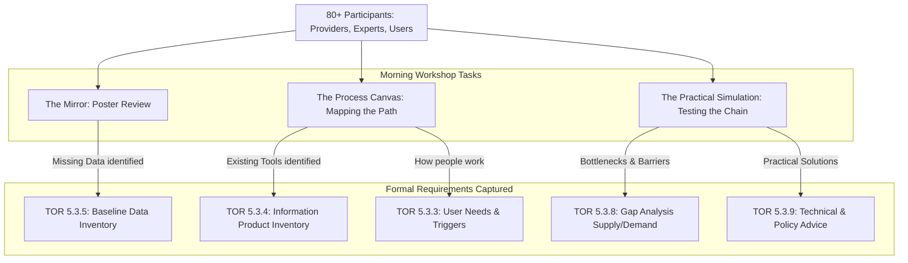

# Workshop Design: National Climate Data Coordination
**Theme**: Co-Creating National Information Products
**Session**: Morning (09:00 – 11:30) | **Target**: 80–100 Stakeholders

---

## 1. Strategic Foundation: The Rationale for Co-Production and Equalization
The design of this workshop is a direct response to a recurring failure in national climate coordination. For many years, the standard approach to gathering information has relied on a consultation model where agencies are asked to provide exhaustive lists of their datasets in isolation. This method consistently leads to a state of consultation fatigue, where agencies share lists of files that are technically present but often disconnected from the actual needs of decision-makers. These static inventories frequently lacked the operational context of how the data is used, resulting in databases that function more like archives than active toolsets. We have found that when those who provide data and those who use it do not collaborate early in the design process, the resulting information is often the wrong scale, the wrong format, or delivered too late to be effective.

To move beyond this, we have chosen a strategy centered on co-production and knowledge equalization. Co-production is the principle that climate information only gains value when it is jointly developed by those who understand the science and those who understand the policy. A secondary but vital goal of this session is to remove the information asymmetry that traditionally blocks national coordination. By the end of this 150-minute window, every participant—from a local staff member to a national scientist—will have an equal understanding of Thailand's climate data landscape. We achieve this by moving the conversation away from technical database technology and toward the practical flow of information. We prioritize the connection between the maker of data and the user of that data, ensuring that every information product identified in this workshop is anchored in a concrete national or local mission.

---

## 2. Project Requirements and Legal Alignment
This session is organized to fulfill the formal requirements of the **TOR 5.3.3 Brainstorming Meeting**. Every activity is structured to produce the specific evidence needed for the project's legal deliverables:

*   **Information Exchange (TOR 5.3.3)**: Formally documenting the specific flow of information and resources between agencies.
*   **Product and Data Inventories (TOR 5.3.4 & 5.3.5)**: Verifying and expanding the national list of climate tools and baseline datasets.
*   **Gap Analysis (TOR 5.3.8)**: Providing the empirical evidence of where data supply fails to meet actual user demand.
*   **Technical and Policy Advice (TOR 5.3.9)**: Gathering the consensus-based recommendations that will guide the long-term governance of the national system.

---

## 3. The Stakeholder Ecosystem (WMO NFCS Roles)
To ensure the entire climate service value chain is represented, participants are organized into groups reflecting the standard roles defined by the World Meteorological Organization’s National Framework for Climate Services (NFCS).

*   **Data Providers**: Agencies responsible for raw environmental observations, such as weather, water, and land data. They provide the scientific foundation and clarify data availability. Includes socio economic data necessary for understanding impacts and assess adaptation option
*   **Co-producers**: Researchers and specialists who translate raw data into risk models, indicators, and sectoral reports. They bridge the gap between science and policy.
*   **Intermediaries**: Organizations that repackage technical information for specific sectors like agriculture or health, ensuring the information is relevant to the user's daily work.
*   **End-Users**: Decision-makers, such as national planners, city mayors, and business leaders, who define the final information needs and operational triggers.
*   **Governance Bodies**: Entities that set the standards for data exchange, quality control, and national data security rules.

---

## 4. The 4 Product Concept Suites
Participants are grouped into tables based on the specific type of information service they are most interested in using or supporting. Each suite is anchored in a concrete workflow pattern derived from the project's initial research.

### **A. The Strategic Briefing Suite**
*   **The Concept**: A one-page summary that translates complex climate data into a clear justification for large-scale national investments and infrastructure projects.
*   **The Workflow**: Connecting long-term climate projections to national budget and engineering standards.

### **B. The Real-Time Information Exchange**
*   **The Concept**: A digital connection that feeds raw sensor and weather data directly from national providers to local emergency responders.
*   **The Workflow**: Automating the flow of high-frequency data to save lives during the first 48 hours of a disaster.

### **C. The Community Resilience Toolkit**
*   **The Concept**: A high-resolution mapping tool that provides neighborhood-level risk alerts for local mayors and district staff.
*   **The Workflow**: Translating complex probability models into a simple "Red/Yellow/Green" alert system for local officials.

### **D. The Financial Risk Lab**
*   **The Concept**: A standardized system for risk certificates that allows banks and insurance companies to price climate risk into loans and property assets.
*   **The Workflow**: Providing a legal and technical standard for private sector risk-pricing based on authoritative national data.

---

## 5. Morning Schedule and Interaction Journey

| Time | Phase | Focus | Capture Tools |
| :--- | :--- | :--- | :--- |
| **09:00 - 09:30** | **Baseline Review** | Participants verify the current map of data & platforms. | **Mirror Posters** (A0 Walls) + Correction Stickers |
| **09:30 - 10:15** | **Product Blueprinting** | Tables refine the flow for their chosen Product Concept. | **Process Canvas** (A1 Table) + Color-coded Notes |
| **10:15 - 11:00** | **Practical Simulation** | Groups test the product against a 2030 crisis scenario. | **Friction Stickers** (Red) + **Solution Cards** |
| **11:00 - 11:30** | **Synthesis & Wrap-up** | Sharing top findings to equalize knowledge in the room. | **The Priority Board** (Stage) |

---

## 6. The Workshop Journey: A Simulation of the Experience

At 09:00, the room is organized into 10 mixed-role tables. Along the walls are the **Mirror Posters**—large-scale A0 displays categorized by sector. As participants arrive, they don't just listen to a presentation; they immediately begin to "edit" the national landscape. A Data Provider might see a listed dataset and use a **Correction Sticker** to update its details. This physical interaction ensures that their expertise is instantly captured in a format that can be photographed and transcribed.

By 09:30, the work moves to the tables. Each table has a **Process Canvas**—a large A1 worksheet. The title focuses on a product, such as the *Strategic Briefing Suite*. The canvas is not a blank sheet; it has a basic workflow already sketched in as a "skeleton" based on our project research. Participants use **Color-Coded Notes** to fill the gaps. A District Planner might define a "Trigger": *"When the temperature hits 40 degrees, I need to know which elderly residents are in danger."* A Satellite Data Expert sitting next to them then identifies exactly which dataset can provide that neighborhood-level information.

At 10:15, the **Practical Simulation** begins. The Facilitator introduces a 2030 Crisis Scenario. Participants look at their newly mapped process and identify where it would fail in a real crisis. They place **Red Friction Stickers** on the canvas exactly where the information flow breaks. For every red sticker, they must write a **Solution Card**—a simple, plain-language index card that proposes a fix, such as: *"Allow local staff to see neighborhood risk data instantly during a heatwave without waiting for high-level clearance."*

By 11:00, the **Morning Wrap-up** moves to the center of the room. Each table takes their most critical Solution Card and pins it to the **Priority Board**—a large central display. The lead facilitator summarizes these as the "Top 8 National Unlocks." A Data Provider now understands the needs of a Banker; a local Mayor understands what a scientist can actually deliver. Every participant receives a **"Landscape Snapshot"** summary, ensuring that the knowledge gained is shared across all 39+ organizations.

---

## 7. Participant Instructions (Handouts per Table)

**"Your Mission for the next 150 minutes is to help us build a shared map of Thailand's resilience."**

1.  **Review the Skeleton**: Look at the "Information Flow" we have sketched on your canvas. It shows how we *think* the data should move from the Provider to the User.
2.  **Validate the Flow**: Does this match how your agency actually works? If not, cross it out and redraw it.
3.  **Identify the Fuel**: Which specific dataset (on the posters) is the "Official" source for this product? If it's missing, add it to the map.
4.  **Find the Break-Points**: During the Simulation (Part 3), mark exactly where this product would fail. Is the data too slow? Is the jargon too thick? Is the access restricted?
5.  **Propose the Fix**: What is the **one change** in national policy or technology that would make this product a reality in the next 12 months?

---

## 8. Mapping Workshop Outputs to Project Requirements (TOR)

---

## 9. The Morning Wrap-up and Synthesis
The final 30 minutes of the morning are dedicated to consolidating the table findings. This is not a simple readout; it is a prioritization exercise to create a **Common Operating Picture** for the country.

The project team facilitates a session where each product group identifies the single most important "Information Unlock" discovered during their simulation. These unlocks are categorized into **Technical Fixes** (e.g., standardizing file formats), **Policy Fixes** (e.g., changing approval rules), and **Communication Fixes** (e.g., removing jargon from reports). By sharing these across the room, we ensure that the knowledge gained is not localized to one table but becomes a shared national priority.

---

## 10. Professional Communication Standards
To ensure successful co-production, all participants and facilitators follow these standards:

*   **Plain Language Principle**: We avoid all internal project jargon and complex technical acronyms. We use professional terms that describe the work being done. 
*   **Action-Oriented Terminology**: We use **"Information Flow Path"** instead of technical mapping terms, and **"Ready-to-use Information Package"** instead of internal product labels.
*   **The Decision-Focus**: Every discussion about data must be justified by its impact on a final action. Participants are encouraged to ask: *"How will this specific information change our final decision?"*
