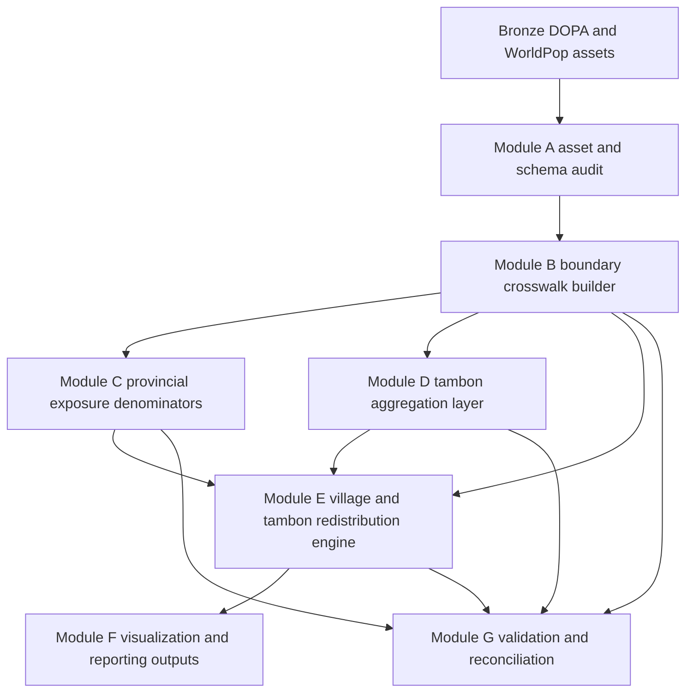

# CRI Phase 1 Stage 3 Detailed Implementation Plan

**Status**: Audit-grounded implementation plan for code-mode execution  
**Purpose**: Translate the high-level software plan in [`CRI_Phase1_Stage3_Software_Plan.md`](ψ/incubate/DCCE/CRI/data_system/artifacts/reports/CRI_Phase1_Stage3_Software_Plan.md) into concrete, delegable work packages without assuming unverified schemas or file structures.  
**Planning boundary**: This document covers audit findings, verified constraints, unresolved unknowns, and implementation-ready subtasks only. It does not implement the Stage 3 pipeline.

%% tha_pop_2020_CN_100m_R2025A_v1.tif is the valid worldpop file %%
---

## 1. Baseline Audit Scope

The following artifacts were inspected to ground this plan.

### 1.1 High-level plan and adjacent planning artifacts
- [`CRI_Phase1_Stage3_Software_Plan.md`](ψ/incubate/DCCE/CRI/data_system/artifacts/reports/CRI_Phase1_Stage3_Software_Plan.md)
- [`CRI_Phase1_Spatial_Disaggregation_Plan.md`](ψ/incubate/DCCE/CRI/data_system/archive_stage3_legacy/artifacts/CRI_Phase1_Spatial_Disaggregation_Plan.md)
- [`CRI_Phase1_Data_Exploration_Report.md`](ψ/incubate/DCCE/CRI/data_system/artifacts/reports/CRI_Phase1_Data_Exploration_Report.md)

### 1.2 Metadata artifacts
- [`data-lineage.md`](ψ/incubate/DCCE/CRI/data_system/metadata/data-lineage.md)
- [`data-sources.md`](ψ/incubate/DCCE/CRI/data_system/metadata/data-sources.md)

### 1.3 Existing scripts relevant to Stage 3 dependencies or legacy behavior
- [`etl_dopa_master.py`](ψ/incubate/DCCE/CRI/data_system/script/etl_dopa_master.py)
- [`build_fact_impact.py`](ψ/incubate/DCCE/CRI/data_system/script/build_fact_impact.py)
- [`build_fact_relief.py`](ψ/incubate/DCCE/CRI/data_system/script/build_fact_relief.py)
- [`build_dim_denominator.py`](ψ/incubate/DCCE/CRI/data_system/script/build_dim_denominator.py)
- [`final_gap_and_lineage_audit.py`](ψ/incubate/DCCE/CRI/data_system/script/final_gap_and_lineage_audit.py)

### 1.4 Existing data assets whose structures were directly verified
- [`data/0_bronze/dopa/`](ψ/incubate/DCCE/CRI/data_system/data/0_bronze/dopa/)
- [`data/0_bronze/dopa/thailanda-administrative-boundary/`](ψ/incubate/DCCE/CRI/data_system/data/0_bronze/dopa/thailanda-administrative-boundary/)
- [`data/0_bronze/worldpop/tha_ppp_2020.tif`](ψ/incubate/DCCE/CRI/data_system/data/0_bronze/worldpop/tha_ppp_2020.tif)
- [`data/1_silver/ddpm/master_village_disaster_stat_2557_2567.csv`](ψ/incubate/DCCE/CRI/data_system/data/1_silver/ddpm/master_village_disaster_stat_2557_2567.csv)
- [`data/1_silver/ddpm/master_financial_relief_by_sector.csv`](ψ/incubate/DCCE/CRI/data_system/data/1_silver/ddpm/master_financial_relief_by_sector.csv)
- [`data/1_silver/bma/bkk_hazard_impact_yearly.csv`](ψ/incubate/DCCE/CRI/data_system/data/1_silver/bma/bkk_hazard_impact_yearly.csv)
- [`data/2_gold/dim_location_master.csv`](ψ/incubate/DCCE/CRI/data_system/data/2_gold/dim_location_master.csv)

### 1.5 Existing directory structure verified during audit
- [`data/0_bronze/`](ψ/incubate/DCCE/CRI/data_system/data/0_bronze/)
- [`data/1_silver/`](ψ/incubate/DCCE/CRI/data_system/data/1_silver/)
- [`data/2_gold/`](ψ/incubate/DCCE/CRI/data_system/data/2_gold/)
- [`artifacts/maps/`](ψ/incubate/DCCE/CRI/data_system/artifacts/maps/)
- [`artifacts/reports/`](ψ/incubate/DCCE/CRI/data_system/artifacts/reports/)
- [`artifacts/visualizations/`](ψ/incubate/DCCE/CRI/data_system/artifacts/visualizations/)

---

## 2. Verified Structures and Constraints

This section records only what was directly verified from the audited artifacts.

### 2.1 Verified medallion-style folder structure
- Bronze, silver, and gold directories already exist under [`data/`](ψ/incubate/DCCE/CRI/data_system/data/).
- The report and visualization directories already exist under [`artifacts/`](ψ/incubate/DCCE/CRI/data_system/artifacts/).
- The Stage 3 high-level plan explicitly requires modular execution rather than a monolithic script in [`CRI_Phase1_Stage3_Software_Plan.md`](ψ/incubate/DCCE/CRI/data_system/artifacts/reports/CRI_Phase1_Stage3_Software_Plan.md:73).

### 2.2 Verified canonical location spine structure
- [`dim_location_master.csv`](ψ/incubate/DCCE/CRI/data_system/data/2_gold/dim_location_master.csv) exists and its header is directly verified as:
  - `location_id`
  - `province_code`
  - `province_name_th`
  - `district_code`
  - `district_name_th`
  - `subdistrict_code`
  - `subdistrict_name_th`
  - `village_code`
  - `village_name_th`
  - `admin_level`
  - `source`
- The file contains village-level rows with 8-digit `location_id` values, visible from the first records in [`dim_location_master.csv`](ψ/incubate/DCCE/CRI/data_system/data/2_gold/dim_location_master.csv:1).
- [`etl_dopa_master.py`](ψ/incubate/DCCE/CRI/data_system/script/etl_dopa_master.py:10) confirms this spine is built from [`ccaatt.xlsx`](ψ/incubate/DCCE/CRI/data_system/data/0_bronze/dopa/ccaatt.xlsx) and [`code_village_dopa_2019.xls`](ψ/incubate/DCCE/CRI/data_system/data/0_bronze/dopa/code_village_dopa_2019.xls).

### 2.3 Verified DDPM village-impact silver structure
- [`master_village_disaster_stat_2557_2567.csv`](ψ/incubate/DCCE/CRI/data_system/data/1_silver/ddpm/master_village_disaster_stat_2557_2567.csv) exists.
- The header is directly verified and includes at least the following fields needed for Stage 3 planning:
  - `ปี`
  - `Disaster Type`
  - `Province Code`
  - `Province`
  - `District Code`
  - `District`
  - `Subdistrict Code`
  - `Subdistrict`
  - `Moo`
  - `Village Code`
  - `Affected People`
  - `Affected Households`
  - `Deaths`
  - `Housing Damage`
  - `Business Damage`
  - `Agriculture Damage`
  - `Livestock Damage`
  - `Fishing Damage`
  - `Transport Damage`
  - `Health Damage`
  - `Utilities Damage`
- The file is large, with 209,935 data rows observed from direct CSV audit in [`stage3_input_audit_snapshot.json`](ψ/incubate/DCCE/CRI/data_system/artifacts/reports/stage3_input_audit_snapshot.json:40).
- The village code field is already present in the silver table, which is consistent with the Stage 3 strategy to anchor on DOPA village codes.

### 2.4 Verified DDPM financial relief silver structure
- [`master_financial_relief_by_sector.csv`](ψ/incubate/DCCE/CRI/data_system/data/1_silver/ddpm/master_financial_relief_by_sector.csv) exists.
- The header is directly verified and includes at least:
  - `จังหวัด`
  - `ปี`
  - `ด้านดำรงชีพ`
  - `ด้านสังคมสงเคราะห์`
  - `ด้านการแพทย์และสาธารณสุข`
  - `ด้านเกษตร_พืช`
  - `ด้านเกษตร_ประมง`
  - `ด้านเกษตร_ปศุสัตว์`
  - `ด้านเกษตร_อื่น`
  - `ด้านบรรเทาสาธารณภัย`
  - `ด้านการปฏิบัติงานบรรเทาทุกข์`
  - `เชิงป้องกันหรือยับยั้ง`
  - `รวมทั้งสิ้น`
  - `วงเงินเสนอ`
  - `วงเงินอนุมัติ`
  - `วงเงินไม่อนุมัติ`
- The file is provincial in structure, not village or subdistrict in structure, which confirms that Stage 3 redistribution is required rather than a direct join.

### 2.5 Verified legacy BMA dependency
- [`bkk_hazard_impact_yearly.csv`](ψ/incubate/DCCE/CRI/data_system/data/1_silver/bma/bkk_hazard_impact_yearly.csv) exists.
- Its directly verified header includes:
  - `report_year_be`
  - `location_id`
  - `hazard_type_id`
  - `deaths_count`
  - `affected_people_count`
  - `relief_amount_baht`
- [`build_fact_impact.py`](ψ/incubate/DCCE/CRI/data_system/script/build_fact_impact.py:9) still depends on this file and on legacy [`dim_location.csv`](ψ/incubate/DCCE/CRI/data_system/data/2_gold/dim_location.csv).
- [`dim_location.csv`](ψ/incubate/DCCE/CRI/data_system/data/2_gold/dim_location.csv:1) uses legacy synthetic `LOC` identifiers and contains records explicitly marked as `Missing district/subdistrict in source`.

### 2.6 Verified world population asset and path reality
- The Bronze WorldPop raster exists as [`tha_ppp_2020.tif`](ψ/incubate/DCCE/CRI/data_system/data/0_bronze/worldpop/tha_ppp_2020.tif).
- The Stage 3 high-level plan notes the asset as `tha_ppp_2020.tiff` in [`CRI_Phase1_Stage3_Software_Plan.md`](ψ/incubate/DCCE/CRI/data_system/artifacts/reports/CRI_Phase1_Stage3_Software_Plan.md:21), while the current filesystem uses the `.tif` extension.
- This extension mismatch is a verified implementation constraint that must be normalized before code execution.

### 2.7 Verified existing DOPA boundary assets
- Province, amphoe, and tambon shapefile bundles exist in [`data/0_bronze/dopa/thailanda-administrative-boundary/`](ψ/incubate/DCCE/CRI/data_system/data/0_bronze/dopa/thailanda-administrative-boundary/).
- Verified filenames include:
  - [`THA_Province.shp`](ψ/incubate/DCCE/CRI/data_system/data/0_bronze/dopa/thailanda-administrative-boundary/THA_Province.shp)
  - [`THA_Amphoe.shp`](ψ/incubate/DCCE/CRI/data_system/data/0_bronze/dopa/thailanda-administrative-boundary/THA_Amphoe.shp)
  - [`THA_Tambon.shp`](ψ/incubate/DCCE/CRI/data_system/data/0_bronze/dopa/thailanda-administrative-boundary/THA_Tambon.shp)
- DBF field names were directly inspected and are recorded in [`CRI_Phase1_Stage3_Input_Baseline_Audit.md`](ψ/incubate/DCCE/CRI/data_system/artifacts/reports/CRI_Phase1_Stage3_Input_Baseline_Audit.md:17):
  - Province: `P_NAME_T`, `P_NAME_E`, `Area_km2`
  - Amphoe: `P_NAME_T`, `P_NAME_E`, `A_NAME_T`, `A_NAME_E`, `Area_km2`
  - Tambon: `P_NAME_T`, `P_NAME_E`, `A_NAME_T`, `A_NAME_E`, `T_NAME_T`, `T_NAME_E`, `Area_km2`
- Attribute data types, encoding behavior at runtime, and key uniqueness still require dedicated geospatial validation in later subtasks.

### 2.8 Verified existing Gold-layer lineage and integrity rules
- [`data-lineage.md`](ψ/incubate/DCCE/CRI/data_system/metadata/data-lineage.md:57) explicitly states that Gold tables must pass a foreign-key check against [`dim_location_master.csv`](ψ/incubate/DCCE/CRI/data_system/data/2_gold/dim_location_master.csv).
- The metadata currently references hazard canonicalization through `data_dictionary.xlsx` and standardization rules through `metadata/standardization_mapping.csv` in [`data-lineage.md`](ψ/incubate/DCCE/CRI/data_system/metadata/data-lineage.md:58) and [`data-lineage.md`](ψ/incubate/DCCE/CRI/data_system/metadata/data-lineage.md:73).
- Audit confirms [`dim_hazard_canonical.csv`](ψ/incubate/DCCE/CRI/data_system/data/2_gold/dim_hazard_canonical.csv:1) exists as an in-repo canonical hazard table, while `metadata/standardization_mapping.csv` remains unverified in the current directory tree.

### 2.9 Verified limitations in the current prototype Stage 3 workflow
- The current prototype Stage 3 workflow is not yet a production-ready modular Stage 3 implementation.
- Verified issues include:
  - hard-coded absolute base paths in the prototype workflow implementation
  - dependence on external GeoJSON download rather than verified local DOPA boundaries
  - reliance on `province_name_en`, which is not part of the verified [`dim_location_master.csv`](ψ/incubate/DCCE/CRI/data_system/data/2_gold/dim_location_master.csv:1) header
  - acknowledgment that Level 2 does not yet join to administrative polygons
  - no persisted Level 3 raster output despite a Stage 3 requirement for a spatially explicit output

---

## 3. Explicit Unknowns and Open Questions

These are not assumptions. They must be resolved or consciously waived before implementation.

1. **Shapefile attribute schema unknowns**
   - DBF field names are now verified (see [`CRI_Phase1_Stage3_Input_Baseline_Audit.md`](ψ/incubate/DCCE/CRI/data_system/artifacts/reports/CRI_Phase1_Stage3_Input_Baseline_Audit.md:17)); remaining unknowns are data types, encoding behavior during geospatial reads, and uniqueness properties needed for deterministic crosswalks.
   - This matters because the high-level plan requires joining DOPA codes into shapefile attributes.

2. **Raster coordinate-system compatibility unknowns**
   - The CRS, nodata strategy, pixel alignment, and geographic extent compatibility between the WorldPop raster and the DOPA boundary shapefiles were not directly verified.
   - No implementation should assume overlay compatibility without checking CRS and extent.

3. **Target schema for Stage 3 outputs unknowns**
   - The exact columns and filenames for new Stage 3 silver and gold outputs do not yet exist as a verified contract.
   - This includes any crosswalk tables, mismatch logs, zonal-stat tables, village-level redistributed outputs, and final raster artifacts.

4. **Canonical hazard mapping dependency unknowns**
   - [`data-lineage.md`](ψ/incubate/DCCE/CRI/data_system/metadata/data-lineage.md:58) refers to `data_dictionary.xlsx`, but that file was not verified in the current directory tree.
   - [`dim_hazard_canonical.csv`](ψ/incubate/DCCE/CRI/data_system/data/2_gold/dim_hazard_canonical.csv:1) is present; however, lineage/provenance back to the original mapping workbook remains undocumented in-place.
   - If hazard grouping or crosswalk logic is needed for Stage 3 implementation, the location and status of this mapping asset must be resolved first.

5. **Standardization rules dependency unknowns**
   - [`data-lineage.md`](ψ/incubate/DCCE/CRI/data_system/metadata/data-lineage.md:73) refers to `metadata/standardization_mapping.csv`, but that file was not verified in the current directory tree.
   - Any implementation that relies on province or administrative-name normalization must either locate this file or create a controlled replacement.

6. **Boundary level choice for Level 2 outputs**
   - The high-level plan specifies tambon-level mapping, while the current prototype workflow notes missing ADM3 polygons and performs only in-memory subdistrict aggregation.
   - It is still unresolved whether the existing tambon shapefile can be used directly without an intermediate crosswalk layer.

7. **Bangkok treatment under the new Stage 3 pipeline**
   - Resolved by [`CRI_Phase1_Stage3_Bangkok_Policy_Resolution.md`](ψ/incubate/DCCE/CRI/data_system/artifacts/reports/CRI_Phase1_Stage3_Bangkok_Policy_Resolution.md).
   - Shared Stage 3 implementation shall include Bangkok at Level 1 only, while excluding Bangkok from shared Level 2 and Level 3 modules until a separate audited Bangkok lower-level branch is approved.

8. **Validation benchmark policy unknowns**
   - The adjacent Stage 3 disaggregation plan recommends piloting on a high-impact province in [`CRI_Phase1_Spatial_Disaggregation_Plan.md`](ψ/incubate/DCCE/CRI/data_system/artifacts/reports/CRI_Phase1_Spatial_Disaggregation_Plan.md:66).
   - No explicit acceptance thresholds are yet verified for coverage rate, mismatch rate, tolerance against administrative totals, or raster aggregation reconciliation.

---

## 4. Planning Principles for Code-Mode Execution

The following principles should govern subagent implementation.

1. **Preserve Bronze immutability**
   - Never alter files under [`data/0_bronze/`](ψ/incubate/DCCE/CRI/data_system/data/0_bronze/).

2. **Treat [`dim_location_master.csv`](ψ/incubate/DCCE/CRI/data_system/data/2_gold/dim_location_master.csv) as the verified canonical spine until replaced by an explicitly approved successor**
   - All Stage 3 joins and reconciliation steps must document whether they consume the existing spine as-is or generate a versioned successor artifact.

3. **Use modular scripts, not a monolith**
   - The high-level plan explicitly requires independent modules in [`CRI_Phase1_Stage3_Software_Plan.md`](ψ/incubate/DCCE/CRI/data_system/artifacts/reports/CRI_Phase1_Stage3_Software_Plan.md:75).

4. **Separate audit artifacts from analytical outputs**
   - Mismatch logs, coverage reports, and reconciliation reports should be first-class outputs rather than console-only messages.

5. **Do not encode unverified schemas into downstream modules**
   - Every module that depends on shapefile fields, raster CRS, hazard mappings, or crosswalk columns must begin with a schema contract or validation check.

---

## 5. Recommended Implementation Architecture

This architecture is designed for code-mode delegation and reflects only audited constraints.

---

## 6. Detailed Subtasks for Code-Mode Subagents

Each subtask below is written to be independently delegable, while still acknowledging dependencies and unknowns.

### Subtask A. Asset and schema audit hardening

**Objective**  
Create a reproducible machine-readable and human-readable audit of the Stage 3 input assets so downstream code never relies on guessed schemas.

**Required inputs**
- [`data/0_bronze/dopa/thailanda-administrative-boundary/THA_Province.shp`](ψ/incubate/DCCE/CRI/data_system/data/0_bronze/dopa/thailanda-administrative-boundary/THA_Province.shp)
- [`data/0_bronze/dopa/thailanda-administrative-boundary/THA_Tambon.shp`](ψ/incubate/DCCE/CRI/data_system/data/0_bronze/dopa/thailanda-administrative-boundary/THA_Tambon.shp)
- [`data/0_bronze/worldpop/tha_ppp_2020.tif`](ψ/incubate/DCCE/CRI/data_system/data/0_bronze/worldpop/tha_ppp_2020.tif)
- [`data/2_gold/dim_location_master.csv`](ψ/incubate/DCCE/CRI/data_system/data/2_gold/dim_location_master.csv)

**Files to inspect or modify**
- Inspect [`THA_Province.shp`](ψ/incubate/DCCE/CRI/data_system/data/0_bronze/dopa/thailanda-administrative-boundary/THA_Province.shp)
- Inspect [`THA_Tambon.shp`](ψ/incubate/DCCE/CRI/data_system/data/0_bronze/dopa/thailanda-administrative-boundary/THA_Tambon.shp)
- Inspect [`tha_ppp_2020.tif`](ψ/incubate/DCCE/CRI/data_system/data/0_bronze/worldpop/tha_ppp_2020.tif)
- Inspect [`dim_location_master.csv`](ψ/incubate/DCCE/CRI/data_system/data/2_gold/dim_location_master.csv)
- Modify or add a new script under [`script/`](ψ/incubate/DCCE/CRI/data_system/script/)
- Write audit outputs under [`artifacts/reports/`](ψ/incubate/DCCE/CRI/data_system/artifacts/reports/)

**Verification method**
- Emit a report that records shapefile columns, CRS, feature counts, geometry types, duplicate-key tests, raster CRS, raster dimensions, nodata, and extent.
- Confirm that the WorldPop path used by code matches the actual `.tif` file on disk.

**Expected outputs**
- Stage 3 input schema audit report
- Optional JSON or CSV schema snapshot for downstream validation

**Dependencies**
- None

**Schema or structure unknowns to resolve before coding**
- Full boundary attribute schemas
- CRS compatibility between vector and raster assets
- Whether province and tambon names already align to the spine or require a crosswalk

---

### Subtask B. DOPA boundary crosswalk and enriched geometry layer

**Objective**  
Build a verified join layer that links DOPA boundary geometries to canonical DOPA location codes for province and tambon analysis without relying on ad hoc name matching in downstream modules.

**Required inputs**
- Outputs from Subtask A
- [`data/2_gold/dim_location_master.csv`](ψ/incubate/DCCE/CRI/data_system/data/2_gold/dim_location_master.csv)
- [`data/0_bronze/dopa/thailanda-administrative-boundary/THA_Province.shp`](ψ/incubate/DCCE/CRI/data_system/data/0_bronze/dopa/thailanda-administrative-boundary/THA_Province.shp)
- [`data/0_bronze/dopa/thailanda-administrative-boundary/THA_Tambon.shp`](ψ/incubate/DCCE/CRI/data_system/data/0_bronze/dopa/thailanda-administrative-boundary/THA_Tambon.shp)

**Files to inspect or modify**
- Inspect [`etl_dopa_master.py`](ψ/incubate/DCCE/CRI/data_system/script/etl_dopa_master.py)
- Possibly add a new crosswalk-building script under [`script/`](ψ/incubate/DCCE/CRI/data_system/script/)
- Write geometry-enriched outputs under [`data/1_silver/`](ψ/incubate/DCCE/CRI/data_system/data/1_silver/)
- Write mismatch logs under [`artifacts/reports/`](ψ/incubate/DCCE/CRI/data_system/artifacts/reports/)

**Verification method**
- Report match rate between boundary records and canonical codes.
- Emit unresolved-name and duplicate-match logs.
- Demonstrate that each province polygon maps to a single province code and each tambon polygon maps to a single tambon code or is explicitly flagged.

**Expected outputs**
- Province geometry layer joined to canonical province codes
- Tambon geometry layer joined to canonical tambon and province codes
- Crosswalk mismatch log

**Dependencies**
- Subtask A

**Schema or structure unknowns to resolve before coding**
- Exact boundary field names for province, amphoe, and tambon labels
- Whether tambon polygons can be uniquely mapped using existing names alone or require supplemental standardization rules
- Availability or absence of [`standardization_mapping.csv`](ψ/incubate/DCCE/CRI/data_system/metadata/standardization_mapping.csv)

---

### Subtask C. Provincial exposure denominator engine

**Objective**  
Create a reusable module that computes verified population exposure denominators by province from the WorldPop raster and enriched province geometries.

**Required inputs**
- Output province geometry from Subtask B
- [`data/0_bronze/worldpop/tha_ppp_2020.tif`](ψ/incubate/DCCE/CRI/data_system/data/0_bronze/worldpop/tha_ppp_2020.tif)

**Files to inspect or modify**
- Add or replace a dedicated modular script under [`script/`](ψ/incubate/DCCE/CRI/data_system/script/)
- Write output table under [`data/2_gold/`](ψ/incubate/DCCE/CRI/data_system/data/2_gold/)
- Write reconciliation report under [`artifacts/reports/`](ψ/incubate/DCCE/CRI/data_system/artifacts/reports/)

**Verification method**
- Confirm every province polygon receives a zonal-stat result.
- Check for null, zero, or negative population sums and flag anomalies.
- Verify output keys align with canonical province identifiers.

**Expected outputs**
- Province-level population denominator table for Stage 3
- Audit report documenting CRS, nodata handling, and aggregation coverage

**Dependencies**
- Subtask A
- Subtask B

**Schema or structure unknowns to resolve before coding**
- Raster nodata and CRS handling
- Final filename and column contract for the denominator output

---

### Subtask D. Tambon aggregation layer for village-impact numerators

**Objective**  
Transform the verified village-impact silver data into a reliable tambon-level numerator table keyed to the canonical spine and ready for map joins.

**Required inputs**
- [`data/1_silver/ddpm/master_village_disaster_stat_2557_2567.csv`](ψ/incubate/DCCE/CRI/data_system/data/1_silver/ddpm/master_village_disaster_stat_2557_2567.csv)
- [`data/2_gold/dim_location_master.csv`](ψ/incubate/DCCE/CRI/data_system/data/2_gold/dim_location_master.csv)
- Optional geometry output from Subtask B for direct map-ready delivery

**Files to inspect or modify**
- Inspect [`build_fact_impact.py`](ψ/incubate/DCCE/CRI/data_system/script/build_fact_impact.py)
- Add a dedicated tambon aggregation script under [`script/`](ψ/incubate/DCCE/CRI/data_system/script/)
- Write analytical output under [`data/2_gold/`](ψ/incubate/DCCE/CRI/data_system/data/2_gold/)
- Write coverage and exclusion logs under [`artifacts/reports/`](ψ/incubate/DCCE/CRI/data_system/artifacts/reports/)

**Verification method**
- Confirm all village rows either match the canonical spine or appear in an explicit unmatched log.
- Reconcile summed tambon metrics back to source village totals for selected fields such as `Affected Households`, `Deaths`, and `Housing Damage`.

**Expected outputs**
- Tambon-level impact numerator table
- Unmatched village-code report
- Aggregation reconciliation report

**Dependencies**
- None for the base aggregation
- Subtask B if direct geometry-joined output is required

**Schema or structure unknowns to resolve before coding**
- Which impact metrics are officially in-scope for Stage 3 first implementation
- Whether hazard grouping requires a verified canonical crosswalk beyond raw `Disaster Type`

---

### Subtask E. Provincial-to-village and provincial-to-tambon redistribution engine

**Objective**  
Implement the modular Stage 3 redistribution logic that converts provincial totals into lower-level spatial outputs using verified weights and explicit reconciliation rules.

**Required inputs**
- Outputs from Subtask B
- Outputs from Subtask C
- Outputs from Subtask D
- [`data/1_silver/ddpm/master_financial_relief_by_sector.csv`](ψ/incubate/DCCE/CRI/data_system/data/1_silver/ddpm/master_financial_relief_by_sector.csv)
- Possibly [`master_financial_relief_by_hazard.csv`](ψ/incubate/DCCE/CRI/data_system/data/1_silver/ddpm/master_financial_relief_by_hazard.csv) if hazard-based outputs are included in scope
- [`data/0_bronze/worldpop/tha_ppp_2020.tif`](ψ/incubate/DCCE/CRI/data_system/data/0_bronze/worldpop/tha_ppp_2020.tif)

**Files to inspect or modify**
- Inspect [`build_fact_relief.py`](ψ/incubate/DCCE/CRI/data_system/script/build_fact_relief.py)
- Inspect [`CRI_Phase1_Spatial_Disaggregation_Plan.md`](ψ/incubate/DCCE/CRI/data_system/archive_stage3_legacy/artifacts/CRI_Phase1_Spatial_Disaggregation_Plan.md)
- Add one or more modular redistribution scripts under [`script/`](ψ/incubate/DCCE/CRI/data_system/script/)
- Write outputs under [`data/2_gold/`](ψ/incubate/DCCE/CRI/data_system/data/2_gold/)
- Write logs under [`artifacts/reports/`](ψ/incubate/DCCE/CRI/data_system/artifacts/reports/)

**Verification method**
- For every province-year-sector combination, verify that redistributed child values sum exactly to the original provincial amount within a declared tolerance.
- Emit per-province reconciliation tables and exception logs.
- Confirm no output row exists without a canonical location key.

**Expected outputs**
- Village- or tambon-level redistributed relief or risk tables
- Reconciliation tables showing source totals versus redistributed totals
- Exception log for provinces or categories that cannot be redistributed cleanly

**Dependencies**
- Subtask A
- Subtask B
- Subtask C
- Subtask D

**Schema or structure unknowns to resolve before coding**
- Whether first delivery covers only Pillar 1 human impact or also Pillars 2 to 4 from [`CRI_Phase1_Spatial_Disaggregation_Plan.md`](ψ/incubate/DCCE/CRI/data_system/artifacts/reports/CRI_Phase1_Spatial_Disaggregation_Plan.md:38)
- Whether redistribution is required for sectoral relief only, or also for other provincial aggregates
- Whether additional weight rasters beyond WorldPop are already available locally

---

### Subtask F. Visualization and artifact generation module

**Objective**  
Generate the three required granularity outputs in a reproducible way using only verified intermediate tables and enriched geometry layers.

**Required inputs**
- Output tables from Subtasks C, D, and E
- Geometry outputs from Subtask B
- Any finalized raster outputs from Subtask E

**Files to inspect or modify**
- Inspect [`visualize_pillar_1_baseline.py`](ψ/incubate/DCCE/CRI/data_system/script/visualize_pillar_1_baseline.py)
- Inspect [`visualize_pillar_1_chart.py`](ψ/incubate/DCCE/CRI/data_system/script/visualize_pillar_1_chart.py)
- Add or revise visualization scripts under [`script/`](ψ/incubate/DCCE/CRI/data_system/script/)
- Write deliverables under [`artifacts/maps/`](ψ/incubate/DCCE/CRI/data_system/artifacts/maps/), [`artifacts/visualizations/`](ψ/incubate/DCCE/CRI/data_system/artifacts/visualizations/), and [`artifacts/reports/`](ψ/incubate/DCCE/CRI/data_system/artifacts/reports/)

**Verification method**
- Confirm every visual output is traceable to a persisted input table or raster.
- Confirm file creation for each required output level.
- Verify that Level 1, Level 2, and Level 3 outputs use explicit documented metrics.

**Expected outputs**
- Level 1 provincial CSV and map
- Level 2 tambon map and supporting table
- Level 3 raster or raster-derived map product
- Generation log describing which inputs produced each artifact

**Dependencies**
- Subtask B
- Subtask C
- Subtask D
- Subtask E

**Schema or structure unknowns to resolve before coding**
- Exact styling standards and Thai font requirements
- Whether Level 3 requires a persisted GeoTIFF, PNG only, or both

---

### Subtask G. Validation, coverage, and governance checks

**Objective**  
Create a formal validation layer that proves Stage 3 outputs are structurally correct, spatially anchored, and auditable.

**Required inputs**
- Outputs from Subtasks B through F
- Existing scripts [`final_gap_and_lineage_audit.py`](ψ/incubate/DCCE/CRI/data_system/script/final_gap_and_lineage_audit.py) and [`gap_analysis_audit.py`](ψ/incubate/DCCE/CRI/data_system/script/gap_analysis_audit.py)

**Files to inspect or modify**
- Inspect [`final_gap_and_lineage_audit.py`](ψ/incubate/DCCE/CRI/data_system/script/final_gap_and_lineage_audit.py)
- Inspect [`gap_analysis_audit.py`](ψ/incubate/DCCE/CRI/data_system/script/gap_analysis_audit.py)
- Add or revise validation scripts under [`script/`](ψ/incubate/DCCE/CRI/data_system/script/)
- Write reports under [`artifacts/reports/`](ψ/incubate/DCCE/CRI/data_system/artifacts/reports/)

**Verification method**
- FK coverage check against [`dim_location_master.csv`](ψ/incubate/DCCE/CRI/data_system/data/2_gold/dim_location_master.csv)
- Redistribution reconciliation checks
- Duplicate-key checks on published outputs
- Null and negative value scan on published metrics
- Province coverage and mismatch summary

**Expected outputs**
- Stage 3 validation report
- Coverage summary by module output
- Mismatch and exception register suitable for governance review

**Dependencies**
- Subtasks B through F

**Schema or structure unknowns to resolve before coding**
- Explicit acceptance thresholds for mismatch rates, null tolerance, and reconciliation tolerance

---

### Subtask H. Bangkok policy decision and integration note

**Objective**  
Resolve whether Bangkok remains in-scope for the first modular Stage 3 implementation and document the chosen handling pattern so code-mode agents do not mix legacy `LOC` logic with DOPA-native logic by accident.

**Required inputs**
- [`build_fact_impact.py`](ψ/incubate/DCCE/CRI/data_system/script/build_fact_impact.py)
- [`dim_location.csv`](ψ/incubate/DCCE/CRI/data_system/data/2_gold/dim_location.csv)
- [`bkk_hazard_impact_yearly.csv`](ψ/incubate/DCCE/CRI/data_system/data/1_silver/bma/bkk_hazard_impact_yearly.csv)

**Audit note**
- [`CRI_Phase1_Spatial_Alignment_Proposal.md`](ψ/incubate/DCCE/CRI/data_system/artifacts/reports/CRI_Phase1_Spatial_Alignment_Proposal.md) was referenced in the original subtask design but was not present in the audited workspace during Subtask 3.
- The resolved policy is documented instead in [`CRI_Phase1_Stage3_Bangkok_Policy_Resolution.md`](ψ/incubate/DCCE/CRI/data_system/artifacts/reports/CRI_Phase1_Stage3_Bangkok_Policy_Resolution.md).

**Files to inspect or modify**
- Inspect the above files
- Write a policy note or assumption register under [`artifacts/reports/`](ψ/incubate/DCCE/CRI/data_system/artifacts/reports/)

**Verification method**
- Produce a documented decision: include now, exclude for first pass, or isolate as a separate branch.
- Identify which downstream modules are affected by that decision.

**Expected outputs**
- [`CRI_Phase1_Stage3_Bangkok_Policy_Resolution.md`](ψ/incubate/DCCE/CRI/data_system/artifacts/reports/CRI_Phase1_Stage3_Bangkok_Policy_Resolution.md)
- Updated dependency note for code-mode execution

**Dependencies**
- None logically, but should be completed before Subtask E if Bangkok is in scope there

**Resolved policy outcome**
- BMA records are not yet a verified basis for shared lower-level DOPA anchoring.
- Bangkok remains in scope only for Level 1 province outputs in the shared first pass.
- Bangkok is excluded from shared Level 2 and Level 3 implementation until a separate audited lower-level branch exists.

---

## 7. Recommended Delegation Order

This is the recommended parent sequence for code-mode subagents.

1. Subtask A: Asset and schema audit hardening
2. Subtask B: DOPA boundary crosswalk and enriched geometry layer
3. Subtask H: Bangkok policy decision and integration note
4. Subtask C: Provincial exposure denominator engine
5. Subtask D: Tambon aggregation layer for village-impact numerators
6. Subtask E: Redistribution engine
7. Subtask F: Visualization and artifact generation module
8. Subtask G: Validation, coverage, and governance checks

This order avoids locking downstream code to assumptions about shapefile fields, CRS alignment, or Bangkok treatment.

---

## 8. Risks and Implementation Guardrails

### 8.1 Confirmed risks
- The existing prototype workflow uses a field not verified in the current spine schema, namely `province_name_en`.
- The WorldPop path extension differs between the high-level plan and the actual file on disk.
- The current legacy BMA integration still depends on synthetic location identifiers in [`dim_location.csv`](ψ/incubate/DCCE/CRI/data_system/data/2_gold/dim_location.csv:1).
- The metadata references to `data_dictionary.xlsx` and `standardization_mapping.csv` are unresolved in the audited directory tree.

### 8.2 Guardrails
- No subagent should write directly into Bronze folders.
- Every module should begin with path existence and schema validation checks.
- Every transformation module should publish a mismatch log and a concise reconciliation summary.
- Every published analytical output should include canonical DOPA keys and a source lineage field where appropriate.

---

## 9. Implementation-Ready Checklist

This checklist is the proposed source of truth for subsequent parent todo creation.

- [ ] Generate a Stage 3 input schema audit covering DOPA boundary shapefiles, the WorldPop raster, and the current canonical spine
- [ ] Normalize and document the authoritative WorldPop file path and extension used by Stage 3 modules
- [ ] Build and validate a province boundary to canonical province-code join layer
- [ ] Build and validate a tambon boundary to canonical tambon-code join layer
- [ ] Publish unresolved boundary-name mismatches and duplicate-match cases as explicit audit artifacts
- [x] Decide and document the Bangkok handling policy for the first modular Stage 3 implementation
- [ ] Build a provincial population denominator module from WorldPop and verified province geometries
- [ ] Build a canonical tambon-level aggregation table from village-level DDPM impact data
- [ ] Publish unmatched village-code and aggregation reconciliation logs for the tambon numerator layer
- [ ] Define the first-pass Stage 3 in-scope metrics and redistribution targets before coding the redistribution engine
- [ ] Implement the redistribution engine with strict reconciliation to provincial totals
- [ ] Generate Level 1 provincial outputs from persisted intermediate tables
- [ ] Generate Level 2 tambon outputs from persisted intermediate tables and verified tambon geometries
- [ ] Generate Level 3 spatially explicit outputs with a documented raster or raster-derived artifact contract
- [ ] Run FK coverage, duplicate-key, null-scan, and redistribution reconciliation checks across all published Stage 3 outputs
- [ ] Publish a final Stage 3 validation and exception report for governance review

---

## 10. Handoff Note for Code-Mode Subagents

Code-mode execution should treat this file as the planning contract and should use the checklist in Section 9 as the parent task backbone. Any code task that encounters unresolved schema questions must stop, publish the uncertainty as an explicit artifact, and avoid silently inferring structures from names alone.
