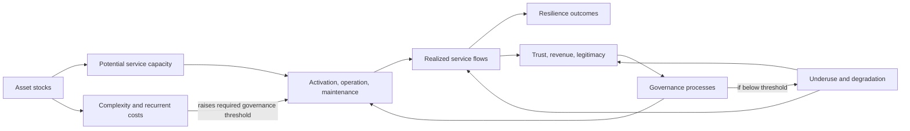
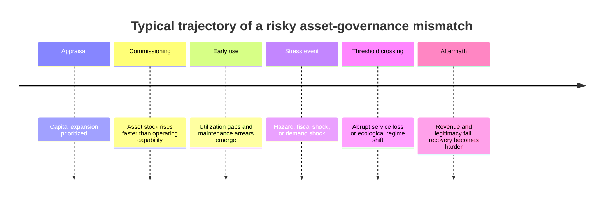
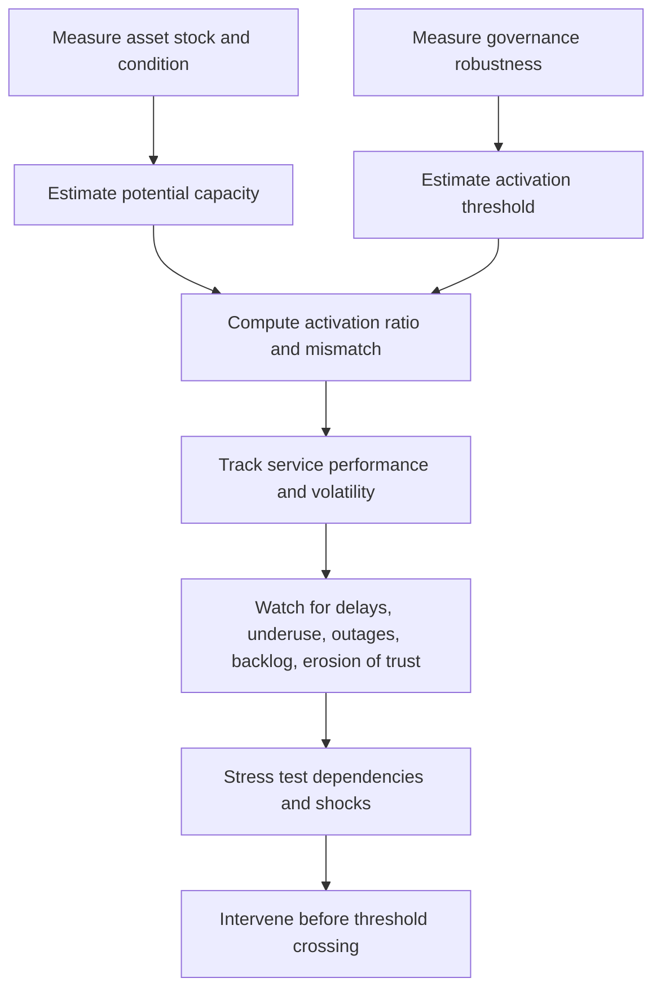

# Hardware, Software, and Nonlinear Resilience

## Executive summary

Across resilience theory, a recurring mistake is to treat **asset stocks** as if they automatically create resilience. They do not. Physical infrastructure, ecological endowments, and other material stocks usually provide **potential capacity** rather than realized resilience. What turns stock into service is a set of **governance processes**: planning, coordination, maintenance, staffing, enforcement, learning, monitoring, financing, accountability, and user uptake. In the language of a useful metaphor, assets are the **hardware**; institutions and operating capabilities are the **software**. The metaphor is explicit in WASH practice and consistent with broader infrastructure-resilience scholarship, which emphasizes that resilience depends jointly on physical attributes and organizational capabilities, including institutional interdependencies across sectors and scales. citeturn28search9turn28search16turn29view0turn36search9

Resilience theory helps explain why the relation between asset stocks and governance processes is often **nonlinear**. Threshold-oriented work in social-ecological systems shows that gradual deterioration in institutions or operating capability can produce abrupt losses in function, especially when systems are near basin boundaries or regime shifts. Asset-based poverty-trap research adds an analogous lesson: there are **critical thresholds** around which behavior and outcomes bifurcate. Combining these literatures suggests a general proposition: as asset portfolios become larger, denser, and more interdependent, the **minimum governance quality required to activate them** rises, and once governance falls below that activation threshold, realized service can collapse disproportionately fast. Recovery is then often **hysteretic**: much larger improvements in governance are needed to restore function than were required to lose it in the first place. citeturn2search0turn24search2turn25search3turn37view0turn0search6

The empirical record strongly supports this interpretation. New Orleans had massive levee and floodwall assets, yet diffuse maintenance responsibilities and decades of fragmented decision-making culminated in catastrophic failure during Hurricane Katrina. Puerto Rico had an island-wide electricity system, yet years of deferred maintenance and mismanagement left the grid fragile enough that Hurricanes Irma and Maria triggered a systemwide collapse. In India’s rural sanitation program, very large stocks of toilets and community sanitary complexes were built, but functionality and sustained use depended heavily on operations, water, electricity, cleaners, and local management. Large transport and irrigation infrastructures show the same pattern: the European Court of Auditors found that many EU-funded airport investments were oversized, underused, or not financially self-sustaining, while a major study of 79 large-scale irrigation schemes in sub-Saharan Africa found a median delivery of only 16 percent of proposed irrigated area, with political incentives and weak management frameworks identified as central causes. Natural assets behave similarly: the Aral Sea and the Northern cod fishery were both richly endowed systems whose ecological “hardware” was overwhelmed by institutional failure, producing collapse rather than resilience. citeturn10search0turn10search1turn10search2turn9search0turn9search12turn14view1turn16view4turn17view2turn19view0turn19view1turn21view0turn21view2turn21view3turn33view0turn5search3turn11search3turn11search6turn12search3turn12search4

For policy, the implication is not “build less” in general. It is to stop treating governance as an afterthought. Investment appraisal should shift from a stock logic to an **activation logic**: how much of the stock is likely to become reliable service under real operating conditions, over the entire life cycle, under stress. The best diagnostic is therefore not asset magnitude alone, but the conjunction of **asset stock**, **governance robustness**, and **realized service performance**. Existing official systems already provide many of the needed inputs, including the IMF Investment and Capital Stock Dataset, the World Bank’s Changing Wealth of Nations database, SEEA ecosystem accounts, Worldwide Governance Indicators, IMF PIMA assessments, OECD Infrastructure Governance Indicators, ND-GAIN readiness measures, JMP service ladders, and sectoral service metrics such as SAIDI and SAIFI. A practical risk screen should flag jurisdictions or sectors where asset stocks are high, governance scores are weak, utilization or service ratios are low, and performance volatility is rising. citeturn38view0turn38view1turn38view2turn38view3turn38view4turn35view0turn34search14turn34search8turn39search2turn39search0turn36search8

## Concepts and analytical frame

In resilience scholarship, the first discipline is always to specify **“resilience of what, to what?”** Carpenter and coauthors argue that resilience becomes operational only when the system, the valued function, and the disturbances of concern are specified. Walker and colleagues then define resilience in social-ecological systems as the capacity to absorb disturbance and reorganize while retaining essentially the same function, structure, identity, and feedbacks, portraying this through a **stability landscape** with basins, thresholds, and alternative regimes. citeturn2search0turn25search3turn24search15

Within that frame, **asset stocks** are best understood as accumulated stores of productive capacity. In development and livelihoods work, assets are not merely household possessions; they are stocks of capital—physical, natural, human, financial, and social—whose usefulness is shaped by policies, institutions, and processes. Official wealth-accounting work makes the same point at national scale: the World Bank’s Changing Wealth of Nations treats produced capital, natural capital, human capital, and net foreign assets as the broader productive base that underpins sustainable development, while the SEEA system tracks the stocks and changes in environmental assets and the ecosystem services they can generate. citeturn3search3turn38view0turn38view1turn40search2

**Governance processes** are the rules, routines, organizations, incentives, and information systems that convert those stocks into durable functions. The OECD defines infrastructure governance as the policies, frameworks, norms, processes, and tools used by public bodies to plan, decide on, implement, and monitor the entire life cycle of public infrastructure. In resilience-oriented infrastructure guidance, this extends to emergency planning, training, exercises, monitoring, and coordination across owners, operators, regulators, and vendors. citeturn36search10turn35view0turn36search9

The **hardware versus software** metaphor is most explicit in the WASH field, where official and practitioner guidance distinguishes hardware as physical infrastructure and software as the social, economic, behavioral, and managerial conditions that make infrastructure work. The insight generalizes well beyond sanitation. CISA states directly that infrastructure resilience depends on both physical attributes and the capabilities of organizations affecting operation and management, and work on institutional interdependence shows that infrastructures are embedded in linked social, ecological, and technological systems whose vulnerability and resilience depend on vertical, lateral, and temporal institutional relations. citeturn28search9turn28search16turn36search9turn29view0

The **potential energy metaphor** is not a standard standalone term in resilience theory, but it can be rigorously grounded in the stability-landscape literature. In that literature, basin size, depth, and slope are used to describe how much disturbance a system can absorb before shifting regimes. Building on that approach, material or ecological assets can be interpreted as **stored potential**: they enlarge the possible action space of a system, but do not by themselves determine whether that potential is actually mobilized into reliable service or adaptive response. In this report, that is what “potential energy” means: latent capacity that requires institutional activation. citeturn25search3turn25search13turn37view0

An **activation threshold** is therefore the minimum governance capability required for a given asset stock to function as service rather than stranded capacity. This is an analytical definition rather than a universally standardized one, but it is strongly supported by two established literatures: resilience work on thresholds and regime shifts, and asset-threshold work showing that outcomes can bifurcate around critical asset levels. The conceptual extension here is straightforward: the relevant threshold need not be in assets alone; it can also be in the governance capacity needed to activate assets. citeturn24search2turn0search9turn37view0turn29view0

**Nonlinearity** means that the output generated by assets is not proportional to the stock. A city can lose only a small share of technical capacity and still experience a very large loss in essential services if failures propagate through dependencies, confidence, finance, or ecological feedbacks. Scheffer and Carpenter’s threshold literature shows how gradual change can have little visible effect until a tipping point is reached, after which the shift is abrupt and hard to reverse. citeturn37view0turn0search6

A **white elephant** is the public-investment analogue of inactive hardware: an expensive project with negative or very weak social return, often proceeded with despite poor screening, unrealistic demand assumptions, or distorted incentives. In the economics literature, white elephants are framed as avoidable negative-net-present-value projects; the World Bank has also used the term for extreme cases of low public-investment efficiency. citeturn32search3turn32search0turn32search8

Finally, **systemic failure** refers to breakdown that propagates across interconnected assets and services rather than remaining confined to a single component. OECD and CISA guidance on critical infrastructure emphasizes that essential systems are interdependent and that failure can cascade across transport, energy, water, telecommunications, finance, and emergency response. citeturn27search1turn36search2turn36search9

## Mechanisms linking asset stocks to activated resilience

The core mechanism is simple: assets first create **potential service capacity**, and governance processes determine what share of that capacity becomes **realized service flow**. A port, grid, levee, irrigation canal, fish stock, or sanitation complex exists as a stock; but unless there are rules for use, maintenance budgets, trained operators, data systems, enforcement, and legitimate decision processes, the stock remains only partially activated. That distinction between stock and flow is implicit in wealth accounting, infrastructure life-cycle management, and resilience theory alike. citeturn38view0turn36search1turn36search10

A second mechanism is that larger asset portfolios usually increase **coordination and maintenance burdens**. The governance needed for a small, modular system is not the same as the governance needed for a tightly coupled, geographically dispersed, technically complex asset base. The institutional-interdependence literature shows that vulnerability arises not only from physical linkages but also from cross-level, cross-sector, and longitudinal institutional dependencies. This means that a rise in asset stock can itself raise the governance threshold required to keep the system functional. citeturn29view0turn36search9

A third mechanism is the formation of **reinforcing feedback loops**. Weak planning or inflated forecasts can produce oversized assets. Oversizing lowers utilization, which lowers operating revenue or political legitimacy, which then reduces maintenance, which further lowers performance and utilization. In another loop, weak maintenance produces frequent disruptions, which erode trust, tax effort, or willingness to pay, which weakens the very institutions that would be needed to repair the system. The European airport audit, Puerto Rico’s grid experience, and India’s sanitation evidence all illustrate versions of this logic. citeturn21view0turn21view2turn21view3turn9search12turn17view2turn19view0

Natural assets add a fourth mechanism: **abundance can intensify extraction pressure when governance is weak**. Large water inflows, fish biomass, or fertile wetlands are not automatically resilient stocks. Without science-based harvest rules, monitoring, rights allocation, and enforcement, abundance becomes politically and economically tempting overuse, eventually moving the system toward ecological thresholds and possible regime shifts. That is exactly the pattern documented in the Aral Sea and Northern cod cases. citeturn11search6turn11search3turn12search4turn12search3

The result is a nonlinear relationship that can be summarized as follows: asset stocks raise potential resilience up to the point where governance can still absorb the induced coordination burden; beyond that point, additional stock can become fragility-enhancing rather than resilience-enhancing. That proposition is an inference, but it is tightly anchored in the combination of adaptive-governance, threshold, institutional-interdependence, and asset-threshold literatures. citeturn24search0turn25search3turn29view0turn24search2

The diagram below condenses the argument.

This stylized loop is consistent with official WASH hardware/software guidance, critical-infrastructure planning frameworks, institutional-interdependence analysis, and threshold models of regime change. citeturn28search9turn28search16turn36search9turn29view0turn37view0

A typical mismatch also has a recognizable temporal sequence.

That timeline is not tied to any one case, but it matches the trajectories documented across the empirical cases reviewed below. citeturn10search1turn9search12turn21view3turn33view0turn11search6turn12search4

## Empirical evidence from cross-sectoral case studies

The cases are deliberately cross-sectoral: flood control, electricity, sanitation, transport, irrigation, inland water ecosystems, and marine fisheries. What unites them is not the engineering form of the asset, but the fact that large physical or natural stocks coexisted with weak governance processes and then produced underutilization, white-elephant dynamics, maladaptation, or collapse.

| Case | Asset stock | Governance weakness | Observed outcome | Evidence |
|---|---|---|---|---|
| New Orleans, United States | Metropolitan levee and floodwall system | Diffuse responsibilities for operations and maintenance, no effective breach warning system, and a long decision history shaped by institutional, policy, financial, and organizational fragmentation | Catastrophic breaching and flooding during Hurricane Katrina; city-scale systemic failure rather than graceful degradation | citeturn10search0turn10search1turn10search2turn23search0 |
| Puerto Rico | Island-wide generation, transmission, and distribution grid | Years of deferred maintenance and mismanagement left an already fragile system exposed; post-disaster recovery governance was also slowed by funding and coordination problems | Systemwide collapse after Hurricanes Irma and Maria and one of the longest blackouts in U.S. history | citeturn9search0turn9search12turn9search7turn9search2 |
| Rural India sanitation | More than 110 million household toilets built under SBM-G and more than 200,000 rural community sanitary complexes nationally | Functionality depended on O&M, water, electricity, cleaners, and local management; these “software” conditions were uneven | In a six-state UNICEF assessment, only about 74.5 percent of sampled CSCs had all functional units, 11.7 percent had no functional units, only 59.6 percent had full water-tap coverage, and functional day/night electricity was limited; average toilet use was modest relative to installed stock | citeturn15view0turn16view4turn17view2turn19view0turn19view1turn13search5 |
| EU-funded regional airports in Estonia, Greece, Italy, Poland, and Spain | Airport terminals, aprons, runways, and cargo facilities funded with €666 million in EU support across 20 audited airports | Weak needs assessment, poor national coordination, output-focused monitoring, and systematically optimistic passenger forecasts | More than half of constructions were underused; 17 of 20 projects were delayed; 9 of 20 had cost overruns; 7 of 20 airports were not financially self-sustaining; empty or oversized facilities created white-elephant dynamics | citeturn20view0turn21view0turn21view2turn21view3 |
| Large-scale irrigation schemes in sub-Saharan Africa | Irrigation dams, canals, and command areas across 79 schemes | Political incentives and centralized bureaucracies produced unrealistically large proposals, weak maintenance, and insufficient local knowledge and technical capacity | Median delivered irrigated area was only 16 percent of what had been proposed; only 25 percent of schemes delivered more than 80 percent; 20 percent were completely inactive | citeturn33view0 |
| Aral Sea basin | Massive inland water body, fishery resources, and river-fed irrigation system | Soviet-era water governance prioritized cotton self-sufficiency and large diversions from the Amu Darya and Syr Darya without accounting for long-run ecological and social costs | Severe shrinkage of the sea, salinization, collapse of fisheries, dust and health impacts, and a classic case of maladaptive asset deployment | citeturn5search3turn11search3turn11search6turn5search11 |
| Northern cod, Canada | One of the world’s great marine fisheries and the core natural asset of Newfoundland and Labrador’s fish economy | Overfishing combined with fisheries mismanagement; Canada’s parliamentary review concluded the management system was dysfunctional | Stock collapsed to extremely low levels by the late 1980s and early 1990s, leading to the 1992 moratorium and major socio-economic dislocation | citeturn12search3turn12search4turn12search0turn12search8 |

Several case patterns are especially revealing.

New Orleans is a paradigmatic case of hardware without sufficiently coherent software. The congressional Katrina investigation emphasized that the levees’ importance and the danger of failure were well known, yet operations and maintenance responsibilities were diffuse and no workable warning system existed for breaches during the event. USACE’s own chronology project framed the system’s pre-Katrina condition as the outcome of decades of economic, policy, legislative, institutional, and financial decisions. This is exactly how resilience failure looks in a coupled asset-governance system: major stock, weak coordination, shock, abrupt collapse. citeturn10search0turn10search1turn10search2

Puerto Rico reveals a related mechanism, but in an electricity network. DOE notes that Hurricanes Irma and Maria caused most of the transmission and distribution system to collapse, while NREL describes the event as a systemwide collapse affecting an already fragile energy system. Subsequent federal reviews found that long-term recovery governance was also hindered by incomplete guidance and coordination problems. This is a case where the technical stock existed, yet the organizational software was not robust enough to keep the network serviceable under stress or to restore it quickly afterward. citeturn9search0turn9search12turn9search2

The sanitation evidence from India is especially useful because the hardware/software distinction is explicit rather than inferential. UNICEF explains that community sanitary complexes are necessary rural infrastructure, but its six-state assessment shows that sizeable fractions were only partly functional or nonfunctional, that full water and electricity coverage was far from universal, and that governance arrangements varied substantially across sites. The logic is important: toilet counts overstate resilience if functionality, utilities, cleaners, and management are missing. Said differently, the stock exists, but activation is incomplete. citeturn14view1turn16view4turn17view2turn19view0turn19view1

The European airport audit is one of the clearest official demonstrations of white-elephant dynamics. The Court found that demand was not convincingly demonstrated for many projects, national strategic coordination was weak outside Poland, monitoring focused largely on physical outputs, and traffic forecasts were substantially over-optimistic in most cases. The result was not merely some inefficiency around the edges; it was a systematic pattern of underuse, delay, poor value for money, and non-self-sustaining facilities. That is a direct empirical refutation of the idea that more asset stock necessarily means more resilience or development. citeturn20view0turn21view0turn21view2turn21view3turn35view0

The irrigation evidence from sub-Saharan Africa is even more striking quantitatively. The Nature Sustainability study found that the median scheme delivered only 16 percent of proposed irrigated area, with one-fifth of schemes completely inactive. The authors explicitly attribute the pattern to political and management frameworks, optimism bias, and bureaucracies lacking technical expertise, local knowledge, and financial resources for maintenance. In short, the asset stock was built faster than the governance capacity required to operate it. citeturn33view0

Aral Sea and Northern cod show that natural assets follow the same logic. In the Aral basin, river diversions and irrigation infrastructure were deployed in service of cotton output, but the underlying governance system ignored ecosystem thresholds and distributional costs; the result was a large-scale ecological and social collapse. In Newfoundland, the cod stock was itself a huge natural asset, but parliamentary and scientific retrospectives concluded that overfishing and systemic management failure drove collapse. In both cases, the “hardware” was not absent. It was the rules of extraction, monitoring, and adaptation that failed. citeturn11search3turn11search6turn12search4turn12search3

## Measurement, mismatch detection, and simple models

The right measurement strategy is to treat resilience as a relation among **stock**, **governance**, and **realized service**. Measuring only stock misses activation problems; measuring only governance misses what must actually be governed; measuring only observed service may miss how close the system is to a threshold. This is consistent with Carpenter’s “resilience of what to what?” warning and with official infrastructure-governance, wealth-accounting, and ecosystem-accounting approaches. citeturn2search0turn38view0turn38view1turn35view0

A practical indicator architecture can be organized in three layers.

| Layer | Useful indicators | Main sources |
|---|---|---|
| Asset stock magnitude and condition | Public and private capital stock; produced capital; natural capital; ecosystem extent and condition; sector-specific inventories such as dam capacity, network length, treatment capacity, fish stocks | IMF ICSD, World Bank CWON, SEEA Ecosystem Accounting, FAO fishery accounting/statistics citeturn38view4turn38view0turn38view1turn40search5turn40search0 |
| Governance robustness | Broad governance quality; infrastructure-planning, allocation, procurement, and implementation institutions; governance readiness; life-cycle asset-management practices | WGI, IMF PIMA, OECD IGIs, ND-GAIN governance readiness, OECD life-cycle guidance citeturn38view2turn38view3turn35view0turn34search14turn34search8turn36search1 |
| Activation and service performance | Utilization ratios, functionality rates, outages, repair times, backlog measures, service ladders, financial self-sufficiency, realized versus forecast demand | JMP sanitation ladders, UNICEF functionality assessments, EIA SAIDI/SAIFI, World Bank Enterprise Surveys, ECA airport audits citeturn39search2turn16view4turn19view0turn39search0turn39search13turn21view2 |

From these ingredients, a simple diagnostic can be built.

Let \(A\) denote a normalized measure of asset stock and complexity, \(G\) a normalized governance robustness score, \(P\) the system’s potential service capacity implied by the stock, and \(S\) the service actually delivered. Then two simple ratios are especially informative:

\[
M = A - G
\]

\[
Q = \frac{S}{P}
\]

Here, \(M\) is a **mismatch index**: high positive values indicate asset growth running ahead of governance capability. \(Q\) is an **activation ratio**: it measures how much of the potential embedded in the stock is actually being realized. These are proposed analytical devices rather than official indices, but they are directly motivated by the stock–governance–service distinctions in the literature and by the empirical cases reviewed above. citeturn2search0turn29view0turn36search9turn33view0turn21view3

A plausible threshold model is:

\[
S = \alpha A \cdot \sigma \big[\beta(G-\tau(A))\big]
\]

where \(\sigma(x)=1/(1+e^{-x})\) is a logistic activation function, \(\alpha\) converts stock into potential capacity, and \(\tau(A)\) is the governance threshold required by the asset portfolio. If \(\tau'(A) > 0\), then larger or more tightly coupled stocks require stronger governance to activate them. This is an intentionally simple formulation, but it captures what the cases suggest: adding assets can raise service only when governance grows enough to keep \(G\) above the relevant threshold. citeturn24search2turn25search3turn29view0turn36search9

To represent tipping and hysteresis more explicitly, the system can be depicted with a stylized potential function:

\[
V(x)=\frac{x^4}{4}-\frac{a x^2}{2}+b x
\]

where \(x\) is realized system function and \(b\) can be interpreted as a stock-governance mismatch term. As \(b\) shifts, one basin of attraction shrinks and eventually disappears. Recovery then requires moving \(b\) back farther than the point at which collapse occurred, which is the formal signature of **hysteresis**. This is not an estimated equation; it is a compact way to import the stability-landscape logic of resilience theory into the asset-governance problem. citeturn25search3turn25search13turn37view0

The most actionable early-warning signals are therefore not single metrics but **joint anomalies**: high asset stocks with low governance scores, rising maintenance backlog, widening gaps between forecast and actual utilization, rising outage variance or interruption duration, declining functionality rates, and increasing evidence of cross-sector dependencies. Scheffer’s work on early-warning signals suggests that increased variance and autocorrelation can indicate approach to critical transitions, while official infrastructure and audit frameworks repeatedly identify maintenance weakness, unrealistic forecasts, and incomplete life-cycle monitoring as practical precursors of failure. citeturn0search6turn21view3turn36search1turn36search17turn39search0

The monitoring logic can be summarized as follows.

That sequence aligns with the logic of PIMA, OECD infrastructure-governance work, CISA resilience planning, JMP service monitoring, and the empirical failures reviewed in this report. citeturn38view3turn35view0turn36search2turn39search2

## Policy implications, uncertainties, and research gaps

### Policy implications

The first policy implication is to **treat governance capability as a co-equal investment object**. Capex approvals should routinely include recurrent O&M finance, staffing plans, training, monitoring systems, and explicit inter-agency coordination arrangements. OECD life-cycle guidance stresses precisely this whole-of-life logic, and CISA emphasizes that organizational capabilities are constitutive of infrastructure resilience rather than supplementary to it. citeturn36search1turn36search9turn36search10

The second implication is to replace “more assets” with **modular, scalable, and reversible growth** where uncertainty is high. The European Court of Auditors pointed to oversized airport infrastructure and weak demand assessment; the broader lesson is that when governance or demand information is weak, modularity is safer than irreversible oversizing. This reduces the likelihood that assets outrun institutions and become white elephants. citeturn21view0turn21view3turn32search3

Third, appraisal systems should impose **governance-readiness gates**. Before expanding stock, governments and funders should ask whether the relevant project or sector clears minimum thresholds on planning, procurement, implementation, maintenance, data, and accountability. PIMA, OECD IGIs, and ND-GAIN readiness metrics already provide the beginnings of such gatekeeping architectures. citeturn38view3turn35view0turn34search14

Fourth, infrastructure policy should monitor **activation ratios**, not just stock counts. Counting toilets, megawatts, runway extensions, or irrigated hectares is insufficient. What matters is the share of technical capacity that is functional, used, financed, and recoverable under stress. The Indian sanitation evidence is especially instructive here: stock counts looked large, but operational diagnostics revealed meaningful gaps in functionality, electricity, water, and use. citeturn15view0turn16view4turn17view2turn19view0turn19view1

Fifth, for natural assets, governance should be designed around **adaptive limits and feedbacks** rather than extraction volumes alone. The cod and Aral cases show that abundant natural hardware can induce overconfidence and political pressure for overuse. Science-based catch rules, water-allocation institutions, ecological monitoring, and mechanisms for rapid policy revision are therefore resilience infrastructure in their own right. citeturn11search6turn12search4turn40search1

### Uncertainties and research gaps

Several research gaps remain important. The first is **comparability**. Asset stocks are relatively measurable, but governance robustness is often context-specific and multi-layered. Broad indicators such as WGI are useful for screening, yet they may be too coarse for sectoral activation thresholds, while sector-specific tools such as PIMA or OECD IGIs cover governance processes better but not always at subnational or utility level. citeturn38view2turn38view3turn35view0

The second gap is **causal identification**. Many failures combine weak governance with exogenous shocks, technological obsolescence, climate stresses, or demand shifts. The case evidence strongly supports a mismatch story, but precise marginal effects of governance on activation are rarely estimated in a way that is comparable across sectors. That limitation is already implicit in resilience scholarship’s long-standing warning that context and disturbance specification matter. citeturn2search0turn25search3

The third gap is **threshold estimation**. Theory shows that thresholds and hysteresis are possible and often likely, but in real systems their exact location is hard to know ex ante. Scheffer and colleagues explicitly caution that early-warning signals are useful but only one tool, and ecological or socio-technical systems may shift before thresholds are cleanly observed. citeturn0search6turn37view0

The fourth gap is the scarcity of **paired longitudinal datasets** that jointly track stock growth, institutional quality, and realized service. Wealth accounts, ecosystem accounts, governance indicators, service ladders, audit frameworks, and outage statistics all exist, but they remain fragmented across scales and sectors. A major frontier is to integrate them into mismatch-oriented dashboards capable of detecting when hardware is accumulating faster than software. citeturn38view0turn38view1turn35view0turn39search2turn39search13

The broad conclusion is therefore firm even where precise thresholds remain uncertain: **asset stocks are best understood as potential energy for resilience, not resilience itself**. In systems with robust governance processes, assets widen option sets, absorb shocks, and support adaptation. In systems with weak governance, the same assets can sit idle, degrade into white elephants, lock societies into maladaptive pathways, or amplify collapse when stress arrives. The decisive variable is not hardware alone, but the nonlinear relationship between hardware and software. citeturn28search9turn36search9turn29view0turn37view0
---

# APPENDIX: CRI Methodological Standard: The Triple-M Taxonomy

**Version**: 1.0 (2026-04-23)
**Status**: Frozen Anchor
**Objective**: To prevent "Expert Drift" by explicitly defining the three types of "mismatch" encountered in the CRI framework development.

## 1. M1: Functional Mismatch (The Strategy Layer)
- **Definition**: The gap between an identified system stock (Asset/Hardware) and the institutional capacity to manage it (Governance/Software).
- **Equation**: M = A - G
- **Usage**: Used in the Strategic Crosswalk to identify policy blindspots.
- **Example**: A city has high-resolution flood maps (Asset), but no mandate to use them in building-permit enforcement (Governance Gap).

## 2. M2: Anchoring Mismatch (The Empirical Layer)
- **Definition**: The gap between a theoretical concept (derived from literature) and the actual administrative data available in Thailand.
- **Equation**: M = Concept - Data
- **Usage**: Used in the Tagging Dictionary to identify "Data Investment" needs.
- **Example**: The literature requires "Community Reciprocity Scales," but the only Thai trace is "Village Fund Participation Rates" (Proxy Gap).

## 3. M3: Fidelity Mismatch (The Forensic Layer)
- **Definition**: A failure in the research or synthesis process where the output deviates from the source evidence or user instructions.
- **Equation**: M = Synthesis - Source
- **Usage**: Used in the Workflow Log to track AI errors and corrections.
- **Example**: The AI cites an internal note as "Evidence" instead of the primary literature source (Research Error).

---

## Mandate for the Oracle
Every mention of "mismatch" in CRI deliverables must be prefixed with the corresponding ID (M1, M2, or M3). Any statement failing this protocol is to be treated as a hypothesis until audited.
