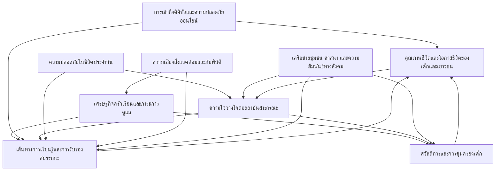

# รายงานอนาคตเด็กและเยาวชนไทย พ.ศ. 2590

+-----------------------------------------------------------------------+
| **วิธีอ้างอิง**                                                       |
|                                                                       |
| เบื้องต้นใช้อ้างอิงในเนื้อหาแบบ นาม-ปี และจัดทำเอกสารอ้างอิงแบบ APA  |
| 7th Edition ในส่วนท้ายของรายงาน                                      |
+=======================================================================+
+-----------------------------------------------------------------------+

## บทคัดย่อ

รายงานฉบับนี้จัดทำขึ้นเพื่อสนับสนุนการเตรียมพร้อมเชิงยุทธศาสตร์ต่ออนาคตของเด็กและเยาวชนในพื้นที่ 3 จังหวัดชายแดนภาคใต้ ไปถึง พ.ศ. 2590 โดยวางเด็กและเยาวชนเป็นศูนย์กลางของเรื่องเล่าและการตัดสินใจ ไม่ใช่เพียงผู้รับผลของการเปลี่ยนแปลงจากระบบอื่น ๆ รายงานสังเคราะห์ร่องรอยการเปลี่ยนแปลงที่กำลังก่อตัวอยู่ในชีวิตจริงให้กลายเป็นแผนที่สัญญาณ ปัจจัยขับเคลื่อน ความตึงเครียดของอนาคต และความไม่แน่นอนสำคัญ เพื่ออธิบายว่าเหตุใดโอกาสชีวิตจึงเปิดออกหรือปิดลงในทางปฏิบัติ โดยเฉพาะในกลุ่มเด็กกำพร้าและเด็กและเยาวชนกลุ่มเปราะบางที่มีความเสี่ยงสะสมสูง

บนฐานของความไม่แน่นอนสำคัญ รายงานพัฒนาภาพอนาคตฐานและฉากทัศน์ทางเลือก 4 แบบ เพื่อทำให้เห็นความเสี่ยงและโอกาสภายใต้เงื่อนไขที่แตกต่างกัน พร้อมสังเคราะห์ภาพอนาคตที่พึงประสงค์เป็นเข็มทิศร่วมสำหรับการออกแบบยุทธศาสตร์ ในส่วนยุทธศาสตร์ รายงานเสนอเส้นทางการเปลี่ยนผ่านที่ต้องทำงานประสานกันระหว่างการทำให้ระบบเดิมเข้าถึงได้จริง การทดลองเพื่อสร้างสะพานเชิงระบบ และการลงทุนระยะยาวเพื่อทำให้ระบบใหม่เป็นเรื่องปกติ โดยเน้นจุดคานงัดสำคัญ ได้แก่ การเชื่อมต่อเส้นทางการเรียนรู้และการรับรองสมรรถนะ การลดต้นทุนการเข้าถึงสวัสดิการและการคุ้มครอง ความไว้วางใจและพื้นที่ปลอดภัย และดิจิทัลที่เป็นทั้งโครงสร้างพื้นฐานและระบบคุ้มครองเด็ก เพื่อให้ยุทธศาสตร์ยังมีความหมายภายใต้ความไม่แน่นอนและสามารถนำไปปรับใช้ในบริบทพื้นที่ได้จริง

## Abstract

This report supports strategic preparedness for the futures of children and youth in Thailand’s Southern Border Provinces toward 2590 BE (2047 CE). It places children and youth, especially orphans and other vulnerable groups with accumulated risks, at the center of analysis and decision-making. The report synthesizes emerging changes in lived realities into an evidence-informed map of signals, drivers, system dynamics, future tensions, and critical uncertainties that shape whether life chances open or close in practice.

Building on these critical uncertainties, the report develops a baseline future and four alternative scenarios to explore plausible pathways under different systemic conditions, and articulates a desirable future as a shared compass. It then translates this desirable future into strategic pathways, leverage points, and a portfolio of actions designed for robustness under uncertainty. The proposed strategy emphasizes making access feasible in everyday life, strengthening the real connectivity of learning pathways and competency recognition, reducing the hidden costs of welfare and protection access, rebuilding trust through safe and credible delivery, and treating digital systems as both opportunity infrastructure and a protection environment for children and youth.

### keyword

การคาดการณ์อนาคตเชิงยุทธศาสตร์, 3 จังหวัดชายแดนภาคใต้, เด็กและเยาวชน, เด็กกำพร้า, สัญญาณและปัจจัยขับเคลื่อน, ฉากทัศน์, ยุทธศาสตร์, จุดคานงัด, ความไว้วางใจ, ดิจิทัลและความปลอดภัยออนไลน์

# บทที่ 1 บทนำ

## ที่มาและความสำคัญ

การมองไปถึง พ.ศ. 2590 ในรายงานฉบับนี้ไม่ได้มีเป้าหมายเพื่อทำนายว่าอนาคตจะต้องเป็นเช่นไร หากเป็นการใช้ระยะเวลาไกลเป็นเครื่องมือช่วยให้สังคมเห็นทั้งข้อจำกัดระยะยาวและหน้าต่างของโอกาสที่ส่งผลต่อการเติบโตของเด็กและเยาวชน โดยเฉพาะในพื้นที่ที่เงื่อนไขเชิงโครงสร้างซับซ้อนและทับซ้อนกันหลายมิติ เช่น เส้นทางการเรียนรู้และการศึกษา เศรษฐกิจครัวเรือน การเข้าถึงสวัสดิการและการคุ้มครอง ความไว้วางใจต่อสถาบันสาธารณะ ความปลอดภัยในชีวิตประจำวัน รวมถึงข้อจำกัดเชิงพื้นที่และความเหลื่อมล้ำเชิงภูมิศาสตร์ การมองอนาคตระยะยาวจึงทำหน้าที่เปิดพื้นที่ของความเป็นไปได้หลายแบบ เพื่อช่วยผู้กำหนดนโยบายและผู้ปฏิบัติงานภาคสนามเตรียมพร้อมต่อความไม่แน่นอน และออกแบบการตัดสินใจที่มีความทนทานต่อเงื่อนไขที่เปลี่ยนไป

รายงานนี้มีจุดตั้งต้นที่ชัดเจนว่า เด็กและเยาวชนคือศูนย์กลางของเรื่องเล่า ไม่ใช่เพียงผู้รับผลของการเปลี่ยนแปลงที่เกิดขึ้นในระบบอื่น ๆ เมื่อความเสี่ยงและแรงกดทับสะสมยาวนาน โอกาสชีวิตของเด็กและเยาวชนมักถูกจำกัดผ่านกลไกที่ดูเหมือนเป็นเรื่องเฉพาะด้าน แต่แท้จริงแล้วเชื่อมโยงกันเป็นระบบ เช่น ครัวเรือนที่เปราะบางทำให้การเรียนรู้สะดุด การเรียนรู้ที่สะดุดทำให้โอกาสทางเศรษฐกิจลดลง โอกาสที่ลดลงทำให้การเข้าถึงบริการยากขึ้น และเมื่อการเข้าถึงบริการยากขึ้น ความไว้วางใจก็ยิ่งถดถอย การวิเคราะห์เชิงอนาคตจึงช่วยทำให้ความเชื่อมโยงเหล่านี้มองเห็นได้ชัด และช่วยยกระดับจากการแก้ปัญหาแบบแยกส่วนไปสู่การออกแบบทางเลือกเชิงยุทธศาสตร์ที่จัดการทั้งโครงสร้าง เงื่อนไข และแรงต้านในเวลาเดียวกัน

## สังคมชายแดนใต้ บริบทในมิติต่าง ๆ

พื้นที่ที่รายงานนี้ให้ความสำคัญคือ 3 จังหวัดชายแดนภาคใต้ ได้แก่ ปัตตานี ยะลา และนราธิวาส พื้นที่ดังกล่าวมีบริบททางสังคม วัฒนธรรม ภาษา เศรษฐกิจ และการปกครองที่แตกต่างจากพื้นที่อื่นของประเทศ และมีประวัติศาสตร์ร่วมที่ทำให้ความสัมพันธ์ระหว่างประชาชนกับสถาบันสาธารณะมีเงื่อนไขเฉพาะของตนเอง ภาพจำของพื้นที่มักถูกเล่าผ่านมิติความขัดแย้งและความมั่นคงเป็นหลัก แต่การทำความเข้าใจชีวิตเด็กและเยาวชนจำเป็นต้องเห็นมากกว่านั้น เพราะเส้นทางชีวิตของเด็กไม่ได้ถูกกำหนดโดยเหตุการณ์ใดเหตุการณ์หนึ่ง หากถูกกำหนดโดยการทับซ้อนของระบบการเรียนรู้ ระบบเศรษฐกิจครัวเรือน ระบบสวัสดิการและการคุ้มครอง ระบบความสัมพันธ์ในชุมชน และสภาพแวดล้อมที่เด็กเติบโตอยู่จริง

ภายใต้บริบทนี้ ความปลอดภัยและความไว้วางใจมีความหมายเชิงปฏิบัติอย่างยิ่งต่อชีวิตประจำวันของเด็กและเยาวชน ความไว้วางใจส่งผลต่อการเข้าถึงบริการและการยอมรับกติกาสาธารณะ ขณะที่ความไม่ไว้วางใจสามารถทำให้โครงการหรือมาตรการที่ออกแบบไว้ดีบนกระดาษไม่เกิดผลในทางปฏิบัติ ในเวลาเดียวกัน เศรษฐกิจครัวเรือนและโอกาสทางอาชีพเป็นเงื่อนไขที่กำหนดความเป็นไปได้ของการอยู่ในระบบการศึกษา การย้ายถิ่น การเข้าสู่ตลาดแรงงาน และการตัดสินใจในช่วงเปลี่ยนผ่านสำคัญของชีวิต นอกจากนี้ การเปลี่ยนแปลงทางเทคโนโลยี ภูมิอากาศ และแนวโน้มสังคมในภาพใหญ่ยังแทรกซึมเข้ามาในชีวิตของเด็กและเยาวชนผ่านช่องทางที่จับต้องได้ เช่น ค่าใช้จ่ายที่เพิ่มขึ้น ภัยพิบัติที่รบกวนความต่อเนื่องของการเรียนรู้ ช่องว่างการเข้าถึงเครื่องมือดิจิทัล และความเสี่ยงใหม่ในโลกออนไลน์

รายงานจึงตั้งใจให้ผู้อ่านเห็นภาพของ 3 จังหวัดชายแดนภาคใต้ในฐานะพื้นที่ที่มีทั้งข้อจำกัดและศักยภาพ มีทั้งแรงกดทับเชิงโครงสร้างและทรัพยากรทางสังคมในชุมชน การมองอนาคตเด็กและเยาวชนในพื้นที่นี้จำเป็นต้องพิจารณาเงื่อนไขที่ทำให้การเปลี่ยนแปลงเป็นไปได้จริง ไม่ว่าจะเป็นระดับครัวเรือน ระดับชุมชน ระดับหน่วยบริการ และระดับนโยบาย โดยไม่ทำให้เรื่องความมั่นคงกลายเป็นตัวเอกของรายงาน แต่ยอมรับว่าเป็นบริบทที่มีผลต่อความเป็นไปได้ ความไว้วางใจ และต้นทุนของการลงมือทำ

##

ในรายงานฉบับนี้ คำว่า เด็กและเยาวชน ใช้เพื่อชี้ถึงช่วงวัยที่กำลังอยู่ในกระบวนการพัฒนาและเปลี่ยนผ่าน โดยให้ความสำคัญกับเส้นทางการเรียนรู้ การคุ้มครอง และการเติบโตทางสังคมอย่างต่อเนื่อง ขณะที่คำว่า เด็กและเยาวชนกลุ่มเปราะบาง หมายถึงกลุ่มที่มีความเสี่ยงสะสมสูงจากข้อจำกัดด้านครัวเรือน เศรษฐกิจ เส้นทางการเรียนรู้ การเข้าถึงสวัสดิการ การคุ้มครอง และสภาพแวดล้อมทางสังคม ทำให้โอกาสชีวิตถูกจำกัดมากกว่ากลุ่มทั่วไป รายงานยังให้ความสำคัญเป็นพิเศษกับกลุ่มเด็กกำพร้า ซึ่งหมายถึงเด็กที่สูญเสียพ่อหรือแม่ หรือทั้งสอง และต้องเผชิญผลกระทบต่อทุนชีวิต การดูแล ความมั่นคงในครัวเรือน และการเรียนรู้ โดยรายงานจะระบุขอบเขตการใช้คำเหล่านี้ให้ชัดเจนในส่วนกรอบการคาดการณ์อนาคต เพื่อให้ข้อสรุปและข้อเสนอเชิงยุทธศาสตร์สอดคล้องกับกลุ่มเป้าหมายที่ตั้งใจสนับสนุน

รายงานใช้ถ้อยคำด้านการคาดการณ์อนาคตอย่างสม่ำเสมอเพื่อช่วยให้ผู้อ่านติดตามตรรกะของการวิเคราะห์ได้ชัดเจน การกวาดสัญญาณ คือการสำรวจร่องรอยการเปลี่ยนแปลงจากหลายแหล่งข้อมูลเพื่อจับสิ่งที่กำลังเปลี่ยนในชีวิตจริงก่อนจะกลายเป็นแนวโน้มใหญ่ สัญญาณ คือข้อมูลหรือเหตุการณ์ที่บอกใบ้ว่ากำลังเกิดการเปลี่ยนผ่านในระบบ ไม่ใช่ข้อสรุปหรือคำทำนาย เมื่อสังเคราะห์สัญญาณจำนวนมากเข้าด้วยกันจะทำให้เห็นปัจจัยขับเคลื่อน ซึ่งเป็นแรงผลักที่ทำให้ระบบเคลื่อน และทำให้สามารถระบุความไม่แน่นอนสำคัญ ซึ่งเป็นปัจจัยที่มีผลสูงต่ออนาคตแต่ทิศทางยังไม่ชัด รายงานใช้ฉากทัศน์เพื่อเล่าภาพอนาคตหลายแบบที่มีตรรกะรองรับ และใช้ภาพอนาคตฐานเป็นเส้นอ้างอิงของอนาคตหากแนวโน้มหลักดำเนินต่อไป ขณะเดียวกัน ภาพอนาคตที่พึงประสงค์ทำหน้าที่เป็นเข็มทิศร่วมว่าควรมุ่งไปสู่อนาคตแบบใดสำหรับเด็กและเยาวชนในพื้นที่

##

โครงสร้างของรายงานถูกออกแบบให้ผู้อ่านสามารถเห็นเส้นทางจากหลักฐานสู่ข้อเสนอได้อย่างเป็นลำดับ โดยเริ่มจากการทำความเข้าใจบริบทและขอบเขตในบทที่ 1 จากนั้นบทที่ 2 จะสังเคราะห์สัญญาณ แนวโน้ม ปัจจัยขับเคลื่อน และความตึงเครียดของอนาคตผ่านการมองเชิงระบบเพื่อระบุจุดคอขวดและเงื่อนไขที่ทำให้การเปลี่ยนแปลงเกิดขึ้นได้จริง บทที่ 3 จะเปลี่ยนความไม่แน่นอนสำคัญให้เป็นภาพอนาคตฐานและภาพอนาคตทางเลือกหลายแบบ เพื่อช่วยให้เห็นทั้งความเสี่ยงที่อาจทวีคูณและโอกาสที่อาจเปิดขึ้นภายใต้เงื่อนไขต่างกัน ส่วนบทที่ 4 จะนำภาพอนาคตที่พึงประสงค์มาวางเป็นเป้าหมายร่วม แล้วแปลงเป็นยุทธศาสตร์ เส้นทางการเปลี่ยนผ่าน จุดคานงัด และพอร์ตโฟลิโอของการดำเนินงานที่ยังมีความหมายแม้อนาคตจะคลาดเคลื่อนจากสมมติฐานบางข้อ

รายงานให้ความสำคัญกับความโปร่งใสของหลักฐาน โดยข้อเท็จจริงที่เป็นตัวเลข รายละเอียดเชิงกฎหมาย หรือข้อมูลที่ต้องการความแม่นยำสูงจะถูกใช้ก็ต่อเมื่อเชื่อมโยงกับแหล่งอ้างอิงที่ตรวจสอบย้อนกลับได้ หากประเด็นใดมีหลักฐานจำกัด รายงานจะเขียนอย่างระมัดระวังในระดับที่เป็นการสังเคราะห์เชิงคุณภาพ และระบุข้อจำกัดของหลักฐานไว้ในเนื้อหาเพื่อไม่ให้ผู้อ่านเข้าใจว่าเป็นข้อสรุปเชิงประจักษ์ที่ยืนยันแล้ว หลักการนี้มีความสำคัญเป็นพิเศษสำหรับบริบทพื้นที่ที่ความรู้จำนวนมากกระจายอยู่ในหลายหน่วยงาน หลายรูปแบบการศึกษา และหลายประสบการณ์ชีวิต ซึ่งอาจไม่ถูกรวบรวมเป็นข้อมูลทางการในรูปแบบเดียวกัน

## วัตถุประสงค์การศึกษา

รายงานฉบับนี้มีวัตถุประสงค์เพื่อสนับสนุนการเตรียมพร้อมเชิงยุทธศาสตร์ต่ออนาคตของเด็กและเยาวชนในพื้นที่ 3 จังหวัดชายแดนภาคใต้ โดยใช้กรอบการคาดการณ์อนาคตเป็นเครื่องมือจัดระเบียบความรู้และความไม่แน่นอน ประการแรก รายงานมุ่งทำให้ผู้อ่านเห็นภาพของแรงกดทับและเงื่อนไขที่กำหนดเส้นทางชีวิตของเด็กและเยาวชนในพื้นที่ในมิติต่าง ๆ อย่างเชื่อมโยงกัน ไม่จำกัดเพียงมิติใดมิติหนึ่ง ประการที่สอง รายงานมุ่งสร้างความเข้าใจร่วมว่าความเสี่ยงและโอกาสในอนาคตอาจแตกแขนงได้หลายแบบ และการตัดสินใจในปัจจุบันมีผลต่อทิศทางดังกล่าวอย่างไร ประการที่สาม รายงานมุ่งเสนอกรอบคิดเพื่อออกแบบยุทธศาสตร์และเส้นทางการเปลี่ยนผ่านที่ให้ความสำคัญกับความทนทานของยุทธศาสตร์ภายใต้ความไม่แน่นอน เพื่อให้ผู้เกี่ยวข้องสามารถเลือกจุดเริ่มต้นและลำดับความสำคัญที่เหมาะสมกับทรัพยากรและข้อจำกัดจริงของพื้นที่

## กรอบการคาดการณ์อนาคต

รายงานนี้ใช้การคาดการณ์อนาคตเชิงยุทธศาสตร์เพื่อช่วยให้ผู้อ่านมองเห็นทั้งภาพแนวโน้มและจุดเปลี่ยนที่อาจเกิดขึ้น โดยถือว่าฉากทัศน์เป็นเครื่องมือเตรียมพร้อม ไม่ใช่คำทำนาย วิธีการดังกล่าวช่วยให้การวางยุทธศาสตร์ไม่ยึดติดกับอนาคตแบบเดียว แต่สามารถออกแบบทางเลือกที่ยังมีความหมายภายใต้หลายเงื่อนไขที่เป็นไปได้

1.  ขอบเขตพื้นที่

    รายงานโฟกัสพื้นที่ 3 จังหวัดชายแดนภาคใต้ และมองพื้นที่ในฐานะระบบที่เชื่อมโยงกันระหว่างครัวเรือน ชุมชน หน่วยบริการ และสถาบันสาธารณะ การอธิบายบริบทเชิงพื้นที่จึงไม่ได้ทำหน้าที่เป็นฉากหลังเชิงภูมิศาสตร์เท่านั้น แต่เป็นการระบุเงื่อนไขของความเป็นไปได้และข้อจำกัดที่ทำให้เส้นทางชีวิตของเด็กและเยาวชนแตกต่างจากพื้นที่อื่นของประเทศ

2.  ขอบเขตกลุ่มเป้าหมายและผู้มีส่วนได้ส่วนเสีย

    กลุ่มเป้าหมายหลักคือเด็กและเยาวชนในพื้นที่ โดยให้ความสำคัญกับกลุ่มเปราะบางที่มีความเสี่ยงสะสมสูง และกลุ่มเด็กกำพร้าที่ต้องเผชิญข้อจำกัดด้านทุนชีวิตและการดูแล ทั้งนี้ รายงานมองผู้มีส่วนได้ส่วนเสียอย่างกว้าง ครอบคลุมครัวเรือนและผู้ดูแล โรงเรียนและผู้จัดการเรียนรู้ หน่วยบริการด้านสวัสดิการและการคุ้มครอง องค์กรปกครองส่วนท้องถิ่น หน่วยงานรัฐ ภาคประชาสังคม และเครือข่ายชุมชนที่มีบทบาทต่อการทำให้การเรียนรู้และการเติบโตของเด็กเกิดขึ้นได้จริงในชีวิตประจำวัน

3.  ขอบเขตระยะเวลา

    ขอบเขตเวลาหลักของรายงานคือการมองไปถึง พ.ศ. 2590 เพื่อมองเห็นผลสะสมของการตัดสินใจและแนวโน้มระยะยาว ในการพิจารณาเส้นทางการเปลี่ยนผ่าน รายงานจะเชื่อมมุมมองระยะสั้นและระยะกลางเข้ากับเป้าหมายระยะยาว เพื่อช่วยให้เห็นว่าการลงมือทำในวันนี้เชื่อมโยงกับผลลัพธ์ในอนาคตอย่างไร และช่วงเวลาใดเป็นช่วงเปลี่ยนผ่านที่ควรให้ความสำคัญเป็นพิเศษ

4.  ขอบเขตมิติการเปลี่ยนแปลง

    รายงานพิจารณามิติการเปลี่ยนแปลงที่มีผลต่อชีวิตเด็กและเยาวชนทั้งในระดับพื้นที่และระดับมหภาค โดยใช้กรอบปัจจัยด้านสังคม เทคโนโลยี เศรษฐกิจ สิ่งแวดล้อม การเมือง และคุณค่าเป็นฐานในการมองปัจจัยขับเคลื่อน พร้อมให้ความสำคัญกับมิติที่เป็นเงื่อนไขร่วมของทุกสาขา ได้แก่ ความเสี่ยง ความปลอดภัย และความไว้วางใจต่อสถาบันสาธารณะ ซึ่งมีผลต่อทั้งความเป็นไปได้ของยุทธศาสตร์และความต่อเนื่องของเส้นทางการเรียนรู้และการเติบโตของเด็กและเยาวชน

เพื่อให้การอ่านบทถัดไปมีความต่อเนื่อง บทที่ 2 จะเริ่มจากการแปลงข้อมูลและข้อสังเกตที่กระจัดกระจายให้กลายเป็นภาพรวมของสัญญาณและแรงขับเคลื่อน พร้อมสกัดความไม่แน่นอนสำคัญที่กำหนดว่าอนาคตของเด็กและเยาวชนในพื้นที่อาจแตกแขนงไปอย่างไร

# บทที่ 2 สัญญาณชีวิตเด็กและเยาวชนไทย

บทที่ 2 ทำหน้าที่แปลงฐานหลักฐานที่กระจัดกระจายให้กลายเป็นแผนที่การเปลี่ยนแปลงที่ผู้อ่านสามารถใช้ติดตามตรรกะของรายงานต่อไปได้อย่างเป็นระบบ กล่าวคือ จากข้อสังเกตและข้อมูลที่พบในปัจจุบัน รายงานสังเคราะห์ให้เห็นว่าสัญญาณใดกำลังชี้ถึงการเปลี่ยนผ่านที่สำคัญ ปัจจัยขับเคลื่อนใดเป็นแรงผลักที่อยู่หลังสัญญาณหลายรายการ และความไม่แน่นอนสำคัญใดที่ทำให้อนาคตอาจแตกแขนงไปได้มากกว่าหนึ่งแบบ การอ่านบทนี้จึงไม่ใช่การอ่านเหตุการณ์ทีละเรื่อง แต่เป็นการอ่านความสัมพันธ์ของระบบที่ทำให้โอกาสชีวิตของเด็กและเยาวชนในพื้นที่ 3 จังหวัดชายแดนภาคใต้ เปิดออกหรือปิดลงในทางปฏิบัติ

คำว่า การกวาดสัญญาณ ในรายงานนี้หมายถึงการสำรวจร่องรอยการเปลี่ยนแปลงจากหลายแหล่งข้อมูล เพื่อจับสิ่งที่กำลังเปลี่ยนในชีวิตจริงก่อนจะกลายเป็นแนวโน้มใหญ่ สัญญาณ คือข้อมูลหรือเหตุการณ์ที่บอกใบ้ว่ากำลังเกิดการเปลี่ยนผ่านในระบบ ไม่ใช่ข้อสรุปหรือคำทำนาย เมื่อจัดระเบียบสัญญาณจำนวนมากเข้าด้วยกันจะทำให้เห็นปัจจัยขับเคลื่อน ซึ่งเป็นแรงผลักที่ทำให้ระบบเคลื่อน และทำให้สามารถระบุความไม่แน่นอนสำคัญ ซึ่งเป็นปัจจัยที่มีผลสูงต่ออนาคตแต่ทิศทางยังไม่ชัด บทนี้ยังใช้แนวคิดผังระบบ เพื่อหลีกเลี่ยงการอธิบายแบบเส้นตรงและทำให้เห็นวงจรป้อนกลับที่ทำให้ปัญหาสะสมหรือคลี่คลายได้ตามเงื่อนไข

รายงานยืนยันหลักการสำคัญว่า มิติความไม่สงบและความปลอดภัยเป็นบริบทที่กำหนดต้นทุนและความเป็นไปได้ของการเข้าถึงบริการ แต่ไม่ใช่ตัวเอกของเรื่องเล่า จุดศูนย์กลางของการอ่านสัญญาณในบทนี้คือคุณภาพชีวิตและโอกาสชีวิตของเด็กและเยาวชน โดยเฉพาะเส้นทางการเรียนรู้ เศรษฐกิจครัวเรือน การเข้าถึงสวัสดิการและการคุ้มครอง ความไว้วางใจต่อสถาบันสาธารณะ และความเสี่ยงในโลกดิจิทัล

## 2.1 การกวาดสัญญาณ

### 2.1.1 สัญญาณแนวโน้มหลักและปัจจัยขับเคลื่อนสำคัญ

สัญญาณที่เกี่ยวข้องกับเด็กและเยาวชนในพื้นที่ 3 จังหวัดชายแดนภาคใต้มีลักษณะสำคัญคือเป็นแรงกดทับที่ทับซ้อนกันหลายชั้น ไม่ว่าจะเป็นแรงกดทับด้านเศรษฐกิจครัวเรือน แรงกดทับต่อความต่อเนื่องของการเรียนรู้ ความเสี่ยงด้านความปลอดภัยและความไว้วางใจต่อรัฐ รวมถึงแรงกดทับใหม่ที่มาจากเทคโนโลยีและสภาพภูมิอากาศ สัญญาณเหล่านี้บางส่วนเป็นสัญญาณเชิงโครงสร้างที่เปลี่ยนช้าแต่มีผลลึก บางส่วนเป็นสัญญาณเชิงพลวัตที่เปลี่ยนเร็วตามสถานการณ์ และบางส่วนเป็นสัญญาณอ่อนที่ยังไม่แพร่หลายแต่มีศักยภาพขยายตัวจนเปลี่ยนเส้นทางชีวิตของเด็กได้อย่างมีนัยสำคัญ

สัญญาณเชิงโครงสร้างที่พบซ้ำสะท้อนว่า เศรษฐกิจครัวเรือนและต้นทุนการดำรงชีพเป็นเงื่อนไขตั้งต้นของหลายการตัดสินใจ การที่ครัวเรือนเผชิญต้นทุนการครองชีพและต้นทุนการเข้าถึงบริการสูงขึ้นย่อมบีบพื้นที่ของการลงทุนด้านการเรียนรู้ ทั้งในรูปค่าใช้จ่ายตรงและในรูปเวลาที่เด็กต้องใช้เพื่อช่วยงานหรือทำงาน เมื่อเศรษฐกิจครัวเรือนเปราะบาง การอยู่ในระบบการศึกษามักกลายเป็นทางเลือกที่ต้องต่อรองกับความจำเป็นเฉพาะหน้า ซึ่งทำให้ความเสี่ยงหลุดออกจากระบบเพิ่มขึ้น แม้จะมีมาตรการสนับสนุนด้านทุนหรือบริการ แต่หากต้นทุนจริงของการเข้าถึงยังสูง หรือหากการเข้าถึงต้องผ่านขั้นตอนที่ซับซ้อน โอกาสที่เด็กเปราะบางจะได้รับประโยชน์เต็มที่ก็จะลดลง

อีกสัญญาณเชิงโครงสร้างที่มีผลต่อชีวิตเด็กอย่างต่อเนื่องคือการแยกส่วนของเส้นทางการเรียนรู้ ในพื้นที่ 3 จังหวัดชายแดนภาคใต้ เส้นทางการเรียนรู้ของเด็กและเยาวชนไม่ได้มีเพียงโรงเรียนของรัฐ หากยังมีโรงเรียนเอกชนสอนศาสนา สถาบันการศึกษาศาสนา และรูปแบบการเรียนรู้ทางเลือกอื่น ๆ ที่สอดคล้องกับบริบทวัฒนธรรมและศรัทธา อย่างไรก็ตาม ความท้าทายเชิงระบบไม่ได้อยู่ที่การมีทางเลือกเพียงอย่างเดียว แต่อยู่ที่การเชื่อมต่อ การรับรองสมรรถนะ และความสามารถในการไหลเวียนระหว่างเส้นทางเหล่านี้ในช่วงเปลี่ยนผ่านสำคัญของชีวิตเด็ก หากเส้นทางหนึ่งไม่สามารถเชื่อมต่อกับอีกเส้นทางได้จริง เด็กจำนวนหนึ่งอาจถูกผลักให้กลายเป็นผู้ที่อยู่นอกการติดตามของระบบการศึกษาและระบบสวัสดิการในระยะยาว แม้จะยังมีการเรียนรู้เกิดขึ้นในชีวิตจริงก็ตาม

สัญญาณเชิงโครงสร้างด้านความไว้วางใจต่อสถาบันสาธารณะทำหน้าที่เป็นทั้งตัวเร่งและตัวหน่วงของการเข้าถึงสิทธิในทางปฏิบัติ ในบริบทพื้นที่ที่มีเงื่อนไขด้านความปลอดภัยและความสัมพันธ์รัฐ–ชุมชนที่ซับซ้อน การมีสิทธิบนเอกสารไม่เท่ากับการเข้าถึงจริง ความไว้วางใจจึงไม่ใช่ทัศนคติทั่วไป หากเป็นเงื่อนไขเชิงสถาบันที่กำหนดว่าครัวเรือนจะติดต่อหน่วยบริการหรือไม่ จะยอมรับกลไกคุ้มครองหรือไม่ และจะเชื่อว่าการเข้าระบบจะนำไปสู่ความช่วยเหลือหรือความเสี่ยงเพิ่มเติม สัญญาณหลายรายการชี้ให้เห็นว่าความปลอดภัยของพื้นที่เรียนรู้และพื้นที่สาธารณะเป็นเงื่อนไขที่กระทบทั้งพฤติกรรมของเด็กและความสบายใจของผู้ปกครอง ซึ่งอาจสะสมเป็นการจำกัดโอกาสการเรียนรู้และการมีส่วนร่วมทางสังคมในระยะยาว

สัญญาณด้านเทคโนโลยีปรากฏในลักษณะสองหน้า กล่าวคือเทคโนโลยีเพิ่มช่องทางการเรียนรู้และการเชื่อมต่อ แต่ในเวลาเดียวกันสามารถขยายช่องว่างและสร้างความเสี่ยงรูปแบบใหม่ได้ หากไม่มีทักษะและการคุ้มครองที่เพียงพอ สัญญาณที่พบชี้ว่าหลักสูตรออนไลน์และช่องทางการเรียนรู้ทางไกลอาจช่วยขยายโอกาสแก่เด็กที่มีข้อจำกัดด้านการเดินทางหรือความต่อเนื่องของการเข้าเรียน ขณะเดียวกันการใช้เครื่องมือปัญญาประดิษฐ์และระบบดิจิทัลที่พัฒนาเร็วกว่าโครงสร้างการกำกับดูแลและทักษะดิจิทัลอาจทำให้ความเหลื่อมล้ำด้านผลลัพธ์ทางการเรียนรู้กว้างขึ้นตามฐานทุนของครัวเรือนและคุณภาพของการสนับสนุนจากผู้ใหญ่

สัญญาณด้านสภาพภูมิอากาศและภัยพิบัติถูกอ่านในฐานะความเสี่ยงเชิงระบบที่ทดสอบความต่อเนื่องของการเรียนรู้และความมั่นคงของครัวเรือน ภัยพิบัติไม่ได้กระทบเพียงโครงสร้างพื้นฐาน หากกระทบรายได้ การย้ายถิ่น การดูแลเด็ก การเข้าถึงบริการสุขภาพ และความสามารถของหน่วยบริการในพื้นที่ที่จะทำงานต่อเนื่องภายใต้ภาวะวิกฤต เมื่อความถี่และความรุนแรงของเหตุการณ์สุดขั้วเพิ่มขึ้น ผลกระทบจึงมีแนวโน้มสะสมเป็นต้นทุนระยะยาวต่อเด็กและเยาวชนที่ต้องใช้ชีวิตอยู่กับความไม่แน่นอนนานที่สุด

จากการจัดระเบียบสัญญาณดังกล่าว สามารถสังเคราะห์ปัจจัยขับเคลื่อนสำคัญที่มีอิทธิพลสูงต่อคุณภาพชีวิตและโอกาสชีวิตของเด็กและเยาวชนในพื้นที่ 3 จังหวัดชายแดนภาคใต้ได้อย่างน้อยห้าประการ ได้แก่ (1) ความมั่นคงทางเศรษฐกิจของครัวเรือนและภาระการดูแล (2) ความเชื่อมต่อและการรับรองของเส้นทางการเรียนรู้ (3) ความไว้วางใจต่อสถาบันสาธารณะและความปลอดภัยของการเข้าระบบ (4) ความพร้อมด้านดิจิทัลทั้งในมิติการเข้าถึง ทักษะ และการคุ้มครอง (5) ความถี่และความรุนแรงของความเสี่ยงสิ่งแวดล้อมที่กระทบชีวิตประจำวัน ปัจจัยเหล่านี้เป็นฐานสำคัญของการระบุความไม่แน่นอนสำคัญในตอนท้ายของบท เพื่อทำให้การสร้างฉากทัศน์ในบทที่ 3 มีตรรกะรองรับและไม่หลุดจากชีวิตจริงของเด็ก

### 2.1.2 แนวโน้มชีวิตของเด็กและเยาวชนกลุ่มเป้าหมาย

การทำความเข้าใจแนวโน้มชีวิตของเด็กและเยาวชนกลุ่มเป้าหมายในพื้นที่ 3 จังหวัดชายแดนภาคใต้จำเป็นต้องเริ่มจากข้อเท็จจริงพื้นฐานว่า เส้นทางชีวิตของเด็กไม่ได้เคลื่อนอยู่ในระบบใดระบบหนึ่ง หากเคลื่อนอยู่บนทางแยกของหลายระบบที่เชื่อมต่อกันไม่สมบูรณ์ ทั้งระบบครัวเรือน ระบบการเรียนรู้ ระบบสวัสดิการและการคุ้มครอง ระบบชุมชน และระบบความปลอดภัย เมื่อหนึ่งระบบสะดุด ระบบอื่น ๆ มักสะดุดตาม และผลลัพธ์ที่ปรากฏในชีวิตเด็กมักออกมาในรูปของความต่อเนื่องที่ขาดตอน เช่น การเรียนที่หยุดชะงัก การย้ายถิ่นของผู้ดูแล การขาดผู้ชี้นำที่ไว้ใจได้ หรือการหลุดออกจากการติดตามของหน่วยบริการ

สำหรับเด็กและเยาวชนกลุ่มเปราะบาง โดยเฉพาะเด็กกำพร้าหรือเด็กที่ครัวเรือนมีภาระการดูแลสูง ช่วงเปลี่ยนผ่านของชีวิตเป็นช่วงที่ความเสี่ยงสะสมมักทำงานชัดที่สุด การเปลี่ยนระดับชั้น การตัดสินใจเลือกเส้นทางการเรียนรู้ และการเริ่มต้นเข้าสู่ตลาดแรงงานเกิดขึ้นภายใต้เงื่อนไขที่ครัวเรือนต้องชั่งน้ำหนักความคุ้มค่าระยะสั้นกับผลลัพธ์ระยะยาว การตัดสินใจที่ดูเหมือนเป็นการตัดสินใจส่วนบุคคลจึงสะท้อนข้อจำกัดเชิงโครงสร้าง เช่น ค่าเดินทาง เวลา ค่าอุปกรณ์ การเข้าถึงอินเทอร์เน็ต ความปลอดภัยในการเดินทางและการทำกิจกรรม รวมถึงความสามารถของผู้ดูแลที่จะติดตามและสนับสนุนการเรียนรู้ในโลกที่ทั้งการเรียนและการสื่อสารขยับเข้าสู่รูปแบบดิจิทัลมากขึ้น

เมื่อมองเส้นทางการเรียนรู้โดยรวม สามารถเห็นอย่างน้อยสามรูปแบบการเคลื่อนตัวที่มีนัยต่ออนาคตของเด็กและเยาวชนในพื้นที่ หนึ่งคือเส้นทางในระบบการศึกษากระแสหลักที่ให้โอกาสเข้าถึงการรับรองทางการศึกษาและการไปต่อในระบบอาชีพ แต่ต้องแลกกับต้นทุนการเข้าถึง ความเหมาะสมเชิงวัฒนธรรมบางประการ และความเสี่ยงที่เกิดจากความไม่ต่อเนื่องของเศรษฐกิจครัวเรือน สองคือเส้นทางการเรียนรู้ในสถาบันที่สอดคล้องกับบริบทศาสนาและชุมชนซึ่งช่วยโอบอุ้มความรู้สึกเป็นส่วนหนึ่งและความมั่นคงทางสังคม แต่ยังเผชิญโจทย์เชิงระบบเรื่องการเชื่อมต่อ การรับรองสมรรถนะ และการขยายโอกาสทางเศรษฐกิจที่เท่าทันการเปลี่ยนแปลงของตลาดแรงงาน สามคือเส้นทางที่เด็กและเยาวชนหลุดออกจากระบบการเรียนรู้ที่ถูกติดตาม ซึ่งอาจเกิดจากแรงดึงดูดของงานนอกพื้นที่ ความจำเป็นทางเศรษฐกิจ ความรู้สึกไม่ปลอดภัย หรือการไม่เห็นความหมายของการอยู่ในระบบเมื่อเส้นทางไปสู่โอกาสที่จับต้องได้ไม่ชัดเจน

แนวโน้มอีกด้านที่สะท้อนจากสัญญาณคือการขยับตัวของพื้นที่ดิจิทัลในฐานะทั้งเครื่องมือและสภาพแวดล้อมของชีวิตเด็ก ในทางหนึ่ง ดิจิทัลช่วยให้การเรียนรู้และการเข้าถึงข้อมูลเกิดขึ้นได้แม้เผชิญข้อจำกัดเชิงพื้นที่หรือความไม่ต่อเนื่องของการเข้าเรียน แต่ในอีกทางหนึ่ง ดิจิทัลทำให้ความเสี่ยงใหม่ ๆ ปรากฏขึ้น ทั้งความเสี่ยงด้านข้อมูลที่ไม่น่าเชื่อถือ การหลอกลวงออนไลน์ ความกดดันทางสังคม และความไม่ปลอดภัยเชิงความเป็นส่วนตัว ความเสี่ยงเหล่านี้มีแนวโน้มกระทบหนักกับเด็กที่ขาดผู้ใหญ่ที่มีทักษะพอจะคุ้มครองหรือชี้นำ โดยเฉพาะในครัวเรือนที่ผู้ดูแลเป็นผู้สูงอายุหรือมีภาระงานสูงจนไม่สามารถติดตามโลกดิจิทัลของเด็กได้อย่างใกล้ชิด

โดยสรุป แนวโน้มชีวิตของเด็กและเยาวชนกลุ่มเป้าหมายในพื้นที่ 3 จังหวัดชายแดนภาคใต้ถูกกำหนดโดยเงื่อนไขร่วมสามชุดที่ทำงานทับซ้อนกัน ได้แก่ ความเป็นไปได้ของการอยู่ในเส้นทางการเรียนรู้อย่างต่อเนื่อง ความเป็นไปได้ของการเข้าถึงสวัสดิการและการคุ้มครองโดยไม่เพิ่มความเสี่ยงใหม่ และความสามารถของครัวเรือนและชุมชนในการรองรับผลกระทบจากความผันผวนทางเศรษฐกิจ สิ่งแวดล้อม และเทคโนโลยี เงื่อนไขเหล่านี้เป็นฐานของการมองเชิงระบบในตอนถัดไป

### 2.1.3 เหตุไม่คาดฝัน

เหตุไม่คาดฝันในรายงานนี้หมายถึงเหตุการณ์โอกาสต่ำแต่ผลกระทบสูง ซึ่งใช้เพื่อทดสอบความทนทานของระบบที่รองรับชีวิตเด็กและเยาวชน ไม่ใช่การเล่าเรื่องเพื่อสร้างความตระหนก หากเป็นการตั้งคำถามว่า เมื่อระบบถูกกดดันพร้อมกันหลายด้าน โครงสร้างใดจะล้มก่อน คอขวดใดจะปรากฏชัด และเด็กกลุ่มใดจะรับภาระหนักที่สุด

กรณีตัวอย่างที่สะท้อนความเสี่ยงแบบนี้ได้ชัดคืออุทกภัยรุนแรงในระดับที่เกินขีดความสามารถของระบบเมืองและระบบบริการในพื้นที่ หากเกิดเหตุการณ์ลักษณะนี้ ผลกระทบทางตรงจะเริ่มจากความเสียหายต่อที่อยู่อาศัย โครงสร้างพื้นฐาน และเส้นทางคมนาคม ส่งผลให้การช่วยเหลือและการเข้าถึงหน่วยบริการล่าช้า ซึ่งสำหรับเด็กและเยาวชนหมายถึงการหยุดชะงักของการเรียนรู้ การขาดพื้นที่ปลอดภัย การเพิ่มภาระการดูแลในครัวเรือน และความเสี่ยงด้านสุขภาพจากโรคที่มากับน้ำและสภาพแวดล้อมหลังน้ำลด

ผลกระทบทางอ้อมที่ตามมามักมีความยาวนานกว่า เพราะภัยพิบัติทำให้ครัวเรือนสูญเสียทรัพย์สินและรายได้พร้อมกัน เกิดหนี้ใหม่หรือภาระหนี้เพิ่มขึ้นในช่วงฟื้นตัว และทำให้การลงทุนด้านการเรียนรู้ถูกลดทอนลงอย่างหลีกเลี่ยงได้ยาก หากผู้ดูแลบาดเจ็บ สูญเสียรายได้ หรือเสียชีวิต เด็กบางส่วนอาจกลายเป็นเด็กกำพร้าหรือเด็กที่ต้องพึ่งพาผู้ดูแลทดแทนอย่างฉับพลัน ซึ่งทำให้ความต่อเนื่องของการเรียนรู้และการเข้าถึงสวัสดิการยิ่งเปราะบาง โดยเฉพาะเมื่อเอกสารสำคัญสูญหายหรือเมื่อระบบการช่วยเหลือมีเงื่อนไขด้านเอกสารที่ไม่สอดคล้องกับสภาพจริงหลังวิกฤต

ในมิติของความไว้วางใจ เหตุไม่คาดฝันมีนัยสำคัญเพราะเป็นช่วงเวลาที่ประชาชนประเมินความสามารถและความเป็นธรรมของระบบสาธารณะอย่างเข้มข้น หากความช่วยเหลือเข้าถึงช้า สื่อสารไม่ชัด หรือมีความเหลื่อมล้ำในการจัดสรร ความไม่ไว้วางใจจะสะสมเป็นแรงต้านต่อการเข้าระบบในช่วงปกติด้วย ในทางกลับกัน หากการช่วยเหลือมีความไวต่อบริบท วางเครือข่ายชุมชนเป็นฐาน และทำให้การเข้าถึงบริการเป็นไปได้จริง เหตุการณ์วิกฤตอาจกลายเป็นจุดเปลี่ยนที่ช่วยสร้างทุนทางสังคมและฟื้นฟูความสัมพันธ์ของประชาชนกับหน่วยบริการได้เช่นกัน

### 2.1.4 สัญญาณอ่อน

สัญญาณอ่อนคือร่องรอยเล็ก ๆ ของการเปลี่ยนแปลงที่ยังไม่ชัดหรือยังไม่แพร่หลาย แต่มีนัยว่า หากขยายตัวจะเปลี่ยนระบบหรือเปลี่ยนเส้นทางชีวิตของเด็กและเยาวชนได้อย่างมีนัยสำคัญ ในบริบทพื้นที่ 3 จังหวัดชายแดนภาคใต้ สัญญาณอ่อนที่ควรเฝ้าระวังมีทั้งด้านโอกาสและด้านความเสี่ยง โดยประเด็นสำคัญไม่ได้อยู่ที่การพบสัญญาณเพียงอย่างเดียว แต่อยู่ที่เงื่อนไขซึ่งจะทำให้สัญญาณนั้นขยายตัวหรือหยุดอยู่แค่ระดับปรากฏการณ์เฉพาะจุด

สัญญาณอ่อนด้านโอกาสที่เห็นได้ชัดคือการขยายตัวของการเรียนรู้รูปแบบออนไลน์และการเรียนรู้แบบผสมผสาน ซึ่งอาจช่วยลดข้อจำกัดด้านการเดินทางและเพิ่มทางเลือกของเด็กที่ไม่สามารถอยู่ในโรงเรียนได้ต่อเนื่อง หากระบบสามารถทำให้การเรียนรู้รูปแบบนี้มีมาตรฐานการวัดผลที่น่าเชื่อถือและมีการรับรองสมรรถนะที่เชื่อมต่อกับเส้นทางการศึกษาและการทำงานได้จริง สัญญาณนี้อาจกลายเป็นคานงัดที่ช่วยลดความเหลื่อมล้ำเชิงพื้นที่ได้ แต่หากขยายตัวภายใต้ช่องว่างการเข้าถึงอุปกรณ์และทักษะดิจิทัลที่ไม่เท่ากัน สัญญาณเดียวกันนี้อาจกลายเป็นตัวขยายความเหลื่อมล้ำของผลลัพธ์ทางการเรียนรู้แทน

สัญญาณอ่อนด้านความเสี่ยงที่ต้องจับตาคือการที่แพลตฟอร์มดิจิทัลกลายเป็นช่องทางของความช่วยเหลือแบบไม่เป็นทางการ ทั้งการระดมทรัพยากร การอุปการะ และการเชื่อมต่อระหว่างผู้ต้องการช่วยเหลือกับเด็กกลุ่มเปราะบาง ในด้านหนึ่ง ช่องทางดังกล่าวสะท้อนพลังการช่วยเหลือของสังคมและความเร็วของการเชื่อมต่อ แต่ในอีกด้านหนึ่ง หากไม่มีมาตรฐานการคุ้มครองเด็กและกลไกตรวจสอบที่เพียงพอ ความช่วยเหลือที่เกิดขึ้นอย่างรวดเร็วอาจพาเด็กเข้าไปสู่ความเสี่ยงรูปแบบใหม่ เช่น ความไม่ปลอดภัย การเอาเปรียบ หรือการตกอยู่ในระบบอุปถัมภ์ที่ไม่โปร่งใส เงื่อนไขสำคัญจึงอยู่ที่ความสามารถของสังคมและหน่วยบริการที่จะสร้างกติกาคุ้มครองเด็กที่ไม่เพิ่มภาระการเข้าถึงจนทำให้ผู้คนหันหลังให้ระบบทั้งหมด

สัญญาณอ่อนอีกประการหนึ่งเกี่ยวข้องกับพื้นที่เรียนรู้และพื้นที่ปลอดภัยของเด็ก เมื่อพื้นที่บางประเภทถูกใช้ร่วมกับบทบาทที่มีความเสี่ยงสูง การรับรู้เรื่องความปลอดภัยของผู้ปกครองและเด็กจะเปลี่ยนไปในทันที และส่งผลต่อพฤติกรรมการเดินทาง การเข้าร่วมกิจกรรม และการใช้ชีวิตในพื้นที่สาธารณะ เงื่อนไขที่ทำให้สัญญาณนี้ขยายตัวหรือคลี่คลายจึงเกี่ยวข้องกับการจัดการพื้นที่ การสื่อสารความเสี่ยง และความสามารถในการสร้างพื้นที่เรียนรู้ที่เด็กและผู้ปกครองเชื่อว่าเป็นพื้นที่ของเด็กอย่างแท้จริง

สัญญาณอ่อนด้านความเป็นธรรมและการคุ้มครองสะท้อนจากข้อถกเถียงเรื่องความครอบคลุมของการเยียวยาและการช่วยเหลือเด็กกำพร้าในบางกรณี หากความไม่สอดคล้องระหว่างนิยามกลุ่มเป้าหมายของมาตรการกับสภาพจริงดำรงอยู่ยาวนาน จะทำให้เกิดความรู้สึกไม่เป็นธรรมและทำให้ความช่วยเหลือของรัฐถูกมองว่าเลือกปฏิบัติ ซึ่งกระทบต่อความไว้วางใจและการเข้าถึงบริการในระยะยาว เงื่อนไขสำคัญจึงอยู่ที่ความโปร่งใสของเกณฑ์ ความสามารถของหน่วยบริการในการอธิบายเหตุผล และการมีช่องทางเยียวยาที่ไม่ทำให้ผู้ร้องต้องรับความเสี่ยงเพิ่มขึ้น

สุดท้าย สัญญาณอ่อนที่ควรจับตาในมิติคุณค่าและบทบาทของเยาวชนคือการขยับตัวของกลุ่มเยาวชนและเครือข่ายชุมชนที่เริ่มทดลองสร้างพื้นที่เรียนรู้และพื้นที่สาธารณะของตนเอง หากสัญญาณนี้ขยายตัวภายใต้การยอมรับของสถาบันและมีทรัพยากรรองรับอย่างเหมาะสม จะช่วยเพิ่มฐานของการมีส่วนร่วมและทำให้เด็กและเยาวชนเป็นผู้ร่วมออกแบบอนาคตมากขึ้น แต่หากเงื่อนไขด้านความปลอดภัยและความไว้วางใจยังไม่คลี่คลาย การขยับตัวดังกล่าวอาจถูกจำกัดอยู่เพียงวงแคบและไม่สามารถกลายเป็นพลังเชิงระบบได้

## 2.2 ผังระบบ

ผังระบบในบทนี้ถูกใช้เพื่อทำให้ผู้อ่านเห็นว่า ปัจจัยที่ดูเหมือนแยกส่วนกันในชีวิตประจำวันของเด็กและเยาวชนเชื่อมกันอย่างไร และเหตุใดการแก้ปัญหาแบบเส้นตรงจึงมักไม่เพียงพอ ผังระบบที่ดีไม่ได้มีเป้าหมายเพื่อใส่ทุกปัจจัยให้ครบ แต่มีเป้าหมายเพื่อทำให้เห็นผลลัพธ์ศูนย์กลาง วงจรป้อนกลับ คอขวด และจุดคานงัดที่มีความหมายต่อการตัดสินใจเชิงยุทธศาสตร์ ในรายงานนี้ ผลลัพธ์ศูนย์กลางถูกนิยามเป็นคุณภาพชีวิตและโอกาสชีวิตของเด็กและเยาวชน และผังระบบถูกรีเซ็นเตอร์ให้เริ่มจากผลลัพธ์ดังกล่าว ไม่ใช่เริ่มจากเหตุการณ์ความรุนแรง

แผนภาพด้านล่างเป็นผังระบบแบบย่อเพื่อช่วยให้เห็นความสัมพันธ์หลักระหว่างระบบครัวเรือน ระบบการเรียนรู้ ระบบสวัสดิการและการคุ้มครอง ระบบความไว้วางใจ และระบบดิจิทัล โดยยังคงให้ความปลอดภัยในชีวิตประจำวันเป็นบริบทที่กำหนดต้นทุนของการเข้าถึงและการลงมือทำ

เมื่ออ่านผังระบบในเชิงพลวัต วงจรป้อนกลับที่สำคัญมักทำงานผ่านการสะสมของต้นทุนและความเชื่อมั่น วงจรแรกคือวงจรเศรษฐกิจครัวเรือนกับการเรียนรู้ เมื่อเศรษฐกิจครัวเรือนเปราะบาง เด็กมีแนวโน้มเผชิญความไม่ต่อเนื่องของการเรียนรู้ ไม่ว่าจะจากค่าใช้จ่าย เวลา หรือการต้องช่วยงานในครัวเรือน เมื่อการเรียนรู้สะดุด โอกาสในการได้ทักษะและการรับรองสมรรถนะลดลง และเมื่อโอกาสทางเศรษฐกิจในอนาคตลดลง ครัวเรือนก็มีแนวโน้มเปราะบางมากขึ้น เป็นวงจรที่ทำให้ความเสี่ยงส่งผ่านระหว่างรุ่นได้ง่ายหากไม่มีกลไกตัดวงจรที่ทำงานจริง

วงจรที่สองคือวงจรความไว้วางใจกับการเข้าถึงสวัสดิการ เมื่อความไว้วางใจต่อสถาบันสาธารณะต่ำ ครัวเรือนมีแนวโน้มไม่เข้าหาหน่วยบริการหรือเข้าถึงได้ไม่เต็มที่ ส่งผลให้ความช่วยเหลือที่ควรลดความเปราะบางไม่ทำงาน และเมื่อความเปราะบางสะสม ความเชื่อมั่นต่อระบบยิ่งถดถอย วงจรนี้มักรุนแรงขึ้นในสถานการณ์วิกฤตหรือในช่วงที่ระบบต้องการให้ครัวเรือนส่งข้อมูลและเอกสารจำนวนมาก เพราะภาระการเข้าถึงจะสูงขึ้นพร้อมกับความเสี่ยงที่ครัวเรือนรับรู้

วงจรที่สามคือวงจรดิจิทัลกับผลลัพธ์ทางการเรียนรู้และความเป็นอยู่ ดิจิทัลสามารถเพิ่มโอกาสการเรียนรู้และการเข้าถึงข้อมูล แต่หากเด็กขาดทักษะและการคุ้มครอง ความเสี่ยงออนไลน์จะเพิ่มขึ้นและกระทบสุขภาวะจิตใจ สมาธิ และความรู้สึกมั่นคง เมื่อสุขภาวะถดถอย เด็กมีแนวโน้มถอยห่างจากการเรียนรู้หรือถอยห่างจากพื้นที่สังคมที่ปลอดภัย และกลับไปพึ่งพาพื้นที่ดิจิทัลมากขึ้น วงจรนี้จึงเป็นทั้งโอกาสและความเสี่ยงขึ้นอยู่กับกติกาการคุ้มครองและคุณภาพของผู้ชี้นำในชีวิตเด็ก

จากผังระบบดังกล่าว คอขวดที่ควรถูกมองเป็นจุดตัดสินใจเชิงยุทธศาสตร์ในระยะต่อไปมีอย่างน้อยสามชุด ได้แก่ คอขวดด้านการเข้าถึงสิทธิและเอกสารที่ทำให้ความช่วยเหลือไม่ถึงเด็กที่เปราะบางที่สุด คอขวดด้านการเชื่อมต่อและการรับรองสมรรถนะที่ทำให้เส้นทางการเรียนรู้หลายแบบไม่สามารถกลายเป็นโอกาสทางเศรษฐกิจและโอกาสชีวิตได้จริง และคอขวดด้านความปลอดภัยและความไว้วางใจที่ทำให้ต้นทุนของการเข้าระบบสูงจนทางเลือกที่ดีที่สุดบนกระดาษไม่เกิดผลในทางปฏิบัติ

### 2.2.1 การวิเคราะห์ผลกระทบไขว้

การวิเคราะห์ผลกระทบไขว้ช่วยทำให้เห็นว่า ปัจจัยสำคัญสองด้านเมื่อเกิดพร้อมกันมักสร้างผลลัพธ์แบบทบทวีหรือหักล้างอย่างไรในชีวิตเด็กและเยาวชน การวิเคราะห์แบบนี้มีความสำคัญเพราะความเสี่ยงที่เด็กเผชิญมักไม่ได้เกิดจากปัจจัยเดี่ยว แต่เกิดจากการซ้อนทับของข้อจำกัดที่เกิดขึ้นพร้อมกัน

คู่ปฏิสัมพันธ์แรกคือเศรษฐกิจครัวเรือนกับเส้นทางการเรียนรู้ หากเศรษฐกิจครัวเรือนเปราะบางในช่วงที่เด็กต้องเผชิญการเปลี่ยนผ่านของระดับการศึกษา ต้นทุนการอยู่ในระบบจะเพิ่มขึ้นอย่างรวดเร็ว และทำให้การตัดสินใจออกจากระบบเกิดขึ้นได้แม้เด็กจะเห็นคุณค่าของการเรียนรู้ หากในช่วงเดียวกันระบบการเรียนรู้มีทางเลือกที่ยืดหยุ่นและเชื่อมต่อกันได้จริง ผลกระทบของความเปราะบางอาจถูกลดทอนลง แต่หากเส้นทางทางเลือกไม่ถูกยอมรับหรือไม่สามารถพาเด็กกลับเข้าสู่การรับรองสมรรถนะได้ ความเปราะบางทางเศรษฐกิจจะเปลี่ยนเป็นการสูญเสียโอกาสชีวิตในระยะยาว

คู่ปฏิสัมพันธ์ที่สองคือความไว้วางใจกับการเข้าถึงสวัสดิการและการคุ้มครอง หากความไว้วางใจต่ำในช่วงที่ครัวเรือนต้องพึ่งพาระบบช่วยเหลือ เช่น ช่วงเจ็บป่วย ภัยพิบัติ หรือการเปลี่ยนผู้ดูแล การเข้าถึงบริการจะยิ่งยากขึ้น และความเปราะบางจะสะสมเป็นความเสี่ยงซ้อนความเสี่ยง ในทางกลับกัน หากมีหน่วยบริการหรือเครือข่ายที่ทำหน้าที่เป็นจุดเชื่อมความไว้ใจและช่วยนำทางการเข้าถึงสิทธิ ความไว้วางใจอาจถูกฟื้นฟู และทำให้ระบบคุ้มครองเริ่มทำงานได้จริงกับเด็กกลุ่มที่ต้องการความช่วยเหลือมากที่สุด

คู่ปฏิสัมพันธ์ที่สามคือภัยพิบัติและความเหลื่อมล้ำดิจิทัล เมื่อภัยพิบัติทำให้การเรียนในห้องเรียนหยุดชะงัก ระบบการเรียนรู้มีแนวโน้มพึ่งพาดิจิทัลมากขึ้นโดยอัตโนมัติ หากครัวเรือนมีอุปกรณ์และทักษะเพียงพอ เด็กอาจรักษาความต่อเนื่องของการเรียนรู้ได้ แต่หากครัวเรือนขาดการเข้าถึงดิจิทัลหรือขาดผู้ชี้นำ ความสูญเสียทางการเรียนรู้จะทวีคูณ และผลกระทบจะไม่หยุดอยู่ที่ช่วงวิกฤต หากลากยาวไปสู่ความรู้สึกถอยห่างจากระบบการเรียนรู้และการลดทอนความเชื่อมั่นในอนาคตของตนเอง

### 2.2.3 การวิเคราะห์ผลกระทบและความไม่แน่นอน

การวิเคราะห์ผลกระทบและความไม่แน่นอนมีเป้าหมายเพื่อสกัดความไม่แน่นอนสำคัญที่มีผลต่ออนาคตของเด็กและเยาวชนในพื้นที่ 3 จังหวัดชายแดนภาคใต้สูง แต่ทิศทางยังเปิดหลายทาง ความไม่แน่นอนเหล่านี้จะทำหน้าที่เป็นฐานของความตึงเครียดของอนาคตที่เพียงพอให้บทที่ 3 สร้างตรรกะฉากทัศน์ได้อย่างมีเหตุผล โดยไม่จำเป็นต้องเริ่มเล่าฉากทัศน์ในบทนี้

ความไม่แน่นอนสำคัญประการแรกคือความสามารถของระบบการเรียนรู้ในการยอมรับความหลากหลายและทำให้เส้นทางต่าง ๆ เชื่อมต่อกันได้จริง คำถามไม่ได้อยู่ที่การมีทางเลือกของการเรียนรู้เพียงอย่างเดียว แต่อยู่ที่การทำให้การเรียนรู้เหล่านั้นสามารถกลายเป็นสมรรถนะที่ได้รับการรับรอง และทำให้เด็กสามารถเคลื่อนย้ายระหว่างเส้นทางได้โดยไม่ถูกตัดออกจากโอกาสในอนาคต ความไม่แน่นอนนี้เชื่อมโดยตรงกับโอกาสทางเศรษฐกิจ ความรู้สึกเป็นส่วนหนึ่ง และแรงจูงใจของเด็กในการอยู่ในเส้นทางการเรียนรู้ต่อไป

ความไม่แน่นอนสำคัญประการที่สองคือเสถียรภาพของเศรษฐกิจครัวเรือนและโอกาสทางอาชีพที่มีคุณภาพในและนอกพื้นที่ หากครัวเรือนเผชิญต้นทุนที่สูงขึ้น รายได้ที่ไม่แน่นอน และภาระการดูแลที่เพิ่มขึ้น การตัดสินใจของเด็กและผู้ดูแลจะมีแนวโน้มหันไปสู่ทางเลือกที่ให้ผลลัพธ์เร็ว แม้ต้องแลกกับการลดทอนโอกาสระยะยาว ขณะเดียวกัน หากเศรษฐกิจในพื้นที่สามารถสร้างงานที่มีคุณภาพและสอดคล้องกับทักษะที่เด็กพัฒนาได้จริง เส้นทางการเรียนรู้จะมีความหมายมากขึ้นและวงจรแรงกดทับอาจถูกคลี่คลาย

ความไม่แน่นอนสำคัญประการที่สามคือทิศทางของความไว้วางใจต่อสถาบันสาธารณะและความปลอดภัยของการเข้าระบบ หากความไว้วางใจฟื้นฟูได้ การเข้าถึงบริการและการคุ้มครองจะทำงานเป็นฐานของการลดความเปราะบางได้จริง แต่หากความไม่ไว้วางใจสะสมต่อเนื่อง ระบบสวัสดิการและการคุ้มครองจะถูกทำให้ไม่ทำงานในทางปฏิบัติ แม้จะมีมาตรการที่ออกแบบไว้ดีบนกระดาษ ความไม่แน่นอนนี้มีผลต่อความเป็นไปได้ของยุทธศาสตร์ทุกข้อในบทที่ 4 เพราะยุทธศาสตร์จะเกิดผลได้ก็ต่อเมื่อผู้คนสามารถและยอมรับที่จะเข้าถึงระบบ

ความไม่แน่นอนสำคัญประการที่สี่คือการที่ดิจิทัลจะเป็นคานงัดของการเรียนรู้และการคุ้มครอง หรือจะกลายเป็นกับดักที่เพิ่มความเหลื่อมล้ำและความเสี่ยงออนไลน์ ปัจจัยชี้ขาดอยู่ที่คุณภาพของโครงสร้างพื้นฐาน ทักษะดิจิทัล และกติกาการคุ้มครองเด็กบนโลกออนไลน์ หากดิจิทัลถูกจัดการอย่างมีจริยธรรมและมีระบบคุ้มครองที่เข้มแข็ง ดิจิทัลจะช่วยลดข้อจำกัดเชิงพื้นที่และเพิ่มทางเลือกการเรียนรู้ แต่หากปล่อยให้การเปลี่ยนผ่านดิจิทัลเกิดขึ้นเร็วกว่าโครงสร้างการคุ้มครอง ดิจิทัลจะกลายเป็นตัวขยายความเสี่ยงและบั่นทอนสุขภาวะของเด็กในระยะยาว

ความไม่แน่นอนสำคัญประการที่ห้าคือความถี่และความรุนแรงของความเสี่ยงสิ่งแวดล้อมที่กระทบความต่อเนื่องของการเรียนรู้และความมั่นคงของครัวเรือน หากความเสี่ยงสิ่งแวดล้อมเพิ่มขึ้นโดยที่ระบบบริการไม่มีขีดความสามารถในการปรับตัว ผลกระทบจะสะสมเป็นภาระต่อเด็กและเยาวชนผ่านการเรียนรู้ที่ขาดตอน การย้ายถิ่น การเจ็บป่วย และภาระฟื้นตัวของครัวเรือน แต่หากระบบสามารถยกระดับการเตรียมพร้อมและทำให้การเรียนรู้และการคุ้มครองดำเนินต่อได้ภายใต้ภาวะวิกฤต ความเสี่ยงสิ่งแวดล้อมจะถูกลดทอนจากการเป็นเหตุการณ์ฉุกเฉินไปสู่การเป็นเงื่อนไขที่จัดการได้

เมื่อจัดรูปความไม่แน่นอนสำคัญเหล่านี้ให้อยู่ในรูปของความตึงเครียดของอนาคต สามารถสรุปเป็นคู่ความตึงเครียดที่มีนัยต่อการสร้างฉากทัศน์ในบทที่ 3 ได้อย่างน้อยสี่คู่ ได้แก่ (1) เส้นทางการเรียนรู้แบบทางเดียวกับเส้นทางการเรียนรู้แบบหลากหลายที่เชื่อมต่อกันได้จริง (2) การคุ้มครองที่พึ่งพาเอกสารและขั้นตอนกับการคุ้มครองที่ทำให้การเข้าถึงเป็นไปได้จริงในชีวิตประจำวัน (3) ดิจิทัลในฐานะเครื่องมือขยายโอกาสกับดิจิทัลในฐานะตัวขยายความเสี่ยงและความเหลื่อมล้ำ (4) ความไว้วางใจที่ฟื้นฟูได้กับความไม่ไว้วางใจที่สะสมจนลดทอนประสิทธิผลของนโยบาย ความตึงเครียดเหล่านี้ทำให้เห็นชัดว่าอนาคตของเด็กและเยาวชนในพื้นที่ 3 จังหวัดชายแดนภาคใต้ไม่ได้ถูกกำหนดด้วยแนวโน้มเส้นเดียว หากขึ้นอยู่กับจุดตัดสินใจเชิงระบบที่สังคมจะเลือกจัดการในทิศทางใด

จากความไม่แน่นอนสำคัญเหล่านี้ บทที่ 3 จะเปลี่ยนความตึงเครียดให้กลายเป็นภาพอนาคตที่เปรียบเทียบกันได้ เพื่อให้เห็นว่าเส้นทางชีวิตของเด็กและเยาวชนอาจแตกแขนงออกไปอย่างไรภายใต้โลกที่ต่างกัน และเพื่อทำให้การออกแบบยุทธศาสตร์ในบทที่ 4 มีฐานสำหรับการทดสอบความทนทานอย่างเป็นระบบ

# บทที่ 3 ภาพอนาคต

บทที่ 3 ทำหน้าที่แปลงความไม่แน่นอนสำคัญและความตึงเครียดของอนาคตที่สังเคราะห์ไว้ในบทที่ 2 ให้กลายเป็นภาพอนาคตที่อ่านเข้าใจได้และนำไปใช้คิดเชิงยุทธศาสตร์ได้จริง โดยจัดลำดับจากภาพอนาคตฐานซึ่งเป็นเส้นอ้างอิงของแนวโน้มที่อาจดำเนินต่อไป หากยังไม่มีการเปลี่ยนผ่านเชิงระบบที่ตั้งใจ ไปสู่ภาพอนาคตทางเลือกในรูปของฉากทัศน์หลายแบบที่มีตรรกะรองรับ และปิดท้ายด้วยภาพอนาคตที่พึงประสงค์ซึ่งทำหน้าที่เป็นเข็มทิศร่วมสำหรับบทถัดไป

ภาพอนาคตทางเลือกในรายงานนี้ไม่ใช่คำทำนาย หากเป็นเครื่องมือช่วยให้ผู้อ่านเห็นว่าภายใต้เงื่อนไขที่ต่างกัน ระบบการเรียนรู้และระบบเศรษฐกิจครัวเรือนสามารถพาเด็กและเยาวชนในพื้นที่ 3 จังหวัดชายแดนภาคใต้ไปสู่ชีวิตที่แตกต่างกันอย่างมีนัยสำคัญได้อย่างไร การมีฉากทัศน์หลายแบบช่วยลดความเสี่ยงของการยึดติดกับแนวโน้มเส้นเดียว และช่วยให้การออกแบบยุทธศาสตร์ในบทที่ 4 เน้นความทนทานภายใต้ความไม่แน่นอน มากกว่าการวางแผนเพื่ออนาคตแบบเดียวเท่านั้น

ในบทนี้ คำว่า ภาพอนาคตฐาน หมายถึงภาพของอนาคตที่มีความเป็นไปได้สูงภายใต้แรงเฉื่อยของระบบเดิม ขณะที่คำว่า ฉากทัศน์ หมายถึงภาพอนาคตหลายแบบที่แตกต่างกันอย่างมีเหตุผลจากความไม่แน่นอนสำคัญ และคำว่า บุคลักษณ์ คืออุปกรณ์เชิงการสื่อสารที่ช่วยทำให้ผลของโครงสร้างและเงื่อนไขเชิงระบบปรากฏในระดับชีวิตประจำวันของเด็กและเยาวชนอย่างจับต้องได้ โดยบุคลักษณ์ไม่ได้เป็นเรื่องเล่าที่แยกขาดจากหลักฐาน แต่เป็นการสังเคราะห์ผลสะสมที่สอดคล้องกับตรรกะของฉากทัศน์นั้น ๆ

## ภาพอนาคตฐาน

ภาพอนาคตฐานเป็นเส้นอ้างอิงสำหรับการมองอนาคตของเด็กและเยาวชนในพื้นที่ 3 จังหวัดชายแดนภาคใต้ พ.ศ. 2590 ว่าจะเป็นอย่างไร หากแนวโน้มหลักยังดำเนินต่อไปโดยไม่มีการปรับโครงสร้างที่มีนัยสำคัญ ภาพนี้ไม่ได้ถูกเขียนเพื่อชี้ว่าอนาคตต้องเป็นเช่นนี้เสมอไป หากถูกเขียนเพื่อให้เห็นความเสี่ยงของการปล่อยให้ระบบเคลื่อนต่อไปตามแรงเฉื่อย และเพื่อให้เห็นว่าช่องว่างระหว่างปัจจุบันกับภาพอนาคตที่พึงประสงค์อยู่ตรงไหน

### ภาพอนาคตฐานตามแนวโน้ม

ในภาพอนาคตฐาน ความไม่ต่อเนื่องของเส้นทางการเรียนรู้ยังคงเป็นโจทย์แกนกลางของเด็กและเยาวชนกลุ่มเปราะบาง แม้พื้นที่จะมีรูปแบบการเรียนรู้หลากหลาย ทั้งในระบบการศึกษากระแสหลักและในรูปแบบที่สอดคล้องกับบริบทศาสนาและชุมชน แต่ระบบโดยรวมยังไม่ทำให้การเรียนรู้เหล่านั้นเชื่อมต่อกันได้จริงในช่วงเปลี่ยนผ่านสำคัญของชีวิตเด็ก การรับรองสมรรถนะและการไหลเวียนระหว่างเส้นทางการเรียนรู้จึงยังมีความฝืดสูง ทำให้การตัดสินใจที่เกิดขึ้นในช่วงวัยเรียนกลายเป็นการตัดสินใจที่มีต้นทุนสูงและย้อนกลับได้ยาก โดยเฉพาะสำหรับเด็กกำพร้าและครัวเรือนที่มีภาระการดูแลสูง

ในเวลาเดียวกัน เศรษฐกิจครัวเรือนยังเป็นตัวแปรที่กำหนดความเป็นไปได้ของการอยู่ในระบบการเรียนรู้มากกว่าที่ควรจะเป็น ภาพอนาคตฐานไม่ได้สมมติว่าเศรษฐกิจจะหยุดนิ่ง หากแต่สะท้อนว่าโอกาสทางเศรษฐกิจที่เกิดขึ้นใหม่อาจกระจุกตัวอยู่ในกลุ่มที่เข้าถึงทุน เครือข่าย ภาษา และทักษะได้ก่อน ขณะที่ครัวเรือนจำนวนมากยังต้องรับต้นทุนความผันผวนไว้เองในรูปของหนี้ ภาระดูแล และรายได้ที่ไม่แน่นอน เมื่อครัวเรือนต้องเลือกทางออกที่ให้ผลระยะสั้น การลงทุนด้านการเรียนรู้ซึ่งให้ผลระยะยาวมักถูกบีบให้แคบลงโดยหลีกเลี่ยงได้ยาก และทำให้เด็กจำนวนหนึ่งค่อย ๆ ถอยห่างจากเส้นทางการเรียนรู้ที่สามารถต่อยอดเป็นโอกาสชีวิตได้จริง

ดิจิทัลในภาพอนาคตฐานทำหน้าที่ทั้งเพิ่มโอกาสและเพิ่มความเหลื่อมล้ำ การเรียนรู้ทางไกล เครื่องมือปัญญาประดิษฐ์ และบริการสาธารณะออนไลน์ช่วยลดข้อจำกัดบางอย่างของพื้นที่ แต่ความไม่เท่ากันด้านอุปกรณ์ คุณภาพการเชื่อมต่อ ทักษะดิจิทัล และความปลอดภัยออนไลน์ทำให้ผลลัพธ์ของการใช้ดิจิทัลแตกต่างกันมาก เด็กที่มีผู้ใหญ่คอยชี้นำและมีทรัพยากรสนับสนุนอาจใช้ดิจิทัลเพื่อเรียนรู้และสร้างรายได้ แต่เด็กที่ขาดผู้ชี้นำอาจเผชิญความเสี่ยงรูปแบบใหม่ เช่น การหลอกลวงออนไลน์ ความกดดันทางสังคม และการเสพข้อมูลที่บั่นทอนสุขภาวะจิตใจ ความเสี่ยงเหล่านี้มีแนวโน้มสะสมอย่างเงียบ ๆ และส่งผลต่อแรงจูงใจในการเรียนรู้ รวมถึงความเชื่อมั่นต่ออนาคตของตนเอง

บริบทความปลอดภัยและความไว้วางใจต่อสถาบันสาธารณะยังคงเป็นเงื่อนไขที่กำหนดต้นทุนของการเข้าถึงบริการและการคุ้มครอง แม้จะมีสิทธิและมาตรการบนเอกสาร แต่หากขั้นตอนการเข้าถึงยังซับซ้อน หรือหากครัวเรือนรับรู้ว่าการเข้าระบบอาจเพิ่มความเสี่ยงหรือภาระ ความช่วยเหลือจะไปไม่ถึงเด็กที่ต้องการมากที่สุด ภาพอนาคตฐานจึงสะท้อนความเสี่ยงของวงจรที่ความเปราะบางสะสมทำให้การเข้าถึงยากขึ้น และการเข้าถึงที่ยากขึ้นทำให้ความเปราะบางสะสมต่อไป

### บุคลักษณ์ในอนาคตฐาน

พ.ศ. 2590 ซารีฟะห์อายุ 16 ปี อาศัยอยู่ใน 3 จังหวัดชายแดนภาคใต้กับผู้ดูแลสูงวัยหลังจากสูญเสียพ่อแม่ตั้งแต่วัยเด็ก เธอเดินทางไปกลับระหว่างบ้าน โรงเรียน และงานรับจ้างเล็ก ๆ ที่ช่วยพยุงรายได้ครัวเรือน ชีวิตประจำวันของเธอไม่ได้ขาดความพยายาม หากถูกกำหนดด้วยต้นทุนแฝงที่ต้องจ่ายเพื่ออยู่ในเส้นทางการเรียนรู้ ทั้งค่าเดินทาง เวลา และแรงกดดันให้ช่วยงานในบ้าน เมื่อครัวเรือนเผชิญความผันผวนด้านรายได้ การเรียนกลายเป็นสิ่งที่ต้องต่อรองกับความจำเป็นเฉพาะหน้าเสมอ

ซารีฟะห์มีทางเลือกของการเรียนรู้มากกว่ารุ่นก่อน เธอเข้าถึงการเรียนเสริมออนไลน์ เครื่องมือช่วยทำการบ้าน และชุมชนการเรียนรู้ในโลกดิจิทัล แต่ผลลัพธ์ของโอกาสเหล่านี้ไม่เท่ากันในทางปฏิบัติ เพราะเธอไม่สามารถพึ่งพาอินเทอร์เน็ตที่เสถียรได้เสมอไป และผู้ดูแลก็ไม่สามารถช่วยกำกับการใช้เทคโนโลยีให้ปลอดภัยได้ตลอดเวลา เมื่อความกดดันสะสม เธอเริ่มมองการเรียนไม่ใช่ในฐานะประตูสู่โอกาส แต่เป็นภาระที่ต้องแลกกับความเหนื่อยล้าและความเสี่ยงที่จะล้มเหลว การถอยห่างจากการเรียนจึงไม่ใช่สัญญาณของการขาดแรงบันดาลใจ หากเป็นการประเมินความเป็นไปได้ภายใต้ข้อจำกัดของชีวิตจริง

ภาพของซารีฟะห์ทำให้เห็นนัยสำคัญของภาพอนาคตฐานว่า ความเปราะบางไม่ได้เกิดจากการขาดบริการเพียงอย่างเดียว หากเกิดจากการที่บริการและเส้นทางการเรียนรู้ไม่ถูกออกแบบให้สอดคล้องกับเงื่อนไขของผู้ใช้จริง และเมื่อระบบไม่ทำให้การอยู่ในเส้นทางการเรียนรู้เป็นไปได้จริง เด็กและเยาวชนกลุ่มเปราะบางจะค่อย ๆ ถูกผลักออกไปจากเส้นทางที่นำไปสู่โอกาสชีวิต แม้จะมีการเรียนรู้เกิดขึ้นในชีวิตประจำวันก็ตาม

## ภาพอนาคตทางเลือก

ภาพอนาคตทางเลือกในรายงานนี้ถูกพัฒนาบนฐานของความไม่แน่นอนสำคัญที่มีผลสูงต่อชีวิตเด็กและเยาวชนในพื้นที่ 3 จังหวัดชายแดนภาคใต้ โดยตั้งใจให้ฉากทัศน์ทั้งสี่แตกต่างกันอย่างชัดเจนในแกนที่เป็นตัวกำหนดความเป็นไปได้ของชีวิตจริง เพื่อให้สามารถนำไปใช้เปรียบเทียบ วิเคราะห์ความเสี่ยงและโอกาส และใช้ทดสอบความทนทานของยุทธศาสตร์ในบทที่ 4 ได้อย่างเป็นระบบ

### แกนตรรกะฉากทัศน์

ฉากทัศน์ทั้งสี่ถูกวางบนแกนความไม่แน่นอนสำคัญสองแกนที่สัมพันธ์โดยตรงกับโอกาสชีวิตของเด็กและเยาวชนในพื้นที่

แกนแรกคือ รูปแบบการจัดการศึกษาและความเชื่อมต่อของเส้นทางการเรียนรู้ ซึ่งสะท้อนความตึงเครียดระหว่างระบบที่ยึดมาตรฐานเดียวเป็นหลักกับระบบที่ยอมรับความหลากหลายและทำให้เส้นทางการเรียนรู้หลายรูปแบบเชื่อมต่อกันได้จริง แกนนี้ไม่ได้หมายถึงการมีหรือไม่มีทางเลือกเท่านั้น หากหมายถึงความสามารถของระบบในการรับรองสมรรถนะและทำให้เด็กสามารถเคลื่อนย้ายระหว่างเส้นทางได้โดยไม่ถูกตัดออกจากโอกาสในอนาคต

แกนที่สองคือ โครงสร้างเศรษฐกิจและเส้นทางรายได้ของครัวเรือน ซึ่งสะท้อนความแตกต่างระหว่างเศรษฐกิจที่ยังยึดกับงานมูลค่าเพิ่มต่ำและเปราะบางต่อความผันผวน กับเศรษฐกิจที่สามารถยกระดับมูลค่าผ่านทุนวัฒนธรรม ความเชื่อมโยงภูมิภาค และทักษะดิจิทัลจนเกิดงานและรายได้ที่มีศักดิ์ศรีมากขึ้น แกนนี้ไม่ได้หมายถึงการเติบโตของเศรษฐกิจโดยรวมเพียงอย่างเดียว หากหมายถึงรูปแบบการกระจายโอกาสว่าเด็กและเยาวชนกลุ่มเปราะบางเข้าถึงได้จริงหรือไม่

ตารางด้านล่างสรุปผังฉากทัศน์ในรูปแบบ 2×2 เพื่อช่วยให้ผู้อ่านเห็นความแตกต่างของโลกทั้งสี่แบบอย่างรวดเร็ว

|  | เศรษฐกิจดั้งเดิมหรือรายได้ต่ำและผันผวน | เศรษฐกิจมูลค่าเพิ่มสูงจากฮาลาล สร้างสรรค์ และดิจิทัล (กระจายโอกาสได้) |
|---|---|---|
| การศึกษาแบบทางเดียวและการรับรองที่ยึดมาตรฐานส่วนกลางเป็นหลัก | ฉากทัศน์ 1 กรอบเดียว โอกาสติดหล่ม | ฉากทัศน์ 2 โตแต่ไหลออก |
| การศึกษาแบบหลากหลายที่เชื่อมต่อได้และการรับรองสมรรถนะหลายเส้นทาง | ฉากทัศน์ 3 ยืนบนราก รายได้บาง | ฉากทัศน์ 4 นูซันตาราบนฐานราก |

### ตัวบ่งชี้ฉากทัศน์

เพื่อให้ผู้อ่านเปรียบเทียบฉากทัศน์ได้อย่างเป็นระบบ รายงานกำหนดตัวบ่งชี้ฉากทัศน์เป็นชุดหัวข้อร่วมที่ทุกฉากทัศน์ต้องตอบเหมือนกัน ตัวบ่งชี้ชุดนี้เน้นมิติที่ส่งผลต่อชีวิตเด็กและเยาวชนในทางปฏิบัติ ไม่ว่าจะเป็นเส้นทางการเรียนรู้ โครงสร้างรายได้ของครัวเรือน ตลาดงาน ความปลอดภัยและความไว้วางใจ ตลอดจนบทบาทของดิจิททัลในฐานะทั้งโอกาสและความเสี่ยง ตัวบ่งชี้ดังกล่าวยังทำหน้าที่เป็นภาษากลางสำหรับบทที่ 4 ในการทดสอบความทนทานของยุทธศาสตร์ภายใต้โลกที่แตกต่างกัน

| ตัวบ่งชี้ฉากทัศน์ (ใช้ร่วมกันทุกฉาก) | ความหมายที่ใช้ในบทนี้ |
|---|---|
| 1) เส้นทางการเรียนรู้หลัก | เด็กเข้าถึงการเรียนรู้แบบใด และเส้นทางต่าง ๆ เชื่อมต่อกันได้จริงเพียงใด |
| 2) เศรษฐกิจครัวเรือนและภาระการดูแล | รายได้ของครัวเรือนเสถียรเพียงใด และภาระดูแลบีบพื้นที่ของการเรียนรู้มากแค่ไหน |
| 3) ตลาดงานและโอกาสรายได้ | งานคุณภาพเกิดที่ไหน เด็กและเยาวชนเข้าถึงได้อย่างไร และเกิดการไหลออกหรือไม่ |
| 4) ทุนวัฒนธรรมและอัตลักษณ์มลายูมุสลิม | อัตลักษณ์ทำหน้าที่เป็นฐานความมั่นคง เป็นข้อจำกัด หรือเป็นทุนเศรษฐกิจอย่างไร |
| 5) ดิจิทัลและความปลอดภัยออนไลน์ | ดิจิทัลเป็นคานงัดของการเรียนรู้และรายได้ หรือเป็นตัวขยายความเสี่ยงและความเหลื่อมล้ำ |
| 6) ความไว้วางใจและธรรมาภิบาลเชิงพื้นที่ | ครัวเรือนไว้ใจระบบบริการและกติกาสาธารณะเพียงใด และการเข้าระบบมีต้นทุนแค่ไหน |
| 7) ชีวิตเด็กกำพร้าและเยาวชนกลุ่มเปราะบาง | เด็กกลุ่มเปราะบางอยู่ตรงไหนของระบบ ได้รับการคุ้มครองและมีทางเลือกจริงหรือไม่ |

### ฉากทัศน์ 1-4

ฉากทัศน์ทั้งสี่ต่อไปนี้ถูกเขียนในรูปแบบเรื่องเล่าที่จับต้องได้ เพื่อให้ผู้อ่านเห็นตรรกะว่าเหตุใดเงื่อนไขเชิงระบบที่ต่างกันจึงนำไปสู่ชีวิตเด็กและเยาวชนที่ต่างกัน ทั้งสี่ฉากทัศน์ตั้งใจให้มีทั้งโอกาสและความเสี่ยง เพื่อสะท้อนว่าความท้าทายไม่ได้ถูกแก้ได้ด้วยปัจจัยเดียว และเพื่อหลีกเลี่ยงการเขียนอนาคตแบบโลกสวยหรือโลกพังทลายเกินจริง

**ฉากทัศน์ 1 กรอบเดียว โอกาสติดหล่ม**

ในฉากทัศน์นี้ ระบบการศึกษาในพื้นที่ยังยึดมาตรฐานส่วนกลางเป็นแกนหลัก การวัดผลและการรับรองยังคงเน้นเส้นทางเดียวเป็นสำคัญ เส้นทางการเรียนรู้ที่หลากหลายมีอยู่ในชีวิตจริง แต่เชื่อมต่อกับการรับรองสมรรถนะและโอกาสต่อยอดได้จำกัด เมื่อเด็กหลุดจากเส้นทางหลัก การกลับเข้ามามักทำได้ยากและมีต้นทุนสูง ในขณะที่เศรษฐกิจของครัวเรือนยังผันผวนและพึ่งพางานมูลค่าเพิ่มต่ำ ทำให้ครัวเรือนต้องรับความเสี่ยงไว้เองมากกว่าที่ระบบช่วยรับ ภายใต้เงื่อนไขนี้ การออกจากระบบการเรียนรู้กลายเป็นทางเลือกที่ดูสมเหตุสมผลในเชิงปฏิบัติ แม้เด็กจะยังมีความใฝ่รู้และศักยภาพอยู่ก็ตาม

ชีวิตประจำวันของเด็กกำพร้าในฉากทัศน์นี้ถูกกำหนดด้วยการต่อรองระหว่างความจำเป็นกับความหวัง เด็กต้องแบ่งเวลาระหว่างการเรียนกับการช่วยพยุงรายได้ครัวเรือน และเมื่อการเรียนไม่ตอบโจทย์ชีวิตจริงหรือไม่เห็นเส้นทางไปต่อที่จับต้องได้ เด็กจะค่อย ๆ ถอยห่างจากการเรียนอย่างเงียบ ๆ สิ่งที่เกิดขึ้นจึงไม่ใช่การล้มเหลวของเด็กคนหนึ่ง หากเป็นการสะสมของข้อจำกัดที่ทำให้การอยู่ในระบบเป็นไปได้ยาก

บุคลักษณ์ในฉากทัศน์นี้คือเด็กวัยเรียนที่มีศักยภาพแต่มีภาระชีวิตสูง เขาเรียนด้วยความพยายามแต่ถูกวัดผลด้วยมาตรฐานที่ไม่เห็นบริบท และเมื่อครัวเรือนเผชิญเหตุไม่คาดฝัน รายได้หายไปหรือภาระหนี้เพิ่มขึ้น การเรียนกลายเป็นสิ่งที่ถูกตัดทอนก่อนเสมอ สัญญาณที่อาจบ่งชี้ว่าพื้นที่กำลังเคลื่อนไปสู่ฉากทัศน์นี้คือการที่ครัวเรือนและโรงเรียนเริ่มพูดถึงการเรียนในฐานะภาระมากกว่าโอกาส การหลุดออกจากระบบถูกทำให้เป็นเรื่องปกติ และช่องทางการเรียนรู้ทางเลือกยังไม่สามารถพาเด็กกลับเข้าสู่การรับรองสมรรถนะได้จริง

**ฉากทัศน์ 2 โตแต่ไหลออก**

ในฉากทัศน์นี้ เศรษฐกิจใหม่ที่เชื่อมโยงกับฮาลาล เศรษฐกิจสร้างสรรค์ และดิจิทัลเติบโตมากขึ้น ทำให้เกิดงานทักษะสูงและห่วงโซ่มูลค่าใหม่ทั้งในและนอกพื้นที่ โอกาสทางเศรษฐกิจจึงดูเหมือนเปิดขึ้นอย่างชัดเจน แต่ระบบการศึกษายังยึดมาตรฐานเดียวและให้คุณค่ากับการรับรองแบบเดิมเป็นหลัก ส่งผลให้โอกาสใหม่ถูกจับจองโดยกลุ่มที่ผ่านเกณฑ์ของระบบและเข้าถึงทุนและเครือข่ายได้ก่อน ขณะที่เด็กและเยาวชนจำนวนมาก โดยเฉพาะกลุ่มเปราะบาง ได้เห็นการเติบโตแต่เข้าไม่ถึง

ผลลัพธ์สำคัญคือการไหลออกของคนรุ่นใหม่ไปสู่ศูนย์กลางเศรษฐกิจ เด็กที่เรียนเก่งและมีเส้นทางไปต่อชัดเจนมักย้ายออกไปเรียนต่อหรือทำงานในเมืองใหญ่หรือข้ามพรมแดน ขณะที่ชุมชนต้นทางสูญเสียทุนมนุษย์และทุนทางสังคมบางส่วนไปพร้อมกัน ในด้านหนึ่ง การไหลออกอาจเพิ่มรายได้ครัวเรือนผ่านการส่งกลับ แต่ในอีกด้านหนึ่ง การไหลออกทำให้พื้นที่ยิ่งพึ่งพาแรงงานราคาถูกและยิ่งยากที่จะสร้างระบบการเรียนรู้และระบบเศรษฐกิจที่ยกระดับทั้งพื้นที่อย่างครอบคลุม

บุคลักษณ์ในฉากทัศน์นี้คือเยาวชนที่มองเห็นอนาคตชัด แต่เห็นอนาคตนั้นอยู่นอกพื้นที่ เด็กกำพร้าหรือเด็กที่ขาดเครือข่ายสนับสนุนอาจอยู่ในสถานะที่ใกล้โอกาสแต่ไปไม่ถึง เพราะต้นทุนของการข้ามขั้นสูงเกินไป สัญญาณที่อาจบ่งชี้ว่าโลกกำลังเคลื่อนไปสู่ฉากทัศน์นี้คือการที่งานใหม่เกิดขึ้นเป็นเกาะ การรับรองแบบเดิมยังคงเป็นประตูหลักสู่โอกาส เครือข่ายทุนและภาษาเป็นตัวคัดกรองสำคัญ และชุมชนเริ่มมองการย้ายถิ่นของคนรุ่นใหม่ว่าเป็นเส้นทางเดียวที่คุ้มค่า

**ฉากทัศน์ 3 ยืนบนราก รายได้บาง**

ในฉากทัศน์นี้ ระบบการเรียนรู้เปิดพื้นที่ให้ความหลากหลายมากขึ้น ชุมชน สถาบันศาสนา ภาคประชาสังคม และท้องถิ่นมีบทบาทร่วมออกแบบการเรียนรู้ให้สอดคล้องกับภาษา อัตลักษณ์ และวิถีชีวิต เด็กและเยาวชนมีพื้นที่เรียนรู้ที่ทำให้รู้สึกเป็นส่วนหนึ่งและมีเครือข่ายดูแลเชิงสังคมที่เข้มแข็ง โดยเฉพาะกับเด็กกำพร้าและผู้ที่มีภาระชีวิตสูง ผลลัพธ์คือเด็กมีความมั่นคงทางสังคมมากขึ้นและเห็นความหมายของการเรียนรู้ในชีวิตประจำวันมากขึ้น

อย่างไรก็ตาม เศรษฐกิจของพื้นที่ยังเปลี่ยนช้าและยังพึ่งพางานมูลค่าเพิ่มต่ำ โอกาสงานคุณภาพและช่องทางเพิ่มรายได้มีจำกัด แม้ระบบการเรียนรู้จะช่วยให้เด็กยืนอยู่บนรากได้ แต่ยังไม่สามารถทำให้เด็กขยับรายได้และขยับโอกาสทางเศรษฐกิจได้มากนัก ความเสี่ยงสำคัญของฉากทัศน์นี้จึงอยู่ที่การที่การเรียนรู้สร้างความมั่นคงทางสังคม แต่ไม่สามารถลดความเปราะบางทางเศรษฐกิจได้อย่างเพียงพอ เมื่อเด็กเติบโตขึ้น หลายคนยังต้องย้ายออกไปหาโอกาส และทำให้ความฝันของการพัฒนาในพื้นที่ถูกดึงกลับด้วยข้อจำกัดเชิงโครงสร้างของเศรษฐกิจ

บุคลักษณ์ในฉากทัศน์นี้คือเยาวชนที่มีทักษะชีวิตและความมั่นคงทางสังคมสูง แต่มีทางเลือกด้านงานจำกัด เขามีเครือข่ายชุมชนรองรับและมีพื้นที่ให้เรียนรู้ แต่ยังไม่เห็นงานที่ทำให้ใช้ศักยภาพได้เต็มที่ สัญญาณที่อาจบ่งชี้ว่าโลกกำลังเคลื่อนไปสู่ฉากทัศน์นี้คือการที่รูปแบบการเรียนรู้ทางเลือกขยายตัวและได้รับความไว้วางใจเพิ่มขึ้น ขณะที่ตลาดงานคุณภาพไม่ขยายตาม และโครงการระดับพื้นที่จำนวนมากเกิดขึ้นแต่ไปต่อหรือขยายผลได้ยากเพราะติดข้อจำกัดด้านตลาด ทุน และโครงสร้างพื้นฐาน

**ฉากทัศน์ 4 นูซันตาราบนฐานราก**

ฉากทัศน์นี้สะท้อนโลกที่ระบบการเรียนรู้และระบบเศรษฐกิจใหม่เติบโตไปด้วยกันในทิศทางที่ครอบคลุม ระบบการเรียนรู้มีความหลากหลายและเชื่อมต่อกันได้จริง เด็กและเยาวชนสามารถเลือกเส้นทางการเรียนรู้ที่เหมาะกับตนเอง ทั้งในโรงเรียน รูปแบบการเรียนรู้ที่สอดคล้องกับศาสนาและชุมชน ศูนย์การเรียนรู้ และเส้นทางการฝึกทักษะ โดยไม่ถูกตัดออกจากการรับรองสมรรถนะและโอกาสไปต่อ ขณะเดียวกัน เศรษฐกิจฮาลาล เศรษฐกิจสร้างสรรค์ และเศรษฐกิจดิจิทัลเติบโตบนฐานของทุนวัฒนธรรมและความเชื่อมโยงภูมิภาค ทำให้เกิดงานและรายได้ที่มีศักดิ์ศรีทั้งในพื้นที่และข้ามพรมแดน

เงื่อนไขสำคัญที่ทำให้ฉากทัศน์นี้เกิดขึ้นได้คือการทำให้ดิจิทัลเป็นโครงสร้างพื้นฐานสาธารณะมากกว่าเป็นสิทธิพิเศษของคนบางกลุ่ม และการทำให้ความไว้วางใจเป็นโครงสร้างพื้นฐานของการเข้าถึงบริการและการเรียนรู้ เมื่อระบบถูกออกแบบให้ตอบสนองต่อบริบทเชิงพื้นที่อย่างสม่ำเสมอ ต้นทุนของการเข้าระบบจะลดลง เด็กกำพร้าและเยาวชนกลุ่มเปราะบางจึงไม่ได้เป็นผู้รอรับความช่วยเหลือ หากเป็นผู้ที่มีทางเลือกจริงและสามารถสร้างเส้นทางชีวิตของตนเองได้ภายใต้เงื่อนไขที่เอื้อให้เป็นไปได้

บุคลักษณ์ในฉากทัศน์นี้คือเยาวชนที่เติบโตขึ้นในระบบที่มองเห็นเขาเป็นผู้มีศักยภาพและออกแบบทางเลือกให้เข้าถึงได้จริง เขาได้รับการชี้นำในช่วงเปลี่ยนผ่าน เข้าถึงทักษะและทุนที่จำเป็น และสามารถใช้ทุนวัฒนธรรมร่วมกับทักษะดิจิทัลเพื่อสร้างรายได้ โดยยังคงความผูกพันกับชุมชน สัญญาณที่อาจบ่งชี้ว่าโลกกำลังเคลื่อนไปสู่ฉากทัศน์นี้คือการที่การลงทุนเศรษฐกิจใหม่เกิดควบคู่กับระบบพัฒนาทักษะที่เข้าถึงเด็กเปราะบางได้จริง การรับรองสมรรถนะหลายเส้นทางเริ่มถูกยอมรับในทางปฏิบัติ และมีพื้นที่เรียนรู้และพื้นที่ทำงานที่ปลอดภัยซึ่งเยาวชนสามารถใช้ต่อเนื่องได้

ตารางต่อไปนี้สรุปความแตกต่างหลักของฉากทัศน์ทั้งสี่ตามตัวบ่งชี้ชุดเดียวกัน เพื่อให้ผู้อ่านเปรียบเทียบได้อย่างรวดเร็ว

| ตัวบ่งชี้ | ฉากทัศน์ 1 กรอบเดียว โอกาสติดหล่ม | ฉากทัศน์ 2 โตแต่ไหลออก | ฉากทัศน์ 3 ยืนบนราก รายได้บาง | ฉากทัศน์ 4 นูซันตาราบนฐานราก |
|---|---|---|---|---|
| เส้นทางการเรียนรู้หลัก | ทางเดียวและมีต้นทุนสูงเมื่อหลุด | ทางเดียวและคัดกรองคนเข้าสู่โอกาสใหม่ | หลากหลายขึ้น แต่การเชื่อมต่อยังไม่เต็มที่ | หลากหลายและเชื่อมต่อได้จริง |
| เศรษฐกิจครัวเรือน | ผันผวนและบีบพื้นที่ของการเรียนรู้ | ดีขึ้นบางกลุ่ม แต่ความเหลื่อมล้ำสูง | มั่นคงเชิงสังคม แต่รายได้ขยับช้า | ช่องทางรายได้หลากหลายและเข้าถึงได้ |
| ตลาดงานและรายได้ | งานมูลค่าเพิ่มต่ำ ทางเลือกจำกัด | งานทักษะสูงกระจุก เกิดการไหลออก | งานคุณภาพจำกัด ต้องย้ายออกเป็นระยะ | งานคุณภาพเกิดในพื้นที่และเชื่อมข้ามพรมแดน |
| ทุนวัฒนธรรม | เป็นอัตลักษณ์แต่ไม่แปลงเป็นโอกาส | ถูกใช้เป็นมูลค่าเพิ่ม แต่ผลประโยชน์กระจุก | เป็นฐานความมั่นคงและการเรียนรู้ | เป็นทุนเศรษฐกิจและสังคมที่กระจายโอกาส |
| ดิจิทัล | ช่องว่างดิจิทัลขยายผล | ดิจิทัลหนุนโอกาส แต่เข้าถึงไม่เท่ากัน | ช่วยการเรียนรู้บางส่วน แต่ยังไม่เป็นโครงสร้างพื้นฐาน | เป็นโครงสร้างพื้นฐานสาธารณะและมีระบบคุ้มครอง |
| ความไว้วางใจ | ต้นทุนเข้าระบบสูงและไม่แน่นอน | ความรู้สึกไม่เป็นธรรมเพิ่มขึ้น | ไว้วางใจในชุมชนสูง แต่รัฐยังไม่ตอบสนองเต็มที่ | กลไกร่วมออกแบบทำให้การเข้าถึงเป็นไปได้จริง |
| ชีวิตเด็กกำพร้า | เสี่ยงหลุดออกจากระบบและถูกมองเป็นภาระ | เห็นโอกาสแต่เข้าไม่ถึงและถูกคัดออกด้วยต้นทุน | ได้รับการดูแล แต่ขยับโอกาสเศรษฐกิจได้ยาก | มีทางเลือกจริง เข้าถึงทักษะ ทุน และการคุ้มครอง |

## ภาพอนาคตที่พึงประสงค์

ภาพอนาคตที่พึงประสงค์ในรายงานนี้ไม่ได้หมายถึงการเลือกฉากทัศน์ที่ดูดีที่สุดเพียงอย่างเดียว หากหมายถึงการกำหนดทิศทางร่วมว่าชีวิตเด็กและเยาวชนในพื้นที่ 3 จังหวัดชายแดนภาคใต้ควรถูกทำให้เป็นไปได้อย่างไรในปี พ.ศ. 2590 ภายใต้หลักการด้านสิทธิเด็ก ความเสมอภาค ความปลอดภัย และการพัฒนาเต็มศักยภาพ ภาพอนาคตที่พึงประสงค์จึงต้องมีลักษณะเป็นเป้าหมายที่นำไปใช้ได้จริง กล่าวคือเป็นภาพที่ชี้เงื่อนไขขั้นต่ำที่สังคมไม่ควรยอมลดทอน และเป็นภาพที่ชัดพอให้บทที่ 4 สามารถพยากรณ์ย้อนกลับเพื่อออกแบบเส้นทางการเปลี่ยนผ่านได้

ประการแรก ภาพอนาคตที่พึงประสงค์ต้องยืนยันว่าเด็กและเยาวชนมีเส้นทางการเรียนรู้ที่เชื่อมต่อได้จริง ไม่ว่าพวกเขาจะเริ่มต้นจากเส้นทางใด เด็กต้องสามารถเคลื่อนผ่านช่วงเปลี่ยนผ่านสำคัญของชีวิตโดยไม่ถูกตัดขาดจากการรับรองสมรรถนะและโอกาสไปต่อ และระบบต้องลดต้นทุนแฝงของการเรียนรู้ลงจนการอยู่ในระบบเป็นไปได้จริงสำหรับครัวเรือนที่มีภาระชีวิตสูง ประการที่สอง ภาพอนาคตต้องทำให้เศรษฐกิจใหม่เพิ่มมูลค่าโดยไม่ทิ้งคนไว้ข้างหลัง กล่าวคือการเติบโตของฮาลาล เศรษฐกิจสร้างสรรค์ และดิจิทัลต้องเชื่อมกับระบบทักษะและทุนที่ทำให้เยาวชนกลุ่มเปราะบางเข้าถึงได้ ไม่ใช่เติบโตเฉพาะคนที่มีทุนตั้งต้นอยู่แล้ว ประการที่สาม ภาพอนาคตต้องยอมรับว่าความไว้วางใจและความปลอดภัยเป็นโครงสร้างพื้นฐานของการเข้าถึงสิทธิ หากความไว้วางใจไม่ถูกสร้างอย่างสม่ำเสมอ บริการที่ออกแบบดีบนกระดาษจะไม่ทำงานกับผู้ที่ต้องการมากที่สุด

วิสัยทัศน์ของภาพอนาคตที่พึงประสงค์สำหรับปี พ.ศ. 2590 คือ เด็กและเยาวชนในพื้นที่ 3 จังหวัดชายแดนภาคใต้ โดยเฉพาะเด็กกำพร้าและกลุ่มเปราะบาง มีเส้นทางการเรียนรู้ที่หลากหลายและเชื่อมต่อได้ เข้าถึงทักษะ ทุน และการคุ้มครองที่ทำให้สามารถเติบโตและทำงานอย่างมีศักดิ์ศรีภายใต้เศรษฐกิจที่ยกระดับมูลค่าบนฐานของอัตลักษณ์และความเชื่อมโยงภูมิภาค พร้อมทั้งมีพื้นที่ทั้งในโลกกายภาพและโลกดิจิทัลที่ปลอดภัยและได้รับการดูแลอย่างเป็นระบบ

เมื่อขยายภาพให้เป็นรายละเอียด ภาพอนาคตที่พึงประสงค์หมายถึงระบบการเรียนรู้ที่ให้ทางเลือกจริงและทำให้เด็กไม่ถูกลงโทษจากการมีข้อจำกัดในชีวิต เด็กและผู้ดูแลเข้าถึงข้อมูลและการชี้นำที่ไว้ใจได้ในช่วงเปลี่ยนผ่าน ระบบการรับรองสมรรถนะทำให้การเรียนรู้จากหลายเส้นทางมีความหมายเทียบเท่ากันในทางปฏิบัติ และหน่วยบริการทำหน้าที่เชื่อมเด็กกลับเข้าสู่โอกาสเมื่อเกิดการสะดุดมากกว่าปล่อยให้เด็กหลุดหายไปจากการติดตาม ในมิติของเศรษฐกิจ ครัวเรือนมีความมั่นคงมากขึ้นและมีช่องทางรายได้ที่ยืดหยุ่นต่อความผันผวน งานในพื้นที่ไม่จำกัดอยู่ที่งานมูลค่าเพิ่มต่ำ แต่มีงานคุณภาพที่เชื่อมกับทักษะดิจิทัล ทักษะการสื่อสารหลายภาษา และทุนวัฒนธรรมที่ถูกยกระดับเป็นสินทรัพย์ร่วมของพื้นที่ ในมิติของดิจิทัล เด็กเข้าถึงโครงสร้างพื้นฐานดิจิทัลและมีระบบคุ้มครองที่ทำให้การใช้เทคโนโลยีปลอดภัยและเสริมพลังมากกว่าบั่นทอนสุขภาวะจิตใจ และในมิติของความไว้วางใจ ระบบบริการและกติกาสาธารณะถูกทำให้ตอบสนองต่อบริบทเชิงพื้นที่อย่างสม่ำเสมอจนการเข้าถึงสิทธิเป็นสิ่งที่ทำได้จริง ไม่ใช่สิ่งที่มีอยู่เพียงในเอกสาร

ภาพอนาคตที่พึงประสงค์จึงไม่ใช่ข้อสรุปปลายทางของบทนี้ หากเป็นจุดยึดร่วมที่ทำให้ผู้อ่านเห็นว่าอนาคตที่ดีขึ้นสำหรับเด็กและเยาวชนในพื้นที่ 3 จังหวัดชายแดนภาคใต้จะไม่เกิดขึ้นเองโดยอัตโนมัติ แต่เกิดจากการออกแบบเงื่อนไขเชิงระบบที่ทำให้ทางเลือกเป็นไปได้จริง และเกิดจากการลงทุนที่ลดความเสี่ยงสะสมของครัวเรือนและเพิ่มความต่อเนื่องของเส้นทางชีวิตของเด็กในระยะยาว

เพื่อเปลี่ยนเข็มทิศร่วมนี้ให้กลายเป็นการลงมือทำที่ต่อเนื่อง บทที่ 4 จะเริ่มจากการพยากรณ์ย้อนกลับจากปลายทางปี 2590 แล้วแปลงเป็นเส้นทาง H1–H2–H3 จุดคานงัด และพอร์ตโฟลิโอของการดำเนินงานที่สามารถปรับตัวได้ภายใต้ฉากทัศน์ทั้งสี่

# บทที่ 4 ยุทธศาสตร์และการวางแผน

บทที่ 4 ทำหน้าที่แปลงภาพอนาคตที่พึงประสงค์ในปี พ.ศ. 2590 ให้กลายเป็นยุทธศาสตร์ที่ลงมือทำได้จริงภายใต้ความไม่แน่นอน โดยไม่ได้มองยุทธศาสตร์เป็นรายการโครงการ แต่เป็นเส้นทางการเปลี่ยนผ่านที่ต้องจัดลำดับและจัดสมดุลระหว่างการแก้คอขวดเร่งด่วน การทดลองเพื่อเปลี่ยนผ่านเชิงระบบ และการลงทุนระยะยาวที่ทำให้ระบบใหม่กลายเป็นเรื่องปกติ ในบริบท 3 จังหวัดชายแดนภาคใต้ ยุทธศาสตร์ที่ดีจึงต้องทำให้เห็นทั้งเงื่อนไขที่ทำให้เด็กและเยาวชนอยู่ในเส้นทางการเรียนรู้ได้จริง เงื่อนไขที่ทำให้ครัวเรือนมีทางเลือกทางเศรษฐกิจที่ยืดหยุ่นขึ้น และเงื่อนไขด้านความปลอดภัยและความไว้วางใจที่ทำให้การเข้าถึงสิทธิและบริการเป็นไปได้ในชีวิตประจำวัน

เพื่อให้ผู้อ่านที่เริ่มต้นจากศูนย์สามารถติดตามตรรกะของบทนี้ได้ รายงานใช้คำสำคัญสี่คำเป็นแกนการอ่าน ได้แก่ พยากรณ์ย้อนกลับ ซึ่งเริ่มจากปลายทางที่พึงประสงค์แล้วถอยกลับมาหาหมุดหมาย เงื่อนไข และจุดตัดสินใจ กรอบสามขอบฟ้า (H1/H2/H3) ซึ่งช่วยแยกงานที่ทำภายใต้ระบบเดิม งานทดลองเปลี่ยนผ่าน และงานสร้างระบบใหม่ จุดคานงัด ซึ่งหมายถึงจุดที่ขยับเล็กน้อยแต่เปลี่ยนระบบได้มาก และความทนทานของยุทธศาสตร์ ซึ่งหมายถึงความสามารถของยุทธศาสตร์ที่จะยังมีความหมายและใช้งานได้ภายใต้หลายฉากทัศน์ ไม่ใช่เก่งเฉพาะอนาคตแบบเดียว

ตารางยุทธศาสตร์ต่อไปนี้สรุปภาพรวมของยุทธศาสตร์หลัก เส้นทาง H1–H2–H3 คานงัดที่ทำให้เกิดผลจริง หลักการทดสอบความทนทาน และประเภทนวัตกรรมที่จำเป็น เพื่อทำให้การขับเคลื่อนสู่ปี 2590 ไม่เป็นเพียงความตั้งใจ แต่เป็นการจัดวางเหตุและผลแบบเป็นลำดับ

| ยุทธศาสตร์ | H1: baseline | H2: transitional | H3: transformational | คานงัด | ทดสอบความทนทาน | นวัตกรรม |
|---|---|---|---|---|---|---|
| ยุทธศาสตร์ 1 การสร้างการศึกษาทางเลือก  กระแสหลัก: ทำให้เส้นทางการเรียนรู้หลากหลายเชื่อมต่อได้จริง | ทำให้การอยู่ในระบบการเรียนรู้เป็นไปได้จริง ลดต้นทุนการเข้าถึงและลดการหลุดจากการติดตามของระบบ ผ่านการประสานส่งต่อและการสนับสนุนในช่วงเปลี่ยนผ่านสำคัญ | สร้างพื้นที่ทดลองการรับรองสมรรถนะหลายเส้นทาง และทดลองรูปแบบการจัดการเรียนรู้ที่ยึดบริบทพื้นที่ พร้อมกลไกคุ้มครองผู้ปฏิบัติงานให้สามารถทดลองได้อย่างปลอดภัย | ทำให้การเรียนรู้หลากหลายเป็นระบบปกติที่ได้รับการยอมรับจริง มีการเทียบโอนและการรับรองสมรรถนะที่เชื่อมต่อกับงานและการศึกษาต่อ โดยไม่ทำให้เด็กเปราะบางถูกลงโทษจากข้อจำกัดชีวิต | การรับรองสมรรถนะและการไหลเวียนระหว่างเส้นทางการเรียนรู้; โครงสร้างการชี้นำในช่วงเปลี่ยนผ่าน; การลดภาระเอกสารและต้นทุนการเข้าถึง | ทนทานสูงในทุกฉากทัศน์เพราะช่วยลดความเสี่ยงหลุดจากระบบ แต่ต้องปรับวิธีส่งมอบตามระดับความไว้วางใจและระดับการกระจายโอกาสทางเศรษฐกิจ | นวัตกรรมบริการนำทาง (navigator/case guide); นวัตกรรมการรับรองสมรรถนะ; sandbox เชิงนโยบายและการจัดการเรียนรู้ |
| ยุทธศาสตร์ 2 การสร้างรายได้สร้างอาชีพ | เพิ่มความเป็นไปได้ของรายได้ครัวเรือนและรายได้เยาวชนในระยะสั้น โดยเชื่อมทักษะที่เรียนรู้กับงานจริง ลดความเสี่ยงรายได้ผันผวนที่บีบให้เด็กออกจากการเรียน | สร้างสะพานระหว่างการเรียนรู้กับเศรษฐกิจมูลค่าเพิ่มสูง โดยทำให้ผู้ประกอบการและตลาดงานร่วมออกแบบทักษะและเส้นทางฝึกงาน พร้อมกลไกทุน/ทรัพยากรที่เข้าถึงได้สำหรับเยาวชนกลุ่มเปราะบาง | ทำให้เศรษฐกิจฮาลาล เศรษฐกิจสร้างสรรค์ และเศรษฐกิจดิจิทัลกระจายโอกาสจริง เกิดงานคุณภาพในพื้นที่ ลดแรงบีบให้ไหลออก และทำให้รายได้ยืดหยุ่นต่อความผันผวนในระยะยาว | การเชื่อมทักษะกับอุปสงค์งานจริง; โครงสร้างทุนชีวิตและทุนตั้งต้นสำหรับเยาวชน; โครงสร้างพื้นฐานดิจิทัลและความปลอดภัยออนไลน์ที่ทำให้เข้าถึงตลาดได้อย่างปลอดภัย | ทนทานปานกลางถึงสูงเมื่อทำแบบพอร์ตโฟลิโอ เพราะทำงานได้ทั้งในฉากทัศน์ที่เศรษฐกิจเปราะบางและฉากทัศน์ที่เศรษฐกิจใหม่เติบโต แต่ต้องระวังไม่ให้โอกาสกระจุกตัวและต้องมีมาตรการคุ้มครองความเสี่ยง | นวัตกรรมพัฒนาทักษะร่วมกับผู้ประกอบการ; นวัตกรรมการฝึกงาน/งานแรก; กลไกทุนยืดหยุ่นและตรวจสอบได้; แพลตฟอร์มตลาดงานและทักษะที่ปลอดภัย |
| ยุทธศาสตร์ 3 สร้างศานติสุข | ทำให้พื้นที่เรียนรู้และพื้นที่บริการเป็นพื้นที่ที่เข้าถึงได้จริง ลดความเสี่ยงและลดต้นทุนของการเข้าระบบสำหรับเด็กและครัวเรือน | สร้างกลไกร่วมออกแบบและร่วมตัดสินใจระหว่างรัฐ ท้องถิ่น และชุมชน เพื่อฟื้นฟูความไว้วางใจและยกระดับการแก้ปัญหาแบบป้องกันมากกว่ารอวิกฤต | ทำให้เงื่อนไขด้านความปลอดภัยและความไว้วางใจเป็นโครงสร้างพื้นฐานถาวรของการคุ้มครองเด็กและการพัฒนาเยาวชน เพื่อให้ยุทธศาสตร์ด้านการเรียนรู้และเศรษฐกิจสามารถทำงานได้ต่อเนื่อง | ความไว้วางใจต่อสถาบันสาธารณะ; พื้นที่ปลอดภัย; กลไกประสานความสัมพันธ์และการสื่อสารสองทางที่สม่ำเสมอ | ทนทานสูงในทุกฉากทัศน์เพราะเป็นเงื่อนไขตั้งต้นของการเข้าถึง แต่ผลลัพธ์ขึ้นอยู่กับความละเอียดของการออกแบบและความต่อเนื่องของการทำงานร่วมกันมากกว่ากิจกรรมเฉพาะจุด | นวัตกรรมการบริหารความร่วมมือ; นวัตกรรมพื้นที่ปลอดภัยและการคุ้มครอง; ระบบข้อมูลเชิงจริยธรรมเพื่อการส่งต่อและเฝ้าระวัง |

## เส้นทางยุทธศาสตร์

ภาพอนาคตที่พึงประสงค์ในบทที่ 3 ชี้ว่าเด็กและเยาวชนในพื้นที่ 3 จังหวัดชายแดนภาคใต้ โดยเฉพาะเด็กกำพร้าและกลุ่มเปราะบาง ต้องมีเส้นทางการเรียนรู้ที่หลากหลายและเชื่อมต่อได้ เข้าถึงทักษะ ทุน และการคุ้มครองที่ทำให้สามารถเติบโตและทำงานอย่างมีศักดิ์ศรีภายใต้เศรษฐกิจที่ยกระดับมูลค่าบนฐานของอัตลักษณ์และความเชื่อมโยงภูมิภาค พร้อมทั้งมีพื้นที่ทั้งในโลกกายภาพและโลกดิจิทัลที่ปลอดภัยและได้รับการดูแลอย่างเป็นระบบ เส้นทางยุทธศาสตร์ในบทนี้จึงเริ่มจากการยอมรับข้อเท็จจริงสำคัญว่าอนาคตไม่ได้มีแบบเดียว และการออกแบบยุทธศาสตร์ที่ดีต้องพาไปให้ถึงเป้าหมายร่วมโดยไม่ผูกชะตากับสมมติฐานข้อใดข้อหนึ่งเพียงลำพัง

เมื่อเทียบฉากทัศน์ทั้งสี่ของบทที่ 3 ความแตกต่างสำคัญอยู่ที่สองเงื่อนไขใหญ่ ได้แก่ ความเชื่อมต่อของเส้นทางการเรียนรู้ และเส้นทางรายได้ของครัวเรือน หากระบบการเรียนรู้ยังเป็นทางเดียวและการรับรองยังผูกกับมาตรฐานส่วนกลางเป็นหลัก เด็กที่สะดุดจะกลับเข้าระบบยาก และความเปราะบางทางเศรษฐกิจจะเปลี่ยนเป็นการสูญเสียโอกาสระยะยาวได้ง่าย ในทางกลับกัน หากเส้นทางการเรียนรู้หลากหลายเชื่อมต่อได้จริง เด็กและผู้ดูแลจะมีทางเลือกและมีจุดพักระหว่างทางมากขึ้น แต่หากเศรษฐกิจยังเป็นงานมูลค่าเพิ่มต่ำและรายได้ผันผวน การเรียนรู้ก็ยังถูกบีบให้ถอยหลังอยู่ดี เส้นทางยุทธศาสตร์จึงต้องทำสองอย่างพร้อมกัน คือทำให้การเรียนรู้เป็นไปได้จริง และทำให้การยกระดับเศรษฐกิจใหม่ไม่ทิ้งคนไว้ข้างหลัง

ในเชิงตรรกะ เส้นทางยุทธศาสตร์ไม่ได้ไล่จากโครงการเล็กไปสู่โครงการใหญ่โดยอัตโนมัติ หากไล่จากการลดความเสี่ยงหลุดจากระบบในวันนี้ ไปสู่การสร้างสะพานการเปลี่ยนผ่าน และไปสู่การทำให้ระบบใหม่กลายเป็นเรื่องปกติในระยะยาว ตลอดเส้นทางนี้ จุดพลิกผันสำคัญมักอยู่ที่การตัดสินใจเชิงกติกาและการจัดสรรทรัพยากร เช่น การยอมรับการเรียนรู้หลายรูปแบบในทางปฏิบัติ การทำให้การเข้าถึงสวัสดิการและการคุ้มครองไม่ติดกับดักเอกสาร และการทำให้ตลาดงานในพื้นที่เห็นคุณค่าของทักษะที่หลากหลายและยอมรับการรับรองสมรรถนะที่ไม่ผูกกับใบวุฒิทางเดียว

### 4.1.1 การพยากรณ์ย้อนกลับ

การพยากรณ์ย้อนกลับในบทนี้เริ่มจากปลายทางปี พ.ศ. 2590 แล้วถอยกลับมาหาหมุดหมาย เงื่อนไข และจุดตัดสินใจในช่วงเวลาต่าง ๆ เพื่อหลีกเลี่ยงการคิดยุทธศาสตร์แบบหวังว่าระบบจะค่อย ๆ ดีขึ้นเอง หมุดหมายไม่ได้มีไว้เพื่อยืนยันว่าจะต้องเกิดขึ้นแน่นอน แต่มีไว้เพื่อทำให้เห็นตรรกะของการเปลี่ยนผ่านว่า หากต้องการระบบใหม่ที่เด็กไม่ถูกผลักหลุดจากโอกาสชีวิต จะต้องมีการเปลี่ยนอะไรบ้างก่อนหลัง และต้องลดความเสี่ยงสะสมตรงไหนก่อนที่ความเสียหายจะกลายเป็นต้นทุนที่กลับคืนยาก

ในบริบทที่หลักฐานเชิงตัวเลขและข้อกำหนดเชิงกฎหมายบางส่วนยังต้องปิดช่องว่าง รายงานใช้หมุดหมายในรูปแบบเชิงคุณภาพที่ตรวจรับได้ โดยยึดหลักว่าการเปลี่ยนผ่านที่ทนทานต้องประกอบด้วยสามชั้นพร้อมกัน คือชั้นการทำให้ระบบเดิมเข้าถึงได้จริง ชั้นการทดลองเพื่อทำให้กติกาและการส่งมอบเปลี่ยน และชั้นการทำให้ระบบใหม่เกิดการยอมรับในวงกว้าง ตารางต่อไปนี้เป็นกรอบหมุดหมายแบบตัวอย่างที่ช่วยให้เห็นความต่อเนื่องของเหตุและผล โดยสามารถปรับช่วงเวลาให้เหมาะกับความพร้อมของบริบทและหลักฐานเพิ่มเติมในอนาคต

| ช่วงเวลาโดยประมาณ | หมุดหมายที่ต้องเกิด (มองเชิงระบบ) | ตรรกะว่าเหตุใดจึงสำคัญต่อเด็กและเยาวชน |
|---|---|---|
| ระยะต้น (ใกล้ปัจจุบัน) | เด็กและครัวเรือนเข้าถึงการสนับสนุนได้ง่ายขึ้นในช่วงเปลี่ยนผ่านสำคัญ ลดการหลุดจากการติดตามของระบบ และมีพื้นที่เรียนรู้ที่ปลอดภัยและต่อเนื่อง | หากยังปล่อยให้เด็กหลุดจากระบบในระยะต้น ภาระการฟื้นฟูจะสูงขึ้นเรื่อย ๆ และความเปราะบางจะสะสมจนการกลับเข้าระบบยากขึ้น |
| ระยะเปลี่ยนผ่าน | มีสะพานระหว่างการเรียนรู้กับงานและรายได้ที่จับต้องได้ และเริ่มมีการยอมรับการรับรองสมรรถนะหลายเส้นทางอย่างน้อยในระดับพื้นที่หรือภาคส่วน | หากการเรียนรู้ไม่เชื่อมกับโอกาสจริง เด็กจะไม่เห็นเหตุผลของการอยู่ในเส้นทางการเรียนรู้ และการยกระดับเศรษฐกิจใหม่จะกลายเป็นโอกาสของคนบางกลุ่มเท่านั้น |
| ระยะยาว | ระบบรับรองสมรรถนะและการเทียบโอนทำงานเป็นเรื่องปกติ เศรษฐกิจใหม่กระจายโอกาส และการเข้าถึงสิทธิและการคุ้มครองเป็นไปได้จริงโดยไม่เพิ่มความเสี่ยง | นี่คือเงื่อนไขที่ทำให้เด็กเปราะบางมีทางเลือกจริง ไม่ถูกลงโทษจากข้อจำกัดชีวิต และสามารถสร้างอาชีพอย่างมีศักดิ์ศรีโดยไม่จำเป็นต้องไหลออก |

จุดตัดสินใจสำคัญของเส้นทางนี้มักอยู่ที่คำถามว่า สังคมจะยอมให้การรับรองสมรรถนะยังคงเป็นประตูทางเดียวต่อไปหรือไม่ สังคมจะทำให้การเข้าถึงสวัสดิการและการคุ้มครองทำงานแบบนำทางและส่งต่อมากขึ้นหรือยังยึดกับภาระเอกสารเป็นหลัก และสังคมจะลงทุนให้ดิจิทัลเป็นโครงสร้างพื้นฐานสาธารณะพร้อมระบบคุ้มครองเด็ก หรือปล่อยให้ดิจิทัลเป็นตัวขยายช่องว่างที่สะท้อนฐานทุนของครัวเรือน จุดตัดสินใจเหล่านี้เป็นตัวกำหนดว่าเส้นทางจะพาไปสู่โลกแบบกรอบเดียว โอกาสติดหล่ม หรือจะขยับไปสู่โลกที่นูซันตาราบนฐานรากเป็นไปได้จริงมากขึ้น

### 4.1.2 เส้นทางอนาคต 3 เส้นทาง (Three Horizons)

กรอบสามขอบฟ้าในบทนี้ช่วยทำให้เห็นว่า การขับเคลื่อนสู่ปี พ.ศ. 2590 ไม่ใช่การเลือกว่าจะทำงานระยะสั้นหรือระยะยาวอย่างใดอย่างหนึ่ง แต่เป็นการทำให้การดำเนินงานสามแบบทำงานประสานกัน โดย H1 คือระบบปัจจุบันที่ยังครอบงำและมีข้อจำกัดสูง H2 คือช่วงที่เกิดการทดลองและนวัตกรรมเปลี่ยนผ่านซึ่งเป็นสะพาน และ H3 คือระบบใหม่ที่สอดคล้องกับภาพอนาคตที่พึงประสงค์

เส้นทางแบบ H1 คือการทำให้ระบบเดิมเข้าถึงได้จริงและลดการหลุดออกจากระบบของเด็กและเยาวชนภายใต้กติกาปัจจุบัน จุดหมายของ H1 ไม่ใช่เพียงทำให้บริการมีอยู่ แต่ทำให้บริการไปถึงเด็กที่ต้องการมากที่สุด โดยลดต้นทุนแฝงของการเข้าถึง เพิ่มความชัดเจนของการส่งต่อ และทำให้ช่วงเปลี่ยนผ่านสำคัญของเด็กมีผู้ชี้นำและพื้นที่รองรับ หาก H1 ทำงานได้ ความเสี่ยงสะสมจะไม่เติบโตจนเกินการควบคุม และจะลดแรงบีบที่ทำให้ครัวเรือนต้องตัดสินใจแบบเฉพาะหน้าอย่างต่อเนื่อง

เส้นทางแบบ H2 คือการสร้างนวัตกรรมเปลี่ยนผ่านที่ทำให้ระบบเก่าเริ่มขยับ โดยไม่ต้องรอให้ระบบทั้งหมดเปลี่ยนพร้อมกัน หัวใจของ H2 คือการสร้างสะพานเชิงกติกาและเชิงการส่งมอบ เช่น การทดลองการรับรองสมรรถนะหลายเส้นทาง การทดลองรูปแบบการจัดการเรียนรู้ที่ยืดหยุ่นต่อภาระชีวิต การทดลองรูปแบบการเชื่อมทักษะกับงานจริง และการทดลองกลไกทรัพยากรที่เข้าถึงได้และตรวจสอบได้ เส้นทางนี้มีความไม่แน่นอนสูง แต่เป็นพื้นที่ที่มีศักยภาพคานงัดมากที่สุด เพราะช่วยพิสูจน์ว่าแนวทางใหม่สามารถทำงานได้จริงและสามารถสร้างการยอมรับได้อย่างไร

เส้นทางแบบ H3 คือการทำให้ระบบใหม่กลายเป็นเรื่องปกติในระยะยาว ซึ่งหมายถึงการทำให้การเรียนรู้หลากหลายเชื่อมต่อได้จริงและได้รับการยอมรับในวงกว้าง ทำให้เศรษฐกิจใหม่กระจายโอกาสและสร้างงานคุณภาพในพื้นที่ และทำให้ความไว้วางใจและความปลอดภัยเป็นโครงสร้างพื้นฐานของการเข้าถึงสิทธิและการคุ้มครองเด็ก เส้นทางนี้ต้องอาศัยการเปลี่ยนแปลงเชิงสถาบัน การลงทุน และความร่วมมือหลายภาคส่วนอย่างต่อเนื่อง แต่เป็นเงื่อนไขที่ทำให้ภาพอนาคตที่พึงประสงค์ไม่เป็นเพียงจินตนาการ

### 4.1.3 จุดคานงัดสำคัญ

จุดคานงัดในบทนี้ถูกสกัดจากคอขวดเชิงระบบที่ปรากฏชัดในบทที่ 2 และจากบทเรียนของฉากทัศน์ในบทที่ 3 โดยยึดหลักว่าคานงัดที่ดีต้องเชื่อมกับผลลัพธ์ศูนย์กลางของรายงานคือคุณภาพชีวิตและโอกาสชีวิตของเด็กและเยาวชน และต้องอธิบายเหตุผลว่าเหตุใดการลงทุนหรือการขยับในจุดนั้นจึงเปลี่ยนระบบได้มากกว่าการขยายกิจกรรมที่ปลายทาง

คานงัดแรกคือการทำให้เส้นทางการเรียนรู้หลากหลายเชื่อมต่อได้จริงผ่านการรับรองสมรรถนะและการเทียบโอนที่เป็นที่ยอมรับในทางปฏิบัติ หากยังไม่มีสะพานเชื่อมระหว่างเส้นทางการเรียนรู้ เด็กที่เลือกเส้นทางหนึ่งหรือสะดุดในช่วงเปลี่ยนผ่านจะถูกตัดออกจากโอกาสในอนาคตโดยอัตโนมัติ คานงัดนี้จึงไม่ใช่การเพิ่มทางเลือกการเรียนรู้เพียงอย่างเดียว แต่คือการทำให้ทางเลือกเหล่านั้นมีความหมายเทียบเท่ากันในโลกของงานและการศึกษาต่อ ซึ่งเป็นเงื่อนไขสำคัญของการลดการไหลออกและการลดการสะสมของความเปราะบาง

คานงัดที่สองคือการทำให้การเข้าถึงสิทธิ สวัสดิการ และการคุ้มครองเป็นไปได้จริง โดยลดกับดักเอกสารและลดต้นทุนการเข้าระบบผ่านการนำทาง การส่งต่อ และการประสานข้อมูลอย่างมีจริยธรรม คอขวดด้านเอกสารและการเข้าถึงไม่ได้เป็นเพียงปัญหาความสะดวก หากเป็นปัญหาที่กำหนดว่าเด็กกลุ่มเปราะบางจะถูกมองเห็นหรือไม่ และจะได้รับการคุ้มครองก่อนที่ความเสี่ยงจะทวีคูณหรือไม่ คานงัดนี้จึงสัมพันธ์โดยตรงกับความสามารถของระบบในการป้องกันการหลุดออกจากเส้นทางการเรียนรู้และการป้องกันการถดถอยของครัวเรือนในช่วงวิกฤต

คานงัดที่สามคือการทำให้เศรษฐกิจมูลค่าเพิ่มสูงเชื่อมกับการพัฒนาทักษะของเยาวชนอย่างเป็นรูปธรรม โดยให้ตลาดงานและผู้ประกอบการร่วมออกแบบเส้นทางทักษะและงานแรก และทำให้เยาวชนกลุ่มเปราะบางเข้าถึงทุนตั้งต้นและช่องทางฝึกงานได้จริง หากเศรษฐกิจใหม่เติบโตแต่ยังพึ่งพาการคัดกรองจากใบวุฒิทางเดียว โอกาสจะกระจุกตัวและโลกแบบโตแต่ไหลออกจะเข้มขึ้น คานงัดนี้จึงเป็นการทำให้การเติบโตของเศรษฐกิจใหม่ลดความเหลื่อมล้ำแทนที่จะขยายความเหลื่อมล้ำ โดยเชื่อมทุนวัฒนธรรม อัตลักษณ์ และความเชื่อมโยงภูมิภาคเข้ากับทักษะใหม่อย่างเคารพบริบทและศักดิ์ศรีของผู้คน

คานงัดที่สี่คือความไว้วางใจและพื้นที่ปลอดภัยในฐานะโครงสร้างพื้นฐานของการพัฒนาเด็กและเยาวชน หากเด็กและครัวเรือนไม่เชื่อว่าการเข้าระบบจะปลอดภัยและคุ้มค่า ระบบการเรียนรู้ ระบบสวัสดิการ และระบบพัฒนาทักษะจะไม่ทำงานกับคนที่ต้องการมากที่สุด คานงัดนี้จึงเน้นการออกแบบกลไกการทำงานร่วมกันที่สม่ำเสมอ โปร่งใส และรับฟัง โดยไม่ทำให้มิติความปลอดภัยกลายเป็นตัวเอกของรายงาน แต่ยอมรับว่ามิติความปลอดภัยกำหนดต้นทุนของการเข้าถึงและความเป็นไปได้ของทุกยุทธศาสตร์

คานงัดที่ห้าคือดิจิทัลและความปลอดภัยออนไลน์ในฐานะทั้งโอกาสและการคุ้มครอง หากดิจิทัลเป็นเพียงเครื่องมือเสริมเฉพาะกิจ ผลลัพธ์จะขึ้นกับฐานทุนของครัวเรือนและอาจขยายช่องว่าง แต่หากดิจิทัลถูกทำให้เป็นโครงสร้างพื้นฐานสาธารณะพร้อมระบบคุ้มครองเด็ก จะช่วยลดข้อจำกัดเชิงพื้นที่ ช่วยรักษาความต่อเนื่องของการเรียนรู้ในช่วงวิกฤต และช่วยให้เด็กเข้าถึงข้อมูลและโอกาสที่กว้างขึ้นโดยไม่ต้องแลกกับความเสี่ยงที่บั่นทอนสุขภาวะ

## การพัฒนายุทธศาสตร์

การพัฒนายุทธศาสตร์ในบทนี้ตั้งอยู่บนหลักว่าเส้นทางสู่ปี พ.ศ. 2590 ต้องเชื่อมภาพอนาคตที่พึงประสงค์กับคอขวดของระบบจริง และต้องทำให้ความทนทานต่อฉากทัศน์เป็นคุณสมบัติพื้นฐาน ไม่ใช่สิ่งที่ค่อยพิจารณาทีหลัง ยุทธศาสตร์จึงถูกออกแบบให้มีทั้งแกนที่ทำงานข้ามทุกฉากทัศน์ และแกนที่ต้องปรับตามเงื่อนไขเฉพาะของแต่ละโลก พร้อมทั้งกำหนดตรรกะพอร์ตโฟลิโอเพื่อหลีกเลี่ยงการลงทุนแบบเส้นเดียว

### ยุทธศาสตร์ตามวิสัยทัศน์

ยุทธศาสตร์ที่หนึ่ง การสร้างการศึกษาทางเลือก มีเป้าหมายเพื่อทำให้เส้นทางการเรียนรู้หลากหลายเชื่อมต่อได้จริงและลดต้นทุนของการอยู่ในระบบการเรียนรู้สำหรับเด็กและครัวเรือนที่มีภาระชีวิตสูง ยุทธศาสตร์นี้ตอบโจทย์ภาพอนาคตที่พึงประสงค์โดยตรง เพราะภาพอนาคตที่ดีไม่ได้เกิดจากการมีทางเลือกบนกระดาษ แต่เกิดจากการทำให้เด็กสามารถเคลื่อนย้ายระหว่างเส้นทางได้โดยไม่ถูกตัดออกจากการรับรองสมรรถนะและโอกาสไปต่อ ยุทธศาสตร์นี้จึงต้องทำงานทั้งด้านการรับรองสมรรถนะ การชี้นำในช่วงเปลี่ยนผ่าน และการส่งมอบการเรียนรู้ในรูปแบบที่สอดคล้องกับบริบทพื้นที่

ยุทธศาสตร์ที่สอง การสร้างรายได้สร้างอาชีพ มีเป้าหมายเพื่อทำให้ครัวเรือนและเยาวชนมีเส้นทางรายได้ที่ยืดหยุ่นและมีศักดิ์ศรีมากขึ้น โดยเชื่อมการพัฒนาทักษะกับงานจริงและเศรษฐกิจมูลค่าเพิ่มสูงในและนอกพื้นที่ ยุทธศาสตร์นี้เป็นหัวใจของการป้องกันการถอยห่างจากการเรียนรู้ เพราะความเปราะบางทางเศรษฐกิจเป็นแรงกดทับที่ทำให้การตัดสินใจเฉพาะหน้ามักชนะการลงทุนระยะยาว ในเชิงปฏิบัติ ยุทธศาสตร์นี้ต้องระวังไม่ให้โอกาสกระจุกตัวอยู่กับผู้ที่มีทุนตั้งต้น และต้องทำให้เยาวชนกลุ่มเปราะบางมีช่องทางเข้าถึงทักษะ งานแรก และทุนตั้งต้นที่เหมาะสมกับความเสี่ยงของชีวิตจริง

ยุทธศาสตร์ที่สาม สร้างศานติสุข มีเป้าหมายเพื่อทำให้เงื่อนไขด้านความปลอดภัยและความไว้วางใจเอื้อให้เด็กเข้าถึงการเรียนรู้ สวัสดิการ และการคุ้มครองได้จริง ยุทธศาสตร์นี้ไม่ได้ถูกเขียนเพื่อทดแทนกระบวนการด้านความมั่นคง หากถูกเขียนเพื่อย้ำว่าความไว้วางใจเป็นเงื่อนไขตั้งต้นของการเข้าถึง และการขับเคลื่อนเชิงยุทธศาสตร์ในพื้นที่ต้องยืนบนกลไกที่ทำให้ผู้คนเชื่อว่าระบบมีความเป็นธรรมและตอบสนองต่อชีวิตจริง ยุทธศาสตร์นี้จึงเน้นการออกแบบพื้นที่ปลอดภัย การสื่อสารสองทาง และการทำงานร่วมกันที่ต่อเนื่องซึ่งลดต้นทุนของการเข้าระบบแทนที่จะเพิ่มความหวาดระแวง

### ความทนทานของยุทธศาสตร์

การทดสอบความทนทานในบทนี้ใช้ฉากทัศน์ทั้งสี่ของบทที่ 3 เป็นกรอบอ้างอิง เพื่อแยกให้ชัดว่าองค์ประกอบใดเป็นแกนที่ควรลงทุนต่อเนื่องเพราะทำงานได้ในทุกโลก และองค์ประกอบใดต้องปรับวิธีส่งมอบหรือจังหวะการลงทุนตามเงื่อนไขของโลกนั้น ๆ หลักการสำคัญคือการไม่ออกแบบเพื่อโลกเดียว เพราะหากโลกคลาดเคลื่อนจากสมมติฐาน การลงทุนจะไม่เพียงล่าช้า แต่จะทำให้ความเชื่อมั่นต่อระบบถดถอยและยิ่งลดการเข้าถึงของเด็กกลุ่มเปราะบาง

ตารางต่อไปนี้สรุปความทนทานขององค์ประกอบยุทธศาสตร์หลักโดยยึดชื่อฉากทัศน์ที่ถูกตรึงไว้ในบทที่ 3

| องค์ประกอบยุทธศาสตร์ | ฉากทัศน์ 1 กรอบเดียว โอกาสติดหล่ม | ฉากทัศน์ 2 โตแต่ไหลออก | ฉากทัศน์ 3 ยืนบนราก รายได้บาง | ฉากทัศน์ 4 นูซันตาราบนฐานราก |
|---|---|---|---|---|
| การลดการหลุดจากการติดตามของระบบ และการชี้นำช่วงเปลี่ยนผ่าน | จำเป็นมาก เพราะต้นทุนการกลับเข้าระบบสูง | จำเป็น เพื่อไม่ให้โอกาสใหม่คัดคนจนเหลือแต่การไหลออก | จำเป็น เพื่อทำให้การเรียนรู้ต่อเนื่องไม่หยุดที่ความมั่นคงทางสังคม | จำเป็น เพื่อทำให้ระบบใหม่ไม่ทิ้งเด็กเปราะบางไว้หลังฉาก |
| การรับรองสมรรถนะหลายเส้นทางและการเทียบโอน | เป็นคานงัดที่จะลดการติดหล่ม แต่เสี่ยงแรงต้านสูง ต้องเริ่มแบบทดลอง | สำคัญเพื่อเปิดประตูสู่เศรษฐกิจใหม่ให้กว้างขึ้นและลดการกระจุก | สำคัญเพื่อเชื่อมการเรียนรู้กับโอกาสรายได้ที่ขยับได้จริง | เป็นโครงสร้างแกนกลางของระบบใหม่ |
| การเชื่อมทักษะกับงานจริงและงานแรกที่มีคุณภาพ | ต้องทำแบบค่อยเป็นค่อยไปภายใต้เศรษฐกิจจำกัด | ต้องทำแบบกันการกระจุกและสร้างแรงจูงใจให้โอกาสอยู่ในพื้นที่ | ต้องทำเพื่อแก้ข้อจำกัดรายได้บางและลดแรงบีบให้ไหลออก | ทำให้เศรษฐกิจใหม่กระจายโอกาสได้ต่อเนื่อง |
| พื้นที่ปลอดภัยและกลไกฟื้นฟูความไว้วางใจ | เป็นเงื่อนไขตั้งต้น เพราะหากไม่ปลอดภัย เด็กจะไม่เข้าระบบ | จำเป็นเพื่อทำให้การเติบโตไม่เกิดความรู้สึกไม่เป็นธรรม | เป็นฐานที่มีอยู่แล้ว ต้องยกระดับให้เชื่อมกับโอกาสเศรษฐกิจ | เป็นโครงสร้างพื้นฐานของการร่วมออกแบบและการเข้าถึง |
| ดิจิทัลในฐานะโครงสร้างพื้นฐานและการคุ้มครองเด็กออนไลน์ | ช่วยลดข้อจำกัดเชิงพื้นที่ แต่ต้องเน้นการคุ้มครองอย่างเข้ม | ช่วยเปิดตลาดและการเรียนรู้ แต่ต้องป้องกันช่องว่างดิจิทัลไม่ให้คัดคน | ช่วยรักษาความต่อเนื่อง แต่ต้องเชื่อมกับงานและรายได้ | เป็นตัวเร่งให้ระบบใหม่ทำงานและรับมือวิกฤตได้ |

จากการทดสอบนี้ องค์ประกอบที่ถือเป็นแกนทนทานสูงในทุกฉากทัศน์คือการลดการหลุดจากการติดตามของระบบ การสร้างพื้นที่ปลอดภัย และการยกระดับความไว้วางใจ เพราะเป็นเงื่อนไขตั้งต้นของการเข้าถึง ส่วนองค์ประกอบที่มีศักยภาพสูงแต่ต้องออกแบบระมัดระวังคือการรับรองสมรรถนะหลายเส้นทางและการเชื่อมทักษะกับเศรษฐกิจใหม่ เพราะหากทำโดยไม่มีระบบคุ้มครองและไม่มีมาตรการกันการกระจุก อาจยิ่งตอกย้ำโลกแบบโตแต่ไหลออกหรือทำให้ความรู้สึกไม่เป็นธรรมสะสม

### การออกแบบนวัตกรรม

การทำให้ยุทธศาสตร์เกิดผลในโลกจริงต้องอาศัยนวัตกรรมหลายประเภทพร้อมกัน ไม่ใช่เพียงเทคโนโลยี แต่รวมถึงวิธีส่งมอบบริการ รูปแบบความร่วมมือ กลไกการรับรองสมรรถนะ และระบบข้อมูลที่เอื้อให้เกิดการป้องกันก่อนวิกฤต ในบริบทของเด็กและเยาวชนกลุ่มเปราะบาง นวัตกรรมที่มีความหมายที่สุดมักเป็นนวัตกรรมที่ลดต้นทุนการเข้าถึง ลดภาระการตัดสินใจที่เสี่ยงในช่วงเปลี่ยนผ่าน และทำให้ความช่วยเหลือเชื่อมต่อกันแทนที่จะกระจัดกระจาย

นวัตกรรมเชิงบริการที่สำคัญคือกลไกนำทางและการส่งต่อ ซึ่งทำหน้าที่เป็นสะพานระหว่างระบบการเรียนรู้ ระบบสวัสดิการ และระบบพัฒนาทักษะ กลไกนี้อาจอยู่ในรูปของผู้ประสานรายกรณี ระบบนัดหมายและติดตามที่สอดคล้องกับชีวิตจริง หรือจุดบริการที่เด็กและผู้ดูแลเชื่อว่าปลอดภัยและไม่ตัดสิน นวัตกรรมเชิงกติกาที่สำคัญคือการทดลองการรับรองสมรรถนะหลายเส้นทางและการเทียบโอนที่ชัดเจนพอให้ตลาดงานและการศึกษาต่อยอมรับได้จริง โดยต้องดำเนินควบคู่กับการคุ้มครองความเสี่ยงด้านคุณภาพและความเป็นธรรม

นวัตกรรมเชิงความร่วมมือที่สำคัญคือการจัดตั้งพื้นที่ทำงานร่วมกันระหว่างหน่วยงานรัฐ ท้องถิ่น ชุมชน สถาบันศาสนา ภาคประชาสังคม และภาคเอกชน ซึ่งไม่ใช่การตั้งคณะทำงานบนกระดาษ แต่เป็นกลไกที่มีภารกิจร่วมชัดเจน มีระบบข้อมูลและการสื่อสารที่พอเหมาะ และมีความรับผิดชอบที่ทำให้การส่งต่อและการติดตามเด็กไม่สูญหายไปตามรอยต่อของหน่วยงาน นวัตกรรมเชิงดิจิทัลที่สำคัญคือการทำให้ดิจิทัลเป็นโครงสร้างพื้นฐานของการเรียนรู้และการเข้าถึงบริการ พร้อมมาตรฐานความปลอดภัยออนไลน์ การคุ้มครองข้อมูล และทักษะดิจิทัลที่ทำให้เด็กใช้เทคโนโลยีเพื่อเพิ่มโอกาสโดยไม่ถูกผลักไปสู่ความเสี่ยงรูปแบบใหม่

### 4.2.4 พอร์ตโฟลิโอของการดำเนินงาน (Portfolio of Actions)

พอร์ตโฟลิโอของการดำเนินงานทำหน้าที่เชื่อมยุทธศาสตร์กับการลงมือทำ โดยทำให้เห็นว่าการขับเคลื่อนสู่ปี พ.ศ. 2590 ต้องผสมผสานงานหลายประเภทที่เสริมกัน ไม่ใช่เลือกเพียงทางใดทางหนึ่ง พอร์ตโฟลิโอในบทนี้ใช้สี่ประเภทการดำเนินงานเป็นฐาน ได้แก่ Quick Wins ซึ่งสร้างผลลัพธ์ระยะสั้นและสร้างความเชื่อมั่น Transitional Actions ซึ่งเป็นการทดลองเพื่อสร้างสะพาน Transformational Actions ซึ่งเป็นการลงทุนเชิงโครงสร้างระยะยาว และ Preventive & Protective Actions ซึ่งทำหน้าที่ป้องกันความเสี่ยงถดถอยและคุ้มครองเด็กในทุกช่วงเวลา

| ประเภทการดำเนินงาน | บทบาทต่อเส้นทาง H1–H2–H3 | ตัวอย่างการดำเนินงานที่สอดคล้องกับยุทธศาสตร์ (เขียนเชิงแนวทาง) | ความเสี่ยงที่ต้องระวัง |
|---|---|---|---|
| Quick Wins | ทำให้ระบบเดิมเข้าถึงได้จริง และลดการหลุดออกจากการติดตาม | การตั้งจุดนำทางการเข้าถึงสิทธิและการส่งต่อเด็กในช่วงเปลี่ยนผ่าน; การสร้างพื้นที่ปลอดภัยที่ต่อเนื่องและเชื่อมกับการเรียนรู้; การทดลองทักษะที่เชื่อมกับงานจริงในระดับชุมชนหรือเครือข่ายผู้ประกอบการ | หากขาดความต่อเนื่อง อาจกลายเป็นกิจกรรมเฉพาะจุดและทำให้ความเชื่อมั่นถดถอย |
| Transitional Actions | สร้างสะพานทดลองกติกาและการรับรองสมรรถนะหลายเส้นทาง | การทดลองการรับรองสมรรถนะในระดับพื้นที่และการเชื่อมกับการจ้างงาน; การทดลองกลไกทรัพยากรยืดหยุ่นที่เข้าถึงเด็กเปราะบางได้; การทดลองมาตรฐานความปลอดภัยออนไลน์และการคุ้มครองข้อมูลในการส่งต่อ | หากไม่มีกรอบกำกับคุณภาพและความเป็นธรรม อาจเกิดการคัดคนและการกระจุกโอกาส |
| Transformational Actions | ทำให้ระบบใหม่เป็นเรื่องปกติและยั่งยืน | การทำให้การเทียบโอนและการรับรองสมรรถนะหลายเส้นทางเป็นมาตรฐานปกติ; การยกระดับเศรษฐกิจใหม่ให้กระจายโอกาสและสร้างงานคุณภาพในพื้นที่; การทำให้ดิจิทัลเป็นโครงสร้างพื้นฐานสาธารณะพร้อมการคุ้มครองเด็ก | ต้องการความต่อเนื่องเชิงสถาบันและการลงทุนระยะยาว หากเปลี่ยนตามวาระสั้นจะเกิดการสะดุด |
| Preventive & Protective Actions | ป้องกันการถดถอยและคุ้มครองเด็กภายใต้ความไม่แน่นอน | ระบบเฝ้าระวังการหลุดจากการเรียนรู้และการเข้าถึงบริการ; กลไกดูแลสุขภาวะจิตใจและความปลอดภัยในพื้นที่เรียนรู้; การเตรียมพร้อมต่อภัยพิบัติที่รักษาความต่อเนื่องของการเรียนรู้ | หากใช้ข้อมูลโดยไม่คำนึงถึงความไว้วางใจ อาจทำให้ครัวเรือนหลีกเลี่ยงการเข้าระบบ |

พอร์ตโฟลิโอนี้ชี้ให้เห็นว่าความสำเร็จไม่ได้มาจากการทำ Quick Wins ให้มากที่สุดหรือการประกาศปฏิรูปครั้งเดียว แต่เกิดจากการจัดลำดับที่ทำให้ Quick Wins สร้างฐานความเชื่อมั่นและลดความเสี่ยงสะสม ขณะเดียวกัน Transitional Actions สร้างการเรียนรู้เชิงระบบและเปิดพื้นที่ให้กติกาเปลี่ยน และ Transformational Actions ทำให้ผลของการทดลองกลายเป็นมาตรฐานใหม่ที่ลดความเหลื่อมล้ำได้จริง ส่วน Preventive & Protective Actions ทำหน้าที่คุ้มครองไม่ให้ระบบถดถอยเมื่อเผชิญวิกฤตหรือความผันผวน

### 4.2.5 ผังผู้มีส่วนเกี่ยวข้องและบทบาทในการขับเคลื่อน (Actor Mapping)

ผังผู้มีส่วนเกี่ยวข้องในบทนี้มีเป้าหมายเพื่อทำให้ความรับผิดชอบและบทบาทของการขับเคลื่อนยุทธศาสตร์อ่านออกได้ โดยไม่สมมติว่าหน่วยงานใดหน่วยงานหนึ่งสามารถทำได้ครบทุกอย่างในบริบท 3 จังหวัดชายแดนภาคใต้ เจ้าภาพของยุทธศาสตร์จึงควรถูกมองในสามบทบาทเสริมกัน คือผู้ถือภารกิจหลักของผลลัพธ์ ผู้ทำหน้าที่เป็นสะพานเชื่อมและผู้ส่งมอบ และผู้เอื้อหรือกำกับกติกาและทรัพยากร บทบาทเหล่านี้ต้องถูกออกแบบให้สอดคล้องกับความไว้วางใจของผู้คน ความสามารถในการลงมือทำ และอำนาจหน้าที่ตามกติกา เพื่อหลีกเลี่ยงการออกแบบที่ดีบนกระดาษแต่ไม่ทำงานในชีวิตจริง

4.2.5 การดำเนินการระยะสั้น (Early Actions: 0–3 ปี)

ในระยะสั้น สิ่งที่สำคัญที่สุดคือการทำให้กลไกนำทางและการส่งต่อทำงานได้จริงควบคู่กับการสร้างพื้นที่ปลอดภัยและการสนับสนุนช่วงเปลี่ยนผ่าน เพราะเป็นการลดความเสี่ยงหลุดจากระบบก่อนที่ความเสียหายจะสะสม ในระยะเดียวกัน ควรเริ่มสร้างความร่วมมือกับผู้ประกอบการและตลาดงานเพื่อทำให้การพัฒนาทักษะเชื่อมกับงานจริง และเริ่มวางกรอบทดลองการรับรองสมรรถนะหลายเส้นทางในระดับพื้นที่ เพื่อให้เกิดหลักฐานการทำงานจริงก่อนขยายผล

ตารางต่อไปนี้เป็นกรอบ actor mapping แบบกลุ่มบทบาท ซึ่งสามารถเติมรายละเอียดรายชื่อองค์กรเฉพาะในรอบที่มีหลักฐานและการยืนยันบทบาทชัดเจนมากขึ้น

| พื้นที่การขับเคลื่อน | เจ้าภาพหลัก (Owner) | ผู้ประสาน/ผู้ส่งมอบ (Broker/Deliverer) | ผู้เอื้อ/กำกับ (Enabler/Regulator) | เหตุผลเชิงตรรกะและข้อควรระวัง |
|---|---|---|---|---|
| การนำทางการเข้าถึงสิทธิ การส่งต่อ และการลดการหลุดจากการติดตาม | หน่วยบริการด้านเด็กและครอบครัวในระดับพื้นที่ | ภาคประชาสังคม เครือข่ายชุมชน โรงเรียน และหน่วยบริการใกล้ตัว | หน่วยงานรัฐด้านสวัสดิการ การศึกษา และข้อมูล | ต้องออกแบบการใช้ข้อมูลอย่างระมัดระวังต่อความไว้วางใจ และต้องทำให้ต้นทุนการเข้าระบบลดลงจริง |
| การเรียนรู้หลากหลายที่เชื่อมต่อได้ | ผู้จัดการเรียนรู้ในพื้นที่ที่เด็กเข้าถึงได้จริง เช่น โรงเรียน ศูนย์การเรียนรู้ สถาบันศาสนาและชุมชน | เครือข่ายครู ผู้ปฏิบัติงานชุมชน มหาวิทยาลัย และภาคีทักษะ | หน่วยงานกำกับมาตรฐานและกลไกรับรองสมรรถนะ | ต้องหลีกเลี่ยงการทำให้การเรียนรู้ทางเลือกกลายเป็นเส้นทางที่ถูกตีตราว่าเป็นทางเลือกชั้นสอง |
| การเชื่อมทักษะกับงานจริงและงานแรก | ผู้ประกอบการในและนอกพื้นที่ และระบบเศรษฐกิจที่รับคนทำงาน | ภาคประชาสังคมและเครือข่ายเยาวชนที่ช่วยคัดกรอง สนับสนุน และติดตาม | หน่วยงานพัฒนาทักษะ ท้องถิ่น และกลไกการลงทุน | ต้องระวังการกระจุกโอกาสและต้องมีมาตรการคุ้มครองไม่ให้เด็กถูกใช้แรงงานหรือรับความเสี่ยงเกินควร |
| พื้นที่ปลอดภัย ความไว้วางใจ และการคุ้มครอง | ชุมชนและสถาบันที่ผู้คนเชื่อถือในชีวิตจริง | ภาคประชาสังคม กลุ่มเยาวชน และผู้ปฏิบัติงานแนวหน้า | หน่วยงานรัฐด้านคุ้มครองเด็กและความปลอดภัยของพื้นที่สาธารณะ | ความปลอดภัยต้องถูกออกแบบให้เป็นพื้นที่ของเด็ก ไม่ใช่พื้นที่ที่ทำให้เด็กถูกติดตามหรือถูกตีตรา |
| ดิจิทัลเป็นโครงสร้างพื้นฐานและความปลอดภัยออนไลน์ | หน่วยงานและผู้ให้บริการที่รับผิดชอบโครงสร้างพื้นฐาน | โรงเรียน ศูนย์การเรียนรู้ ผู้ปกครอง และเครือข่ายทักษะดิจิทัล | หน่วยงานกำกับดูแลข้อมูล ความปลอดภัยไซเบอร์ และมาตรฐานคุ้มครองเด็ก | ต้องทำให้การคุ้มครองเกิดจริงโดยไม่เพิ่มภาระจนผู้คนหลีกเลี่ยงระบบ |

### 4.2.6 การติดตามและตัวชี้วัดอนาคต (เป็น option ที่อาจเพิ่มได้ถ้ามีเวลา)

การติดตามในบทนี้ถูกเสนอในฐานะตัวชี้วัดอนาคตและสัญญาณเตือนล่วงหน้า มากกว่าตัวชี้วัดผลผลิตรายโครงการ เพราะเป้าหมายคือการรู้ให้เร็วว่าระบบกำลังเคลื่อนไปสู่โลกแบบใด และรู้ให้เร็วว่าคอขวดใดกำลังกลับมาทำงานหนัก ตัวชี้วัดที่เหมาะกับบริบท 3 จังหวัดชายแดนภาคใต้ควรสะท้อนความต่อเนื่องของเส้นทางการเรียนรู้ ความเป็นไปได้ของการเข้าถึงสิทธิและการคุ้มครองโดยไม่เพิ่มความเสี่ยง และความสามารถของครัวเรือนในการประคองชีวิตเด็กผ่านความผันผวน

ในเชิงปฏิบัติ ตัวชี้วัดอนาคตที่มีความหมายอาจถูกจัดเป็นสามกลุ่ม ได้แก่ ตัวชี้วัดความต่อเนื่องของการเรียนรู้และการไหลเวียนระหว่างเส้นทางการเรียนรู้ ตัวชี้วัดการเข้าถึงสิทธิและการคุ้มครองที่สะท้อนต้นทุนของการเข้าระบบและคุณภาพของการส่งต่อ และตัวชี้วัดความไว้วางใจและความปลอดภัยที่สะท้อนว่าผู้คนเชื่อว่าระบบช่วยได้จริงหรือกำลังหลีกเลี่ยงระบบมากขึ้น ขณะเดียวกัน ควรมีตัวชี้วัดด้านดิจิทัลและความปลอดภัยออนไลน์ซึ่งสะท้อนว่าดิจิทัลกำลังเป็นคานงัดหรือกำลังเป็นกับดัก และควรมีตัวชี้วัดความผันผวนของครัวเรือนและผลกระทบจากภัยพิบัติที่สะท้อนความเสี่ยงสะสมต่อเด็ก

ข้อเสนอเชิงตัวชี้วัดในรายงานนี้ตั้งใจให้เป็นกรอบแนวทางมากกว่าข้อกำหนดตายตัว เพราะการนิยาม วิธีวัด หน่วยงานเจ้าภาพ และการคุ้มครองข้อมูลต้องถูกออกแบบอย่างระมัดระวังเพื่อไม่ให้การติดตามกลายเป็นภาระการเข้าระบบหรือทำให้ความไว้วางใจถดถอย หากตัวชี้วัดถูกออกแบบให้สอดคล้องกับชีวิตจริงและใช้เพื่อปรับนโยบายอย่างรวดเร็ว จะทำให้ยุทธศาสตร์ในบทนี้สามารถเรียนรู้และปรับตัวได้ต่อเนื่องภายใต้ความไม่แน่นอน

เพื่อปิดวงจรการอ่านจากเข็มทิศไปสู่ข้อเสนอที่นำไปใช้ได้จริง บทที่ 5 จะสังเคราะห์สาระสำคัญของรายงานในรูปของนัยเชิงนโยบาย ข้อเสนอเชิงยุทธศาสตร์ และประเด็นข้ามมิติที่ต้องถือเป็นแกนของการต่อยอดในระยะถัดไป

# บทที่ 5 สรุป

บทที่ 5 ทำหน้าที่สังเคราะห์ข้อค้นพบตลอดรายงานให้กลายเป็นข้อสรุปเชิงยุทธศาสตร์ที่ผู้อ่านสามารถนำไปใช้ประกอบการตัดสินใจได้จริง โดยเชื่อมให้เห็นเส้นทางเดียวกันตั้งแต่เหตุผลที่ต้องมองไปถึง พ.ศ. 2590 ในบทที่ 1 การอ่านสัญญาณและความสัมพันธ์เชิงระบบในบทที่ 2 การสำรวจภาพอนาคตที่แตกแขนงภายใต้ความไม่แน่นอนสำคัญในบทที่ 3 ไปจนถึงการออกแบบยุทธศาสตร์ เส้นทางการเปลี่ยนผ่าน จุดคานงัด และพอร์ตโฟลิโอของการดำเนินงานในบทที่ 4 ทั้งหมดถูกเขียนเพื่อย้ำว่าคุณภาพชีวิตและโอกาสชีวิตของเด็กและเยาวชนในพื้นที่ 3 จังหวัดชายแดนภาคใต้ โดยเฉพาะเด็กกำพร้าและเยาวชนกลุ่มเปราะบาง ไม่ได้ถูกกำหนดด้วยปัจจัยใดปัจจัยหนึ่ง แต่เกิดจากข้อจำกัดที่ทับซ้อนกันและการตัดสินใจเชิงระบบที่สะสมผลลัพธ์ในระยะยาว

ข้อสรุปสำคัญของรายงานคือ อนาคตที่พึงประสงค์ไม่ใช่ภาพฝัน หากเป็นทิศทางที่สามารถขยับเข้าใกล้ได้เมื่อสังคมจัดลำดับการลงทุนให้ถูกจุด ทำให้การเข้าถึงเป็นไปได้จริง และออกแบบยุทธศาสตร์ให้ทนทานภายใต้ความไม่แน่นอน กล่าวคือไม่ผูกความสำเร็จไว้กับสมมติฐานของโลกแบบเดียว แต่ทำให้ยุทธศาสตร์หลักยังทำงานได้แม้เงื่อนไขด้านเศรษฐกิจ การเรียนรู้ ดิจิทัล หรือความไว้วางใจจะเปลี่ยนไป

## สรุปผลการคาดการณ์คาดเชิงยุทธศาสตร์

รายงานชี้ให้เห็นว่าความเปราะบางของเด็กและเยาวชนในพื้นที่ 3 จังหวัดชายแดนภาคใต้มีลักษณะเป็นความเสี่ยงสะสมมากกว่าความเสี่ยงเฉพาะเรื่อง กล่าวคือเมื่อเศรษฐกิจครัวเรือนผันผวน ภาระการดูแลสูง และต้นทุนการเข้าถึงบริการยังมาก การอยู่ในเส้นทางการเรียนรู้ย่อมขาดความต่อเนื่อง เมื่อการเรียนรู้สะดุด โอกาสในการได้รับการรับรองสมรรถนะและโอกาสรายได้ในอนาคตจะลดลง และเมื่อโอกาสลดลง ความสามารถของครัวเรือนในการรองรับแรงกระแทกจากความผันผวนด้านเศรษฐกิจ สิ่งแวดล้อม และเทคโนโลยีก็ยิ่งลดลง วงจรเหล่านี้เป็นเหตุผลที่รายงานย้ำให้เห็นภาพระบบ ไม่ใช่เพียงการเพิ่มกิจกรรมปลายทาง

การใช้ฉากทัศน์ในบทที่ 3 ทำให้เห็นว่า จุดตัดสินใจเชิงระบบที่ทรงพลังที่สุดสองประการคือ ความเชื่อมต่อของเส้นทางการเรียนรู้ และเส้นทางรายได้ของครัวเรือน ภายใต้แกนดังกล่าว รายงานเสนอฉากทัศน์ 4 แบบ ได้แก่ ฉากทัศน์ 1 กรอบเดียว โอกาสติดหล่ม ซึ่งสะท้อนโลกที่การรับรองยังเป็นประตูทางเดียวและเศรษฐกิจครัวเรือนยังบีบการเรียนรู้อย่างต่อเนื่อง ฉากทัศน์ 2 โตแต่ไหลออก ซึ่งสะท้อนการเติบโตของเศรษฐกิจใหม่ที่เกิดขึ้นพร้อมกับการคัดกรองและการกระจุกของโอกาสจนผลลัพธ์เป็นการไหลออกของคนรุ่นใหม่ ฉากทัศน์ 3 ยืนบนราก รายได้บาง ซึ่งสะท้อนการมีพื้นที่เรียนรู้และความมั่นคงทางสังคมเพิ่มขึ้นแต่เศรษฐกิจยังยกระดับได้จำกัด และฉากทัศน์ 4 นูซันตาราบนฐานราก ซึ่งสะท้อนโลกที่การเรียนรู้หลากหลายเชื่อมต่อได้จริง เศรษฐกิจมูลค่าเพิ่มสูงกระจายโอกาส และความไว้วางใจทำหน้าที่เป็นโครงสร้างพื้นฐานของการเข้าถึง

เมื่อเทียบความแตกต่างของโลกทั้งสี่ รายงานชี้ชัดว่า การไม่ลงมือทำหรือการลงมือทำแบบแยกส่วนมีความเสี่ยงพาไปสู่เส้นทางที่โอกาสชีวิตค่อย ๆ ปิดลงในทางปฏิบัติ แม้จะมีบริการและทางเลือกบนกระดาษอยู่ก็ตาม ในทางกลับกัน การขยับไปสู่ภาพอนาคตที่พึงประสงค์ต้องทำให้ทางเลือกมีความหมายเทียบเท่ากันในโลกจริง ผ่านการรับรองสมรรถนะที่เชื่อมต่อได้ การลดต้นทุนแฝงของการเข้าถึงสวัสดิการและการคุ้มครอง การทำให้ดิจิทัลเป็นทั้งโครงสร้างพื้นฐานและระบบคุ้มครอง และการทำให้เศรษฐกิจใหม่เป็นโอกาสที่เด็กเปราะบางเข้าถึงได้ ไม่ใช่เป็นเวทีแข่งขันของคนที่มีทุนตั้งต้นเท่านั้น

บทที่ 4 แปลงภาพอนาคตที่พึงประสงค์ให้เป็นยุทธศาสตร์สามแกน ได้แก่ การสร้างการศึกษาทางเลือก การสร้างรายได้สร้างอาชีพ และการสร้างศานติสุข โดยวางแนวคิดพยากรณ์ย้อนกลับ กรอบสามขอบฟ้า และพอร์ตโฟลิโอของการดำเนินงานเพื่อให้เห็นว่า งานระยะสั้น งานทดลองเปลี่ยนผ่าน และงานระยะยาวต้องทำงานประสานกัน ภายใต้บริบทพื้นที่ 3 จังหวัดชายแดนภาคใต้ ยุทธศาสตร์ที่มีความหมายที่สุดคือยุทธศาสตร์ที่ทำให้การเข้าถึงเป็นไปได้จริงในชีวิตประจำวัน และลดโอกาสที่เด็กจะหลุดออกจากการติดตามของระบบในช่วงเปลี่ยนผ่านสำคัญของชีวิต

## นัยเชิงนโยบาย

นัยเชิงนโยบายประการแรกคือ การจัดลำดับความสำคัญต้องเริ่มจากการทำให้การอยู่ในเส้นทางการเรียนรู้เป็นไปได้จริงก่อนการขยายมาตรการเชิงโครงการ กล่าวคือหากระบบยังปล่อยให้เด็กหลุดออกจากการติดตามในช่วงเปลี่ยนผ่านสำคัญ ต้นทุนการฟื้นฟูจะเพิ่มสูงขึ้นเรื่อย ๆ และทำให้ความเปราะบางกลายเป็นภาระเชิงโครงสร้างที่ย้อนกลับได้ยาก การลงทุนที่ให้ผลสูงจึงมักเป็นการลงทุนที่ลดต้นทุนแฝงของการเข้าถึง เพิ่มการนำทางและการส่งต่อ และทำให้พื้นที่เรียนรู้และพื้นที่บริการเป็นพื้นที่ที่เด็กและผู้ดูแลเชื่อว่าเข้าถึงได้อย่างปลอดภัย

นัยเชิงนโยบายประการที่สองคือ ความทนทานของยุทธศาสตร์ต้องถูกออกแบบให้เป็นคุณสมบัติพื้นฐาน ไม่ใช่ส่วนเสริมในภายหลัง ภายใต้ฉากทัศน์ทั้งสี่ ยุทธศาสตร์ที่เน้นเพียงการเติบโตของเศรษฐกิจใหม่โดยไม่มีกลไกกันการกระจุกมีความเสี่ยงทำให้โลกแบบโตแต่ไหลออกเข้มขึ้น ขณะที่ยุทธศาสตร์ที่เน้นเพียงความมั่นคงทางสังคมโดยไม่เชื่อมต่อกับโอกาสรายได้มีความเสี่ยงทำให้โลกแบบยืนบนราก รายได้บางติดเพดาน ดังนั้น นโยบายต้องจัดพอร์ตโฟลิโอของการดำเนินงานให้มีทั้งงานป้องกันและคุ้มครอง งานลดการหลุดจากระบบ งานทดลองเปลี่ยนผ่าน และงานลงทุนระยะยาวที่ทำให้ระบบใหม่เกิดการยอมรับในวงกว้าง

นัยเชิงนโยบายประการที่สามคือ ความไว้วางใจต่อสถาบันสาธารณะและความปลอดภัยในชีวิตประจำวันเป็นเงื่อนไขของการเข้าถึง ไม่ใช่ผลลัพธ์ปลายทางที่ค่อยตามมา หากมาตรการใดเพิ่มภาระเอกสาร เพิ่มความเสี่ยงในการเปิดเผยข้อมูล หรือทำให้ครัวเรือนรู้สึกว่าการเข้าระบบนำไปสู่ต้นทุนที่ไม่คุ้มค่า มาตรการนั้นย่อมไม่ทำงานกับเด็กกลุ่มที่ต้องการความช่วยเหลือมากที่สุด นัยนี้ชี้ให้เห็นความสำคัญของการออกแบบการใช้ข้อมูลอย่างมีจริยธรรม การมีพื้นที่ปลอดภัยที่ไม่ตีตรา และการมีกลไกสื่อสารสองทางที่สม่ำเสมอเพื่อทำให้ความช่วยเหลือเกิดขึ้นในทางปฏิบัติ

นัยเชิงนโยบายประการที่สี่คือ ดิจิทัลควรถูกมองพร้อมกันในฐานะโครงสร้างพื้นฐานของการเรียนรู้และเป็นพื้นที่เสี่ยงที่ต้องคุ้มครอง หากดิจิทัลถูกผลักให้เป็นช่องทางบริการโดยไม่มีระบบคุ้มครองเด็กและไม่มีทักษะดิจิทัลที่พอเพียง ดิจิทัลจะขยายความเหลื่อมล้ำและบั่นทอนสุขภาวะจิตใจจนย้อนกลับมากระทบการเรียนรู้และความสัมพันธ์ทางสังคม ในทางกลับกัน หากดิจิทัลถูกออกแบบให้เป็นคานงัดของการรักษาความต่อเนื่องของการเรียนรู้ในช่วงวิกฤตและเป็นช่องทางเข้าถึงโอกาสรายได้อย่างปลอดภัย ดิจิทัลจะช่วยลดข้อจำกัดเชิงพื้นที่และเพิ่มความเป็นไปได้ของการเปลี่ยนผ่าน

## ข้อเสนอเชิงยุทธศาสตร์

ข้อเสนอเชิงยุทธศาสตร์ของรายงานนี้ยึดหลักว่าการขับเคลื่อนสู่ปี พ.ศ. 2590 ต้องทำให้ยุทธศาสตร์หลักสามแกนในบทที่ 4 ทำงานประสานกัน และทำให้จุดคานงัดสำคัญถูกขยับอย่างต่อเนื่องผ่านพอร์ตโฟลิโอของการดำเนินงานที่หลากหลาย ทั้งนี้ ข้อเสนอถูกเขียนในระดับทิศทางและเงื่อนไข เพื่อให้สามารถนำไปปรับใช้ได้ตามบริบทพื้นที่และตามความพร้อมของผู้มีส่วนได้ส่วนเสีย โดยไม่ตั้งสมมติฐานเกินหลักฐานที่มีอยู่ในขณะนี้

ข้อเสนอแรกคือการทำให้เส้นทางการเรียนรู้หลากหลายเชื่อมต่อได้จริง โดยยกระดับการรับรองสมรรถนะและการเทียบโอนให้เป็นสะพานที่ใช้งานได้ในทางปฏิบัติ ไม่ใช่เพียงการประกาศเพิ่มทางเลือก การทำให้การเรียนรู้ทางเลือกไม่กลายเป็นเส้นทางชั้นสองต้องเกิดพร้อมกันสามด้าน ได้แก่ การสร้างกลไกนำทางช่วงเปลี่ยนผ่านที่ทำให้เด็กไม่หลุดจากการติดตาม การทำให้มาตรฐานการรับรองสมรรถนะมีความน่าเชื่อถือและสื่อสารได้กับตลาดงาน และการออกแบบพื้นที่ทดลองเชิงนโยบายที่ทำให้ผู้จัดการเรียนรู้สามารถทดลองรูปแบบการเรียนรู้ที่สอดคล้องกับบริบทได้โดยไม่เพิ่มความเสี่ยงให้ผู้เรียนและผู้ปฏิบัติงาน

ข้อเสนอที่สองคือการทำให้เศรษฐกิจใหม่เป็นโอกาสที่กระจายถึงเด็กและเยาวชนกลุ่มเปราะบาง ผ่านการเชื่อมทักษะกับอุปสงค์งานจริง งานแรกที่มีคุณภาพ และทุนตั้งต้นที่เหมาะสมกับความเสี่ยงของชีวิตจริง แกนของข้อเสนอคือการออกแบบสะพานจากการเรียนรู้สู่รายได้ในรูปแบบที่ตรวจสอบได้และไม่คัดคนด้วยทุนตั้งต้น เช่น การมีช่องทางฝึกงานและงานแรกที่มีการคุ้มครอง การมีระบบสนับสนุนการตัดสินใจและการติดตามผลในช่วงเริ่มต้นทำงาน และการมีกลไกกันความเสี่ยงเพื่อไม่ให้เศรษฐกิจใหม่กลายเป็นเวทีที่โอกาสกระจุกตัวอยู่กับผู้ที่เข้าถึงภาษา เครือข่าย และทุนได้ก่อน

ข้อเสนอที่สามคือการทำให้การเข้าถึงสวัสดิการและการคุ้มครองเป็นไปได้จริง โดยลดกับดักเอกสารและลดต้นทุนการเข้าระบบผ่านการนำทาง การส่งต่อ และการประสานข้อมูลอย่างมีจริยธรรม กลไกสำคัญคือการมีผู้ประสานหรือระบบนำทางที่เด็กและผู้ดูแลเชื่อถือได้ ซึ่งทำหน้าที่ช่วยแปลสิทธิให้เป็นขั้นตอนที่ทำได้จริง เชื่อมต่อบริการระหว่างหน่วยงาน และทำให้การติดตามไม่กลายเป็นภาระหรือความเสี่ยง การจัดการข้อมูลต้องยึดหลักว่าการคุ้มครองเด็กและการฟื้นฟูความไว้วางใจสำคัญไม่น้อยไปกว่าประสิทธิภาพของระบบ

ข้อเสนอที่สี่คือการทำให้ความไว้วางใจและพื้นที่ปลอดภัยเป็นโครงสร้างพื้นฐานของการพัฒนาเด็กและเยาวชน โดยออกแบบกลไกทำงานร่วมกันระหว่างรัฐ ท้องถิ่น ชุมชน สถาบันศาสนา ภาคประชาสังคม และภาคเอกชนให้มีภารกิจร่วมที่ชัดเจนและทำงานต่อเนื่อง การมีพื้นที่ปลอดภัยไม่ใช่เพียงการจัดสถานที่ หากหมายถึงการสร้างสภาพแวดล้อมที่เด็กและผู้ดูแลเชื่อว่าสามารถเข้ามาเรียนรู้ ขอคำปรึกษา และเข้าถึงบริการได้โดยไม่ถูกตีตราหรือเพิ่มความเสี่ยง ข้อเสนอนี้ทำหน้าที่เป็นฐานของทุกข้อเสนอ เพราะหากความไว้วางใจไม่เกิดขึ้นอย่างเป็นรูปธรรม การเข้าถึงที่ตั้งใจให้ครอบคลุมจะไม่เกิดผลกับกลุ่มที่ต้องการมากที่สุด

ตารางต่อไปนี้สรุปการเชื่อมโยงระหว่างความเสี่ยงเชิงระบบ จุดคานงัด และบทบาทเจ้าภาพในลักษณะกรอบการตัดสินใจเพื่อช่วยให้ผู้อ่านเห็นภาพรวมการขับเคลื่อน โดยยังไม่ลงรายละเอียดรายชื่อองค์กรเฉพาะจนกว่าจะมีการยืนยันบทบาทเชิงพื้นที่อย่างชัดเจนมากขึ้น

| ประเด็นเสี่ยงและจุดตัดสินใจเชิงระบบ | จุดคานงัดที่ต้องขยับ | บทบาทเจ้าภาพหลัก (Owner) | บทบาทผู้ประสาน/ผู้ส่งมอบ (Broker/Deliverer) | บทบาทผู้เอื้อ/กำกับ (Enabler/Regulator) |
|---|---|---|---|---|
| เด็กหลุดออกจากการติดตามของระบบในช่วงเปลี่ยนผ่านสำคัญ | กลไกนำทางและการส่งต่อที่ทำงานจริง | หน่วยบริการด้านเด็กและครอบครัวระดับพื้นที่ | โรงเรียน ศูนย์การเรียนรู้ เครือข่ายชุมชน ภาคประชาสังคม | หน่วยงานรัฐด้านสวัสดิการ การศึกษา และข้อมูล |
| ทางเลือกการเรียนรู้มีแต่ไม่เชื่อมกับการรับรองสมรรถนะ | การรับรองสมรรถนะและการเทียบโอนที่ใช้ได้จริง | ผู้จัดการเรียนรู้ในพื้นที่ที่เด็กเข้าถึงได้จริง | เครือข่ายครู ผู้ปฏิบัติงานชุมชน ภาคีทักษะ | หน่วยงานกำกับมาตรฐานและกลไกรับรอง |
| เศรษฐกิจใหม่เติบโตแต่โอกาสกระจุกและเกิดการไหลออก | สะพานทักษะสู่ตลาดงาน งานแรก และทุนตั้งต้น | ผู้ประกอบการและระบบเศรษฐกิจที่รับคนทำงาน | เครือข่ายเยาวชนและภาคีทักษะ | หน่วยงานพัฒนาทักษะ ท้องถิ่น และกลไกการลงทุน |
| ดิจิทัลขยายโอกาสพร้อมขยายความเสี่ยงและความเหลื่อมล้ำ | ดิจิทัลเป็นโครงสร้างพื้นฐานพร้อมระบบคุ้มครองเด็ก | หน่วยงาน/ผู้ให้บริการโครงสร้างพื้นฐาน | โรงเรียน ผู้ปกครอง เครือข่ายทักษะดิจิทัล | หน่วยงานกำกับข้อมูล ความปลอดภัยไซเบอร์ และมาตรฐานคุ้มครองเด็ก |
| ความไม่ไว้วางใจทำให้มาตรการที่ดีไม่ทำงานในทางปฏิบัติ | พื้นที่ปลอดภัยและกลไกสื่อสารสองทางต่อเนื่อง | สถาบันและพื้นที่ที่ผู้คนเชื่อถือในชีวิตจริง | ผู้ปฏิบัติงานแนวหน้า กลุ่มเยาวชน ภาคประชาสังคม | หน่วยงานรัฐด้านคุ้มครองเด็กและความปลอดภัยพื้นที่สาธารณะ |

5.4 ประเด็นข้ามมิติที่ค้นพบ (Cross-Cutting Insights)

ประเด็นข้ามมิติประการแรกคือ ความต่อเนื่องของเส้นทางการเรียนรู้เป็นทั้งผลลัพธ์และคานงัด กล่าวคือการเรียนรู้ที่ต่อเนื่องช่วยเปิดทางไปสู่งานและรายได้ แต่ในเวลาเดียวกันต้องอาศัยเงื่อนไขร่วมที่ทำให้การอยู่ในเส้นทางเป็นไปได้จริง เช่น ต้นทุนการเข้าถึงที่ต่ำลง การชี้นำช่วงเปลี่ยนผ่าน และการรับรองสมรรถนะที่เชื่อมต่อได้ หากขาดเงื่อนไขร่วมเหล่านี้ การเพิ่มทางเลือกการเรียนรู้จะไม่แปลเป็นโอกาสที่จับต้องได้

ประเด็นข้ามมิติประการที่สองคือ เศรษฐกิจครัวเรือนและภาระการดูแลทำหน้าที่เป็นตัวกำหนดความเป็นไปได้ของแทบทุกนโยบายในทางปฏิบัติ แม้นโยบายด้านการศึกษาและทักษะจะออกแบบดีเพียงใด หากครัวเรือนไม่สามารถแบกรับต้นทุนแฝงของการเข้าร่วมได้ การตัดสินใจของเด็กและผู้ดูแลย่อมโน้มเอียงไปสู่ทางเลือกที่ให้ผลระยะสั้น นัยนี้ทำให้การออกแบบนโยบายต้องมองความเป็นไปได้ของการเข้าถึงและการคงอยู่เป็นแกน ไม่ใช่มองเพียงการมีบริการ

ประเด็นข้ามมิติประการที่สามคือ ความไว้วางใจเป็นเงื่อนไขของการส่งมอบ ไม่ใช่เพียงมิติความสัมพันธ์ทางสังคมทั่วไป ในพื้นที่ที่การเข้าระบบมีต้นทุนเชิงความรู้สึกและความเสี่ยงที่ครัวเรือนรับรู้สูง ความไว้วางใจทำหน้าที่เป็นประตูของการเข้าถึง หากประตูนี้แคบลง นโยบายจำนวนมากจะทำงานได้กับกลุ่มที่เข้มแข็งกว่าเท่านั้น และยิ่งขยายความเหลื่อมล้ำของผลลัพธ์

ประเด็นข้ามมิติประการที่สี่คือ ดิจิทัลต้องถูกจัดการในฐานะสภาพแวดล้อมของชีวิตเด็ก ไม่ใช่เพียงเครื่องมือสนับสนุนโครงการ ดิจิทัลเกี่ยวข้องกับทั้งการเรียนรู้ รายได้ ความสัมพันธ์ทางสังคม และความปลอดภัย หากระบบคุ้มครองและทักษะดิจิทัลไม่เติบโตตาม ความเสี่ยงออนไลน์จะสะสมและย้อนกลับมากระทบการเรียนรู้และความเป็นอยู่ในโลกกายภาพ

ประเด็นข้ามมิติประการที่ห้าคือ ยุทธศาสตร์ที่ทนทานมักเป็นยุทธศาสตร์ที่ลดการพึ่งพาการคาดการณ์ที่แม่นยำ และเพิ่มความสามารถของระบบในการปรับตัว กล่าวคือแทนที่จะออกแบบนโยบายเพื่อโลกแบบเดียว ยุทธศาสตร์ควรประกอบด้วยงานหลายประเภทที่เสริมกัน เพื่อให้ยังสามารถป้องกันการถดถอยและสร้างทางเลือกได้แม้เงื่อนไขจะเปลี่ยนไป

5.5 ข้อเสนอเพื่อการต่อยอด

เพื่อให้รายงานฉบับสมบูรณ์สามารถลงรายละเอียดเชิงข้อเท็จจริงและเชิงข้อกำหนดได้มากขึ้นโดยไม่ลดทอนความน่าเชื่อถือ งานต่อยอดที่สำคัญคือการปิดช่องว่างของหลักฐานและการทำให้การสังเคราะห์สามารถตรวจสอบย้อนกลับได้ในประเด็นที่มีเดิมพันสูง โดยเฉพาะการจัดทำฐานตัวเลขที่ตรวจสอบย้อนกลับได้สำหรับบริบทเด็กและเยาวชนในพื้นที่ 3 จังหวัดชายแดนภาคใต้ การตามรอยข้อกำหนดเชิงกฎหมายและความเป็นไปได้ของการเปลี่ยนผ่านด้านการศึกษาและการรับรองสมรรถนะ การจัดทำบัญชีแหล่งข้อมูลสำหรับการกวาดสัญญาณและเกณฑ์การคัดเลือก การตรึงตรรกะฉากทัศน์และตัวบ่งชี้ให้เป็นมาตรฐานเดียวตลอดรายงาน และการทำแผนที่ผู้มีส่วนเกี่ยวข้องเชิงพื้นที่ให้ละเอียดพอสำหรับการกำหนดเจ้าภาพและรูปแบบความร่วมมือ ทั้งหมดนี้จะช่วยให้ข้อเสนอเชิงยุทธศาสตร์ในรายงานสามารถยกระดับจากกรอบทิศทางและเงื่อนไขไปสู่แผนการขับเคลื่อนที่มีความชัดเจนและรับผิดรับชอบได้มากขึ้น โดยยังคงยึดหลักว่าความทนทานภายใต้ความไม่แน่นอนต้องเป็นคุณสมบัติพื้นฐานของการวางนโยบายสาธารณะ

# เอกสารอ้างอิง

รายการเอกสารอ้างอิงจะถูกรวบรวมและจัดรูปแบบตาม APA 7th Edition ให้ครบถ้วนในรอบการตรวจหลักฐาน โดยยึดหลักว่าแหล่งอ้างอิงต้องตรวจสอบย้อนกลับได้ และสอดคล้องกับข้อเท็จจริงเชิงตัวเลขและข้อกำหนดที่ระบุในเนื้อหา

# ภาคผนวก

##  ภาคผนวก 1 รายงานการกวาดสัญญาณโดยละเอียด

ภาคผนวกนี้ใช้สำหรับบรรจุรายการสัญญาณที่ถูกกวาดพบ แหล่งข้อมูล และเกณฑ์การคัดเลือกในรูปแบบที่ตรวจสอบย้อนกลับได้ รวมถึงตารางสรุปสัญญาณตามมิติ STEEPV และการเชื่อมโยงสัญญาณกับปัจจัยขับเคลื่อนและความไม่แน่นอนสำคัญ เพื่อให้ผู้อ่านสามารถติดตามเส้นทางหลักฐานได้โดยไม่ทำให้เนื้อหารายงานหลักหนักจนเกินจำเป็น

เอกสารอ้างอิง

APA 7ed

อ้างอิงในเนื้อหา (นาม, ปี)

