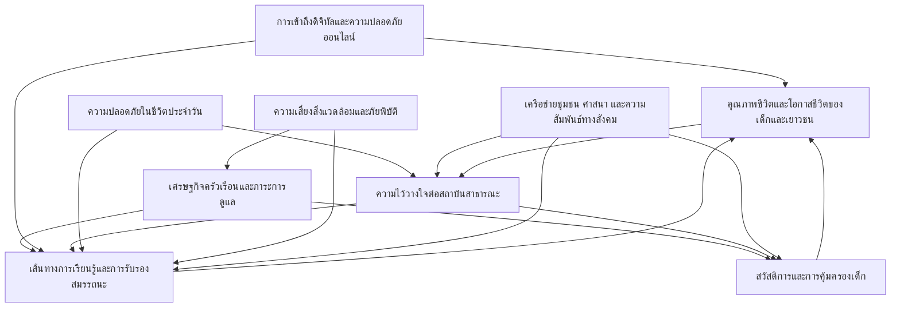

# บทที่ 2 สัญญาณชีวิตเด็กและเยาวชนไทย

บทที่ 2 ทำหน้าที่แปลงฐานหลักฐานที่กระจัดกระจายให้กลายเป็นแผนที่การเปลี่ยนแปลงที่ผู้อ่านสามารถใช้ติดตามตรรกะของรายงานต่อไปได้อย่างเป็นระบบ กล่าวคือ จากข้อสังเกตและข้อมูลที่พบในปัจจุบัน รายงานสังเคราะห์ให้เห็นว่าสัญญาณใดกำลังชี้ถึงการเปลี่ยนผ่านที่สำคัญ ปัจจัยขับเคลื่อนใดเป็นแรงผลักที่อยู่หลังสัญญาณหลายรายการ และความไม่แน่นอนสำคัญใดที่ทำให้อนาคตอาจแตกแขนงไปได้มากกว่าหนึ่งแบบ การอ่านบทนี้จึงไม่ใช่การอ่านเหตุการณ์ทีละเรื่อง แต่เป็นการอ่านความสัมพันธ์ของระบบที่ทำให้โอกาสชีวิตของเด็กและเยาวชนในพื้นที่ 3 จังหวัดชายแดนภาคใต้ เปิดออกหรือปิดลงในทางปฏิบัติ

คำว่า การกวาดสัญญาณ ในรายงานนี้หมายถึงการสำรวจร่องรอยการเปลี่ยนแปลงจากหลายแหล่งข้อมูล เพื่อจับสิ่งที่กำลังเปลี่ยนในชีวิตจริงก่อนจะกลายเป็นแนวโน้มใหญ่ สัญญาณ คือข้อมูลหรือเหตุการณ์ที่บอกใบ้ว่ากำลังเกิดการเปลี่ยนผ่านในระบบ ไม่ใช่ข้อสรุปหรือคำทำนาย เมื่อจัดระเบียบสัญญาณจำนวนมากเข้าด้วยกันจะทำให้เห็นปัจจัยขับเคลื่อน ซึ่งเป็นแรงผลักที่ทำให้ระบบเคลื่อน และทำให้สามารถระบุความไม่แน่นอนสำคัญ ซึ่งเป็นปัจจัยที่มีผลสูงต่ออนาคตแต่ทิศทางยังไม่ชัด บทนี้ยังใช้แนวคิดผังระบบ เพื่อหลีกเลี่ยงการอธิบายแบบเส้นตรงและทำให้เห็นวงจรป้อนกลับที่ทำให้ปัญหาสะสมหรือคลี่คลายได้ตามเงื่อนไข

รายงานยืนยันหลักการสำคัญว่า มิติความไม่สงบและความปลอดภัยเป็นบริบทที่กำหนดต้นทุนและความเป็นไปได้ของการเข้าถึงบริการ แต่ไม่ใช่ตัวเอกของเรื่องเล่า จุดศูนย์กลางของการอ่านสัญญาณในบทนี้คือคุณภาพชีวิตและโอกาสชีวิตของเด็กและเยาวชน โดยเฉพาะเส้นทางการเรียนรู้ เศรษฐกิจครัวเรือน การเข้าถึงสวัสดิการและการคุ้มครอง ความไว้วางใจต่อสถาบันสาธารณะ และความเสี่ยงในโลกดิจิทัล

## 2.1 การกวาดสัญญาณ

### 2.1.1 สัญญาณแนวโน้มหลักและปัจจัยขับเคลื่อนสำคัญ

สัญญาณที่เกี่ยวข้องกับเด็กและเยาวชนในพื้นที่ 3 จังหวัดชายแดนภาคใต้มีลักษณะสำคัญคือเป็นแรงกดทับที่ทับซ้อนกันหลายชั้น ไม่ว่าจะเป็นแรงกดทับด้านเศรษฐกิจครัวเรือน แรงกดทับต่อความต่อเนื่องของการเรียนรู้ ความเสี่ยงด้านความปลอดภัยและความไว้วางใจต่อรัฐ รวมถึงแรงกดทับใหม่ที่มาจากเทคโนโลยีและสภาพภูมิอากาศ สัญญาณเหล่านี้บางส่วนเป็นสัญญาณเชิงโครงสร้างที่เปลี่ยนช้าแต่มีผลลึก บางส่วนเป็นสัญญาณเชิงพลวัตที่เปลี่ยนเร็วตามสถานการณ์ และบางส่วนเป็นสัญญาณอ่อนที่ยังไม่แพร่หลายแต่มีศักยภาพขยายตัวจนเปลี่ยนเส้นทางชีวิตของเด็กได้อย่างมีนัยสำคัญ

สัญญาณเชิงโครงสร้างที่พบซ้ำสะท้อนว่า เศรษฐกิจครัวเรือนและต้นทุนการดำรงชีพเป็นเงื่อนไขตั้งต้นของหลายการตัดสินใจ การที่ครัวเรือนเผชิญต้นทุนการครองชีพและต้นทุนการเข้าถึงบริการสูงขึ้นย่อมบีบพื้นที่ของการลงทุนด้านการเรียนรู้ ทั้งในรูปค่าใช้จ่ายตรงและในรูปเวลาที่เด็กต้องใช้เพื่อช่วยงานหรือทำงาน เมื่อเศรษฐกิจครัวเรือนเปราะบาง การอยู่ในระบบการศึกษามักกลายเป็นทางเลือกที่ต้องต่อรองกับความจำเป็นเฉพาะหน้า ซึ่งทำให้ความเสี่ยงหลุดออกจากระบบเพิ่มขึ้น แม้จะมีมาตรการสนับสนุนด้านทุนหรือบริการ แต่หากต้นทุนจริงของการเข้าถึงยังสูง หรือหากการเข้าถึงต้องผ่านขั้นตอนที่ซับซ้อน โอกาสที่เด็กเปราะบางจะได้รับประโยชน์เต็มที่ก็จะลดลง

อีกสัญญาณเชิงโครงสร้างที่มีผลต่อชีวิตเด็กอย่างต่อเนื่องคือการแยกส่วนของเส้นทางการเรียนรู้ ในพื้นที่ 3 จังหวัดชายแดนภาคใต้ เส้นทางการเรียนรู้ของเด็กและเยาวชนไม่ได้มีเพียงโรงเรียนของรัฐ หากยังมีโรงเรียนเอกชนสอนศาสนา สถาบันการศึกษาศาสนา และรูปแบบการเรียนรู้ทางเลือกอื่น ๆ ที่สอดคล้องกับบริบทวัฒนธรรมและศรัทธา อย่างไรก็ตาม ความท้าทายเชิงระบบไม่ได้อยู่ที่การมีทางเลือกเพียงอย่างเดียว แต่อยู่ที่การเชื่อมต่อ การรับรองสมรรถนะ และความสามารถในการไหลเวียนระหว่างเส้นทางเหล่านี้ในช่วงเปลี่ยนผ่านสำคัญของชีวิตเด็ก หากเส้นทางหนึ่งไม่สามารถเชื่อมต่อกับอีกเส้นทางได้จริง เด็กจำนวนหนึ่งอาจถูกผลักให้กลายเป็นผู้ที่อยู่นอกการติดตามของระบบการศึกษาและระบบสวัสดิการในระยะยาว แม้จะยังมีการเรียนรู้เกิดขึ้นในชีวิตจริงก็ตาม

สัญญาณเชิงโครงสร้างด้านความไว้วางใจต่อสถาบันสาธารณะทำหน้าที่เป็นทั้งตัวเร่งและตัวหน่วงของการเข้าถึงสิทธิในทางปฏิบัติ ในบริบทพื้นที่ที่มีเงื่อนไขด้านความปลอดภัยและความสัมพันธ์รัฐ–ชุมชนที่ซับซ้อน การมีสิทธิบนเอกสารไม่เท่ากับการเข้าถึงจริง ความไว้วางใจจึงไม่ใช่ทัศนคติทั่วไป หากเป็นเงื่อนไขเชิงสถาบันที่กำหนดว่าครัวเรือนจะติดต่อหน่วยบริการหรือไม่ จะยอมรับกลไกคุ้มครองหรือไม่ และจะเชื่อว่าการเข้าระบบจะนำไปสู่ความช่วยเหลือหรือความเสี่ยงเพิ่มเติม สัญญาณหลายรายการชี้ให้เห็นว่าความปลอดภัยของพื้นที่เรียนรู้และพื้นที่สาธารณะเป็นเงื่อนไขที่กระทบทั้งพฤติกรรมของเด็กและความสบายใจของผู้ปกครอง ซึ่งอาจสะสมเป็นการจำกัดโอกาสการเรียนรู้และการมีส่วนร่วมทางสังคมในระยะยาว

สัญญาณด้านเทคโนโลยีปรากฏในลักษณะสองหน้า กล่าวคือเทคโนโลยีเพิ่มช่องทางการเรียนรู้และการเชื่อมต่อ แต่ในเวลาเดียวกันสามารถขยายช่องว่างและสร้างความเสี่ยงรูปแบบใหม่ได้ หากไม่มีทักษะและการคุ้มครองที่เพียงพอ สัญญาณที่พบชี้ว่าหลักสูตรออนไลน์และช่องทางการเรียนรู้ทางไกลอาจช่วยขยายโอกาสแก่เด็กที่มีข้อจำกัดด้านการเดินทางหรือความต่อเนื่องของการเข้าเรียน ขณะเดียวกันการใช้เครื่องมือปัญญาประดิษฐ์และระบบดิจิทัลที่พัฒนาเร็วกว่าโครงสร้างการกำกับดูแลและทักษะดิจิทัลอาจทำให้ความเหลื่อมล้ำด้านผลลัพธ์ทางการเรียนรู้กว้างขึ้นตามฐานทุนของครัวเรือนและคุณภาพของการสนับสนุนจากผู้ใหญ่

สัญญาณด้านสภาพภูมิอากาศและภัยพิบัติถูกอ่านในฐานะความเสี่ยงเชิงระบบที่ทดสอบความต่อเนื่องของการเรียนรู้และความมั่นคงของครัวเรือน ภัยพิบัติไม่ได้กระทบเพียงโครงสร้างพื้นฐาน หากกระทบรายได้ การย้ายถิ่น การดูแลเด็ก การเข้าถึงบริการสุขภาพ และความสามารถของหน่วยบริการในพื้นที่ที่จะทำงานต่อเนื่องภายใต้ภาวะวิกฤต เมื่อความถี่และความรุนแรงของเหตุการณ์สุดขั้วเพิ่มขึ้น ผลกระทบจึงมีแนวโน้มสะสมเป็นต้นทุนระยะยาวต่อเด็กและเยาวชนที่ต้องใช้ชีวิตอยู่กับความไม่แน่นอนนานที่สุด

จากการจัดระเบียบสัญญาณดังกล่าว สามารถสังเคราะห์ปัจจัยขับเคลื่อนสำคัญที่มีอิทธิพลสูงต่อคุณภาพชีวิตและโอกาสชีวิตของเด็กและเยาวชนในพื้นที่ 3 จังหวัดชายแดนภาคใต้ได้อย่างน้อยห้าประการ ได้แก่ (1) ความมั่นคงทางเศรษฐกิจของครัวเรือนและภาระการดูแล (2) ความเชื่อมต่อและการรับรองของเส้นทางการเรียนรู้ (3) ความไว้วางใจต่อสถาบันสาธารณะและความปลอดภัยของการเข้าระบบ (4) ความพร้อมด้านดิจิทัลทั้งในมิติการเข้าถึง ทักษะ และการคุ้มครอง (5) ความถี่และความรุนแรงของความเสี่ยงสิ่งแวดล้อมที่กระทบชีวิตประจำวัน ปัจจัยเหล่านี้เป็นฐานสำคัญของการระบุความไม่แน่นอนสำคัญในตอนท้ายของบท เพื่อทำให้การสร้างฉากทัศน์ในบทที่ 3 มีตรรกะรองรับและไม่หลุดจากชีวิตจริงของเด็ก

### 2.1.2 แนวโน้มชีวิตของเด็กและเยาวชนกลุ่มเป้าหมาย

การทำความเข้าใจแนวโน้มชีวิตของเด็กและเยาวชนกลุ่มเป้าหมายในพื้นที่ 3 จังหวัดชายแดนภาคใต้จำเป็นต้องเริ่มจากข้อเท็จจริงพื้นฐานว่า เส้นทางชีวิตของเด็กไม่ได้เคลื่อนอยู่ในระบบใดระบบหนึ่ง หากเคลื่อนอยู่บนทางแยกของหลายระบบที่เชื่อมต่อกันไม่สมบูรณ์ ทั้งระบบครัวเรือน ระบบการเรียนรู้ ระบบสวัสดิการและการคุ้มครอง ระบบชุมชน และระบบความปลอดภัย เมื่อหนึ่งระบบสะดุด ระบบอื่น ๆ มักสะดุดตาม และผลลัพธ์ที่ปรากฏในชีวิตเด็กมักออกมาในรูปของความต่อเนื่องที่ขาดตอน เช่น การเรียนที่หยุดชะงัก การย้ายถิ่นของผู้ดูแล การขาดผู้ชี้นำที่ไว้ใจได้ หรือการหลุดออกจากการติดตามของหน่วยบริการ

สำหรับเด็กและเยาวชนกลุ่มเปราะบาง โดยเฉพาะเด็กกำพร้าหรือเด็กที่ครัวเรือนมีภาระการดูแลสูง ช่วงเปลี่ยนผ่านของชีวิตเป็นช่วงที่ความเสี่ยงสะสมมักทำงานชัดที่สุด การเปลี่ยนระดับชั้น การตัดสินใจเลือกเส้นทางการเรียนรู้ และการเริ่มต้นเข้าสู่ตลาดแรงงานเกิดขึ้นภายใต้เงื่อนไขที่ครัวเรือนต้องชั่งน้ำหนักความคุ้มค่าระยะสั้นกับผลลัพธ์ระยะยาว การตัดสินใจที่ดูเหมือนเป็นการตัดสินใจส่วนบุคคลจึงสะท้อนข้อจำกัดเชิงโครงสร้าง เช่น ค่าเดินทาง เวลา ค่าอุปกรณ์ การเข้าถึงอินเทอร์เน็ต ความปลอดภัยในการเดินทางและการทำกิจกรรม รวมถึงความสามารถของผู้ดูแลที่จะติดตามและสนับสนุนการเรียนรู้ในโลกที่ทั้งการเรียนและการสื่อสารขยับเข้าสู่รูปแบบดิจิทัลมากขึ้น

เมื่อมองเส้นทางการเรียนรู้โดยรวม สามารถเห็นอย่างน้อยสามรูปแบบการเคลื่อนตัวที่มีนัยต่ออนาคตของเด็กและเยาวชนในพื้นที่ หนึ่งคือเส้นทางในระบบการศึกษากระแสหลักที่ให้โอกาสเข้าถึงการรับรองทางการศึกษาและการไปต่อในระบบอาชีพ แต่ต้องแลกกับต้นทุนการเข้าถึง ความเหมาะสมเชิงวัฒนธรรมบางประการ และความเสี่ยงที่เกิดจากความไม่ต่อเนื่องของเศรษฐกิจครัวเรือน สองคือเส้นทางการเรียนรู้ในสถาบันที่สอดคล้องกับบริบทศาสนาและชุมชนซึ่งช่วยโอบอุ้มความรู้สึกเป็นส่วนหนึ่งและความมั่นคงทางสังคม แต่ยังเผชิญโจทย์เชิงระบบเรื่องการเชื่อมต่อ การรับรองสมรรถนะ และการขยายโอกาสทางเศรษฐกิจที่เท่าทันการเปลี่ยนแปลงของตลาดแรงงาน สามคือเส้นทางที่เด็กและเยาวชนหลุดออกจากระบบการเรียนรู้ที่ถูกติดตาม ซึ่งอาจเกิดจากแรงดึงดูดของงานนอกพื้นที่ ความจำเป็นทางเศรษฐกิจ ความรู้สึกไม่ปลอดภัย หรือการไม่เห็นความหมายของการอยู่ในระบบเมื่อเส้นทางไปสู่โอกาสที่จับต้องได้ไม่ชัดเจน

แนวโน้มอีกด้านที่สะท้อนจากสัญญาณคือการขยับตัวของพื้นที่ดิจิทัลในฐานะทั้งเครื่องมือและสภาพแวดล้อมของชีวิตเด็ก ในทางหนึ่ง ดิจิทัลช่วยให้การเรียนรู้และการเข้าถึงข้อมูลเกิดขึ้นได้แม้เผชิญข้อจำกัดเชิงพื้นที่หรือความไม่ต่อเนื่องของการเข้าเรียน แต่ในอีกทางหนึ่ง ดิจิทัลทำให้ความเสี่ยงใหม่ ๆ ปรากฏขึ้น ทั้งความเสี่ยงด้านข้อมูลที่ไม่น่าเชื่อถือ การหลอกลวงออนไลน์ ความกดดันทางสังคม และความไม่ปลอดภัยเชิงความเป็นส่วนตัว ความเสี่ยงเหล่านี้มีแนวโน้มกระทบหนักกับเด็กที่ขาดผู้ใหญ่ที่มีทักษะพอจะคุ้มครองหรือชี้นำ โดยเฉพาะในครัวเรือนที่ผู้ดูแลเป็นผู้สูงอายุหรือมีภาระงานสูงจนไม่สามารถติดตามโลกดิจิทัลของเด็กได้อย่างใกล้ชิด

โดยสรุป แนวโน้มชีวิตของเด็กและเยาวชนกลุ่มเป้าหมายในพื้นที่ 3 จังหวัดชายแดนภาคใต้ถูกกำหนดโดยเงื่อนไขร่วมสามชุดที่ทำงานทับซ้อนกัน ได้แก่ ความเป็นไปได้ของการอยู่ในเส้นทางการเรียนรู้อย่างต่อเนื่อง ความเป็นไปได้ของการเข้าถึงสวัสดิการและการคุ้มครองโดยไม่เพิ่มความเสี่ยงใหม่ และความสามารถของครัวเรือนและชุมชนในการรองรับผลกระทบจากความผันผวนทางเศรษฐกิจ สิ่งแวดล้อม และเทคโนโลยี เงื่อนไขเหล่านี้เป็นฐานของการมองเชิงระบบในตอนถัดไป

### 2.1.3 เหตุไม่คาดฝัน

เหตุไม่คาดฝันในรายงานนี้หมายถึงเหตุการณ์โอกาสต่ำแต่ผลกระทบสูง ซึ่งใช้เพื่อทดสอบความทนทานของระบบที่รองรับชีวิตเด็กและเยาวชน ไม่ใช่การเล่าเรื่องเพื่อสร้างความตระหนก หากเป็นการตั้งคำถามว่า เมื่อระบบถูกกดดันพร้อมกันหลายด้าน โครงสร้างใดจะล้มก่อน คอขวดใดจะปรากฏชัด และเด็กกลุ่มใดจะรับภาระหนักที่สุด

กรณีตัวอย่างที่สะท้อนความเสี่ยงแบบนี้ได้ชัดคืออุทกภัยรุนแรงในระดับที่เกินขีดความสามารถของระบบเมืองและระบบบริการในพื้นที่ หากเกิดเหตุการณ์ลักษณะนี้ ผลกระทบทางตรงจะเริ่มจากความเสียหายต่อที่อยู่อาศัย โครงสร้างพื้นฐาน และเส้นทางคมนาคม ส่งผลให้การช่วยเหลือและการเข้าถึงหน่วยบริการล่าช้า ซึ่งสำหรับเด็กและเยาวชนหมายถึงการหยุดชะงักของการเรียนรู้ การขาดพื้นที่ปลอดภัย การเพิ่มภาระการดูแลในครัวเรือน และความเสี่ยงด้านสุขภาพจากโรคที่มากับน้ำและสภาพแวดล้อมหลังน้ำลด

ผลกระทบทางอ้อมที่ตามมามักมีความยาวนานกว่า เพราะภัยพิบัติทำให้ครัวเรือนสูญเสียทรัพย์สินและรายได้พร้อมกัน เกิดหนี้ใหม่หรือภาระหนี้เพิ่มขึ้นในช่วงฟื้นตัว และทำให้การลงทุนด้านการเรียนรู้ถูกลดทอนลงอย่างหลีกเลี่ยงได้ยาก หากผู้ดูแลบาดเจ็บ สูญเสียรายได้ หรือเสียชีวิต เด็กบางส่วนอาจกลายเป็นเด็กกำพร้าหรือเด็กที่ต้องพึ่งพาผู้ดูแลทดแทนอย่างฉับพลัน ซึ่งทำให้ความต่อเนื่องของการเรียนรู้และการเข้าถึงสวัสดิการยิ่งเปราะบาง โดยเฉพาะเมื่อเอกสารสำคัญสูญหายหรือเมื่อระบบการช่วยเหลือมีเงื่อนไขด้านเอกสารที่ไม่สอดคล้องกับสภาพจริงหลังวิกฤต

ในมิติของความไว้วางใจ เหตุไม่คาดฝันมีนัยสำคัญเพราะเป็นช่วงเวลาที่ประชาชนประเมินความสามารถและความเป็นธรรมของระบบสาธารณะอย่างเข้มข้น หากความช่วยเหลือเข้าถึงช้า สื่อสารไม่ชัด หรือมีความเหลื่อมล้ำในการจัดสรร ความไม่ไว้วางใจจะสะสมเป็นแรงต้านต่อการเข้าระบบในช่วงปกติด้วย ในทางกลับกัน หากการช่วยเหลือมีความไวต่อบริบท วางเครือข่ายชุมชนเป็นฐาน และทำให้การเข้าถึงบริการเป็นไปได้จริง เหตุการณ์วิกฤตอาจกลายเป็นจุดเปลี่ยนที่ช่วยสร้างทุนทางสังคมและฟื้นฟูความสัมพันธ์ของประชาชนกับหน่วยบริการได้เช่นกัน

### 2.1.4 สัญญาณอ่อน

สัญญาณอ่อนคือร่องรอยเล็ก ๆ ของการเปลี่ยนแปลงที่ยังไม่ชัดหรือยังไม่แพร่หลาย แต่มีนัยว่า หากขยายตัวจะเปลี่ยนระบบหรือเปลี่ยนเส้นทางชีวิตของเด็กและเยาวชนได้อย่างมีนัยสำคัญ ในบริบทพื้นที่ 3 จังหวัดชายแดนภาคใต้ สัญญาณอ่อนที่ควรเฝ้าระวังมีทั้งด้านโอกาสและด้านความเสี่ยง โดยประเด็นสำคัญไม่ได้อยู่ที่การพบสัญญาณเพียงอย่างเดียว แต่อยู่ที่เงื่อนไขซึ่งจะทำให้สัญญาณนั้นขยายตัวหรือหยุดอยู่แค่ระดับปรากฏการณ์เฉพาะจุด

สัญญาณอ่อนด้านโอกาสที่เห็นได้ชัดคือการขยายตัวของการเรียนรู้รูปแบบออนไลน์และการเรียนรู้แบบผสมผสาน ซึ่งอาจช่วยลดข้อจำกัดด้านการเดินทางและเพิ่มทางเลือกของเด็กที่ไม่สามารถอยู่ในโรงเรียนได้ต่อเนื่อง หากระบบสามารถทำให้การเรียนรู้รูปแบบนี้มีมาตรฐานการวัดผลที่น่าเชื่อถือและมีการรับรองสมรรถนะที่เชื่อมต่อกับเส้นทางการศึกษาและการทำงานได้จริง สัญญาณนี้อาจกลายเป็นคานงัดที่ช่วยลดความเหลื่อมล้ำเชิงพื้นที่ได้ แต่หากขยายตัวภายใต้ช่องว่างการเข้าถึงอุปกรณ์และทักษะดิจิทัลที่ไม่เท่ากัน สัญญาณเดียวกันนี้อาจกลายเป็นตัวขยายความเหลื่อมล้ำของผลลัพธ์ทางการเรียนรู้แทน

สัญญาณอ่อนด้านความเสี่ยงที่ต้องจับตาคือการที่แพลตฟอร์มดิจิทัลกลายเป็นช่องทางของความช่วยเหลือแบบไม่เป็นทางการ ทั้งการระดมทรัพยากร การอุปการะ และการเชื่อมต่อระหว่างผู้ต้องการช่วยเหลือกับเด็กกลุ่มเปราะบาง ในด้านหนึ่ง ช่องทางดังกล่าวสะท้อนพลังการช่วยเหลือของสังคมและความเร็วของการเชื่อมต่อ แต่ในอีกด้านหนึ่ง หากไม่มีมาตรฐานการคุ้มครองเด็กและกลไกตรวจสอบที่เพียงพอ ความช่วยเหลือที่เกิดขึ้นอย่างรวดเร็วอาจพาเด็กเข้าไปสู่ความเสี่ยงรูปแบบใหม่ เช่น ความไม่ปลอดภัย การเอาเปรียบ หรือการตกอยู่ในระบบอุปถัมภ์ที่ไม่โปร่งใส เงื่อนไขสำคัญจึงอยู่ที่ความสามารถของสังคมและหน่วยบริการที่จะสร้างกติกาคุ้มครองเด็กที่ไม่เพิ่มภาระการเข้าถึงจนทำให้ผู้คนหันหลังให้ระบบทั้งหมด

สัญญาณอ่อนอีกประการหนึ่งเกี่ยวข้องกับพื้นที่เรียนรู้และพื้นที่ปลอดภัยของเด็ก เมื่อพื้นที่บางประเภทถูกใช้ร่วมกับบทบาทที่มีความเสี่ยงสูง การรับรู้เรื่องความปลอดภัยของผู้ปกครองและเด็กจะเปลี่ยนไปในทันที และส่งผลต่อพฤติกรรมการเดินทาง การเข้าร่วมกิจกรรม และการใช้ชีวิตในพื้นที่สาธารณะ เงื่อนไขที่ทำให้สัญญาณนี้ขยายตัวหรือคลี่คลายจึงเกี่ยวข้องกับการจัดการพื้นที่ การสื่อสารความเสี่ยง และความสามารถในการสร้างพื้นที่เรียนรู้ที่เด็กและผู้ปกครองเชื่อว่าเป็นพื้นที่ของเด็กอย่างแท้จริง

สัญญาณอ่อนด้านความเป็นธรรมและการคุ้มครองสะท้อนจากข้อถกเถียงเรื่องความครอบคลุมของการเยียวยาและการช่วยเหลือเด็กกำพร้าในบางกรณี หากความไม่สอดคล้องระหว่างนิยามกลุ่มเป้าหมายของมาตรการกับสภาพจริงดำรงอยู่ยาวนาน จะทำให้เกิดความรู้สึกไม่เป็นธรรมและทำให้ความช่วยเหลือของรัฐถูกมองว่าเลือกปฏิบัติ ซึ่งกระทบต่อความไว้วางใจและการเข้าถึงบริการในระยะยาว เงื่อนไขสำคัญจึงอยู่ที่ความโปร่งใสของเกณฑ์ ความสามารถของหน่วยบริการในการอธิบายเหตุผล และการมีช่องทางเยียวยาที่ไม่ทำให้ผู้ร้องต้องรับความเสี่ยงเพิ่มขึ้น

สุดท้าย สัญญาณอ่อนที่ควรจับตาในมิติคุณค่าและบทบาทของเยาวชนคือการขยับตัวของกลุ่มเยาวชนและเครือข่ายชุมชนที่เริ่มทดลองสร้างพื้นที่เรียนรู้และพื้นที่สาธารณะของตนเอง หากสัญญาณนี้ขยายตัวภายใต้การยอมรับของสถาบันและมีทรัพยากรรองรับอย่างเหมาะสม จะช่วยเพิ่มฐานของการมีส่วนร่วมและทำให้เด็กและเยาวชนเป็นผู้ร่วมออกแบบอนาคตมากขึ้น แต่หากเงื่อนไขด้านความปลอดภัยและความไว้วางใจยังไม่คลี่คลาย การขยับตัวดังกล่าวอาจถูกจำกัดอยู่เพียงวงแคบและไม่สามารถกลายเป็นพลังเชิงระบบได้

## 2.2 ผังระบบ

ผังระบบในบทนี้ถูกใช้เพื่อทำให้ผู้อ่านเห็นว่า ปัจจัยที่ดูเหมือนแยกส่วนกันในชีวิตประจำวันของเด็กและเยาวชนเชื่อมกันอย่างไร และเหตุใดการแก้ปัญหาแบบเส้นตรงจึงมักไม่เพียงพอ ผังระบบที่ดีไม่ได้มีเป้าหมายเพื่อใส่ทุกปัจจัยให้ครบ แต่มีเป้าหมายเพื่อทำให้เห็นผลลัพธ์ศูนย์กลาง วงจรป้อนกลับ คอขวด และจุดคานงัดที่มีความหมายต่อการตัดสินใจเชิงยุทธศาสตร์ ในรายงานนี้ ผลลัพธ์ศูนย์กลางถูกนิยามเป็นคุณภาพชีวิตและโอกาสชีวิตของเด็กและเยาวชน และผังระบบถูกรีเซ็นเตอร์ให้เริ่มจากผลลัพธ์ดังกล่าว ไม่ใช่เริ่มจากเหตุการณ์ความรุนแรง

แผนภาพด้านล่างเป็นผังระบบแบบย่อเพื่อช่วยให้เห็นความสัมพันธ์หลักระหว่างระบบครัวเรือน ระบบการเรียนรู้ ระบบสวัสดิการและการคุ้มครอง ระบบความไว้วางใจ และระบบดิจิทัล โดยยังคงให้ความปลอดภัยในชีวิตประจำวันเป็นบริบทที่กำหนดต้นทุนของการเข้าถึงและการลงมือทำ

เมื่ออ่านผังระบบในเชิงพลวัต วงจรป้อนกลับที่สำคัญมักทำงานผ่านการสะสมของต้นทุนและความเชื่อมั่น วงจรแรกคือวงจรเศรษฐกิจครัวเรือนกับการเรียนรู้ เมื่อเศรษฐกิจครัวเรือนเปราะบาง เด็กมีแนวโน้มเผชิญความไม่ต่อเนื่องของการเรียนรู้ ไม่ว่าจะจากค่าใช้จ่าย เวลา หรือการต้องช่วยงานในครัวเรือน เมื่อการเรียนรู้สะดุด โอกาสในการได้ทักษะและการรับรองสมรรถนะลดลง และเมื่อโอกาสทางเศรษฐกิจในอนาคตลดลง ครัวเรือนก็มีแนวโน้มเปราะบางมากขึ้น เป็นวงจรที่ทำให้ความเสี่ยงส่งผ่านระหว่างรุ่นได้ง่ายหากไม่มีกลไกตัดวงจรที่ทำงานจริง

วงจรที่สองคือวงจรความไว้วางใจกับการเข้าถึงสวัสดิการ เมื่อความไว้วางใจต่อสถาบันสาธารณะต่ำ ครัวเรือนมีแนวโน้มไม่เข้าหาหน่วยบริการหรือเข้าถึงได้ไม่เต็มที่ ส่งผลให้ความช่วยเหลือที่ควรลดความเปราะบางไม่ทำงาน และเมื่อความเปราะบางสะสม ความเชื่อมั่นต่อระบบยิ่งถดถอย วงจรนี้มักรุนแรงขึ้นในสถานการณ์วิกฤตหรือในช่วงที่ระบบต้องการให้ครัวเรือนส่งข้อมูลและเอกสารจำนวนมาก เพราะภาระการเข้าถึงจะสูงขึ้นพร้อมกับความเสี่ยงที่ครัวเรือนรับรู้

วงจรที่สามคือวงจรดิจิทัลกับผลลัพธ์ทางการเรียนรู้และความเป็นอยู่ ดิจิทัลสามารถเพิ่มโอกาสการเรียนรู้และการเข้าถึงข้อมูล แต่หากเด็กขาดทักษะและการคุ้มครอง ความเสี่ยงออนไลน์จะเพิ่มขึ้นและกระทบสุขภาวะจิตใจ สมาธิ และความรู้สึกมั่นคง เมื่อสุขภาวะถดถอย เด็กมีแนวโน้มถอยห่างจากการเรียนรู้หรือถอยห่างจากพื้นที่สังคมที่ปลอดภัย และกลับไปพึ่งพาพื้นที่ดิจิทัลมากขึ้น วงจรนี้จึงเป็นทั้งโอกาสและความเสี่ยงขึ้นอยู่กับกติกาการคุ้มครองและคุณภาพของผู้ชี้นำในชีวิตเด็ก

จากผังระบบดังกล่าว คอขวดที่ควรถูกมองเป็นจุดตัดสินใจเชิงยุทธศาสตร์ในระยะต่อไปมีอย่างน้อยสามชุด ได้แก่ คอขวดด้านการเข้าถึงสิทธิและเอกสารที่ทำให้ความช่วยเหลือไม่ถึงเด็กที่เปราะบางที่สุด คอขวดด้านการเชื่อมต่อและการรับรองสมรรถนะที่ทำให้เส้นทางการเรียนรู้หลายแบบไม่สามารถกลายเป็นโอกาสทางเศรษฐกิจและโอกาสชีวิตได้จริง และคอขวดด้านความปลอดภัยและความไว้วางใจที่ทำให้ต้นทุนของการเข้าระบบสูงจนทางเลือกที่ดีที่สุดบนกระดาษไม่เกิดผลในทางปฏิบัติ

### 2.2.1 การวิเคราะห์ผลกระทบไขว้

การวิเคราะห์ผลกระทบไขว้ช่วยทำให้เห็นว่า ปัจจัยสำคัญสองด้านเมื่อเกิดพร้อมกันมักสร้างผลลัพธ์แบบทบทวีหรือหักล้างอย่างไรในชีวิตเด็กและเยาวชน การวิเคราะห์แบบนี้มีความสำคัญเพราะความเสี่ยงที่เด็กเผชิญมักไม่ได้เกิดจากปัจจัยเดี่ยว แต่เกิดจากการซ้อนทับของข้อจำกัดที่เกิดขึ้นพร้อมกัน

คู่ปฏิสัมพันธ์แรกคือเศรษฐกิจครัวเรือนกับเส้นทางการเรียนรู้ หากเศรษฐกิจครัวเรือนเปราะบางในช่วงที่เด็กต้องเผชิญการเปลี่ยนผ่านของระดับการศึกษา ต้นทุนการอยู่ในระบบจะเพิ่มขึ้นอย่างรวดเร็ว และทำให้การตัดสินใจออกจากระบบเกิดขึ้นได้แม้เด็กจะเห็นคุณค่าของการเรียนรู้ หากในช่วงเดียวกันระบบการเรียนรู้มีทางเลือกที่ยืดหยุ่นและเชื่อมต่อกันได้จริง ผลกระทบของความเปราะบางอาจถูกลดทอนลง แต่หากเส้นทางทางเลือกไม่ถูกยอมรับหรือไม่สามารถพาเด็กกลับเข้าสู่การรับรองสมรรถนะได้ ความเปราะบางทางเศรษฐกิจจะเปลี่ยนเป็นการสูญเสียโอกาสชีวิตในระยะยาว

คู่ปฏิสัมพันธ์ที่สองคือความไว้วางใจกับการเข้าถึงสวัสดิการและการคุ้มครอง หากความไว้วางใจต่ำในช่วงที่ครัวเรือนต้องพึ่งพาระบบช่วยเหลือ เช่น ช่วงเจ็บป่วย ภัยพิบัติ หรือการเปลี่ยนผู้ดูแล การเข้าถึงบริการจะยิ่งยากขึ้น และความเปราะบางจะสะสมเป็นความเสี่ยงซ้อนความเสี่ยง ในทางกลับกัน หากมีหน่วยบริการหรือเครือข่ายที่ทำหน้าที่เป็นจุดเชื่อมความไว้ใจและช่วยนำทางการเข้าถึงสิทธิ ความไว้วางใจอาจถูกฟื้นฟู และทำให้ระบบคุ้มครองเริ่มทำงานได้จริงกับเด็กกลุ่มที่ต้องการความช่วยเหลือมากที่สุด

คู่ปฏิสัมพันธ์ที่สามคือภัยพิบัติและความเหลื่อมล้ำดิจิทัล เมื่อภัยพิบัติทำให้การเรียนในห้องเรียนหยุดชะงัก ระบบการเรียนรู้มีแนวโน้มพึ่งพาดิจิทัลมากขึ้นโดยอัตโนมัติ หากครัวเรือนมีอุปกรณ์และทักษะเพียงพอ เด็กอาจรักษาความต่อเนื่องของการเรียนรู้ได้ แต่หากครัวเรือนขาดการเข้าถึงดิจิทัลหรือขาดผู้ชี้นำ ความสูญเสียทางการเรียนรู้จะทวีคูณ และผลกระทบจะไม่หยุดอยู่ที่ช่วงวิกฤต หากลากยาวไปสู่ความรู้สึกถอยห่างจากระบบการเรียนรู้และการลดทอนความเชื่อมั่นในอนาคตของตนเอง

### 2.2.3 การวิเคราะห์ผลกระทบและความไม่แน่นอน

การวิเคราะห์ผลกระทบและความไม่แน่นอนมีเป้าหมายเพื่อสกัดความไม่แน่นอนสำคัญที่มีผลต่ออนาคตของเด็กและเยาวชนในพื้นที่ 3 จังหวัดชายแดนภาคใต้สูง แต่ทิศทางยังเปิดหลายทาง ความไม่แน่นอนเหล่านี้จะทำหน้าที่เป็นฐานของความตึงเครียดของอนาคตที่เพียงพอให้บทที่ 3 สร้างตรรกะฉากทัศน์ได้อย่างมีเหตุผล โดยไม่จำเป็นต้องเริ่มเล่าฉากทัศน์ในบทนี้

ความไม่แน่นอนสำคัญประการแรกคือความสามารถของระบบการเรียนรู้ในการยอมรับความหลากหลายและทำให้เส้นทางต่าง ๆ เชื่อมต่อกันได้จริง คำถามไม่ได้อยู่ที่การมีทางเลือกของการเรียนรู้เพียงอย่างเดียว แต่อยู่ที่การทำให้การเรียนรู้เหล่านั้นสามารถกลายเป็นสมรรถนะที่ได้รับการรับรอง และทำให้เด็กสามารถเคลื่อนย้ายระหว่างเส้นทางได้โดยไม่ถูกตัดออกจากโอกาสในอนาคต ความไม่แน่นอนนี้เชื่อมโดยตรงกับโอกาสทางเศรษฐกิจ ความรู้สึกเป็นส่วนหนึ่ง และแรงจูงใจของเด็กในการอยู่ในเส้นทางการเรียนรู้ต่อไป

ความไม่แน่นอนสำคัญประการที่สองคือเสถียรภาพของเศรษฐกิจครัวเรือนและโอกาสทางอาชีพที่มีคุณภาพในและนอกพื้นที่ หากครัวเรือนเผชิญต้นทุนที่สูงขึ้น รายได้ที่ไม่แน่นอน และภาระการดูแลที่เพิ่มขึ้น การตัดสินใจของเด็กและผู้ดูแลจะมีแนวโน้มหันไปสู่ทางเลือกที่ให้ผลลัพธ์เร็ว แม้ต้องแลกกับการลดทอนโอกาสระยะยาว ขณะเดียวกัน หากเศรษฐกิจในพื้นที่สามารถสร้างงานที่มีคุณภาพและสอดคล้องกับทักษะที่เด็กพัฒนาได้จริง เส้นทางการเรียนรู้จะมีความหมายมากขึ้นและวงจรแรงกดทับอาจถูกคลี่คลาย

ความไม่แน่นอนสำคัญประการที่สามคือทิศทางของความไว้วางใจต่อสถาบันสาธารณะและความปลอดภัยของการเข้าระบบ หากความไว้วางใจฟื้นฟูได้ การเข้าถึงบริการและการคุ้มครองจะทำงานเป็นฐานของการลดความเปราะบางได้จริง แต่หากความไม่ไว้วางใจสะสมต่อเนื่อง ระบบสวัสดิการและการคุ้มครองจะถูกทำให้ไม่ทำงานในทางปฏิบัติ แม้จะมีมาตรการที่ออกแบบไว้ดีบนกระดาษ ความไม่แน่นอนนี้มีผลต่อความเป็นไปได้ของยุทธศาสตร์ทุกข้อในบทที่ 4 เพราะยุทธศาสตร์จะเกิดผลได้ก็ต่อเมื่อผู้คนสามารถและยอมรับที่จะเข้าถึงระบบ

ความไม่แน่นอนสำคัญประการที่สี่คือการที่ดิจิทัลจะเป็นคานงัดของการเรียนรู้และการคุ้มครอง หรือจะกลายเป็นกับดักที่เพิ่มความเหลื่อมล้ำและความเสี่ยงออนไลน์ ปัจจัยชี้ขาดอยู่ที่คุณภาพของโครงสร้างพื้นฐาน ทักษะดิจิทัล และกติกาการคุ้มครองเด็กบนโลกออนไลน์ หากดิจิทัลถูกจัดการอย่างมีจริยธรรมและมีระบบคุ้มครองที่เข้มแข็ง ดิจิทัลจะช่วยลดข้อจำกัดเชิงพื้นที่และเพิ่มทางเลือกการเรียนรู้ แต่หากปล่อยให้การเปลี่ยนผ่านดิจิทัลเกิดขึ้นเร็วกว่าโครงสร้างการคุ้มครอง ดิจิทัลจะกลายเป็นตัวขยายความเสี่ยงและบั่นทอนสุขภาวะของเด็กในระยะยาว

ความไม่แน่นอนสำคัญประการที่ห้าคือความถี่และความรุนแรงของความเสี่ยงสิ่งแวดล้อมที่กระทบความต่อเนื่องของการเรียนรู้และความมั่นคงของครัวเรือน หากความเสี่ยงสิ่งแวดล้อมเพิ่มขึ้นโดยที่ระบบบริการไม่มีขีดความสามารถในการปรับตัว ผลกระทบจะสะสมเป็นภาระต่อเด็กและเยาวชนผ่านการเรียนรู้ที่ขาดตอน การย้ายถิ่น การเจ็บป่วย และภาระฟื้นตัวของครัวเรือน แต่หากระบบสามารถยกระดับการเตรียมพร้อมและทำให้การเรียนรู้และการคุ้มครองดำเนินต่อได้ภายใต้ภาวะวิกฤต ความเสี่ยงสิ่งแวดล้อมจะถูกลดทอนจากการเป็นเหตุการณ์ฉุกเฉินไปสู่การเป็นเงื่อนไขที่จัดการได้

เมื่อจัดรูปความไม่แน่นอนสำคัญเหล่านี้ให้อยู่ในรูปของความตึงเครียดของอนาคต สามารถสรุปเป็นคู่ความตึงเครียดที่มีนัยต่อการสร้างฉากทัศน์ในบทที่ 3 ได้อย่างน้อยสี่คู่ ได้แก่ (1) เส้นทางการเรียนรู้แบบทางเดียวกับเส้นทางการเรียนรู้แบบหลากหลายที่เชื่อมต่อกันได้จริง (2) การคุ้มครองที่พึ่งพาเอกสารและขั้นตอนกับการคุ้มครองที่ทำให้การเข้าถึงเป็นไปได้จริงในชีวิตประจำวัน (3) ดิจิทัลในฐานะเครื่องมือขยายโอกาสกับดิจิทัลในฐานะตัวขยายความเสี่ยงและความเหลื่อมล้ำ (4) ความไว้วางใจที่ฟื้นฟูได้กับความไม่ไว้วางใจที่สะสมจนลดทอนประสิทธิผลของนโยบาย ความตึงเครียดเหล่านี้ทำให้เห็นชัดว่าอนาคตของเด็กและเยาวชนในพื้นที่ 3 จังหวัดชายแดนภาคใต้ไม่ได้ถูกกำหนดด้วยแนวโน้มเส้นเดียว หากขึ้นอยู่กับจุดตัดสินใจเชิงระบบที่สังคมจะเลือกจัดการในทิศทางใด

